# MaWire Bank — Business Model & Product Catalog
**Document Version:** 1.0  
**Classification:** Internal — Restricted  
**Jurisdiction:** República de Chile  
**Regulator:** Comisión para el Mercado Financiero (CMF)  
**Last Updated:** 2026-06-06

---

## Table of Contents

1. [Consumer Banking Products](#1-consumer-banking-products)
2. [Business Banking Products](#2-business-banking-products)
3. [Revenue Model — Full Breakdown](#3-revenue-model--full-breakdown)
4. [Revenue Waterfall — Year 1 to Year 5](#4-revenue-waterfall--year-1-to-year-5)
5. [Revenue Model Architecture Diagram](#5-revenue-model-architecture-diagram)

---

## 1. Consumer Banking Products

### 1.1 Checking Accounts — Cuenta Vista

**Regulatory Framework:** CMF Norma General N°20 (formerly SBIF RAN 2-1) governs Cuentas Vista. Banks licensed under Ley General de Bancos (DFL N°3/1997) may offer Cuentas Vista. MaWire Bank, operating under a full banking license obtained from CMF, issues these accounts directly. Non-bank entities may offer Cuenta Vista-equivalent instruments only via a licensed bank sponsor arrangement.

**Product Features:**

| Feature | Detail |
|---|---|
| Account currency | CLP (Chilean Peso) |
| Opening minimum balance | CLP 0 |
| Maintenance fee | CLP 0 (Tier Free) / CLP 2,990/month (Tier Plus) / CLP 4,990/month (Tier Pro) |
| Maximum stored balance (unverified) | CLP 500,000 (per CMF threshold for simplified KYC) |
| Maximum stored balance (full KYC) | No statutory cap; subject to internal AML limits |
| Debit card included | Visa Débito or Mastercard Débito (physical + virtual) |
| ATM withdrawals | 3 free/month at RedBanc network; CLP 990 thereafter |
| Interbank transfers (TEF) | Free via Sistema LBTR / TEF-CChile |
| Real-time payments | CLP transfers via Combanc TEF rails, T+0 settlement |
| Direct debit (PAC) | Supported — Pago Automático de Cuentas via Transbank/BCI infra |
| Interest on balance | 0% (Tier Free), 0.5% nominal annual (Tier Plus/Pro on balances ≥ CLP 100K) |
| CMF deposit insurance | Covered by Fondo de Garantía de Depósitos per Ley 19,246 up to UF 200 (≈ CLP 7,400,000 as of June 2026) |
| Overdraft facility | Not available on Cuenta Vista; governed under separate credit line product |

**Fee Structure (CLP):**

| Fee Type | Free Tier | Plus Tier | Pro Tier |
|---|---|---|---|
| Monthly maintenance | CLP 0 | CLP 2,990 | CLP 4,990 |
| Domestic TEF | CLP 0 | CLP 0 | CLP 0 |
| ATM withdrawal (RedBanc, after 3 free) | CLP 990 | CLP 790 | CLP 0 |
| ATM withdrawal (foreign network) | CLP 2,500 | CLP 2,000 | CLP 1,500 |
| Replacement debit card | CLP 3,990 | CLP 1,990 | CLP 0 |
| Stop payment order | CLP 5,900 | CLP 3,900 | CLP 0 |
| Certified account statement | CLP 2,500 | CLP 0 | CLP 0 |
| Chargeback processing fee | CLP 0 | CLP 0 | CLP 0 |
| International wire (USD/EUR) | USD 15 flat + 1.2% FX spread | USD 12 + 1.0% | USD 10 + 0.8% |

**Float Income Model:** MaWire Bank earns net interest income on the aggregate uninvested balances held in pooled reserve accounts. With a projected average Cuenta Vista balance of CLP 320,000 per account and overnight TPM (Tasa de Política Monetaria) at 5.0% (BCCh, June 2026), the annualized float yield on CLP reserves placed in BCCh overnight repos equals approximately 4.6% net of required reserve ratios. On 100,000 accounts, aggregate float balance of CLP 32B generates approximately CLP 1.47B (~USD 1.6M) in annual float income before funding cost allocation.

**Regulatory Compliance — CMF Norma General N°20:**
- Monthly itemized statement mandatory (electronic default; paper on request at no charge)
- Maximum 30-day lag between fee change notification and implementation
- All fee structures must be registered in CMF's SIEF system (Sistema de Información de Entidades Fiscalizadas)
- Cuenta Vista holders retain portability rights; bank must execute transfer within 5 business days upon request
- Minimum disclosure: TAE (Tasa Anual Equivalente) for any interest-bearing feature

---

### 1.2 Savings Accounts — Cuentas de Ahorro

**Regulatory Framework:** Cuentas de Ahorro in Chile are governed under DFL N°3 (Artículos 46-55) and CMF Norma General N°66. Banks may issue interest-bearing savings accounts with variable or fixed rates. The Banco Central de Chile (BCCh) sets the TPM, which anchors the deposit rate market.

**Current Market Rate Context (June 2026):**
- BCCh TPM: 5.00%
- Average savings rate offered by Banco de Chile, BCI, Santander: 3.5–4.2% nominal annual
- MaWire target savings rate: 4.25% nominal annual (≈ 4.34% effective annual / APY) on standard savings
- High-yield savings (balances ≥ CLP 5,000,000): 4.75% nominal annual

**Product Tiers:**

| Tier | Minimum Balance | Nominal Rate | APY (effective) | Withdrawal Limit |
|---|---|---|---|---|
| Standard Ahorro | CLP 0 | 4.25% | 4.34% | 2 free/month; CLP 990 after |
| High-Yield Ahorro | CLP 5,000,000 | 4.75% | 4.86% | 1 free/month; CLP 1,490 after |
| Ahorro Meta (goal savings) | CLP 0 | 4.50% (locked subaccount) | 4.60% | Penalty CLP 5,000 if withdrawn before goal |

**Rate Spread Economics:** MaWire funds savings deposits at 4.25–4.75% and deploys capital in: (a) BCCh overnight repo at 5.0%, (b) 30-day interbank placements at 5.1–5.3%, (c) consumer loan book at 18–28% nominal. Net spread on savings funding: 50–75 bps from repo/interbank; up to 2,300 bps on consumer lending.

---

### 1.3 DAP — Depósito a Plazo

**Regulatory Framework:** DAPs are governed by DFL N°3 Artículo 47 and CMF Norma General N°66. They may be nominativos (registered, non-transferable) or a la orden (bearer, transferable). MaWire issues nominativos only for AML compliance.

**Current Market Benchmarks (June 2026):**

| Term | BCCh Swap Rate | Market Average (BCI/Santander) | MaWire Offered Rate | MaWire APY |
|---|---|---|---|---|
| 30 days | 5.05% | 4.60% | 4.80% | 4.80% |
| 90 days | 5.10% | 4.75% | 5.00% | 5.09% |
| 180 days | 5.15% | 4.85% | 5.15% | 5.28% |
| 365 days | 5.20% | 5.00% | 5.30% | 5.44% |
| UF-indexed 365 days | Inflation + 1.5% | UF + 1.2% | UF + 1.5% | UF + 1.53% |

**Minimum Investment:** CLP 1,000,000 (nominativo); CLP 500,000 for digital-only DAP via app.

**Early Redemption Penalty:** 50% of accrued interest forfeited; principal returned in full (per CMF Norma General N°66 Artículo 8).

**Deposit Insurance Coverage:** DAPs covered up to UF 200 per depositor per institution under Ley 19,246 (Fondo de Garantía de Depósitos, administered by CMF).

**Funding Spread:** MaWire deploys DAP funds in: BCCh repos (T+1 liquidity buffer), interbank lending (Combanc LBTR), and consumer/SME loan origination. The effective funding cost of a 90-day DAP at 5.00% competes favorably against interbank borrowing costs at 5.15–5.25%, providing a stable funding base.

---

### 1.4 Digital Wallets

**Regulatory Framework:** CMF Norma General N°57 (Medios de Pago Electrónicos) governs stored-value instruments. Interoperability with BancoEstado's Cuenta RUT is required under BCCh Acuerdo N°2023-01 mandating open payment rails.

**Wallet Product Features:**

| Feature | Detail |
|---|---|
| Stored value limit (simplified KYC) | CLP 500,000 per CMF threshold |
| Stored value limit (full KYC) | CLP 5,000,000 |
| P2P transfers | Free; real-time via TEF-CChile or Transferencias Inmediatas |
| Cuenta RUT interoperability | Via LBTR/TEF rails; T+0 to Cuenta RUT BancoEstado |
| Top-up methods | Debit card, bank transfer, cash at FullCarga/Multicaja (CLP 990 fee) |
| Withdrawal | Transfer to linked bank account; CLP 0 fee |
| QR payments | ISO 20022-compliant QR code at merchant POS; Visa/MC network |
| International remittance | Via integration with Currencycloud/Wise API; 0.8–1.5% FX spread |
| USSD/feature phone access | Planned Phase 2 |
| Interest on wallet balance | 0% (regulatory constraint: stored-value instruments may not pay interest per CMF NG N°57 without full banking license — MaWire's license permits interest, but marketing as "wallet" requires separate regulatory treatment) |

**Interoperability Architecture:** MaWire connects to Sistema de Pagos Interbancarios (SPI) operated by Combanc. TEF messages use ISO 8583 format adapted to Chilean market. The BCCh's Sistema LBTR (Liquidación Bruta en Tiempo Real) is used for high-value transfers >UF 1,000. Real-time retail transfers route through TEF-CChile with T+0 settlement guaranteed by intraday liquidity facility.

---

### 1.5 Deposit Products — Full Term Structure

**Product Grid:**

| Product Name | Term | Rate Type | Nominal Rate | APY | Min Amount | Currency |
|---|---|---|---|---|---|---|
| Overnight Repo | 1 day | Variable (TPM-linked) | 4.70% | 4.70% | CLP 10,000,000 | CLP |
| DAP 30 | 30 days | Fixed | 4.80% | 4.80% | CLP 500,000 | CLP |
| DAP 90 | 90 days | Fixed | 5.00% | 5.09% | CLP 500,000 | CLP |
| DAP 180 | 180 days | Fixed | 5.15% | 5.28% | CLP 500,000 | CLP |
| DAP 365 | 365 days | Fixed | 5.30% | 5.44% | CLP 1,000,000 | CLP |
| DAP UF 365 | 365 days | UF-indexed | UF + 1.50% | UF + 1.53% | UF 30 | UF |
| DAP UF 730 | 730 days | UF-indexed | UF + 1.80% | UF + 1.84% | UF 50 | UF |

**Rate Benchmark Context:** BCCh publishes benchmark rates via Boletín Estadístico. As of June 2026, the 90-day deposit rate (Sistema Financiero promedio) sits at 4.82%. MaWire's 5.00% on 90-day DAP represents a 18 bps premium to attract deposit volume during initial growth phase, justified by lower brick-and-mortar overhead.

---

### 1.6 Investment Products

**Regulatory Framework:** Investment products sold by MaWire are governed by CMF (formerly SVS — Superintendencia de Valores y Seguros, merged into CMF in 2018). MaWire must be registered as Corredor de Bolsa or act through a registered intermediary. Fund distribution requires CMF registration per Ley 18,045 (Mercado de Valores) and Ley 20,712 (Fondos de Inversión).

#### 1.6.1 Fondos Mutuos (Mutual Funds)

MaWire distributes Fondos Mutuos via API partnership with licensed Administradoras de Fondos Mutuos (AFM). Regulatory framework: Ley 20,712 and CMF Norma de Carácter General N°365.

| Fund Category | Risk Level | Underlying Assets | Expected Return (annual) | Management Fee | MaWire Distribution Fee |
|---|---|---|---|---|---|
| Fondo Mutuo Money Market | Very Low | BCCh bonds, bank deposits ≤90d | TPM minus 0.5% ≈ 4.5% | 0.30% | 0.15% |
| Fondo Mutuo Renta Fija Chile | Low | Chilean government bonds, bank bonds | 4.8–5.5% | 0.50% | 0.20% |
| Fondo Mutuo Renta Fija Internacional | Medium-Low | EM bonds, USD fixed income | 5.0–6.5% | 0.75% | 0.25% |
| Fondo Mutuo Renta Variable Chile | Medium-High | IPSA-component stocks | 8–12% (5yr avg) | 1.20% | 0.40% |
| Fondo Mutuo Renta Variable Global | High | MSCI World ETFs | 9–14% (5yr avg) | 1.50% | 0.50% |
| Fondo Mutuo Balanceado | Medium | 60% fixed / 40% equity | 6.5–8.5% | 0.90% | 0.30% |

**Minimum Investment:** CLP 5,000 (most funds); CLP 0 for dollar-cost averaging feature (CLP 5,000/month recurring minimum).

#### 1.6.2 APV — Ahorro Previsional Voluntario

APV is governed by DL 3,500 (Artículo 42 bis) and allows tax-advantaged voluntary pension savings. Two regimes:

| Regime | Tax Treatment | Max Annual Contribution | MaWire Product |
|---|---|---|---|
| Régimen A (tax credit) | 15% tax credit on contributions (max UF 17 annual credit) | UF 600/year (≈ CLP 22.2M) | APV Régimen A — invested in approved Fondos Mutuos |
| Régimen B (tax deduction) | Contributions deducted from taxable income; taxed on withdrawal | UF 600/year | APV Régimen B — for high-income taxpayers |

MaWire integrates with PREVIRED and SII (Servicio de Impuestos Internos) APIs for APV certificate issuance (Certificado de APV for annual tax filing). The bank earns the fund distribution fee (0.15–0.50% of AUM) on APV assets under management.

#### 1.6.3 ETFs and Stocks

MaWire offers direct stock and ETF trading through a white-label integration with a CMF-registered Corredor de Bolsa (e.g., LarrainVial Corredora or BTG Pactual Chile). Revenue model: CLP 990–2,990 per trade or 0% commission on ETF purchases with 0.10% annual custody fee.

| Product | Exchange | Commission | Custody Fee |
|---|---|---|---|
| Chilean stocks (Bolsa de Santiago) | BCS | CLP 1,990/trade | 0.10% annual |
| IPSA ETFs | BCS | CLP 0 | 0.10% annual |
| US stocks (via ADR or direct) | NYSE/NASDAQ | USD 1.99/trade | 0.15% annual |
| Global ETFs (iShares, Vanguard) | NYSE Arca | USD 0 | 0.10% annual |

---

### 1.7 Credit Cards

**Regulatory Framework:**
- CAE (Carga Anual Equivalente) mandatory disclosure per CMF Norma General N°44
- TASA MÁXIMA CONVENCIONAL (TMC) set quarterly by BCCh per Ley 18,010. As of Q2 2026: TMC for consumer credit ≤ UF 200 = 49.72% nominal annual; for amounts > UF 200 = 31.45% nominal annual
- Cobro de Cargo por Atraso capped per CMF rules
- SERNAC Financiero compliance mandatory

**Product Lineup:**

| Card Product | Annual Fee | Credit Limit Range | Purchase APR | Cash Advance APR | CAE Example |
|---|---|---|---|---|---|
| MaWire Classic Visa | CLP 0 (first year), CLP 19,900/yr thereafter | CLP 200K – CLP 1.5M | 32.0% nominal | 39.0% nominal | 37.2% CAE |
| MaWire Gold Visa | CLP 29,900/yr | CLP 1M – CLP 5M | 28.0% nominal | 35.0% nominal | 32.8% CAE |
| MaWire Platinum Mastercard | CLP 49,900/yr | CLP 3M – CLP 15M | 24.0% nominal | 30.0% nominal | 27.6% CAE |
| MaWire Business Visa | CLP 39,900/yr | CLP 2M – CLP 30M | 26.0% nominal | 32.0% nominal | 30.2% CAE |

**Rate Structure Detail:**
- All rates are BELOW the TMC cap of 49.72% (amounts ≤ UF 200) and 31.45% (amounts > UF 200). Note: MaWire Classic falls below both thresholds; Gold and Platinum for limits >UF 200 (≈ CLP 7.4M) must stay below 31.45% nominal — Platinum at 24% and Gold at 28% both comply.
- CAE calculation includes annual fee amortized monthly, interest rate, and all mandatory charges per CMF NG N°44 Annexo methodology.
- Minimum monthly payment: Greater of (2.5% of outstanding balance) or (CLP 10,000)
- Late payment fee: CLP 3,990 per event (not per day), capped per CMF
- Non-revolving (no-interest installments): Cuotas sin interés available at select merchants; MaWire earns higher merchant interchange to compensate

**Interchange Revenue on Credit Cards:**
- Domestic Visa credit: 1.2% MDR average (blended); merchant pays; MaWire retains 0.6–0.9% as issuer interchange
- International Visa credit: 1.8% MDR; MaWire retains 1.0–1.2%
- Scheme fees (Visa/Mastercard network): 0.11–0.15% deducted from interchange revenue

---

### 1.8 Debit Cards

**Regulatory Framework:** Debit card interchange in Chile was historically monopolized by Transbank. Following the BCCh's Acuerdo N°2021-01 mandating four-party scheme opening, Visa and Mastercard debit now operate independently. MaWire issues Visa Débito and Mastercard Débito under direct principal membership.

**Interchange Revenue Model:**

| Transaction Type | MDR Charged to Merchant | MaWire Issuer Interchange | Scheme Fee | Net to MaWire |
|---|---|---|---|---|
| Domestic debit (contactless, <CLP 10K) | 0.5% | 0.30% | 0.08% | 0.22% |
| Domestic debit (chip, >CLP 10K) | 0.8% | 0.50% | 0.10% | 0.40% |
| E-commerce debit | 1.0% | 0.65% | 0.12% | 0.53% |
| International debit | 1.5% | 0.90% | 0.18% | 0.72% |
| ATM withdrawal (own network) | N/A | CLP 500 flat fee | CLP 50 | CLP 450 |
| ATM withdrawal (RedBanc) | N/A | CLP 350 flat (from ATM owner) | — | CLP 350 |

**Transbank Replacement Strategy:** MaWire routes all debit acceptance through direct Visa/Mastercard acquiring partnerships (e.g., Getnet Chile, Kushki, Pagali) rather than Transbank's legacy network. This enables: (a) higher interchange retention, (b) real-time settlement T+0 vs. T+1 Transbank, (c) API-native acquiring for embedded finance use cases.

**Projected Debit GMV per Active User:** CLP 485,000/month (based on Chilean average consumer spending data, SBIF Informe de Tarjetas 2024). At CLP 485K GMV and 0.40% average net interchange: CLP 1,940/user/month in debit interchange revenue.

---

### 1.9 Personal Loans

**Regulatory Framework:**
- TMC applies per Ley 18,010 and BCCh quarterly resolution
- CAE mandatory per CMF Norma General N°44
- UF-indexed loans require disclosure in UF and CLP equivalent at disbursement
- Pre-payment right: borrower may prepay at any time with compensation capped at 1-month interest (Ley 18,010 Artículo 10)

**Product Lineup:**

| Loan Product | Amount Range | Term | Rate (nominal) | CAE | Index | Origination Fee |
|---|---|---|---|---|---|---|
| Crédito de Consumo Express | CLP 100K – CLP 500K | 3–12 months | 42.0% | 47.8% | CLP nominal | 1.5% of principal |
| Crédito de Consumo Standard | CLP 500K – CLP 5M | 12–48 months | 28.0% | 32.1% | CLP nominal | 2.0% of principal |
| Crédito de Consumo Premium | CLP 5M – CLP 20M | 24–84 months | 22.0% | 25.3% | CLP/UF | 1.0% of principal |
| Refinanciamiento de Deudas | CLP 1M – CLP 10M | 12–60 months | 24.0% | 27.6% | CLP nominal | 2.5% of principal |

**Risk-Based Pricing Model:**
- MaWire uses a proprietary credit scoring model integrating: DICOM (Equifax Chile) bureau data, Banco Central payment behavior, SII (tax) income verification, open banking transaction data (CMF Marco de Finanzas Abiertas, Ley 21,521)
- Score bands A-E with rate ladders:
  - Band A (score 780+): 18–22% nominal
  - Band B (score 680–779): 24–28% nominal
  - Band C (score 580–679): 30–36% nominal
  - Band D (score 480–579): 38–44% nominal
  - Band E (<480): Decline or secured credit product

**All rates are below the Q2 2026 TMC caps of 49.72% (≤UF 200) and 31.45% (>UF 200).**

---

### 1.10 Mortgage Products

**Regulatory Framework:** Mutuo Hipotecario Endosable governed by DFL N°3 (Artículos 69-74). Letras Hipotecarias governed by Ley General de Bancos Artículo 67. LTV limits set by internal credit policy; CMF Norma General N°43 governs provisioning requirements for mortgage portfolios.

**Product Lineup:**

| Product | LTV Max | Term | Rate | Index | Minimum Amount |
|---|---|---|---|---|---|
| Mutuo Hipotecario (first home) | 80% | 8–30 years | UF + 2.80% – UF + 3.50% | UF | UF 500 (≈ CLP 18.5M) |
| Mutuo Hipotecario (investment property) | 70% | 8–25 years | UF + 3.20% – UF + 4.00% | UF | UF 500 |
| Mutuo Hipotecario (social housing, subsidized) | 90% | 8–30 years | UF + 1.80% – UF + 2.50% | UF | UF 200 |
| Letras Hipotecarias | 75% | 5–20 years | Market rate at issuance | UF | UF 1,000 |

**LTV Policy:** Maximum LTV of 80% for primary residence (first mortgage, full income verification). Maximum 70% for non-primary / investment. Social housing programs (DS 1, DS 49) allow up to 90% LTV with MINVU subsidy guarantee.

**Mortgage Rate Context (June 2026):** BCCh publishes average mortgage rates monthly. Current market: UF + 3.0–3.5% for 20-year term. MaWire initial entry rates: UF + 2.80% (premium borrower) to UF + 3.50% (standard), competitive with Banco Santander Chile (UF + 3.1–3.6%) and BCI (UF + 2.9–3.4%).

**Origination Fees:**
- Notarial/inscription fees: paid by borrower (market: CLP 250K–800K)
- MaWire origination fee: 0.8% of principal
- Tasación (appraisal): CLP 150,000–300,000 paid to CMF-registered tasador

---

## 2. Business Banking Products

### 2.1 Business Checking Accounts — Cuenta Corriente Empresarial

**Regulatory Framework:** Governed by DFL N°3 Artículo 69 and CMF Norma General N°20 (commercial accounts). Requires corporate KYB (Know Your Business) per UAF (Unidad de Análisis Financiero) guidelines and CMF circular on AML.

**Product Features:**

| Feature | Detail |
|---|---|
| Account types | Individual Empresa (EIRL/SPA), SME (<UF 25,000 annual revenue), Corporate (>UF 25,000) |
| Monthly fee | CLP 0 (Startup Tier, 0–2 years), CLP 9,990 (Business), CLP 24,990 (Corporate) |
| Checkbook | Physical checks issued; digital check support via Cámara de Compensación Electrónica |
| Signatories | Up to 5 authorized signatories; digital signature via FirmaElectrónica (Ley 19,799) |
| Overdraft (sobregiro) | Available: up to CLP 50M; 36.0% nominal on overdraft used (below TMC) |
| API access | Full REST API for ERP integration (SAP, Oracle, local ERPs like DEFONTANA) |
| Multi-currency accounts | USD, EUR sub-accounts available; same account SWIFT BIC |
| International wire | SWIFT MT103; USD 25 flat + 0.8–1.5% FX spread |
| Bulk payment file upload | TEF masivo CSV/XML upload; up to 10,000 records per batch |
| Account statements | Daily, weekly, monthly — downloadable CSV/OFX/PDF; API access |

---

### 2.2 Payroll Services — Previred Integration

**Regulatory Framework:** Employers must remit AFP (pension), Isapre/Fonasa (health), and CCAF (welfare fund) contributions by the 10th of each month (Código del Trabajo Artículo 19). UAF reporting required for cash payroll disbursements >UF 450.

**MaWire Payroll Module:**

| Feature | Detail |
|---|---|
| Previred API integration | Direct API connection to Previred.com for AFP/Isapre/Fonasa/Mutual payment |
| Supported AFPs | AFP Habitat, Cuprum, Capital, Modelo, PlanVital, ProVida, Uno |
| Supported Isapres | Banmédica, Colmena, Cruz Blanca, MasVida, Vida Tres, Consalud |
| Payroll file formats | CSV, XLSX, XML (PREVIRED standard), API batch |
| Mass salary disbursement | TEF masivo via MaWire API; CLP 0 for first 200 employees/month; CLP 49/employee thereafter |
| Payslip generation | Digital payslip (Liquidación de Sueldo) with electronic signature |
| SII DTE integration | Boleta de Honorarios Electrónica for contractors via SII API |
| Tax withholding (Impuesto Único) | Automatic calculation and remittance to SII |
| Pricing | CLP 14,990/month base (up to 50 employees) + CLP 490/additional employee |

---

### 2.3 Treasury Services

**Overnight Sweeps:**
- Automatic end-of-day sweep of excess operating balances into BCCh-collateralized overnight repo
- Threshold: CLP 10M minimum balance to activate sweep
- Rate: TPM minus 25 bps = 4.75% nominal overnight
- Settlement: Same-day via Sistema LBTR

**Money Market Access:**
- MaWire Corporate clients access institutional Fondos Mutuos Money Market (T+0 redemption)
- Available funds: LarrainVial Asset Management MM Fund, BTG Pactual CLP Fund
- Minimum: CLP 50,000,000
- Rate: 4.40–4.60% nominal annual
- Fee: 0.20% annual (MaWire distribution fee included)

**FX Treasury:**
- Spot FX (USD/CLP, EUR/CLP, BRL/CLP): 0.4–0.8% spread over BCCh mid-rate
- Forward contracts: 30/60/90/180-day forwards via counterparty bank (BCI/Santander wholesale desk)
- NDF (Non-Deliverable Forwards) for exposure hedging: minimum USD 100,000 notional
- FX reporting: DIVA reports to BCCh for transactions >USD 10,000 per MAS regulation

---

### 2.4 Bulk Payments — TEF Masivo and LBTR

**TEF Masivo:**
- Batch file upload (CSV/XML) with up to 10,000 payment records
- Processing window: Files received by 14:00 process same day; after 14:00 next business day
- Settlement: T+0 for TEF; funds available within 2 hours of batch processing start
- Fee: CLP 0 (first 500 transactions/month per Business tier); CLP 29/transaction thereafter
- Supported networks: Combanc TEF-CChile, LBTR for individual transactions >UF 1,000
- File formats: Transbank-compatible CSV, PAIN.001 (ISO 20022), proprietary MaWire JSON API

**LBTR Batches:**
- High-value transfers: Payments >UF 1,000 routed via LBTR (Sistema de Liquidación Bruta en Tiempo Real del BCCh)
- Settlement: Real-time gross settlement during BCCh operating hours (08:00–20:00 business days)
- Fee: CLP 2,500/transaction (BCCh pass-through) + CLP 500 MaWire processing fee
- SWIFT integration available for cross-border high-value payments

---

### 2.5 Corporate Cards

**Product Features:**

| Feature | Detail |
|---|---|
| Card types | Visa Business, Mastercard Business, Virtual cards (unlimited) |
| Spend controls | Per-card limits, MCC category blocks, geofencing, time restrictions |
| VAT recovery (IVA) | Automatic IVA (19%) disaggregation on all electronic receipts; SII API integration for F29 |
| Expense management | Receipt capture via mobile OCR; GL code mapping; export to Contabilidad/DEFONTANA/SAP |
| Employee cards | Up to 200 supplementary cards per corporate account |
| Monthly fee | CLP 4,990/card (first 5 free on Corporate tier) |
| Interchange rate (earned) | Visa Business: 1.4–1.8% MDR on domestic purchases |
| Travel insurance | USD 250,000 coverage per cardholder (Platinum tier only) |
| Cashback | 0.5% cashback on eligible business purchases (fuel, office supplies, SII-registered vendors) |

---

### 2.6 Cash Management — Pooling

**Physical Pooling:**
- Consolidation of balances across subsidiary accounts into a master account daily
- Zero-balance sweeping: subsidiaries swept to zero; master account funds operations
- Minimum master account balance: CLP 100,000,000
- Fee: CLP 149,000/month per pooling structure (up to 10 subsidiary accounts)

**Notional Pooling — Regulatory Treatment:**
- CMF Norma General (draft circular under consultation as of 2026) does not yet explicitly authorize notional pooling for non-financial corporate groups. MaWire's legal team (external counsel: Carey y Cía. or Morales & Besa) position: notional pooling is permissible under DFL N°3 as an accounting offset arrangement between same-entity accounts, provided individual deposit insurance limits are tracked and disclosed.
- Notional pooling offered as a Treasury Services module: fee CLP 249,000/month for structures with > CLP 500M aggregate notional.

---

## 3. Revenue Model — Full Breakdown

### 3.1 Net Interest Margin (NIM)

**Definition:** NIM = (Interest Income − Interest Expense) / Average Earning Assets

**Loan Book Composition (Year 3 Steady-State Target):**

| Asset Class | % of Loan Book | Yield (nominal) | Funding Cost | Net Spread |
|---|---|---|---|---|
| Consumer loans (CLP) | 45% | 28.5% | 5.2% | 23.3% |
| Credit card revolving | 20% | 30.0% | 5.2% | 24.8% |
| Mortgage (UF-indexed) | 20% | UF + 3.2% | UF + 1.8% | 1.4% real (≈ 5.5% nominal) |
| SME loans | 10% | 16.5% | 5.2% | 11.3% |
| Corporate / treasury | 5% | 7.5% | 5.0% | 2.5% |

**Blended NIM Projection:** 3.2% (Year 1, low loan/asset ratio) → 4.8% (Year 5, mature book). Consumer-heavy mix initially depresses NIM due to high provisioning; by Year 3, seasoned book provisioning normalizes.

**Regulatory Capital:** CMF requires minimum Tier 1 Capital Ratio of 4.5% (Basel III per Ley 21,130 effective 2021); Total Capital Ratio 8%. MaWire targets 12% Total Capital Ratio as buffer, constraining loan book leverage.

---

### 3.2 Interchange Revenue

**Consumer Debit Interchange:**
- Blended net interchange: 0.40% of GMV (as calculated in Section 1.8)
- Average monthly GMV per active user: CLP 485,000
- Annual interchange per user: CLP 485,000 × 12 × 0.40% = CLP 23,280/year ≈ USD 25.6

**Credit Card Interchange:**
- Blended net interchange: 0.75% of credit GMV (issuer share after scheme fees)
- Average monthly credit spend per active cardholder: CLP 320,000
- Annual interchange per credit cardholder: CLP 320,000 × 12 × 0.75% = CLP 28,800/year ≈ USD 31.7

**Regulatory Note:** BCCh Acuerdo N°2021-01 caps interchange; CMF monitors compliance. Visa/Mastercard domestic interchange schedules published quarterly and subject to regulatory review.

---

### 3.3 FX Spread Revenue

**Revenue Mechanism:**
- MaWire marks up FX conversion from BCCh mid-rate by 0.8–1.5%
- Consumer international transfers: 1.2% average spread
- Business FX: 0.6–0.8% spread (lower margin, higher volume)
- Remittance product (inbound from diaspora): 1.5% spread + USD 0–3 flat fee

**Volume Assumptions:**
- Year 1: USD 5M monthly FX volume → USD 60M annual → Revenue: USD 720K (at 1.2%)
- Year 3: USD 25M monthly → USD 300M annual → Revenue: USD 3.0M
- Year 5: USD 60M monthly → USD 720M annual → Revenue: USD 7.2M

---

### 3.4 Account Fees

**Tiered Monthly Fee Model:**

| Tier | Monthly Fee | Estimated % of User Base | Annual Revenue/User |
|---|---|---|---|
| Free | CLP 0 | 60% | CLP 0 |
| Plus | CLP 2,990 | 30% | CLP 35,880 |
| Pro | CLP 4,990 | 10% | CLP 59,880 |

**Blended average annual account fee per total user:** CLP 0×0.60 + CLP 35,880×0.30 + CLP 59,880×0.10 = CLP 16,752/user/year ≈ USD 18.4

**Regulatory Note:** All fee changes require 30-day advance notice per CMF NG N°20, published in SIF and customer-facing channels.

---

### 3.5 Merchant Acquiring

**MDR Structure:**

| Merchant Category | MDR | MaWire Net (after interchange paid to card issuer) | Network Fee |
|---|---|---|---|
| Supermarkets/Grocery | 1.5% | 0.60% | 0.12% |
| Restaurants | 1.8% | 0.75% | 0.12% |
| Retail | 2.0% | 0.85% | 0.12% |
| E-commerce | 2.5% | 1.10% | 0.15% |
| Hotels/Travel | 2.2% | 0.90% | 0.12% |
| High-risk (gambling, crypto) | 2.8% | 1.30% | 0.20% |

**Acquiring Volume Projections:**
- Year 1: CLP 3B GMV → Revenue (at 1.0% net): CLP 30M ≈ USD 33K
- Year 3: CLP 50B GMV → Revenue: CLP 500M ≈ USD 550K
- Year 5: CLP 200B GMV → Revenue: CLP 2.0B ≈ USD 2.2M

---

### 3.6 Loan Origination Fees

**Fee Structure:** 1.0–3.0% of principal, collected at disbursement. Recognized as income over loan term under IFRS 9 (effective interest method) for regulatory P&L; cash collected upfront.

| Loan Type | Origination Fee | Average Loan Size | Fee per Loan |
|---|---|---|---|
| Consumer Express | 1.5% | CLP 300,000 | CLP 4,500 |
| Consumer Standard | 2.0% | CLP 2,000,000 | CLP 40,000 |
| Consumer Premium | 1.0% | CLP 8,000,000 | CLP 80,000 |
| SME | 2.5% | CLP 15,000,000 | CLP 375,000 |
| Mortgage | 0.8% | UF 2,500 (≈ CLP 92.5M) | CLP 740,000 |

---

### 3.7 Investment Management Fees

**AUM Fee Model:**

| Product | AUM Fee (MaWire share) | Year 3 AUM Target | Annual Revenue |
|---|---|---|---|
| Fondos Mutuos distribution | 0.20–0.50% | CLP 50B | CLP 150M |
| APV administration | 0.30% | CLP 20B | CLP 60M |
| ETF/Stock custody | 0.10–0.15% | CLP 15B | CLP 19M |

**Total Year 3 Investment Revenue:** CLP 229M ≈ USD 252K

---

### 3.8 API / Embedded Finance

**Revenue Model:**

| API Product | Pricing | Year 3 Volume | Annual Revenue |
|---|---|---|---|
| Account verification API (Open Banking) | CLP 50/call | 5M calls | CLP 250M |
| Payment initiation API | CLP 120/transaction | 2M transactions | CLP 240M |
| KYC-as-a-Service (white label) | CLP 500/verification | 400K verifications | CLP 200M |
| Banking-as-a-Service (BaaS) license | Revenue share 0.3–0.8% GMV | CLP 10B GMV | CLP 50M |
| Data analytics API (anonymized) | CLP 200/query | 1M queries | CLP 200M |

**Total Year 3 API Revenue:** CLP 940M ≈ USD 1.03M

---

### 3.9 Premium Subscriptions

**Subscription Products:**

| Plan | Monthly Fee | Annual Fee | Features |
|---|---|---|---|
| Personal Pro | CLP 4,990 | CLP 49,900 (2 months free) | Unlimited ATM, no FX fees, premium support, 4.50% savings rate |
| Business Essential | CLP 14,990 | CLP 149,900 | Payroll module, 500 free TEFs, API access, dedicated CSM |
| Business Professional | CLP 29,990 | CLP 299,900 | All Essential + Pooling, corporate cards, advanced analytics |

**Projected Subscription Revenue:**
- Year 1: 2,000 Personal Pro + 200 Business Essential = CLP 158M + CLP 35.9M = CLP 194M ≈ USD 213K
- Year 3: 25,000 Personal Pro + 3,000 Business = CLP 1.50B + CLP 539M = CLP 2.04B ≈ USD 2.24M
- Year 5: 80,000 Personal Pro + 12,000 Business = CLP 4.79B + CLP 2.16B = CLP 6.95B ≈ USD 7.64M

---

### 3.10 Late Payment Fees

**Regulatory Cap:** CMF Norma General N°44 caps late payment fees. Per CMF methodology: maximum late payment fee = 1.5% of overdue installment amount, not exceeding 3% of original installment, assessed once per missed payment event (not daily).

**MaWire Policy:**
- Credit cards: CLP 3,990 per missed minimum payment (within CMF cap for balances <UF 200)
- Personal loans: CLP 5,990 per missed installment + 1.5% of overdue amount (whichever is lower)
- Mortgages: CLP 15,000 per missed installment + legal costs if referred to legal collection after 90 days
- Business accounts (overdraft): 2.0% monthly on unauthorized overdraft balance (within TMC)

**Late Fee Revenue Projection (% of loan book):**
- Expected 90-day NPL rate: 3.5% of loan book
- Late fees collected on NPL accounts: CLP 8,500 average per event
- Year 3 loan book: CLP 80B; 3.5% NPL = CLP 2.8B in NPL accounts; estimated 4 late fee events = CLP 34M

---

## 4. Revenue Waterfall — Year 1 to Year 5

### 4.1 User Growth Assumptions

| Year | Total Registered Users | Monthly Active Users (MAU) | Loan Customers | Credit Card Holders | Business Accounts |
|---|---|---|---|---|---|
| Year 1 | 50,000 | 30,000 | 5,000 | 3,000 | 500 |
| Year 2 | 200,000 | 130,000 | 25,000 | 15,000 | 2,500 |
| Year 3 | 500,000 | 350,000 | 80,000 | 50,000 | 8,000 |
| Year 4 | 1,000,000 | 720,000 | 180,000 | 110,000 | 20,000 |
| Year 5 | 2,000,000 | 1,500,000 | 400,000 | 250,000 | 50,000 |

### 4.2 Revenue Per User Assumptions

| Revenue Line | Y1 (CLP/MAU) | Y2 (CLP/MAU) | Y3 (CLP/MAU) | Y4 (CLP/MAU) | Y5 (CLP/MAU) |
|---|---|---|---|---|---|
| Account fees | 5,200 | 9,800 | 14,200 | 15,500 | 16,752 |
| Debit interchange | 9,360 | 15,600 | 20,280 | 22,800 | 23,280 |
| Credit card interchange | 3,456 | 10,368 | 21,600 | 27,648 | 28,800 |
| NIM (loan interest net) | 14,400 | 28,800 | 50,400 | 64,800 | 79,200 |
| FX spread | 1,440 | 3,600 | 5,760 | 7,200 | 8,640 |
| Origination fees | 2,880 | 5,760 | 9,600 | 12,480 | 14,400 |
| Investment fees | 720 | 1,440 | 2,880 | 3,600 | 4,320 |
| Subscriptions | 3,840 | 5,760 | 7,680 | 8,640 | 9,600 |
| Acquiring/merchant | 576 | 1,728 | 2,880 | 3,744 | 4,320 |
| API/embedded finance | 720 | 1,440 | 2,880 | 4,032 | 5,760 |
| Late fees | 432 | 1,008 | 2,016 | 2,592 | 3,024 |
| **TOTAL per MAU** | **42,624** | **85,104** | **140,176** | **173,036** | **198,096** |
| **TOTAL per MAU (USD)** | **USD 46.9** | **USD 93.5** | **USD 154.1** | **USD 190.2** | **USD 217.7** |

### 4.3 Total Revenue Waterfall (CLP Millions)

| Revenue Line | Year 1 | Year 2 | Year 3 | Year 4 | Year 5 |
|---|---|---|---|---|---|
| MAU | 30,000 | 130,000 | 350,000 | 720,000 | 1,500,000 |
| Account fees | CLP 156M | CLP 1,274M | CLP 4,970M | CLP 11,160M | CLP 25,128M |
| Debit interchange | CLP 281M | CLP 2,028M | CLP 7,098M | CLP 16,416M | CLP 34,920M |
| Credit card interchange | CLP 104M | CLP 1,348M | CLP 7,560M | CLP 19,907M | CLP 43,200M |
| NIM (net interest) | CLP 432M | CLP 3,744M | CLP 17,640M | CLP 46,656M | CLP 118,800M |
| FX spread | CLP 43M | CLP 468M | CLP 2,016M | CLP 5,184M | CLP 12,960M |
| Loan origination fees | CLP 86M | CLP 749M | CLP 3,360M | CLP 8,986M | CLP 21,600M |
| Investment management | CLP 22M | CLP 187M | CLP 1,008M | CLP 2,592M | CLP 6,480M |
| Subscriptions | CLP 115M | CLP 749M | CLP 2,688M | CLP 6,221M | CLP 14,400M |
| Merchant acquiring | CLP 17M | CLP 225M | CLP 1,008M | CLP 2,693M | CLP 6,480M |
| API / embedded finance | CLP 22M | CLP 187M | CLP 1,008M | CLP 2,903M | CLP 8,640M |
| Late fees | CLP 13M | CLP 131M | CLP 706M | CLP 1,866M | CLP 4,536M |
| **TOTAL REVENUE (CLP M)** | **CLP 1,291M** | **CLP 11,090M** | **CLP 49,062M** | **CLP 124,584M** | **CLP 297,144M** |
| **TOTAL REVENUE (USD M)** | **USD 1.42M** | **USD 12.19M** | **USD 53.9M** | **USD 136.9M** | **USD 326.5M** |
| **Revenue per MAU (CLP)** | **42,367** | **85,308** | **140,177** | **173,033** | **198,096** |

*Exchange rate assumption: CLP 910 / USD 1 (June 2026 BCCh reference rate)*

### 4.4 Cost and EBITDA Overlay (CLP Millions)

| Metric | Year 1 | Year 2 | Year 3 | Year 4 | Year 5 |
|---|---|---|---|---|---|
| Total Revenue | CLP 1,291M | CLP 11,090M | CLP 49,062M | CLP 124,584M | CLP 297,144M |
| Total Operating Costs | CLP 7,842M | CLP 14,924M | CLP 29,848M | CLP 54,600M | CLP 97,240M |
| Loan Loss Provisions | CLP 200M | CLP 1,500M | CLP 4,800M | CLP 10,800M | CLP 24,000M |
| **EBITDA** | **(CLP 6,751M)** | **(CLP 5,334M)** | **CLP 14,414M** | **CLP 59,184M** | **CLP 175,904M** |
| **EBITDA Margin** | **N/A (loss)** | **N/A (loss)** | **29.4%** | **47.5%** | **59.2%** |

*Break-even on EBITDA basis achieved in Q3 of Year 3, approximately 30 months post-launch.*

---

## 5. Revenue Model Architecture Diagram

```mermaid
graph TD
    A[MaWire Bank Revenue Engine] --> B[Interest Income]
    A --> C[Fee Income]
    A --> D[Trading & FX]
    A --> E[Technology / Platform]

    B --> B1[Consumer Loan NIM\n18–42% nominal rate\n3.2–4.8% blended NIM]
    B --> B2[Mortgage NIM\nUF + 2.8–3.5%\n20–30 year term]
    B --> B3[SME Loan NIM\n14–18% nominal\nUF-indexed options]
    B --> B4[Float Income\n4.6% on demand deposits\nBCCh overnight repo]
    B --> B5[Credit Card Revolving\n24–42% nominal\nBelow TMC cap]

    C --> C1[Account Maintenance Fees\nCLP 0–4,990/month\nFree / Plus / Pro tiers]
    C --> C2[Card Interchange\nDebit: 0.22–0.53% net\nCredit: 0.65–1.2% net]
    C --> C3[Loan Origination\n1–3% of principal\nIFRS 9 EIR treatment]
    C --> C4[Merchant Acquiring MDR\n1.5–2.8% gross\nNet: 0.60–1.30%]
    C --> C5[Late Payment Fees\nCapped per CMF NG 44\nCLP 3,990–15,000/event]

    D --> D1[FX Spread\n0.8–1.5% over BCCh mid\nConsumer + Business]
    D --> D2[Investment Distribution\n0.15–0.50% AUM fee\nFondos Mutuos + APV]
    D --> D3[Treasury / Interbank\nOvernight placements\nLBTR/Combanc access]

    E --> E1[API Platform\nCLP 50–500/call\nOpen Banking + BaaS]
    E --> E2[Premium Subscriptions\nCLP 4,990/mo Personal\nCLP 14,990–29,990 Business]
    E --> E3[Payroll SaaS\nCLP 14,990/mo base\n+ CLP 490/employee]
    E --> E4[Embedded Finance\n0.3–0.8% GMV share\nBaaS partnerships]

    B1 --> F[Year 5 Total Revenue\nCLP 297B\nUSD 326M]
    B2 --> F
    B3 --> F
    B4 --> F
    B5 --> F
    C1 --> F
    C2 --> F
    C3 --> F
    C4 --> F
    C5 --> F
    D1 --> F
    D2 --> F
    D3 --> F
    E1 --> F
    E2 --> F
    E3 --> F
    E4 --> F

    F --> G[EBITDA Margin Year 5\n59.2%\nBreak-even Month 30]

    style A fill:#1a3a6b,color:#fff
    style F fill:#0d6e3f,color:#fff
    style G fill:#0d6e3f,color:#fff
```

---

*End of Document — MaWire Bank Business Model v1.0*  
*Prepared by: Strategy & Finance Division*  
*Next Review: Q4 2026*  
*Regulatory Reference: CMF, BCCh, UAF, SII — República de Chile*
