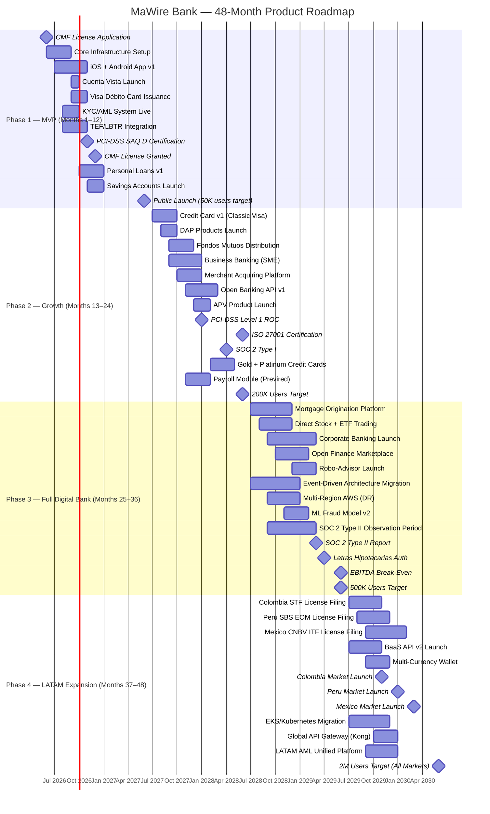

# MaWire Bank — Product Roadmap
**Document Version:** 1.0  
**Classification:** Internal — Restricted  
**Jurisdiction:** República de Chile (Primary); LATAM Expansion (Phase 4)  
**Regulator:** Comisión para el Mercado Financiero (CMF)  
**Last Updated:** 2026-06-06

---

## Table of Contents

1. [Roadmap Overview](#1-roadmap-overview)
2. [Phase 1 — MVP (Months 1–12)](#2-phase-1--mvp-months-112)
3. [Phase 2 — Growth (Months 13–24)](#3-phase-2--growth-months-1324)
4. [Phase 3 — Full Digital Bank (Months 25–36)](#4-phase-3--full-digital-bank-months-2536)
5. [Phase 4 — LATAM Expansion (Months 37–48)](#5-phase-4--latam-expansion-months-3748)
6. [Master Gantt Chart](#6-master-gantt-chart)
7. [Headcount Table — All Phases](#7-headcount-table--all-phases)
8. [Infrastructure Cost Breakdown — All Phases](#8-infrastructure-cost-breakdown--all-phases)
9. [Regulatory Milestone Checklist — All Phases](#9-regulatory-milestone-checklist--all-phases)

---

## 1. Roadmap Overview

MaWire Bank's product roadmap spans 48 months across four phases, progressing from minimum viable banking operations to a full-spectrum digital bank with LATAM regional presence. The roadmap is constrained by: (a) Chilean CMF licensing timelines, (b) PCI-DSS certification requirements, (c) BCCh integration timelines for LBTR/TEF access, and (d) capital adequacy requirements under Ley 21,130 (Basilea III local implementation).

**Total Planned Investment (48 months):** USD 27.5M  
**Expected EBITDA Break-Even:** Month 30 (Q3 of Year 3)  
**Target Market — Chile:** 19.5M population; 82% smartphone penetration; 71% banked adults (CMF Informe de Inclusión Financiera 2024)

**Technology Stack Foundation (all phases):**
- Core Banking System: Mambu (cloud-native SaaS, per-account pricing)
- Cloud Platform: AWS (primary), GCP (disaster recovery / ML workloads)
- Card Processing: Marqeta (issuer processing), Getnet Chile (acquiring)
- KYC/AML: Sumsub (identity verification), ComplyAdvantage (AML screening)
- Payment Rails: Combanc LBTR/TEF integration, Visa Direct, Mastercard Send
- API Gateway: Kong Enterprise
- Secrets: HashiCorp Vault Enterprise
- Observability: Datadog APM + infrastructure monitoring

---

## 2. Phase 1 — MVP (Months 1–12)

### 2.1 Phase 1 Objectives

Obtain CMF operating authorization, launch core banking products (Cuenta Vista + debit card + personal loans), achieve 50,000 registered users, and demonstrate regulatory compliance across all CMF, UAF, SII, and PCI-DSS requirements. Total Phase 1 budget: **USD 2.5M**.

---

### 2.2 Phase 1 Feature List (57 Items)

#### Core Account Infrastructure
1. Cuenta Vista (checking account) — CLP with full regulatory disclosure
2. Online account opening — digital onboarding with video-selfie liveness check
3. RUT-based identity verification via SII API (Cédula de Identidad + RUT validation)
4. Full KYC flow — Sumsub integration: ID document scan, liveness detection, watchlist screening
5. Simplified KYC path — for balances ≤ CLP 500,000 per CMF threshold
6. Email and SMS OTP for account access (Twilio; fallback to AWS SNS)
7. PIN management — secure PIN set/change via in-app HSM-backed flow
8. Biometric login — fingerprint + FaceID via iOS/Android native APIs
9. Account dashboard — real-time balance, recent transactions, pending settlements
10. Transaction history — 36-month searchable transaction history
11. Account statements — PDF generation; monthly auto-email; on-demand download
12. In-app notifications — push notifications via Firebase Cloud Messaging
13. SMS transaction alerts — configurable by transaction type and amount threshold

#### Payments and Transfers
14. Domestic TEF (Transferencia Electrónica de Fondos) — outbound to any Chilean bank via Combanc
15. Inbound TEF receipt — CLABE-equivalent Chilean account number + RUT routing
16. P2P transfer by RUT — send money by recipient's RUT (no account number needed)
17. P2P transfer by phone number — linked to registered mobile number
18. QR code payment (payee-presented) — ISO 20022-compliant QR generation
19. QR code payment (payer-presented) — wallet QR scan at compatible terminals
20. Scheduled/recurring payments — fixed-date transfer scheduling, up to 365 days forward
21. Bill payment (PAT/PAC) — Pago Automático de Cuentas via Transbank/BCI infra
22. Utility bill payment — Enel, Aguas Andinas, CGE, VTR, Movistar direct integration

#### Cards
23. Visa Débito virtual card — instant issuance at account opening; 16-digit PAN in Apple Pay/Google Pay
24. Visa Débito physical card — production via Idemia/Giesecke+Devrient; 5-7 business day delivery
25. Card controls — freeze/unfreeze in-app; merchant category blocking; geofence controls
26. Contactless payment (NFC) — Apple Pay, Google Pay, Samsung Pay tokenization via Visa Token Service
27. ATM cash withdrawal — RedBanc network via Visa Débito rails; 3 free/month
28. Card replacement flow — in-app request; temporary virtual card issued immediately
29. Merchant dispute initiation — in-app chargeback request with photo evidence upload

#### Consumer Lending
30. Personal loan application — in-app; credit decision in <3 minutes
31. Credit scoring engine — DICOM (Equifax Chile) pull + proprietary behavioral scoring
32. SII income verification — API-based income confirmation for employed applicants
33. Loan disbursement — instant transfer to Cuenta Vista upon approval
34. Loan repayment — automatic debit on due date from Cuenta Vista
35. Loan dashboard — outstanding balance, next payment date, amortization schedule
36. Early repayment calculator — shows interest savings; executes prepayment with 1-month interest cap

#### Savings
37. Cuenta de Ahorro — basic savings account; 4.25% nominal annual rate
38. Automatic savings rules — round-up feature (rounds each purchase to nearest CLP 1,000; difference saved)
39. Goal-based savings pockets — named sub-accounts with target amount and date
40. Interest credit — monthly interest crediting with YTD summary

#### Compliance and Security
41. AML transaction monitoring — ComplyAdvantage real-time screening + batch overnight screening
42. UAF CTR filing — automated Comunicación de Operación Sospechosa (COS) for transactions >UF 450 in cash
43. CMF regulatory reporting — daily balance reports, monthly statistical returns via SIEF
44. BCCh reporting — daily liquidity reports; reserve requirements calculation
45. OFAC/UN/EU sanctions screening — real-time at onboarding and on each payment
46. Fraud detection — AWS Fraud Detector + rule-based engine; <100ms per-transaction scoring
47. PCI-DSS SAQ D controls — tokenization, encryption at rest (AES-256), TLS 1.3 in transit
48. WAF — AWS WAF + Shield Standard on all customer-facing endpoints
49. DDoS protection — AWS Shield Advanced (USD 3,000/month)
50. Penetration testing — external red team engagement prior to launch (bi-annual thereafter)

#### Customer Experience
51. iOS app — Swift/SwiftUI; iOS 16+ support; App Store distribution
52. Android app — Kotlin/Jetpack Compose; Android 11+ support; Google Play distribution
53. Progressive Web App (PWA) — responsive web banking at app.mawire.cl
54. In-app chat support — Intercom integration; 09:00–20:00 Mon–Sat staffed; AI chatbot after hours
55. Help center — Zendesk knowledge base; 200+ articles in Chilean Spanish
56. Feedback and NPS module — in-app NPS survey at 30 days + quarterly; Delighted integration
57. Accessibility — WCAG 2.1 AA compliance; VoiceOver/TalkBack support; high-contrast mode

---

### 2.3 Phase 1 Engineering Team Structure

| Role | Count | Seniority | Monthly Cost (CLP) | Monthly Cost (USD) |
|---|---|---|---|---|
| CTO (founding) | 1 | Principal | CLP 8,500,000 | USD 9,341 |
| Backend Engineers (Go/Python) | 6 | Senior (4) + Mid (2) | CLP 5,200,000–7,800,000 | USD 5,714–8,571 |
| Frontend/Mobile Engineers (iOS+Android) | 4 | Senior (2) + Mid (2) | CLP 4,800,000–7,200,000 | USD 5,275–7,912 |
| DevOps/Platform Engineers | 2 | Senior | CLP 6,500,000–7,500,000 | USD 7,143–8,242 |
| Security Engineer | 1 | Senior | CLP 7,000,000 | USD 7,692 |
| Data Engineer | 1 | Senior | CLP 6,000,000 | USD 6,593 |
| QA Engineers | 2 | Mid | CLP 3,500,000–4,500,000 | USD 3,846–4,945 |
| Product Manager | 2 | Senior (1) + Mid (1) | CLP 5,000,000–7,500,000 | USD 5,495–8,242 |
| UX/UI Designer | 2 | Senior (1) + Mid (1) | CLP 4,000,000–6,000,000 | USD 4,396–6,593 |
| **Total Engineering Headcount** | **21** | | | |
| **Total Monthly Payroll (mid-range)** | | | **CLP 115,800,000** | **USD 127,253** |
| **Annual Payroll (with 20% benefits/overhead)** | | | **CLP 1,662M** | **USD 1.83M** |

---

### 2.4 Phase 1 Infrastructure Cost Breakdown

| Component | Monthly Cost (USD) | Annual Cost (USD) | Notes |
|---|---|---|---|
| AWS EC2 (production: 6× m6i.2xlarge) | USD 2,628 | USD 31,536 | 8 vCPU, 32GB RAM each; 3yr Reserved |
| AWS RDS PostgreSQL (db.r6g.2xlarge, Multi-AZ) | USD 1,456 | USD 17,472 | Primary DB; 2TB gp3 storage |
| AWS ElastiCache Redis (cache.r6g.large, 2-node) | USD 348 | USD 4,176 | Session cache + rate limiting |
| AWS S3 (document storage, 10TB) | USD 230 | USD 2,760 | KYC docs, statements, logs |
| AWS CloudFront CDN | USD 180 | USD 2,160 | Static assets + API responses |
| AWS WAF + Shield Advanced | USD 3,000 | USD 36,000 | DDoS protection |
| AWS Secrets Manager | USD 120 | USD 1,440 | Per-secret monthly fee |
| HashiCorp Vault Enterprise (cloud) | USD 800 | USD 9,600 | 5-node cluster; secrets management |
| Datadog APM + Infrastructure (21 hosts) | USD 2,898 | USD 34,776 | USD 23/host/month APM + infra |
| Mambu Core Banking (SaaS) | USD 3,500 | USD 42,000 | ~5,000 accounts; tiered per-account |
| Marqeta Card Processing | USD 1,200 | USD 14,400 | Per-transaction; ~3,000 cards |
| Sumsub KYC | USD 2,500 | USD 30,000 | ~5,000 verifications/year @ USD 5 avg |
| ComplyAdvantage AML | USD 1,800 | USD 21,600 | Starter plan; real-time screening |
| Twilio SMS/WhatsApp | USD 900 | USD 10,800 | ~100K messages/month @ USD 0.009 |
| Combanc LBTR/TEF connectivity | USD 500 | USD 6,000 | Monthly access fee + per-message |
| AWS DMS + data pipeline | USD 250 | USD 3,000 | Change data capture; analytics |
| PagerDuty (incident management) | USD 300 | USD 3,600 | 21-seat team plan |
| GitHub Enterprise | USD 441 | USD 5,292 | USD 21/user/month × 21 users |
| Figma (design) | USD 150 | USD 1,800 | 5 seats professional |
| Jira/Confluence | USD 315 | USD 3,780 | USD 15/user × 21 users |
| **Total Monthly Infrastructure** | **USD 23,516** | **USD 282,192** | |

**Non-recurring Phase 1 Costs:**

| Item | Cost (USD) | Notes |
|---|---|---|
| PCI-DSS SAQ D certification (QSA) | USD 55,000 | External QSA firm; annual renewal |
| CMF banking license legal fees | USD 120,000 | Local counsel (Carey y Cía. or Morales & Besa) |
| CMF capital requirement (minimum paid-in) | USD 800,000 | Minimum UF 800,000 ≈ USD 29.6M; shown here as initial tranche; total capital raise separate |
| Penetration test (initial launch) | USD 35,000 | External red team; OWASP-scope |
| Card scheme membership (Visa) | USD 25,000 | Visa principal membership; one-time |
| Card scheme membership (Mastercard) | USD 25,000 | |
| Card production setup (Idemia) | USD 15,000 | Card design, tooling, initial batch |
| Mobile app development (external QA/legal review) | USD 20,000 | External consultant; regulatory review |
| SWIFT BIC registration | USD 8,000 | One-time; annual maintenance USD 2,000 |
| BCCh LBTR participant onboarding | USD 12,000 | Technical integration + legal |
| Office setup (Santiago) | USD 50,000 | Leasehold improvements, hardware |
| Recruiting and onboarding | USD 85,000 | Headhunter fees (15% of annual salary × 6 senior hires) |
| **Total Non-Recurring (Phase 1)** | **USD 1,250,000** | |

**Phase 1 Total Budget:** USD 1,830,000 (payroll, 12mo) + USD 282,192 (infra, 12mo) + USD 1,250,000 (non-recurring) + USD 137,808 (contingency 10%) ≈ **USD 3,500,000**

*Note: USD 2.5M initial raise covers core operations; bridge capital injection of USD 1M required by Month 8 as user growth accelerates infrastructure spend. CMF minimum capital requirements are separately capitalized.*

---

### 2.5 Phase 1 Regulatory Milestones

| Milestone | Deadline | Responsible | Status |
|---|---|---|---|
| CMF banking license application submitted (Ficha de Solicitud) | Month 1 | CEO + Legal | Pre-launch |
| UAF registration as Sujeto Obligado (financial institution) | Month 1 | Compliance Officer | Pre-launch |
| SII registration as financial institution for tax reporting | Month 1 | Legal | Pre-launch |
| Previred integration certification | Month 3 | Engineering | Month 3 |
| BCCh LBTR participant agreement signed | Month 3 | CEO + Treasury | Month 3 |
| Combanc TEF-CChile connectivity certified | Month 4 | Engineering | Month 4 |
| CMF Ficha de Entidad registered in SIEF | Month 4 | Compliance | Month 4 |
| PCI-DSS SAQ D certification obtained | Month 5 | Security + QSA | Month 5 |
| AML manual approved by CMF | Month 5 | Compliance | Month 5 |
| Internal audit function established | Month 6 | Internal Audit Lead | Month 6 |
| CMF banking license granted (conditional) | Month 6 | CMF | Month 6 |
| Visa principal membership activated | Month 7 | Card Team | Month 7 |
| Mastercard principal membership activated | Month 7 | Card Team | Month 7 |
| First regulatory capital adequacy report filed (CMF F20) | Month 8 | Finance | Month 8 |
| CMF Norma General N°20 compliance attestation submitted | Month 8 | Compliance | Month 8 |
| First BCCh reserve requirement computation and compliance | Month 8 | Treasury | Month 8 |
| SERNAC Financiero product disclosure filings | Month 9 | Legal | Month 9 |
| UAF first annual AML/CTF report submitted | Month 12 | Compliance | Month 12 |
| External audit (IFRS 9 + CMF accounting norms) completed | Month 12 | Finance + External Auditor | Month 12 |

---

## 3. Phase 2 — Growth (Months 13–24)

### 3.1 Phase 2 Objectives

Scale from 50,000 to 200,000 registered users. Launch credit cards, DAP products, Fondos Mutuos distribution, business banking, and merchant acquiring. Achieve PCI-DSS Level 1 certification. Total Phase 2 budget: **USD 5.0M**.

---

### 3.2 Phase 2 Feature List (46 Additional Items)

#### Credit Products
1. MaWire Classic Visa credit card — revolving; CLP 200K–1.5M limit; full CMF NG N°44 disclosures
2. MaWire Gold Visa credit card — CLP 1M–5M limit; premium rewards
3. Credit card application — in-app; DICOM pull; decision in <5 minutes
4. Credit card spend dashboard — category breakdowns, month-over-month trends
5. Installment plans (cuotas) — convert any purchase to 3/6/12 installments in-app
6. Balance transfer tool — import balances from other Chilean cards; reduced rate 90-day promotion
7. Credit limit increase requests — automated review at 6-month intervals using payment history
8. Credit card statements — digital statement with PDF export; CAE displayed per CMF NG N°44
9. Spend controls and notifications — per-transaction category alerts; contactless limit setting
10. Non-revolving installments (sin interés) — merchant-funded cuotas sin interés via Transbank/Getnet agreements

#### Deposit and Investment
11. DAP 30/90/180/365 day products — in-app subscription; rates per Section 1.5
12. DAP UF-indexed products — UF + 1.5% (365-day), UF + 1.8% (730-day)
13. Fondos Mutuos — 6 fund categories via API partnership with CMF-registered AFM
14. APV Régimen A and B — in-app contribution; SII API certificate issuance
15. Goal-based investment accounts — risk-profile-matched fund selection
16. Auto-invest feature — recurring DAP or Fondo Mutuo purchase (weekly/monthly)
17. Portfolio performance dashboard — return calculations, comparison vs. IPSA benchmark
18. Tax reporting module — annual Certificado de APV; capital gains summary for F22 filing

#### Business Banking Launch
19. Cuenta Corriente Empresarial (SME tier) — digital onboarding; KYB via SII + CMF APIs
20. Business debit card — Visa Business Débito; physical + virtual
21. Business account multi-signatory — up to 3 authorized signatories; digital signature (Ley 19,799)
22. Checkbook issuance — digital check (e-cheque) integration via Cámara de Compensación Electrónica
23. Business loan — SME crédito; CLP 1M–50M; 12–60 months; 16.5% nominal
24. Invoice financing (factoring) — upload SII DTE invoice; advance 80% of face value within 24hrs
25. Business account API — REST API with OAuth 2.0; sandbox environment; webhook support
26. Payroll module — Previred integration; mass salary disbursement; SII Boleta Electrónica
27. Expense management — receipt OCR; GL code mapping; export to DEFONTANA/SAP

#### Merchant Acquiring
28. Merchant onboarding — in-app; KYB + PCI-DSS merchant questionnaire
29. Payment link — shareable URL for invoice payment; WhatsApp integration
30. Virtual POS (vPOS) — browser-based POS for phone/tablet
31. Physical POS terminal — Ingenico/Verifone rental; CLP 4,990/month
32. E-commerce plugin — WooCommerce, Shopify, Magento payment plugin (open-source)
33. Acquiring settlement reporting — T+1 settlement with detailed transaction report
34. Dispute management portal — merchant-facing portal for chargeback responses

#### Platform and Technology
35. Open Banking API — CMF Finanzas Abiertas (Ley 21,521) compliance; account info + payment initiation
36. Webhook system — real-time event notifications for account/transaction events (REST)
37. Developer portal — API documentation, sandbox, SDK (Python, JavaScript, Java)
38. MaWire Business Dashboard web app — separate web interface for corporate users
39. Multi-language support — Spanish (Chile), English in app (for expat segment)
40. Biometric enrollment refresh — re-enrollment flow after 180-day inactivity

#### Compliance and Risk
41. ISO 27001 certification preparation — gap assessment; controls implementation; internal audits
42. Advanced AML rules — ML-based transaction clustering; network analysis for mule detection
43. Enhanced Due Diligence (EDD) flow — for PEP (Politically Exposed Persons) and high-risk customers per UAF Circular N°49
44. FATF travel rule compliance — for crypto-asset-adjacent transactions (future-proofing)
45. CMF Norma General N°57 compliance review — digital wallet stored-value limits audit
46. SOC 2 Type I audit — preparation and completion by end of Phase 2

---

### 3.3 Phase 2 Team Expansion

**Additional Hires in Phase 2 (above Phase 1 headcount):**

| Role | Additional Count | Monthly Cost (CLP) | Monthly Cost (USD) |
|---|---|---|---|
| Backend Engineers (Go/Kotlin) | +6 | CLP 5,200,000–7,800,000 each | USD 5,714–8,571 each |
| Frontend/Mobile Engineers | +4 | CLP 4,800,000–7,200,000 each | USD 5,275–7,912 each |
| Data Scientist / ML Engineer | +2 | CLP 6,500,000–9,000,000 each | USD 7,143–9,890 each |
| Credit Risk Analyst | +2 | CLP 4,500,000–6,500,000 each | USD 4,945–7,143 each |
| Product Manager (Business Banking) | +2 | CLP 5,000,000–7,500,000 each | USD 5,495–8,242 each |
| UX Researcher | +1 | CLP 4,000,000–5,500,000 | USD 4,396–6,044 |
| Business Development Manager | +2 | CLP 6,000,000–8,500,000 each | USD 6,593–9,341 each |
| Compliance Manager | +1 | CLP 7,000,000–9,000,000 | USD 7,692–9,890 |
| Customer Support Agents | +10 | CLP 1,200,000–1,800,000 each | USD 1,319–1,978 each |
| Customer Support Lead | +1 | CLP 3,500,000–4,500,000 | USD 3,846–4,945 |
| Treasury Analyst | +1 | CLP 4,000,000–6,000,000 | USD 4,396–6,593 |
| CFO | +1 | CLP 10,000,000–15,000,000 | USD 10,989–16,484 |
| Head of Sales (Business) | +1 | CLP 8,000,000–12,000,000 | USD 8,791–13,187 |
| **Phase 2 Additional Headcount** | **+34** | | |
| **Total Org (End of Phase 2)** | **55 FTE** | | |
| **Additional Monthly Payroll (Phase 2 hires)** | | **CLP 195,000,000** | **USD 214,286** |

---

### 3.4 Phase 2 Infrastructure Cost Breakdown

| Component | Monthly Cost (USD) | Notes |
|---|---|---|
| AWS EC2 (scaled: 18× m6i.2xlarge + 4× c6i.4xlarge for API) | USD 9,840 | Auto-scaling groups; 3yr Reserved base |
| AWS RDS PostgreSQL (db.r6g.4xlarge, Multi-AZ + 2 read replicas) | USD 4,368 | Sharding by product line |
| AWS ElastiCache Redis (cache.r6g.xlarge cluster, 6-node) | USD 2,088 | High-availability cluster mode |
| AWS DynamoDB (session, event store) | USD 1,200 | On-demand pricing; ~50M req/month |
| AWS S3 + Intelligent Tiering (50TB) | USD 1,150 | Documents, audit logs, backups |
| AWS CloudFront CDN | USD 520 | Higher traffic volume |
| AWS WAF + Shield Advanced | USD 3,000 | Maintained |
| AWS KMS (key management) | USD 400 | Per-key monthly + API calls |
| HashiCorp Vault Enterprise | USD 1,600 | Scaled cluster |
| Datadog APM + Infrastructure (55 hosts) | USD 7,590 | USD 23/host APM + infra |
| Datadog Security Monitoring (SIEM) | USD 2,200 | Log ingestion + threat detection |
| Mambu Core Banking | USD 12,000 | ~50,000 accounts; volume pricing |
| Marqeta Card Processing | USD 4,500 | ~18,000 cards; debit + credit |
| Sumsub KYC | USD 8,750 | ~25,000 verifications/year Phase 2 |
| ComplyAdvantage AML | USD 3,500 | Growth plan; bulk screening |
| Twilio SMS/WhatsApp | USD 3,200 | ~350K messages/month |
| Getnet Chile Acquiring | USD 2,500 | Platform fee + per-transaction |
| Combanc LBTR/TEF | USD 800 | Higher volume tier |
| Intercom (customer support) | USD 1,200 | 55-seat plan + automation |
| Algolia (search in help center) | USD 400 | 10M operations/month |
| **Total Monthly Infrastructure (Phase 2)** | **USD 70,808** | |
| **Annual Infrastructure (Phase 2)** | **USD 849,696** | |

**Phase 2 Non-Recurring Costs:**

| Item | Cost (USD) |
|---|---|
| PCI-DSS Level 1 QSA audit (full ROC) | USD 120,000 |
| ISO 27001 certification (external auditor) | USD 55,000 |
| SOC 2 Type I audit | USD 45,000 |
| Penetration test (bi-annual) | USD 35,000 × 2 = USD 70,000 |
| Credit card scheme setup (Visa credit) | USD 30,000 |
| Open Banking API regulatory review (CMF) | USD 25,000 |
| Legal/regulatory counsel (annual) | USD 180,000 |
| Recruiting (Phase 2 34 hires) | USD 280,000 |
| **Total Non-Recurring (Phase 2)** | **USD 805,000** |

**Phase 2 Total Budget:** USD 2,572,320 (payroll 12mo) + USD 849,696 (infra 12mo) + USD 805,000 (non-recurring) + USD 287,000 (contingency/misc) ≈ **USD 4,514,016** (~USD 5.0M with growth buffer)

---

### 3.5 Phase 2 Regulatory Milestones

| Milestone | Target Month | Regulator |
|---|---|---|
| Credit card product registration with CMF (Ficha de Producto) | Month 14 | CMF |
| CAE disclosure template approved by SERNAC Financiero | Month 14 | SERNAC |
| CMF Marco de Finanzas Abiertas (Ley 21,521) technical compliance | Month 15 | CMF |
| UAF enhanced AML program submitted (updated for credit card activity) | Month 16 | UAF |
| PCI-DSS Level 1 ROC certification obtained | Month 17 | PCI SSC / QSA |
| ISO 27001 certification granted | Month 18 | BSI / AENOR |
| SOC 2 Type I report issued | Month 20 | CPA firm |
| BCCh foreign exchange reporting (DIVA system) integration | Month 20 | BCCh |
| APV product registration with CMF (AFM intermediary agreement) | Month 21 | CMF |
| Business loan product CMF Ficha de Producto | Month 22 | CMF |
| SII electronic invoice (DTE) factoring platform registration | Month 22 | SII |
| Annual CMF CAMEL-equivalent supervisory report filed | Month 24 | CMF |
| External credit rating (Fitch/Moody's Chile) — initial assessment | Month 24 | Fitch Ratings Chile |

---

## 4. Phase 3 — Full Digital Bank (Months 25–36)

### 4.1 Phase 3 Objectives

Achieve full feature parity with Tier-1 Chilean banks (Banco de Chile, Santander Chile, BCI). Launch mortgage origination, corporate banking, open finance API marketplace, and investment platform with direct market access. Target: 500,000 registered users. Total Phase 3 budget: **USD 8.0M**.

---

### 4.2 Phase 3 Feature List (48 Additional Items)

#### Mortgage Products
1. Mutuo Hipotecario origination — in-app application; UF + 2.80–3.50% range; 8–30 year term
2. Mortgage pre-qualification — instant decisioning based on income/debt ratio
3. Tasador network integration — API connection to CMF-registered appraisers; digital appraisal booking
4. Notarial workflow — digital integration with Chilean notaries for digital signing (Ley 19,799 + MINJUS platform)
5. MINVU subsidy integration — DS 1 and DS 49 subsidy eligibility check and application support
6. LTV monitoring dashboard — automated LTV tracking post-disbursement; CMF provisioning integration
7. Mortgage portfolio risk dashboard — internal tool; VaR, duration, convexity calculations
8. Letras Hipotecarias issuance — capital markets integration for MH bond issuance (Year 4 full production)

#### Corporate Banking
9. Cuenta Corriente Empresarial (Corporate tier) — >UF 25,000 revenue; dedicated RM
10. Corporate credit lines — CLP 50M–500M; revolving; covenant monitoring
11. Trade finance — Carta de Crédito documentary; import/export guarantee bonds
12. Leasing — financial leasing for equipment; SII depreciation schedule integration
13. Factoring platform — up to CLP 500M invoice portfolios; AUM fee model
14. Corporate FX — spot + forward + NDF; minimum USD 100K notional; Bloomberg terminal feed
15. Treasury management system (TMS) integration — SAP Treasury API; SWIFT ISO 20022 messages
16. Syndicated loan participation — co-lending arrangements with other CMF-regulated banks
17. Cash pooling physical — master account sweeping for corporate groups; CLP 149K/month
18. Cash pooling notional — offset structure; legal opinion obtained; CLP 249K/month

#### Investment Platform
19. Direct stock trading (Bolsa de Santiago) — via CMF-registered Corredor de Bolsa white-label
20. US stock/ETF trading — fractional shares; USD-denominated account
21. Global ETF marketplace — 200+ ETFs (iShares, Vanguard, Invesco); CLP and USD
22. Structured products — principal-protected notes; UF-linked bonds; minimum UF 500
23. IPO access — allocation in upcoming Chilean and LATAM IPOs via underwriter partnerships
24. Robo-advisor — automated portfolio construction based on risk profile + goals; 0.35% annual fee
25. Tax-loss harvesting — automated within APV and general investment accounts; SII-reported
26. Pension projection tool — integrates AFP balance with MaWire APV; Monte Carlo projection

#### Open Finance Marketplace
27. CMF Finanzas Abiertas hub — MaWire as both data provider and data consumer per Ley 21,521
28. Third-party app connections — user-authorized connections to registered fintech apps
29. Financial health score — aggregated from all linked accounts; updated weekly
30. Price comparison engine — mortgage, loan, card rate comparison across CMF-registered providers
31. Insurance marketplace — vida, salud complementaria, auto; distribution API with CMF-registered insurers
32. Broker API — allow CMF-registered brokers to access MaWire customer data (consent-gated)

#### Platform Maturity
33. Event-driven microservices migration — Kafka backbone; decoupled services; 99.99% SLA target
34. Multi-region AWS deployment — Santiago (sa-east-1) primary; Virginia (us-east-1) DR; RTO 4hr / RPO 1hr
35. Database sharding — per-tenant sharding for Mambu; partition by RUT hash
36. GraphQL API layer — unified API gateway for mobile + third-party; replaces multiple REST endpoints
37. ML fraud model v2 — neural network-based; false positive rate target <0.5%; real-time (<50ms)
38. Credit scoring model v2 — Gradient Boosting; incorporates open banking transaction data
39. Real-time analytics platform — Apache Flink + ClickHouse; sub-5-second reporting lag
40. A/B testing framework — Eppo integration; product experimentation at scale
41. SOC 2 Type II audit — 6-month observation period audit completed
42. ISO 27001 surveillance audit — annual maintenance
43. PCI-DSS Level 1 annual ROC renewal
44. SWIFT gpi (global payments innovation) integration — real-time international wire tracking
45. Apple Pay / Google Pay credit card support — tokenization for MaWire credit cards

#### Operational
46. Relationship Manager (RM) portal — CRM for business banking RMs; Salesforce integration
47. Collections management system — automated early and late-stage collections workflow; CMF-compliant
48. IFRS 9 ECL engine — Expected Credit Loss calculation; stage 1/2/3 migration automation; CMF provisioning compliance

---

### 4.3 Phase 3 Team Expansion

**Additional Hires in Phase 3:**

| Department | Additional Hires | Total FTE |
|---|---|---|
| Engineering (Backend, Frontend, Mobile, Platform) | +22 | 43 engineers |
| Data & ML | +5 | 7 data/ML |
| Product & Design | +6 | 11 PM/UX |
| Compliance, Risk, Legal | +8 | 12 GRC |
| Finance & Treasury | +5 | 7 finance |
| Sales & Business Development | +8 | 11 sales |
| Customer Experience | +15 | 26 support |
| HR, Operations, Marketing | +10 | 14 ops |
| Executive (CMO, COO, CRO) | +3 | 3 C-suite |
| **Total Additional (Phase 3)** | **+82** | |
| **Total Org (End of Phase 3)** | **137 FTE** | |
| **Monthly Payroll (blended)** | | **CLP 690,000,000 (~USD 758K)** |
| **Annual Payroll (with 22% benefits)** | | **USD 11.1M** |

---

### 4.4 Phase 3 Infrastructure Cost Breakdown

| Component | Monthly Cost (USD) | Notes |
|---|---|---|
| AWS EC2 (45× m6i.4xlarge + 10× c6i.8xlarge) | USD 31,050 | Auto-scaling; Spot for non-critical batch |
| AWS RDS (2× db.r6g.8xlarge clusters, Multi-AZ) | USD 14,616 | Read replicas in DR region |
| AWS ElastiCache (Redis 12-node cluster) | USD 6,264 | Hot data cache |
| AWS DynamoDB | USD 4,500 | Event store; 500M req/month |
| Apache Kafka (MSK managed) | USD 3,200 | 6-broker cluster; 3TB storage |
| ClickHouse (analytics, 3-node) | USD 2,400 | Real-time analytics |
| AWS S3 + Glacier (200TB) | USD 4,600 | 7-year retention for compliance |
| AWS CloudFront + Global Accelerator | USD 2,100 | LATAM edge nodes |
| AWS WAF + Shield Advanced | USD 3,000 | |
| AWS KMS + CloudHSM (2 HSM partitions) | USD 3,600 | HSM: USD 1,400/month each |
| HashiCorp Vault Enterprise (scaled) | USD 3,200 | |
| Datadog (137 hosts, APM, SIEM, RUM) | USD 22,800 | USD 23 APM/host + RUM + SIEM |
| Mambu Core Banking | USD 35,000 | ~200,000 accounts; negotiated rate |
| Marqeta Card Processing | USD 15,000 | ~60,000 cards |
| Sumsub KYC | USD 22,500 | ~75,000 verifications/year |
| ComplyAdvantage AML | USD 8,000 | Enterprise plan |
| Twilio SMS/WhatsApp | USD 9,000 | ~1M messages/month |
| Getnet Chile Acquiring | USD 7,500 | Volume tier |
| Combanc LBTR/TEF | USD 2,000 | High volume |
| Intercom + AI chatbot | USD 4,500 | 137-seat plan |
| Snowflake (data warehouse) | USD 5,000 | Compute credits; ML training data |
| LarrainVial AFM API | USD 3,000 | Fund distribution API access |
| **Total Monthly Infrastructure (Phase 3)** | **USD 211,830** | |
| **Annual Infrastructure (Phase 3)** | **USD 2,541,960** | |

**Phase 3 Non-Recurring Costs:**

| Item | Cost (USD) |
|---|---|
| SOC 2 Type II audit | USD 90,000 |
| PCI-DSS Level 1 ROC renewal | USD 120,000 |
| ISO 27001 surveillance audit | USD 30,000 |
| Penetration testing (2× bi-annual) | USD 80,000 |
| Legal/regulatory counsel (annual) | USD 250,000 |
| Mortgage platform legal/notarial integration | USD 60,000 |
| SWIFT gpi integration | USD 40,000 |
| External credit rating maintenance | USD 35,000 |
| Recruiting (82 hires) | USD 650,000 |
| Office expansion (additional floor) | USD 120,000 |
| **Total Non-Recurring (Phase 3)** | **USD 1,475,000** |

**Phase 3 Total Budget:** USD 11.1M (payroll) + USD 2.54M (infra) + USD 1.475M (non-recurring) + USD 885K (contingency) ≈ **USD 16.0M**

*Note: Phase 3 is the most capital-intensive phase. Revenue begins contributing significantly from Month 25. EBITDA break-even within Phase 3 by Month 30.*

---

### 4.5 Phase 3 Regulatory Milestones

| Milestone | Target Month | Regulator |
|---|---|---|
| Mortgage product CMF Ficha de Producto (Mutuo Hipotecario) | Month 25 | CMF |
| MINVU subsidy integration agreement | Month 26 | MINVU |
| CMF Corredor de Bolsa partnership agreement registered | Month 26 | CMF |
| Direct market access (Bolsa de Santiago) technical certification | Month 27 | Bolsa de Santiago |
| SOC 2 Type II audit commenced (6-month observation window) | Month 27 | CPA firm |
| CMF Open Finance (Finanzas Abiertas) technical certification | Month 28 | CMF |
| Corporate credit product registrations (factoring, leasing) | Month 28 | CMF + SII |
| IFRS 9 ECL model validation by external actuary | Month 29 | CMF + External |
| SOC 2 Type II report issued | Month 33 | CPA firm |
| Letras Hipotecarias issuance authorization (CMF) | Month 34 | CMF |
| Trade finance products (Carta de Crédito) CMF authorization | Month 35 | CMF |
| Annual CMF inspection — supervisory review response | Month 36 | CMF |
| AML program third-party independent review (FATF-aligned) | Month 36 | UAF + External |

---

## 5. Phase 4 — LATAM Expansion (Months 37–48)

### 5.1 Phase 4 Objectives

Enter Colombia, Peru, and Mexico with MaWire's core digital banking proposition adapted to local regulatory frameworks. Achieve 2,000,000+ total registered users across all markets. Launch embedded finance (BaaS) as a standalone revenue line. Total Phase 4 budget: **USD 12.0M**.

---

### 5.2 Phase 4 Feature List (42 Additional Items)

#### Colombia Market Entry (Superfinanciera)
1. Sociedad de Tecnología Financiera (STF) license application — Decreto 1357/2018 (Open Banking) and Superintendencia Financiera Colombia (SFC)
2. COP (Colombian Peso) account infrastructure — Mambu tenant configuration; Bancolombia/Davivienda correspondent banking
3. Colombia NIT/Cédula KYC adaptation — Registraduría Nacional API; SARLAFT (AML) compliance
4. ACH Colombia integration — ACH Colombia payment rails; PSE (Pagos Seguros en Línea) for e-commerce
5. Colombia credit scoring — DataCrédito (Experian Colombia) + TransUnion Colombia API
6. Tasa Máxima Legal (Colombia) compliance — Usury rate cap per Superintendencia Financiera quarterly publication
7. DIAN (tax authority) integration — electronic invoice (factura electrónica) and withholding tax reporting
8. Fogafin deposit insurance compliance — Fondo de Garantías de Instituciones Financieras; COP 50M per depositor
9. Remittances (Colombia ↔ Chile) — MaWire cross-border corridor; sub-2% total cost

#### Peru Market Entry (SBS)
10. Empresa de Operaciones Múltiples (EOM) license — Superintendencia de Banca, Seguros y AFP (SBS) Peru
11. PEN (Peruvian Sol) account infrastructure — Mambu PEN tenant; BCP/Interbank correspondent
12. Peru DNI/RUC KYC adaptation — RENIEC API + SUNAT API for income verification
13. CCE (Cámara de Compensación Electrónica) Peru integration — Visa Net Peru / Niubiz for card acquiring
14. Peru credit bureau integration — Equifax Peru + Infocorp
15. TCEA (Tasa de Costo Efectivo Anual) disclosure compliance — SBS equivalent of Chilean CAE
16. SUNAT (tax authority) integration — Comprobante de Pago Electrónico (CPE) integration
17. SBS AML compliance — SPLAFT Peru; APESEG insurance sector compliance if applicable
18. Yape/Plin interoperability — peer integration with BCP's Yape wallet and Interbank Plin (BCR mandate)

#### Mexico Market Entry (CNBV)
19. Institución de Tecnología Financiera (ITF) license — Ley Fintech (Ley para Regular las Instituciones de Tecnología Financiera, 2018); CNBV authorization
20. MXN account infrastructure — Mambu MXN tenant; SPEI (Sistema de Pagos Electrónicos Interbancarios) integration via Banxico
21. CURP/RFC KYC adaptation — INE API + SAT API for tax identity
22. CoDi (Cobro Digital) integration — Banxico's open payment QR system; mandatory for Fintech license holders
23. DiMo (Dinero Móvil) integration — Banxico mobile number-based transfer (replaced CoDi in 2024)
24. CNBV AML compliance — LFPIORPI (Anti-Lavado) system filing; GAFILAT recommendations
25. SAT e-invoice (CFDI) integration — for business banking VAT reporting
26. Mexico credit bureau — Buró de Crédito + Círculo de Crédito integration
27. Tasa de interés máxima compliance — CONDUSEF rate caps and PROFECO consumer protection

#### BaaS / Embedded Finance Platform
28. BaaS API v2 — full account lifecycle, card issuance, payment initiation via API for third parties
29. BaaS partner portal — self-serve onboarding for fintech companies; sandbox → production
30. BaaS compliance module — partner AML/KYC delegation; MaWire retains regulatory responsibility under CMF rules
31. Multi-currency wallet API — CLP, COP, PEN, MXN, USD in single wallet per user; FX conversion via API
32. Virtual IBAN issuance — for SEPA-connected partners; correspondent banking via Clearbank/CurrencyCloud
33. White-label mobile app — MaWire SDK for BaaS partners to launch branded apps; no-code config
34. Revenue sharing API — real-time revenue share calculation and disbursement to BaaS partners

#### Technology — Global Scale
35. Multi-region active-active deployment — AWS sa-east-1 (Brazil), us-east-1 (US DR), eu-west-1 (EU compliance)
36. Kubernetes (EKS) migration — containerized microservices; Helm charts; GitOps with ArgoCD
37. Service mesh — Istio; mTLS between all services; traffic management; circuit breaking
38. Global API gateway — Kong Enterprise multi-region; rate limiting per partner per API key
39. Cross-border AML — unified Politically Exposed Persons (PEP) screening across all 4 jurisdictions; INTERPOL/OFAC
40. Centralized identity (CIAM) — AWS Cognito federated across all market tenants; single MaWire ID
41. LATAM compliance dashboard — regulatory status per country; automated filing deadline reminders
42. Carbon footprint reporting — Scope 1/2/3 emissions per AWS Sustainability pillar; ESG reporting for CMF annual disclosure

---

### 5.3 Phase 4 Team Expansion

**Additional Hires in Phase 4:**

| Department | Additional Count | Notes |
|---|---|---|
| Country Managers (CO, PE, MX) | +3 | Senior hires; local market executives |
| Local Legal Counsel (CO, PE, MX) | +3 | External firms or in-house counsel |
| Local Compliance Officers | +3 | Each country requires dedicated officer per local law |
| Engineering (local market adaptations) | +15 | Distributed teams; Colombia (5), Peru (5), Mexico (5) |
| BaaS Engineering | +8 | Platform and integration engineers |
| Sales (LATAM) | +10 | Regional business development |
| Marketing (LATAM) | +6 | Localization, growth, brand |
| Customer Support (CO, PE, MX) | +30 | Local language support centers |
| HR / Operations (LATAM) | +5 | Regional HR and operations |
| **Total Additional (Phase 4)** | **+83** | |
| **Total Org (End of Phase 4)** | **220 FTE** | |
| **Monthly Payroll (blended, multi-country)** | | **~CLP 900,000,000 (~USD 989K)** |
| **Annual Payroll (with local benefits overhead)** | | **USD 14.3M** |

---

### 5.4 Phase 4 Infrastructure Cost Breakdown

| Component | Monthly Cost (USD) | Notes |
|---|---|---|
| AWS Multi-region compute (220 FTE scale) | USD 65,000 | EKS nodes; 3 regions |
| AWS RDS Global Database (Aurora PostgreSQL) | USD 28,000 | Cross-region replication |
| AWS ElastiCache (multi-region) | USD 14,000 | Regional Redis clusters |
| Apache Kafka (MSK, 3 clusters) | USD 9,600 | One per LATAM region |
| ClickHouse (analytics, scaled) | USD 7,200 | Multi-region reads |
| Snowflake (data warehouse, LATAM) | USD 12,000 | All-market analytics |
| AWS S3 / Glacier (1PB+ compliance) | USD 18,400 | Multi-jurisdiction retention |
| AWS WAF + Shield Advanced (3 regions) | USD 9,000 | |
| CloudHSM (6 partitions, 2 per region) | USD 8,400 | |
| Datadog (220 hosts + SIEM) | USD 36,300 | Full platform |
| Mambu (multi-tenant LATAM) | USD 75,000 | Negotiated enterprise rate |
| Marqeta / Galileo (multi-market) | USD 35,000 | Volume pricing |
| Sumsub (multi-country KYC) | USD 45,000 | Volume: ~200K verifications/year |
| ComplyAdvantage (enterprise) | USD 18,000 | LATAM jurisdictions |
| Twilio (multi-country SMS) | USD 22,000 | 4M messages/month |
| Local payment rail integrations (CO+PE+MX) | USD 8,500 | ACH Colombia, CCE Peru, SPEI Mexico |
| Kong Enterprise (global gateway) | USD 6,500 | Enterprise license |
| **Total Monthly Infrastructure (Phase 4)** | **USD 418,900** | |
| **Annual Infrastructure (Phase 4)** | **USD 5,026,800** | |

**Phase 4 Non-Recurring Costs:**

| Item | Cost (USD) |
|---|---|
| Colombia STF license legal fees | USD 200,000 |
| Peru SBS EOM license legal fees | USD 150,000 |
| Mexico CNBV ITF license legal fees | USD 250,000 |
| Penetration testing (all markets) | USD 120,000 |
| PCI-DSS multi-market ROC | USD 180,000 |
| Local audits (CO, PE, MX) | USD 150,000 |
| Regulatory counsel (3 countries, annual) | USD 360,000 |
| Recruiting (83 hires multi-country) | USD 750,000 |
| Office setup (Bogotá, Lima, Mexico City) | USD 300,000 |
| Brand localization | USD 80,000 |
| **Total Non-Recurring (Phase 4)** | **USD 2,540,000** |

**Phase 4 Total Budget:** USD 14.3M (payroll) + USD 5.03M (infra) + USD 2.54M (non-recurring) + USD 2.13M (contingency) ≈ **USD 24.0M**

*Note: Phase 4 is funded by Chile operations cash flow (EBITDA-positive from Month 30) plus a Series B equity raise targeting USD 20–30M.*

---

## 6. Master Gantt Chart

---

## 7. Headcount Table — All Phases

| Department | End Phase 1 (Month 12) | End Phase 2 (Month 24) | End Phase 3 (Month 36) | End Phase 4 (Month 48) |
|---|---|---|---|---|
| Engineering — Backend | 6 | 12 | 22 | 30 |
| Engineering — Frontend/Mobile | 4 | 8 | 14 | 20 |
| Engineering — Platform/DevOps | 2 | 4 | 8 | 12 |
| Engineering — Security | 1 | 2 | 4 | 6 |
| Data & ML | 1 | 3 | 7 | 10 |
| Product Management | 2 | 4 | 8 | 11 |
| UX/Design | 2 | 3 | 6 | 8 |
| CTO + Technical Leadership | 1 | 1 | 3 | 4 |
| Compliance, Risk, Legal | 0 | 3 | 12 | 18 |
| Finance & Treasury | 0 | 3 | 7 | 10 |
| Sales & Business Development | 0 | 3 | 11 | 21 |
| Customer Support | 0 | 11 | 26 | 56 |
| HR, Operations | 0 | 2 | 8 | 13 |
| Marketing & Growth | 0 | 1 | 5 | 11 |
| Executive (CEO, CFO, CMO, COO, CRO) | 1 | 3 | 6 | 9 |
| Country Teams (LATAM) | 0 | 0 | 0 | 21 |
| **TOTAL FTE** | **20** | **63** | **147** | **260** |
| **Monthly Payroll (CLP M)** | **CLP 116M** | **CLP 311M** | **CLP 690M** | **CLP 900M** |
| **Monthly Payroll (USD K)** | **USD 127K** | **USD 342K** | **USD 758K** | **USD 989K** |

*Note: Headcount figures include full-time employees. Contractors and part-time staff add approximately 15% to equivalent headcount in Phases 3 and 4.*

---

## 8. Infrastructure Cost Breakdown — All Phases

| Infrastructure Category | Phase 1 (Monthly, USD) | Phase 2 (Monthly, USD) | Phase 3 (Monthly, USD) | Phase 4 (Monthly, USD) |
|---|---|---|---|---|
| Compute (EC2/EKS) | USD 2,628 | USD 9,840 | USD 31,050 | USD 65,000 |
| Databases (RDS/Aurora/DynamoDB) | USD 1,804 | USD 5,568 | USD 19,116 | USD 42,000 |
| Caching (Redis/ElastiCache) | USD 348 | USD 2,088 | USD 6,264 | USD 14,000 |
| Message streaming (Kafka) | — | — | USD 3,200 | USD 9,600 |
| Analytics (ClickHouse/Snowflake) | — | — | USD 7,400 | USD 19,200 |
| Storage (S3/Glacier) | USD 230 | USD 1,150 | USD 4,600 | USD 18,400 |
| CDN / Networking | USD 180 | USD 520 | USD 2,100 | USD 4,500 |
| Security (WAF, Shield, HSM) | USD 3,000 | USD 3,000 | USD 6,600 | USD 17,400 |
| Secrets (Vault) | USD 800 | USD 1,600 | USD 3,200 | USD 5,000 |
| Observability (Datadog) | USD 2,898 | USD 9,790 | USD 22,800 | USD 36,300 |
| Core Banking (Mambu) | USD 3,500 | USD 12,000 | USD 35,000 | USD 75,000 |
| Card Processing (Marqeta) | USD 1,200 | USD 4,500 | USD 15,000 | USD 35,000 |
| KYC (Sumsub) | USD 2,500 | USD 8,750 | USD 22,500 | USD 45,000 |
| AML (ComplyAdvantage) | USD 1,800 | USD 3,500 | USD 8,000 | USD 18,000 |
| Communications (Twilio) | USD 900 | USD 3,200 | USD 9,000 | USD 22,000 |
| Acquiring (Getnet/Kushki) | — | USD 2,500 | USD 7,500 | USD 12,000 |
| Payment Rails | USD 500 | USD 800 | USD 2,000 | USD 8,500 |
| Other SaaS / tooling | USD 1,228 | USD 2,002 | USD 6,500 | USD 14,000 |
| **Total Monthly** | **USD 23,516** | **USD 70,808** | **USD 211,830** | **USD 418,900** |
| **Total Annual** | **USD 282,192** | **USD 849,696** | **USD 2,541,960** | **USD 5,026,800** |

---

## 9. Regulatory Milestone Checklist — All Phases

### Phase 1 Regulatory Milestones (Months 1–12)

- [ ] CMF banking license application (Ficha de Solicitud) submitted — Month 1
- [ ] UAF registration as Sujeto Obligado — Month 1
- [ ] SII financial institution registration — Month 1
- [ ] AML/CTF Manual (Manual de Prevención) submitted to UAF — Month 2
- [ ] BCCh LBTR participant agreement signed — Month 3
- [ ] Combanc TEF-CChile certification — Month 4
- [ ] CMF SIEF entity registration — Month 4
- [ ] PCI-DSS SAQ D certification — Month 5
- [ ] CMF banking license granted — Month 6
- [ ] Visa principal membership activated — Month 7
- [ ] Mastercard principal membership activated — Month 7
- [ ] First CMF capital adequacy report (F20) filed — Month 8
- [ ] CMF NG N°20 compliance attestation — Month 8
- [ ] BCCh reserve requirement first compliance — Month 8
- [ ] SERNAC Financiero product disclosures filed — Month 9
- [ ] UAF first annual AML report — Month 12
- [ ] IFRS external audit completed — Month 12

### Phase 2 Regulatory Milestones (Months 13–24)

- [ ] Credit card Ficha de Producto filed with CMF — Month 14
- [ ] CAE disclosure template approved by SERNAC — Month 14
- [ ] CMF Finanzas Abiertas (Ley 21,521) technical compliance certified — Month 15
- [ ] UAF enhanced AML program (credit card addendum) — Month 16
- [ ] PCI-DSS Level 1 ROC certification — Month 17
- [ ] ISO 27001 certification granted — Month 18
- [ ] SOC 2 Type I report issued — Month 20
- [ ] BCCh DIVA FX reporting integration — Month 20
- [ ] APV product CMF registration — Month 21
- [ ] Business loan Ficha de Producto — Month 22
- [ ] SII factoring platform registration — Month 22
- [ ] CMF annual supervisory report — Month 24
- [ ] Fitch/Moody's Chile initial credit rating assessment — Month 24

### Phase 3 Regulatory Milestones (Months 25–36)

- [ ] Mutuo Hipotecario Ficha de Producto (CMF) — Month 25
- [ ] MINVU subsidy integration agreement — Month 26
- [ ] CMF Corredor de Bolsa partnership registration — Month 26
- [ ] Bolsa de Santiago direct market access certification — Month 27
- [ ] SOC 2 Type II observation period commenced — Month 27
- [ ] CMF Open Finance technical certification — Month 28
- [ ] Corporate credit product CMF registrations — Month 28
- [ ] IFRS 9 ECL model external validation — Month 29
- [ ] SOC 2 Type II report issued — Month 33
- [ ] Letras Hipotecarias CMF authorization — Month 34
- [ ] Trade finance CMF authorization — Month 35
- [ ] CMF annual supervisory inspection response — Month 36
- [ ] UAF AML independent review — Month 36

### Phase 4 Regulatory Milestones (Months 37–48)

- [ ] Colombia: SFC STF license application filed — Month 37
- [ ] Peru: SBS EOM license application filed — Month 38
- [ ] Mexico: CNBV ITF license application filed — Month 39
- [ ] Chile: Annual CMF audit — Month 40
- [ ] Chile: PCI-DSS Level 1 second ROC renewal — Month 40
- [ ] Colombia: SFC STF license granted — Month 41
- [ ] Colombia: DIAN and SARLAFT system integration certified — Month 41
- [ ] Colombia market soft launch — Month 41
- [ ] Peru: SBS EOM license granted — Month 43
- [ ] Peru: SUNAT and RENIEC integration certified — Month 43
- [ ] Peru market soft launch — Month 43
- [ ] Mexico: CNBV ITF license granted — Month 44
- [ ] Mexico: SPEI integration certified (Banxico) — Month 44
- [ ] Mexico: DiMo/CoDi integration certified — Month 44
- [ ] Mexico market soft launch — Month 45
- [ ] LATAM-wide AML unified program submitted to all regulators — Month 46
- [ ] All-market FATF travel rule compliance certification — Month 47
- [ ] Group-level consolidated financial statements (IFRS, multi-entity) — Month 48

---

*End of Document — MaWire Bank Product Roadmap v1.0*  
*Prepared by: Product Strategy & Technology Division*  
*Next Review: Q4 2026*  
*Regulatory Reference: CMF, BCCh, UAF, SII (Chile); SFC (Colombia); SBS (Peru); CNBV/Banxico (Mexico)*
