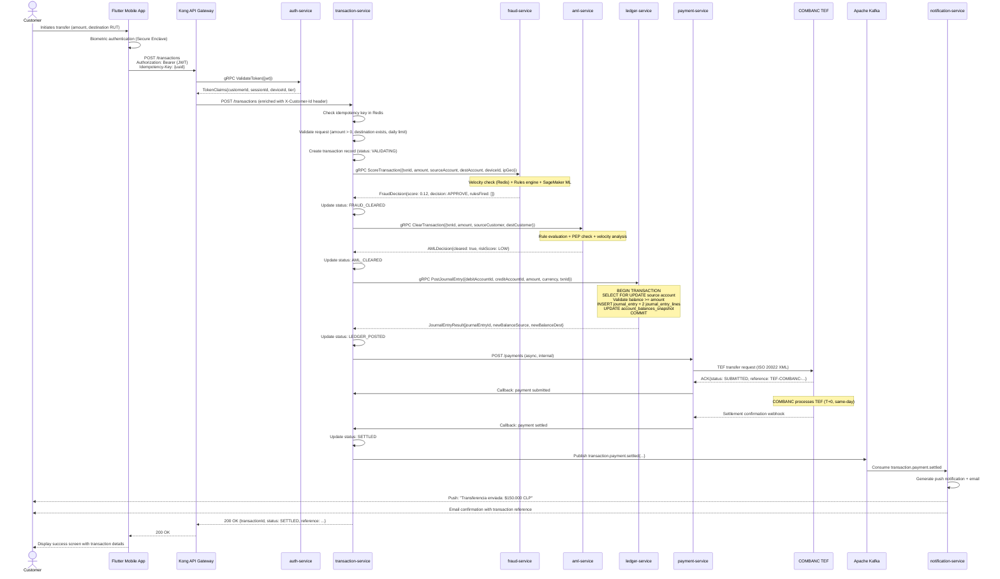

# MaWire Bank — Architecture Overview

**Classification:** Internal Technical Documentation  
**Audience:** CTO, Engineering Leadership, CMF Technical Review  
**Version:** 1.0  
**Date:** 2026-06-06

---

## Table of Contents

1. [Frontend Architecture](#1-frontend-architecture)
   - 1.1 [Mobile Application](#11-mobile-application)
   - 1.2 [Web Frontend](#12-web-frontend)
   - 1.3 [Admin Portals](#13-admin-portals)
2. [Backend Microservices Architecture](#2-backend-microservices-architecture)
3. [Event-Driven Architecture](#3-event-driven-architecture)
4. [API Gateway](#4-api-gateway)
5. [System Architecture Diagrams](#5-system-architecture-diagrams)

---

## 1. Frontend Architecture

### 1.1 Mobile Application

The mobile application is the primary channel for retail customers. Chile has smartphone penetration above 80% and MaWire's target demographic (25–45 years, urban, bancarizable) interacts almost exclusively via mobile. The platform decision has deep consequences for regulatory compliance, security, and developer velocity.

#### 1.1.1 Flutter vs React Native — Comparative Analysis

##### Flutter

Flutter compiles Dart code to native ARM machine code via the Dart AOT (Ahead-Of-Time) compiler. The UI layer bypasses native platform widgets entirely, rendering through the Skia (Android/older iOS) or Impeller (iOS 16+, Android upcoming) graphics engines directly to the GPU canvas. This gives Flutter a deterministic 60 fps rendering pipeline unaffected by JavaScript bridge congestion or native UI thread contention.

**Runtime model:** Dart VM is not present in release builds. The compiled binary embeds the Flutter engine (~5 MB), the framework layer (Material/Cupertino widgets), and application code as a single native binary. No JIT compilation occurs in production.

**Biometric authentication:** Flutter's `local_auth` package wraps `BiometricPrompt` on Android and `LAContext` / Face ID on iOS. For banking compliance under CMF Circular 59 (strong authentication requirements), the plugin exposes biometric strength classification — `BiometricType.strong` (fingerprint with dedicated hardware sensor, Face ID) vs `BiometricType.weak` (pattern, legacy fingerprint sensors). MaWire Bank requires `strong` classification only; the auth service enforces this via the `biometricType` claim in the device registration JWT.

**HSM and TEE integration:** Sensitive cryptographic material (device-bound private keys for transaction signing) is stored in Android Keystore (backed by StrongBox TEE on Pixel/Samsung flagship devices) or iOS Secure Enclave. Flutter accesses these via platform channels:

```dart
// platform_channel_service.dart
class SecureKeyService {
  static const _channel = MethodChannel('com.mawire.bank/secure_key');

  /// Generates a P-256 key pair inside the device TEE/Secure Enclave.
  /// The private key never leaves secure hardware.
  Future<String> generateDeviceKey(String keyAlias) async {
    final pubKeyDer = await _channel.invokeMethod<String>(
      'generateKey',
      {'alias': keyAlias, 'requiresBiometric': true, 'requiresStrongBox': true},
    );
    return pubKeyDer!; // DER-encoded public key for server registration
  }

  /// Signs a challenge with the device-bound private key.
  /// Biometric prompt is presented by the OS; success is required.
  Future<String> signChallenge(String keyAlias, String challengeBase64) async {
    return await _channel.invokeMethod<String>(
      'signChallenge',
      {'alias': keyAlias, 'challenge': challengeBase64},
    ) as String;
  }
}
```

The Android-side implementation (Kotlin) calls `KeyPairGenerator` with `KeyProperties.PURPOSE_SIGN`, `setIsStrongBoxBacked(true)`, and `setUserAuthenticationRequired(true)`. iOS uses `SecKeyCreateRandomKey` with `kSecAttrTokenIDSecureEnclave`.

**Offline-first capability:** Flutter apps run full Dart logic offline. MaWire Bank caches the last 90 days of transactions in SQLite via the `drift` ORM, encrypted with SQLCipher using a key derived from the device biometric-bound key. This matters for Chilean market conditions: rural and lower-connectivity urban users on congested networks need to view balances and recent activity without a data connection.

**Flutter cons for banking:**
- Larger initial APK size (~20 MB base vs ~8 MB React Native)
- Dart ecosystem is smaller than JavaScript; fewer banking-specific third-party SDKs (though most CMF-required SDKs offer native Android/iOS SDKs accessed via platform channels)
- Custom Impeller rendering means banking security SDKs that rely on UIKit overlay detection must be adapted

##### React Native

React Native runs JavaScript in the Hermes engine (a bytecode-compiled JS engine optimized for mobile, replacing the V8-based architecture), communicating with native modules over an asynchronous JSI (JavaScript Interface) bridge. The new Architecture (Fabric renderer + TurboModules, fully shipped as of RN 0.74) reduces bridge overhead substantially but the fundamental model remains: UI is rendered by native platform widgets, business logic runs in JS thread.

**Hermes engine characteristics:** Hermes compiles JS to bytecode at build time, reducing startup time. However, complex financial calculations (compound interest, amortization schedules for the loan module) run significantly slower in Hermes than equivalent Go or Dart native code. MaWire's loan amortization preview requires computing a full 30-year CLP/UF amortization table in under 50 ms on a mid-tier Android device — achievable in Dart/Flutter, marginal in Hermes.

**Metro bundler and OTA updates:** Metro enables over-the-air JavaScript bundle updates via CodePush or Expo Updates. This is architecturally attractive (deploy logic fixes without App Store review) but creates a regulatory risk: CMF Circular 59 and Norma General 454 require that any software change to a banking application that affects authentication, transaction processing, or data handling follows a change management process. Silently pushing OTA JS bundles to production without CMF notification could violate these requirements. Flutter's compiled native binary mandates App Store/Play Store distribution for all changes, which enforces the required change management gate.

**React Native cons for banking:**
- JS bridge, even with JSI, introduces non-deterministic latency for security-sensitive operations
- Platform-specific bugs manifest differently (Fabric rendering edge cases on older Android OEM skins common in Chile: Samsung One UI, Xiaomi MIUI)
- OTA update model creates CMF compliance friction
- HSM/TEE integration requires native module development anyway, negating cross-platform benefit for the security-critical path

##### Recommendation: Flutter

**MaWire Bank will use Flutter** for the following specific reasons aligned with Chilean regulatory and market context:

1. **CMF biometric compliance:** Flutter's platform channel architecture allows deterministic enforcement of `StrongBox`-backed biometric requirements. A single Dart service layer enforces the policy; there is no JS bridge indirection that could silently degrade to software-backed keys.

2. **Offline-first for Chilean connectivity:** The Chilean mobile network in regions like Araucanía, Maule, and periurban Santiago has intermittent 4G coverage. Flutter's ability to compile full business logic natively means offline transaction queuing, balance viewing, and scheduled payment management work without network connectivity. React Native's reliance on the JS bridge (which still initializes asynchronously) creates a worse cold-start experience on low-end Android devices when cached network state is stale.

3. **Single binary for CMF change management:** CMF change management requirements are easier to satisfy when all code changes require App Store/Play Store review. Flutter enforces this structurally.

4. **60 fps on mid-tier devices:** The Chilean mass-market Android device is a 2–3 year old mid-range phone. Flutter's GPU-rendered UI maintains smooth scrolling through transaction lists, which is a significant UX differentiator vs React Native's native widget rendering on fragmented Android OEM UI layers.

5. **Dart null safety and type system:** Banking logic (balance calculations, fee computations) benefits from Dart's sound null safety and strong typing, reducing runtime errors in financial calculations.

---

### 1.2 Web Frontend

The web frontend serves customers who prefer desktop banking and is also the entry point for CMF-required desktop accessibility compliance (WCAG 2.1 AA).

**Framework:** Next.js 14 with App Router  
**Language:** TypeScript 5.x with `strict: true`, `noUncheckedIndexedAccess: true`, `exactOptionalPropertyTypes: true`  
**Runtime:** Node.js 20 LTS on AWS Lambda (via `@vercel/next` adapter or self-hosted on ECS Fargate)

#### TypeScript Configuration

```json
// tsconfig.json (relevant strictness settings)
{
  "compilerOptions": {
    "strict": true,
    "noUncheckedIndexedAccess": true,
    "exactOptionalPropertyTypes": true,
    "noImplicitReturns": true,
    "noFallthroughCasesInSwitch": true,
    "forceConsistentCasingInFileNames": true,
    "target": "ES2022",
    "lib": ["ES2022", "DOM", "DOM.Iterable"],
    "moduleResolution": "bundler",
    "allowImportingTsExtensions": true,
    "paths": {
      "@mawire/*": ["./src/*"]
    }
  }
}
```

#### Data Fetching: SWR

SWR (stale-while-revalidate) is used for all API data fetching. Banking UX requires that displayed balances are never stale by more than 30 seconds during an active session. SWR's revalidation-on-focus and polling options are configured per-resource:

```typescript
// hooks/useAccountBalance.ts
import useSWR from 'swr';
import { fetcher } from '@mawire/api/fetcher';
import type { AccountBalance } from '@mawire/types/account';

export function useAccountBalance(accountId: string) {
  const { data, error, isLoading, mutate } = useSWR<AccountBalance>(
    accountId ? `/api/accounts/${accountId}/balance` : null,
    fetcher,
    {
      refreshInterval: 30_000,        // poll every 30s during session
      revalidateOnFocus: true,        // revalidate when tab regains focus
      revalidateOnReconnect: true,    // revalidate on network reconnect
      dedupingInterval: 5_000,        // deduplicate requests within 5s window
      errorRetryCount: 3,
      errorRetryInterval: 2_000,
      onError: (err) => {
        // ship to Datadog RUM
        window.DD_RUM?.addError(err, { accountId, hook: 'useAccountBalance' });
      },
    }
  );

  return { balance: data, error, isLoading, refresh: mutate };
}
```

#### State Management: Zustand

Global client state (session, UI preferences, notification queue) is managed with Zustand. Redux is explicitly avoided — its boilerplate-to-value ratio is unfavorable for a team of 8–12 frontend engineers, and Zustand's TypeScript inference is superior for the discriminated union types that banking state machines require.

```typescript
// store/sessionStore.ts
import { create } from 'zustand';
import { devtools, persist } from 'zustand/middleware';
import { immer } from 'zustand/middleware/immer';

interface SessionState {
  customerId: string | null;
  sessionToken: string | null;
  mfaVerified: boolean;
  deviceId: string | null;
  biometricBound: boolean;
  setSession: (session: Pick<SessionState, 'customerId' | 'sessionToken' | 'deviceId'>) => void;
  setMfaVerified: (verified: boolean) => void;
  clearSession: () => void;
}

export const useSessionStore = create<SessionState>()(
  devtools(
    persist(
      immer((set) => ({
        customerId: null,
        sessionToken: null,
        mfaVerified: false,
        deviceId: null,
        biometricBound: false,
        setSession: (session) =>
          set((state) => {
            state.customerId = session.customerId;
            state.sessionToken = session.sessionToken;
            state.deviceId = session.deviceId;
          }),
        setMfaVerified: (verified) =>
          set((state) => {
            state.mfaVerified = verified;
          }),
        clearSession: () =>
          set((state) => {
            state.customerId = null;
            state.sessionToken = null;
            state.mfaVerified = false;
            state.deviceId = null;
            state.biometricBound = false;
          }),
      })),
      {
        name: 'mawire-session',
        // Only persist non-sensitive identifiers; sessionToken is in httpOnly cookie
        partialize: (state) => ({
          customerId: state.customerId,
          deviceId: state.deviceId,
          biometricBound: state.biometricBound,
        }),
      }
    )
  )
);
```

#### Styling: Tailwind CSS

Tailwind CSS 3.x with a custom design system plugin. The MaWire design token set is defined in `tailwind.config.ts` and extends Tailwind's default theme with brand colors, typography scale, and spacing that matches the CMF accessibility guidelines for financial information display (minimum 16px body text, 4.5:1 contrast ratio for all interactive elements).

#### Key Components

**Account Dashboard (`/app/(authenticated)/dashboard/page.tsx`):** Server component that fetches account summary via the internal API route. Renders account cards (checking, savings, investment) with real-time balance refresh via client islands (using the `"use client"` directive only on the balance ticker and transaction feed components).

**Transaction History (`/app/(authenticated)/accounts/[accountId]/transactions/page.tsx`):** Virtualized list using `@tanstack/react-virtual` for rendering thousands of transaction records without DOM bloat. Transactions are fetched in pages of 50, with infinite scroll. Each transaction row renders a type icon, merchant name, amount formatted with `Intl.NumberFormat` for CLP (no decimals) and USD (2 decimals), and a status badge (pending, settled, reversed).

**Payment Flow (`/app/(authenticated)/pay/page.tsx`):** A multi-step wizard implemented as a state machine using `xstate` v5. States: `idle → recipient_entry → amount_entry → confirmation → mfa_challenge → submitting → success | error`. The `mfa_challenge` state triggers TOTP or biometric WebAuthn depending on the customer's configured MFA method. The machine prevents double-submission structurally — the `submitting` state has no transitions back to `confirmation`, so rapid double-clicks cannot create duplicate payment requests.

---

### 1.3 Admin Portals

MaWire Bank operates five internal portals, each with distinct access control tiers enforced at the API gateway level (separate OAuth 2.0 client IDs, separate RBAC role namespaces). All portals share the same React/Next.js stack but are independently deployed to minimize blast radius of a compromised credential.

#### Portal 1: Operations Portal

**URL:** `ops.internal.mawire.cl`  
**Users:** Operations team, account managers, branch coordinators  
**Auth:** Corporate SSO (Azure AD) + hardware TOTP  

**Functionality:**
- Account lifecycle management: manual account status transitions (active → frozen → dormant → closed), override reason codes that are written to the audit log
- Manual transaction posting: for regulatory credits (e.g., court-ordered reversals, CMF-directed refunds); requires dual-control approval (maker + checker) with independent MFA
- Fee override: apply or waive maintenance fees with audit-logged justification
- Customer communication history: full timeline of all outbound notifications (SMS, email, push) and inbound customer interactions
- Batch operations: bulk account updates from CSV (e.g., interest rate changes for a loan tranche), with preview-before-commit and rollback capability

#### Portal 2: Compliance Portal

**URL:** `compliance.internal.mawire.cl`  
**Users:** Compliance officers, UAFINAC/CMF reporting staff, AML analysts  
**Auth:** Corporate SSO + hardware TOTP + IP allowlist (compliance office network only)  

**Functionality:**
- KYC review queue: displays customers in `pending_review` status with their uploaded documents (RUT, cédula de identidad, proof of address, source-of-funds declaration); reviewers approve or reject with structured reason codes
- AML transaction monitoring queue: alerts generated by `aml-service` ranked by risk score, with full transaction context, counterparty analysis, and a decision workflow (clear → no action, escalate → UAF referral, freeze → account suspension)
- Suspicious Activity Reports (SAR/UAF): structured form that pre-populates from the AML case, generates the UAF XML format required by Chile's Unidad de Análisis Financiero, and tracks submission status and UAF response
- PEP (Politically Exposed Person) screening: shows PEP matches from the vendor screening service with false-positive adjudication workflow
- Regulatory report archive: all CMF monthly filings (F01, F02, estado de resultados) with submission timestamps and acknowledgement receipts

#### Portal 3: Fraud Portal

**URL:** `fraud.internal.mawire.cl`  
**Users:** Fraud analysts, fraud operations team  
**Auth:** Corporate SSO + hardware TOTP  

**Functionality:**
- Real-time fraud alert feed: WebSocket-connected live feed of fraud alerts from `fraud-service`, grouped by alert type (card-not-present, account takeover, mule account detection, unusual login geography)
- Case management: each alert can be opened into a case with a full investigation timeline; analysts add notes, attach evidence, and make disposition decisions (confirmed fraud → block + SAR, false positive → unblock + model feedback)
- Rule configuration UI: a no-code interface for configuring fraud scoring rules (velocity limits, geography restrictions, merchant category blocks); rules are versioned and require peer review before activation
- Model performance dashboard: precision/recall metrics for the current fraud ML model, false positive rate by rule, and A/B test results for candidate model versions
- Card dispute intake: links to the card dispute workflow in `card-service`, with chargeback timeline tracking and VISA/Mastercard network communication status

#### Portal 4: Treasury Portal

**URL:** `treasury.internal.mawire.cl`  
**Users:** Treasury team, CFO, ALM (Asset-Liability Management) officers  
**Auth:** Corporate SSO + hardware TOTP + IP allowlist (treasury office network)  

**Functionality:**
- Position management: real-time intraday liquidity position by currency (CLP, USD, EUR), showing projected end-of-day positions based on scheduled payments, maturities, and interbank lines
- FX book: open FX positions, mark-to-market P&L, hedge book status, counterparty exposure by FX dealer bank
- Liquidity monitoring dashboard: LCR (Liquidity Coverage Ratio) and NSFR (Net Stable Funding Ratio) computed daily per CMF requirements, with alert thresholds at 110% (warning) and 100% (critical)
- LBTR queue: inbound and outbound payments in the Chilean LBTR (Liquidación Bruta en Tiempo Real) system, with status tracking and manual intervention capability for stuck payments
- Counterparty limit monitoring: credit exposure to each correspondent bank, measured against board-approved limits, with utilization percentage and days-to-limit-review
- Interest rate sensitivity: NII (Net Interest Income) sensitivity to parallel and non-parallel rate shifts (+/-100bp, +/-200bp) computed by the ALM model

#### Portal 5: Customer Support Portal

**URL:** `support.internal.mawire.cl`  
**Users:** Customer service agents, tier-1 and tier-2 support  
**Auth:** Corporate SSO + soft TOTP (reduced friction for high-volume agents)  

**Functionality:**
- 360-degree customer view: single screen showing customer profile, all accounts, current balances, KYC status, open disputes, recent communications, and active cards — loaded in under 2 seconds via the BFF (Backend for Frontend) aggregation endpoint
- Transaction search: full-text search across customer transactions by merchant name, amount range, date range, status; results are paginated and exportable to CSV for customer PDF statements
- Dispute management: intake form for customer disputes (unauthorized transaction, merchant dispute, ATM discrepancy), automatic classification, and status tracking through the chargeback lifecycle
- Account unlock: self-service unlock workflow for locked accounts (too many PIN attempts), requires agent to verify customer identity via OTP sent to registered phone before unlocking
- Callback scheduling: agents can schedule callbacks for complex issues, logged in CRM with SLA tracking (CMF Circular 44 requires resolution of customer complaints within 10 business days)

---

## 2. Backend Microservices Architecture

MaWire Bank's backend is a microservices system. Each service owns its data store exclusively — no service queries another service's database directly. Inter-service communication is asynchronous via Kafka events for non-latency-sensitive operations, and synchronous via internal gRPC for latency-sensitive operations (fraud scoring during transaction processing, balance checks during payment authorization).

All Go services are compiled to static binaries and run as Docker containers on Amazon EKS (Kubernetes). Python services run on EKS with `uvicorn`/`gunicorn` workers. Node.js services run on EKS with a PM2 cluster manager.

---

### Service Catalog

#### `auth-service`

| Attribute | Value |
|---|---|
| Language | Go 1.22 |
| Database | PostgreSQL 16 (RDS) — `authdb` |
| Cache | Redis 7 (ElastiCache) — session store |
| Responsibility | Authentication, session management, MFA, device registration |

**API Surface (gRPC + REST):**
- `POST /auth/login` — credential validation, returns challenge or short-lived token
- `POST /auth/mfa/verify` — TOTP/WebAuthn/biometric challenge response, issues access + refresh tokens
- `POST /auth/token/refresh` — rotate refresh token, issue new access token
- `POST /auth/logout` — revoke refresh token
- `POST /auth/devices/register` — register device public key for biometric binding
- `gRPC ValidateToken(TokenRequest) TokenClaims` — internal token validation (consumed by API gateway)

**Token architecture:** Access tokens are JWT (RS256, 15-minute expiry) signed with a key pair managed in AWS KMS. Refresh tokens are opaque 32-byte random strings stored in Redis with 30-day TTL, one-time-use (rotation on every refresh). The Redis key is `rt:{sha256(token)}` to prevent timing attacks on the token store lookup.

**Events published:**
- `auth.login.success` — `{ customerId, deviceId, ipAddress, timestamp, geoLocation }`
- `auth.login.failure` — `{ attemptedIdentifier, ipAddress, timestamp, failureReason }`
- `auth.mfa.bypassed` — triggers immediate fraud alert (should never occur in production)
- `auth.device.registered` — `{ customerId, deviceId, publicKeyFingerprint, timestamp }`

**Events consumed:**
- `customer.status.changed` — to invalidate all sessions for suspended customers immediately

---

#### `customer-service`

| Attribute | Value |
|---|---|
| Language | Go 1.22 |
| Database | PostgreSQL 16 (RDS) — `customerdb` |
| Responsibility | Customer profile management, status lifecycle, contact information |

**API Surface:**
- `POST /customers` — create customer record (called by onboarding flow after KYC approval)
- `GET /customers/{id}` — retrieve customer profile
- `PATCH /customers/{id}` — update contact info, preferences (full audit log of every change)
- `PUT /customers/{id}/status` — status transitions: `pending_kyc → active`, `active → frozen`, etc.
- `GET /customers/{id}/audit-log` — complete change history for the customer record

**Data model (key fields):**

```sql
CREATE TABLE customers (
    id              UUID PRIMARY KEY DEFAULT gen_random_uuid(),
    rut             VARCHAR(12) UNIQUE NOT NULL,  -- Chilean RUT, normalized (no dots/dash)
    email           VARCHAR(320) UNIQUE NOT NULL,
    phone_e164      VARCHAR(20) NOT NULL,          -- E.164 format: +56912345678
    full_name       VARCHAR(200) NOT NULL,
    date_of_birth   DATE NOT NULL,
    nationality     CHAR(2) NOT NULL,             -- ISO 3166-1 alpha-2
    status          VARCHAR(30) NOT NULL CHECK (status IN (
                      'pending_kyc','kyc_review','active','frozen',
                      'dormant','closed','deceased')),
    pep_status      VARCHAR(20) NOT NULL DEFAULT 'not_pep'
                      CHECK (pep_status IN ('not_pep','pep','pep_related')),
    risk_tier       SMALLINT NOT NULL DEFAULT 1 CHECK (risk_tier BETWEEN 1 AND 5),
    kyc_completed_at TIMESTAMPTZ,
    created_at      TIMESTAMPTZ NOT NULL DEFAULT NOW(),
    updated_at      TIMESTAMPTZ NOT NULL DEFAULT NOW()
);
```

**Events published:** `customer.created`, `customer.status.changed`, `customer.profile.updated`  
**Events consumed:** `kyc.approved`, `kyc.rejected`, `aml.customer.risk_reclassified`

---

#### `kyc-service`

| Attribute | Value |
|---|---|
| Language | Python 3.12 (FastAPI) |
| Database | PostgreSQL 16 (RDS) — `kycdb` |
| Object Store | S3 — `mawire-kyc-documents` (SSE-KMS encrypted) |
| Responsibility | KYC document orchestration, vendor API integration, document storage |

MaWire Bank integrates with two KYC vendors: **Truora** (primary, LATAM-native, covers Chilean RUT validation, DICOM check, cédula de identidad OCR) and **Jumio** (secondary, for international customers with non-Chilean identity documents). The `kyc-service` abstracts both behind a common interface.

**KYC workflow states:** `initiated → document_upload → document_verification → identity_check → aml_screening → manual_review | approved | rejected`

**API Surface:**
- `POST /kyc/sessions` — create a KYC session for a customer, returns upload URLs
- `POST /kyc/sessions/{id}/documents` — accept document uploads (multipart), store in S3
- `POST /kyc/sessions/{id}/submit` — trigger vendor verification
- `GET /kyc/sessions/{id}` — poll session status and results
- `POST /kyc/sessions/{id}/review` — compliance officer manual review decision

**Vendor integration pattern:**

```python
# kyc/vendors/truora.py
import httpx
from typing import Protocol

class KYCVendorResult(Protocol):
    session_id: str
    status: str  # 'approved' | 'rejected' | 'manual_review'
    checks: dict[str, str]
    raw_response: dict

class TruoraClient:
    BASE_URL = "https://api.truora.com/v1"

    def __init__(self, api_key: str):
        self._client = httpx.AsyncClient(
            base_url=self.BASE_URL,
            headers={"Truora-API-Key": api_key},
            timeout=httpx.Timeout(30.0),
        )

    async def verify_rut(self, rut: str) -> dict:
        """Validate Chilean RUT against SII registry."""
        response = await self._client.post(
            "/checks",
            json={
                "type": "rut-verification",
                "rut": rut,
                "country": "CL",
            }
        )
        response.raise_for_status()
        return response.json()

    async def verify_identity_document(
        self,
        front_image_s3_presigned: str,
        back_image_s3_presigned: str,
        rut: str,
    ) -> dict:
        """Submit cédula de identidad for OCR + liveness check."""
        response = await self._client.post(
            "/identity-verifications",
            json={
                "country": "CL",
                "document_type": "national_id",
                "front_image_url": front_image_s3_presigned,
                "back_image_url": back_image_s3_presigned,
                "expected_document_id": rut,
            }
        )
        response.raise_for_status()
        return response.json()
```

**Events published:** `kyc.session.created`, `kyc.document.uploaded`, `kyc.approved`, `kyc.rejected`, `kyc.manual_review_required`  
**Events consumed:** `customer.created`

---

#### `aml-service`

| Attribute | Value |
|---|---|
| Language | Python 3.12 (FastAPI + Celery workers) |
| Database | PostgreSQL 16 (RDS) — `amldb` |
| Cache | Redis 7 — rule evaluation cache |
| ML Runtime | AWS SageMaker endpoint (batch scoring) |
| Responsibility | Transaction monitoring, AML rule evaluation, UAF reporting, PEP screening |

The AML service implements a rules-based engine (configurable velocity rules, geographic restrictions, counterparty lists) layered with an ML model for anomaly scoring. Rules are evaluated synchronously during transaction processing (via gRPC call from `transaction-service`). ML model scoring runs asynchronously post-transaction and can trigger retrospective holds.

**UAF reporting:** Chile's UAF (Unidad de Análisis Financiero) requires electronic submission of Suspicious Transaction Reports (STR/ROS) via the UAFNet portal. The `aml-service` generates XML payloads conforming to the UAFNet schema and submits via the UAFNet SOAP API. Every submission is stored with the UAF acknowledgement number, submission timestamp, and a hash of the submitted payload for audit purposes.

**Events published:** `aml.alert.created`, `aml.customer.risk_reclassified`, `aml.uaf.report.submitted`, `aml.transaction.cleared`, `aml.transaction.flagged`  
**Events consumed:** `transaction.settled`, `customer.created`, `kyc.approved`

---

#### `account-service`

| Attribute | Value |
|---|---|
| Language | Go 1.22 |
| Database | PostgreSQL 16 (RDS) — `accountdb` |
| Responsibility | Account lifecycle, product configuration, balance management, interest accrual |

**Account types supported:**
- `CUENTA_CORRIENTE` — Chilean checking account, RUT-linked, IBAN issued
- `CUENTA_VISTA` — sight account (lower KYC requirements, limited functionality per CMF)
- `CUENTA_AHORRO` — savings account, monthly withdrawal limit per CMF regulation
- `CUENTA_INVERSION` — investment account for fund holdings

**API Surface:**
- `POST /accounts` — open a new account for a customer
- `GET /accounts/{id}` — account details including current balance
- `GET /accounts/{id}/balance` — real-time balance query (proxies to ledger-service)
- `PUT /accounts/{id}/status` — freeze, unfreeze, close
- `GET /accounts/{id}/statement` — generate account statement (delegates to reporting-service)
- `GET /customers/{customerId}/accounts` — list all accounts for a customer

**Events published:** `account.opened`, `account.closed`, `account.frozen`, `account.unfrozen`, `account.interest.accrued`  
**Events consumed:** `customer.status.changed`, `ledger.balance.updated`

---

#### `ledger-service`

| Attribute | Value |
|---|---|
| Language | Go 1.22 |
| Database | PostgreSQL 16 (RDS, Multi-AZ) — `ledgerdb` — primary datastore, see doc 05 for full schema |
| Responsibility | Double-entry accounting engine, journal entries, balance computation, trial balance |

This is the most critical service in the system. Every financial movement — customer transactions, fee postings, interest accruals, FX conversions — is recorded as an immutable journal entry. No other service writes to `ledgerdb`. The ledger is the single source of truth for all financial positions.

See `/docs/05-ledger-system.md` for complete schema, event model, and implementation details.

**Events published:** `ledger.journal_entry.created`, `ledger.balance.updated`, `ledger.reconciliation.discrepancy`  
**Events consumed:** `transaction.validated`, `transaction.reversed`, `account.opened`, `account.closed`

---

#### `transaction-service`

| Attribute | Value |
|---|---|
| Language | Go 1.22 |
| Database | PostgreSQL 16 (RDS) — `transactiondb` |
| Cache | Redis 7 — idempotency key store |
| Responsibility | Transaction orchestration, idempotency, state machine, status tracking |

The `transaction-service` orchestrates the complete lifecycle of a financial transaction. It is the conductor: it calls `fraud-service` for real-time scoring, `aml-service` for AML clearance, `ledger-service` for journal entry creation, and `payment-service` for external payment rail submission. It implements a saga pattern with compensating transactions for rollback.

**Idempotency:** Every transaction request includes a client-generated `Idempotency-Key` (UUID v4). The service stores `{idempotency_key → transaction_id}` in Redis with 24-hour TTL. Duplicate requests within the TTL window return the original response without re-processing.

**Transaction state machine:**

```
INITIATED → VALIDATING → FRAUD_SCORING → AML_CLEARING → LEDGER_PENDING
         → PAYMENT_SUBMITTED → SETTLED
         → FAILED (from any state)
         → REVERSED (from SETTLED, within reversal window)
```

**Events published:** `transaction.initiated`, `transaction.validated`, `transaction.fraud_cleared`, `transaction.aml_cleared`, `transaction.ledger_posted`, `transaction.settled`, `transaction.failed`, `transaction.reversed`  
**Events consumed:** `ledger.journal_entry.created`, `payment.settled`, `payment.failed`, `fraud.decision.completed`, `aml.transaction.cleared`, `aml.transaction.flagged`

---

#### `payment-service`

| Attribute | Value |
|---|---|
| Language | Go 1.22 |
| Database | PostgreSQL 16 (RDS) — `paymentdb` |
| Responsibility | Payment rail routing, external payment network integration, settlement tracking |

**Payment rails integrated:**
- **TEF (Transferencia Electrónica de Fondos):** Chilean domestic interbank transfer via COMBANC's TEF system. REST API integration with COMBANC clearing house.
- **LBTR (Liquidación Bruta en Tiempo Real):** Real-time gross settlement for high-value transactions (>5M CLP). Integrated via the Banco Central de Chile's LBTR API (ISO 20022 XML messaging).
- **Webpay/Transbank:** Card acquiring for merchant payments. Integrated via Transbank's REST API.
- **SWIFT:** International wire transfers via correspondent bank (Banco de Chile as SWIFT correspondent). MT103 message generation.
- **Internal transfers:** Intra-bank transfers between MaWire accounts are settled immediately without external rail.

**Events published:** `payment.submitted`, `payment.settled`, `payment.failed`, `payment.returned`  
**Events consumed:** `transaction.ledger_posted`

---

#### `card-service`

| Attribute | Value |
|---|---|
| Language | Go 1.22 |
| Database | PostgreSQL 16 (RDS) — `carddb` |
| HSM | AWS CloudHSM — card key generation and PIN encryption |
| Responsibility | Card lifecycle, PIN management, authorization (ISO 8583), dispute management |

**Card network integration:** MaWire Bank issues Visa debit cards. Integration with Visa's VisaNet via an ISO 8583 message processor (using an authorized processor). Authorization requests are processed in <300ms end-to-end.

**PAN storage:** Full PAN is never stored in `carddb`. The card service stores a tokenized PAN (Visa Token Service) and last-4 digits. PAN is encrypted in transit using 3DES under keys managed in AWS CloudHSM.

**Events published:** `card.issued`, `card.activated`, `card.blocked`, `card.unblocked`, `card.expired`, `card.pin_changed`, `card.authorization.approved`, `card.authorization.declined`, `card.dispute.opened`  
**Events consumed:** `customer.status.changed`, `account.frozen`

---

#### `loan-service`

| Attribute | Value |
|---|---|
| Language | Go 1.22 |
| Database | PostgreSQL 16 (RDS) — `loandb` |
| Responsibility | Loan origination, credit decisioning, amortization scheduling, repayment tracking, arrears management |

**Products:** Consumer loans (crédito de consumo), mortgage (crédito hipotecario — UF-denominated), revolving line of credit (línea de crédito).

**Regulatory compliance:**
- CMF requires disclosure of CAE (Carga Anual Equivalente) before loan origination
- SBIF/CMF provisioning rules: loans 90+ days past due require 100% provision
- Interest rate caps: CMF sets maximum conventional rate (Tasa Máxima Convencional, TMC) updated quarterly; the loan service fetches TMC from the CMF API and validates all new loan rates against it

**Amortization engine (Go):**

```go
// loan/amortization/french.go
package amortization

import (
    "math"
    "time"
)

// FrenchSchedule computes a French-method (constant installment) amortization
// schedule for a UF-denominated loan.
type Installment struct {
    Number      int
    DueDate     time.Time
    Principal   float64 // UF
    Interest    float64 // UF
    Total       float64 // UF
    Balance     float64 // UF remaining after this payment
}

// ComputeSchedule returns all installments for a UF loan.
// principal: loan amount in UF
// annualRate: annual nominal interest rate (e.g., 0.0899 for 8.99%)
// months: loan term in months
// disbursementDate: date of first disbursement
func ComputeSchedule(principal, annualRate float64, months int, disbursementDate time.Time) []Installment {
    monthlyRate := annualRate / 12.0
    // French method: R = P * r / (1 - (1+r)^-n)
    installmentAmount := principal * monthlyRate / (1 - math.Pow(1+monthlyRate, float64(-months)))

    schedule := make([]Installment, months)
    balance := principal

    for i := 0; i < months; i++ {
        interest := balance * monthlyRate
        principalPart := installmentAmount - interest
        balance -= principalPart
        if i == months-1 {
            // Absorb rounding residual in last installment
            principalPart += balance
            balance = 0
        }
        schedule[i] = Installment{
            Number:    i + 1,
            DueDate:   disbursementDate.AddDate(0, i+1, 0),
            Principal: math.Round(principalPart*1e6) / 1e6, // 6 decimal UF precision
            Interest:  math.Round(interest*1e6) / 1e6,
            Total:     math.Round(installmentAmount*1e6) / 1e6,
            Balance:   math.Max(0, math.Round(balance*1e6)/1e6),
        }
    }
    return schedule
}
```

**Events published:** `loan.originated`, `loan.disbursed`, `loan.installment.due`, `loan.installment.paid`, `loan.arrears.entered`, `loan.written_off`  
**Events consumed:** `transaction.settled` (for repayment matching)

---

#### `investment-service`

| Attribute | Value |
|---|---|
| Language | Python 3.12 (FastAPI) |
| Database | PostgreSQL 16 (RDS) — `investmentdb` |
| External | Bloomberg B-PIPE (fund NAV data), SVS (Superintendencia de Valores y Seguros) fund registry API |
| Responsibility | Investment product catalog, APV (Ahorro Previsional Voluntario) management, fund order routing |

**APV compliance:** APV accounts are subject to CMF/SVS regulation. Annual tax benefit (Regime A: 15% tax credit; Regime B: tax deduction) must be tracked per customer and reported to the SII (Servicio de Impuestos Internos) annually.

**Events published:** `investment.order.placed`, `investment.order.executed`, `investment.nav.updated`, `investment.apv.annual_report.generated`  
**Events consumed:** `account.opened` (for account type `CUENTA_INVERSION`)

---

#### `notification-service`

| Attribute | Value |
|---|---|
| Language | Node.js 20 (NestJS) |
| Database | PostgreSQL 16 (RDS) — `notificationdb` |
| External | AWS SES (email), AWS SNS → Twilio (SMS), Firebase FCM (push) |
| Responsibility | Multi-channel notification delivery, template management, delivery tracking, preference management |

**Channel priority:** Push (Firebase FCM) → SMS (Twilio) → Email (SES). Push is attempted first; if the device token is stale or push fails delivery within 10 seconds, fallback to SMS. Email is always sent for financial events regardless of push/SMS status (regulatory audit trail).

**Template engine:** Handlebars.js templates stored in S3, versioned. Templates are bilingual (Spanish primary, English secondary for international customers). CMF requires that all financial notifications include specific disclosure text (e.g., "Este es un aviso de su entidad financiera regulada por la CMF").

**Events consumed:** `transaction.settled`, `card.authorization.declined`, `loan.installment.due`, `account.frozen`, `kyc.approved`, `kyc.rejected`, `auth.login.failure` (after 3 consecutive failures)

---

#### `fraud-service`

| Attribute | Value |
|---|---|
| Language | Python 3.12 (FastAPI) |
| Database | PostgreSQL 16 (RDS) — `frauddb` |
| ML Runtime | AWS SageMaker real-time endpoint |
| Cache | Redis 7 — velocity counters, device fingerprint store |
| Responsibility | Real-time fraud scoring, rule evaluation, device fingerprinting, alert generation |

**Scoring pipeline:** The fraud scoring call from `transaction-service` must complete in <150ms (P99). The pipeline:

1. Redis velocity check (transactions per device/account/IP in last 1/5/60 minutes) — ~5ms
2. Rules engine evaluation (configurable rule set loaded into memory on startup) — ~10ms
3. Feature extraction for ML model (transaction amount, merchant category, device, geo, time) — ~20ms
4. SageMaker endpoint call (XGBoost ensemble model, `ml.c5.xlarge` instance) — ~80ms
5. Score aggregation and decision (approve/flag/block) — ~5ms

**Events published:** `fraud.alert.created`, `fraud.decision.completed`, `fraud.case.opened`, `fraud.case.resolved`  
**Events consumed:** `transaction.initiated`, `auth.login.success` (for device risk profiling)

---

#### `treasury-service`

| Attribute | Value |
|---|---|
| Language | Go 1.22 |
| Database | PostgreSQL 16 (RDS) — `treasurydb` |
| Responsibility | Intraday liquidity management, LBTR queue management, nostro account reconciliation, LCR/NSFR computation |

**Events published:** `treasury.liquidity.alert`, `treasury.nostro.reconciled`, `treasury.lcr.computed`  
**Events consumed:** `payment.submitted`, `payment.settled`, `ledger.balance.updated`

---

#### `fx-service`

| Attribute | Value |
|---|---|
| Language | Go 1.22 |
| Database | PostgreSQL 16 (RDS) — `fxdb` |
| External | Reuters (Refinitiv Eikon) streaming rates, Banco Central de Chile (official CLP/USD rate) |
| Responsibility | Exchange rate management, FX conversion, UF (Unidad de Fomento) rate publication |

**UF rate:** The Chilean UF is updated daily by the Banco Central. The `fx-service` fetches the official UF rate from the Banco Central API at 08:00 CLT each day and publishes it to all services that need it. All UF-denominated loan calculations, savings account interest, and investment valuations use this authoritative rate.

**Events published:** `fx.rate.updated`, `fx.uf.updated`, `fx.conversion.completed`

---

#### `reporting-service`

| Attribute | Value |
|---|---|
| Language | Python 3.12 (FastAPI + Celery) |
| Database | Read replica of `ledgerdb`, `customerdb`, `loandb` |
| Object Store | S3 — `mawire-regulatory-reports` |
| Responsibility | CMF regulatory report generation, account statements, internal management reports |

**CMF reports generated:**
- **F01:** Monthly balance sheet (estado de situación financiera)
- **F02:** Monthly income statement (estado de resultados)
- **F04:** Loan portfolio quality report (cartera de créditos)
- **F12:** Liquidity report (LCR/NSFR)
- **ROS:** Suspicious transaction report (delegated from aml-service)

Reports are generated as XML and PDF, stored in S3 with server-side encryption (SSE-KMS), and submitted to CMF's portal via their authenticated REST API. Each submission generates an immutable audit record.

**Events published:** `report.generated`, `report.submitted`, `report.cmf_acknowledged`  
**Events consumed:** (batch-triggered by scheduler, not event-driven)

---

#### `document-service`

| Attribute | Value |
|---|---|
| Language | Go 1.22 |
| Database | PostgreSQL 16 (RDS) — `documentdb` (metadata only) |
| Object Store | S3 — `mawire-documents` (SSE-KMS), versioned |
| Responsibility | Document storage, retrieval, classification, retention policy enforcement |

**Retention:** CMF requires 10-year retention of all customer documents and transaction records. The `document-service` implements lifecycle policies in S3: documents move from S3 Standard → S3 Standard-IA (after 1 year) → S3 Glacier Instant Retrieval (after 3 years). Deletion is blocked by S3 Object Lock (WORM — Write Once, Read Many) for the 10-year mandatory retention period.

**Events published:** `document.uploaded`, `document.retrieved`, `document.retention.expired`

---

#### `audit-service`

| Attribute | Value |
|---|---|
| Language | Go 1.22 |
| Database | PostgreSQL 16 (RDS) — `auditdb` — append-only, no UPDATE/DELETE permissions granted |
| Object Store | S3 (long-term archive) |
| Responsibility | Immutable audit log, hash chaining, CMF audit trail compliance |

The `audit-service` consumes all events from all Kafka topics (via a wildcard consumer group `audit-service-all`) and writes an immutable, hash-chained record for every event. No application code has UPDATE or DELETE privileges on `auditdb`. Row-level security policies enforce append-only semantics at the PostgreSQL level.

See `/docs/05-ledger-system.md` § Audit Requirements for hash chaining implementation details.

**Events consumed:** ALL topics (wildcard subscription)

---

## 3. Event-Driven Architecture

### 3.1 Apache Kafka Deployment

MaWire Bank runs Amazon MSK (Managed Streaming for Apache Kafka) with the following configuration:

- **Kafka version:** 3.6.x
- **Broker count:** 3 brokers per AZ, 3 AZs (9 brokers total, multi-AZ for HA)
- **Instance type:** `kafka.m5.2xlarge` (8 vCPU, 32 GB RAM per broker)
- **Storage:** 2 TB GP3 EBS per broker
- **Replication factor:** 3 (all partitions replicated across all 3 AZs)
- **Min in-sync replicas:** 2 (ensures no message loss if one broker goes down)
- **Retention:** 7 days by default; financial event topics retain 30 days

### 3.2 Topic Naming Convention

```
{domain}.{entity}.{action}[.{environment}]

Examples:
  transaction.payment.initiated
  transaction.payment.settled
  transaction.payment.failed
  ledger.journal_entry.created
  customer.profile.updated
  customer.status.changed
  auth.login.success
  auth.login.failure
  kyc.session.approved
  aml.alert.created
  fraud.decision.completed
  card.authorization.approved
  card.authorization.declined
  notification.push.delivered
  notification.sms.failed
  treasury.liquidity.alert
  fx.uf.updated
```

**Partition strategy:**

| Topic | Partitions | Partition Key | Rationale |
|---|---|---|---|
| `transaction.payment.*` | 32 | `accountId` | Ensures ordered processing per account |
| `ledger.journal_entry.*` | 16 | `accountId` | Ordered per account for balance consistency |
| `customer.*` | 8 | `customerId` | Ordered per customer |
| `auth.*` | 16 | `customerId` | Ordered per customer for session management |
| `fraud.decision.*` | 32 | `transactionId` | High throughput, no ordering requirement |
| `aml.alert.*` | 8 | `customerId` | Ordered per customer for case correlation |
| `notification.*` | 16 | `customerId` | Ordered per customer for delivery deduplication |
| `fx.*` | 4 | `currencyPair` | Low volume, ordered per currency pair |

### 3.3 Event Schema

All events conform to a standard envelope schema. The payload is event-type specific.

```json
{
  "$schema": "https://schema.mawire.cl/events/v1/envelope",
  "specVersion": "1.0",
  "id": "01926b3f-7c2a-7000-b4e3-d3f9c8a2e1f0",
  "type": "transaction.payment.settled",
  "source": "transaction-service",
  "subject": "transactions/01926b3f-7c2a-7000-b4e3-d3f9c8a2e1f0",
  "time": "2026-06-06T14:23:45.123456Z",
  "dataContentType": "application/json",
  "schemaUrl": "https://schema.mawire.cl/events/v1/transaction.payment.settled",
  "traceId": "4bf92f3577b34da6a3ce929d0e0e4736",
  "spanId": "00f067aa0ba902b7",
  "environmentId": "prod",
  "data": {
    "transactionId": "01926b3f-7c2a-7000-b4e3-d3f9c8a2e1f0",
    "idempotencyKey": "cust_a1b2c3_20260606_001",
    "sourceAccountId": "01926a2e-6b1b-7000-a3d2-c2e8b7a1d0e9",
    "destinationAccountId": "01926a2e-6b1b-7000-a3d2-c2e8b7a1d0f1",
    "amountCLP": 150000,
    "currencyCode": "CLP",
    "paymentRail": "TEF",
    "externalReference": "TEF-COMBANC-20260606-00123456",
    "settledAt": "2026-06-06T14:23:44.987654Z",
    "journalEntryId": "01926b3f-7c2a-7000-b4e3-d3f9c8a2e1f1",
    "metadata": {
      "initiatedBy": "customer",
      "channel": "mobile_app",
      "deviceId": "device_7a8b9c0d",
      "ipAddress": "190.107.x.x"
    }
  }
}
```

**Schema Registry:** Confluent Schema Registry (MSK-compatible) enforces Avro schemas for all topics. Producers cannot publish events that fail schema validation. The `schemaUrl` field in each event references the canonical JSON Schema definition.

### 3.4 Consumer Group Strategy

```
Consumer Group Name Convention: {service-name}-{topic-pattern}

auth-service-customer:         consumes customer.status.changed
transaction-service-fraud:     consumes fraud.decision.completed
transaction-service-aml:       consumes aml.transaction.cleared, aml.transaction.flagged
transaction-service-payment:   consumes payment.settled, payment.failed
ledger-service-transaction:    consumes transaction.validated, transaction.reversed
notification-service-events:   consumes transaction.settled, card.authorization.declined, ...
audit-service-all:             consumes * (all topics, wildcard)
reporting-service-batch:       consumes ledger.journal_entry.created (for daily batch)
```

**Offset management:** All consumer groups use manual offset commit (auto-commit is disabled). Offsets are committed only after the consuming service has durably persisted the event to its own database. This guarantees at-least-once delivery. Services implement idempotency at the handler level using the event `id` field.

### 3.5 Dead Letter Queue Pattern

```
Primary topic: transaction.payment.initiated
                      ↓ (consumer: transaction-service)
                [Processing attempt 1,2,3]
                      ↓ (3 failures, exponential backoff: 1s, 4s, 16s)
DLQ topic: transaction.payment.initiated.dlq
                      ↓ (consumer: dlq-processor service)
                [Human review via Ops Portal]
                      ↓ (manual replay or discard)
                [Alert to on-call engineer via PagerDuty]
```

DLQ messages are enriched with retry metadata:

```json
{
  "originalTopic": "transaction.payment.initiated",
  "originalPartition": 7,
  "originalOffset": 192847,
  "failureCount": 3,
  "lastFailureAt": "2026-06-06T14:25:01Z",
  "lastErrorMessage": "deadlock detected on ledgerdb replica",
  "lastErrorStackTrace": "...",
  "originalEvent": { "...": "original event envelope" }
}
```

### 3.6 Event Sourcing vs CQRS

MaWire Bank uses **CQRS** (Command Query Responsibility Segregation) for the account balance read path, but does **not** implement full event sourcing for the primary datastore. The decision rationale:

**CQRS applied to balances:** The `ledger-service` writes journal entries to `ledgerdb` (command side). A materialized view of current account balances (`account_balances_snapshot`) is maintained as a read model, updated synchronously after each journal entry and asynchronously via a Kafka event to keep the `account-service` balance cache warm. Read-heavy operations (balance display, account statement) query the read model, not the journal entry table.

**Why not full event sourcing:** Full event sourcing (deriving current state by replaying all events from the beginning) was evaluated and rejected for the following reasons:
1. Regulatory audit requirements specify that a "current balance" must be deterministically computable without full replay — the snapshot table satisfies this with the journal entry chain as proof.
2. Event replay time grows unbounded; a 10-year-old account with millions of transactions would require unacceptable replay time for state reconstruction.
3. The PostgreSQL ledger with hash-chained journal entries provides tamper evidence equivalent to event sourcing without the operational complexity.

The `audit-service`'s append-only log functions as an operational event store for compliance purposes; it is not used as the primary state derivation mechanism.

---

## 4. API Gateway

### 4.1 Kong vs AWS API Gateway

| Criterion | Kong Gateway (self-hosted on EKS) | AWS API Gateway |
|---|---|---|
| Latency overhead | ~1ms (in-cluster) | 5–15ms (regional endpoint) |
| Rate limiting | Redis-backed, per-consumer, sliding window | Built-in but coarse (token bucket per stage) |
| Plugin ecosystem | 200+ plugins, custom Lua/Go plugins | Lambda authorizers, limited middleware |
| gRPC support | Native (gRPC proxy) | HTTP transcoding only |
| Cost | Fixed (EKS compute) | Pay-per-request ($3.50/million) |
| Operational complexity | Higher (self-managed) | Lower (managed service) |
| Chilean data sovereignty | All traffic stays in AWS São Paulo (sa-east-1) | Same |
| Custom auth plugins | Full flexibility (Lua/Go) | Lambda authorizer adds cold start latency |

**Recommendation: Kong Gateway** on EKS. At MaWire Bank's projected transaction volume (500K–2M API calls/day at launch, growing to 10M+/day within 2 years), AWS API Gateway becomes expensive and its rate limiting granularity is insufficient for the tiered rate limiting requirements.

### 4.2 Rate Limiting Tiers

Kong is configured with the `rate-limiting-advanced` plugin using a Redis cluster as the shared counter store. Rate limits are applied by `consumer` (authenticated) or by `ip` (unauthenticated).

```yaml
# kong/plugins/rate-limiting.yaml
plugins:
  - name: rate-limiting-advanced
    config:
      limit:
        - 100          # public tier (unauthenticated or developer)
        - 1000         # partner tier
        - 0            # internal tier (unlimited, 0 = no limit)
      window_size:
        - 60           # per minute
        - 60
        - 60
      identifier: consumer
      strategy: sliding
      sync_rate: 10    # sync Redis counter every 10 requests (performance)
      namespace: mawire_ratelimit
      redis:
        host: redis.internal.mawire.cl
        port: 6379
        timeout: 2000
        database: 0

  # Burst allowance: partner tier can burst to 2x for 10s
  - name: rate-limiting-advanced
    config:
      limit: [2000]
      window_size: [10]
      identifier: consumer
      consumer_groups: ["partner"]
```

| Tier | Limit | Window | Target |
|---|---|---|---|
| `public` | 100 req | 60s | Developer sandbox, unauthenticated endpoints |
| `customer` | 300 req | 60s | Retail customer mobile/web sessions |
| `partner` | 1,000 req | 60s | Third-party FinTech partners (Open Banking) |
| `internal` | unlimited | — | Internal microservices |
| `admin` | 500 req | 60s | Admin portal users |

### 4.3 Authentication Middleware

Kong validates JWT tokens on every request using the `jwt` plugin configured for RS256 verification with the `auth-service`'s public key (fetched from a JWKS endpoint). The plugin rejects requests with expired tokens, invalid signatures, or missing `sub` claims.

```lua
-- kong/plugins/mawire-auth/handler.lua (custom Kong plugin)
local jwt_decoder = require "kong.plugins.jwt.jwt_parser"
local http = require "resty.http"

local MaWireAuthHandler = {}
MaWireAuthHandler.PRIORITY = 1000
MaWireAuthHandler.VERSION = "1.0.0"

function MaWireAuthHandler:access(conf)
  local token = kong.request.get_header("Authorization")
  if not token then
    return kong.response.exit(401, { message = "No authorization token" })
  end

  token = token:match("Bearer (.+)")
  if not token then
    return kong.response.exit(401, { message = "Invalid authorization format" })
  end

  local jwt, err = jwt_decoder:new(token)
  if err then
    return kong.response.exit(401, { message = "Invalid JWT: " .. err })
  end

  -- Verify against JWKS (cached, refreshed every 5 minutes)
  local claims = jwt.claims
  if claims.exp < ngx.time() then
    return kong.response.exit(401, { message = "Token expired" })
  end

  -- Inject customer ID and session ID into upstream request headers
  kong.service.request.set_header("X-Customer-Id", claims.sub)
  kong.service.request.set_header("X-Session-Id", claims.sid)
  kong.service.request.set_header("X-Consumer-Tier", claims.tier or "customer")
  kong.service.request.set_header("X-Device-Id", claims.did or "")

  -- Remove Authorization header from upstream (services use X-Customer-Id)
  if conf.strip_authorization then
    kong.service.request.clear_header("Authorization")
  end
end

return MaWireAuthHandler
```

### 4.4 Circuit Breaker Pattern

Kong's `request-termination` and upstream health check features implement passive circuit breaking. Active circuit breaking uses the `upstream` object's health check configuration:

```yaml
# kong/upstreams/transaction-service.yaml
upstreams:
  - name: transaction-service
    algorithm: round-robin
    healthchecks:
      active:
        http_path: /health
        interval: 5
        healthy:
          successes: 2
        unhealthy:
          http_failures: 3
          interval: 5
      passive:
        healthy:
          successes: 5
        unhealthy:
          http_failures: 5
          http_statuses: [500, 502, 503, 504]
          tcp_failures: 2
          timeouts: 3
    targets:
      - target: transaction-service.mawire-prod.svc.cluster.local:8080
        weight: 100
```

When all targets for an upstream are marked unhealthy (circuit open), Kong returns a 503 with a `Retry-After` header. The mobile app and web frontend display a user-friendly maintenance message and queue non-critical actions locally for retry.

---

## 5. System Architecture Diagrams

### 5.1 Complete System Architecture

```mermaid
graph TB
    subgraph "Customer Channels"
        MOB[Flutter Mobile App]
        WEB[Next.js Web App]
    end

    subgraph "Internal Portals"
        OPS[Operations Portal]
        COMP[Compliance Portal]
        FRAUD_P[Fraud Portal]
        TREAS_P[Treasury Portal]
        SUPP[Support Portal]
    end

    subgraph "API Gateway Layer"
        KONG[Kong Gateway<br/>Rate Limiting / Auth / Circuit Breaker]
    end

    subgraph "Core Services — Go"
        AUTH[auth-service]
        CUST[customer-service]
        ACC[account-service]
        LED[ledger-service]
        TXN[transaction-service]
        PAY[payment-service]
        CARD[card-service]
        LOAN[loan-service]
        TREAS[treasury-service]
        FX[fx-service]
        DOC[document-service]
        AUD[audit-service]
    end

    subgraph "Specialized Services"
        KYC[kyc-service<br/>Python]
        AML[aml-service<br/>Python]
        FRSV[fraud-service<br/>Python]
        INV[investment-service<br/>Python]
        RPT[reporting-service<br/>Python]
        NOTIF[notification-service<br/>Node.js]
    end

    subgraph "Event Bus"
        KAFKA[Apache Kafka — MSK<br/>9 brokers, 3 AZs]
    end

    subgraph "Data Stores"
        PG_AUTH[(authdb<br/>PostgreSQL)]
        PG_CUST[(customerdb<br/>PostgreSQL)]
        PG_LED[(ledgerdb<br/>PostgreSQL)]
        PG_TXN[(transactiondb<br/>PostgreSQL)]
        PG_ACC[(accountdb<br/>PostgreSQL)]
        REDIS[(Redis<br/>ElastiCache)]
        S3[(S3<br/>Documents/Reports)]
        SAGE[SageMaker<br/>ML Endpoints]
    end

    subgraph "External Systems"
        MAMBU[Mambu Core Banking]
        VISANET[VisaNet / Transbank]
        COMBANC[COMBANC TEF]
        LBTR_EXT[Banco Central LBTR]
        SWIFT_EXT[SWIFT Network]
        TRUORA[Truora KYC]
        UAF_EXT[UAF Portal]
        CMF_EXT[CMF Portal]
        BCH[Banco Central Chile<br/>UF Rate API]
    end

    MOB -->|HTTPS/REST| KONG
    WEB -->|HTTPS/REST| KONG
    OPS -->|HTTPS/REST| KONG
    COMP -->|HTTPS/REST| KONG
    FRAUD_P -->|HTTPS/REST| KONG
    TREAS_P -->|HTTPS/REST| KONG
    SUPP -->|HTTPS/REST| KONG

    KONG -->|validates JWT| AUTH
    KONG --> CUST
    KONG --> ACC
    KONG --> TXN
    KONG --> CARD
    KONG --> LOAN
    KONG --> INV

    TXN -->|gRPC score| FRSV
    TXN -->|gRPC clear| AML
    TXN -->|gRPC post| LED
    TXN -->|async| PAY

    LED --- PG_LED
    TXN --- PG_TXN
    AUTH --- PG_AUTH
    AUTH --- REDIS
    CUST --- PG_CUST
    ACC --- PG_ACC

    FRSV --> SAGE
    FRSV --> REDIS
    AML --> SAGE

    PAY -->|TEF| COMBANC
    PAY -->|LBTR| LBTR_EXT
    PAY -->|SWIFT| SWIFT_EXT
    CARD -->|ISO 8583| VISANET

    KYC -->|API| TRUORA
    AML -->|SOAP| UAF_EXT
    RPT -->|REST| CMF_EXT
    FX -->|API| BCH

    ACC -->|REST| MAMBU
    LOAN -->|REST| MAMBU

    AUTH -.->|events| KAFKA
    CUST -.->|events| KAFKA
    TXN -.->|events| KAFKA
    LED -.->|events| KAFKA
    PAY -.->|events| KAFKA
    CARD -.->|events| KAFKA
    KYC -.->|events| KAFKA
    AML -.->|events| KAFKA
    FRSV -.->|events| KAFKA

    KAFKA -.->|consumes| NOTIF
    KAFKA -.->|consumes| AUD
    KAFKA -.->|consumes| RPT
    KAFKA -.->|consumes| FRSV
    KAFKA -.->|consumes| AML

    NOTIF --> S3
    DOC --> S3
    RPT --> S3
    KYC --> S3
```



---

### 5.2 Payment Flow Sequence Diagram



---

*Document version 1.0 — MaWire Bank Engineering — Classification: Internal*
