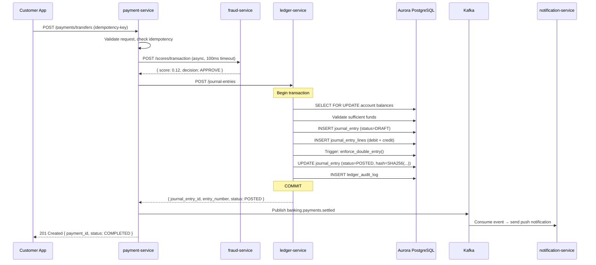
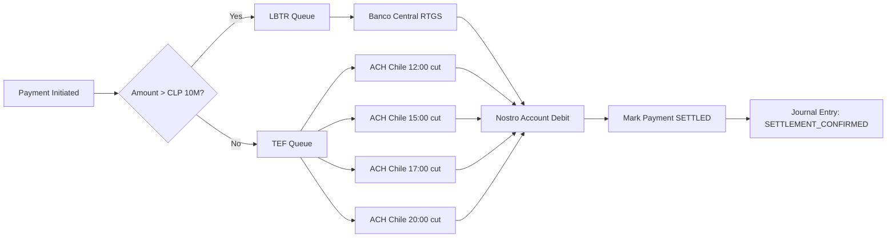

# 05 — Ledger System

## Overview

MaWire Bank's ledger is the financial source of truth. It implements double-entry bookkeeping with append-only immutable records, hash-chained audit trails, and full SBIF/CMF regulatory reporting capability. It is implemented as a dedicated `ledger-service` (Go) with its own Aurora PostgreSQL cluster, isolated from all other services.

---

## Core Accounting Principles

### Double-Entry Bookkeeping

Every financial transaction creates at least two journal entry lines:
- One or more **debits** (D)
- One or more **credits** (C)
- The sum of all debits MUST equal the sum of all credits for each journal entry.

This invariant is enforced at the database level via a CHECK constraint and at the application level before any write.

### Chart of Accounts (CoA) — MaWire Standard

```
Assets (1xxxxx)
  10xxxx — Cash & Equivalents
    100001 — Nostro CLP (BancoEstado correspondent)
    100002 — Nostro USD (JPMorgan Chase New York)
    100003 — Central Bank Reserve Account
  11xxxx — Customer Deposits (contra)
    110001 — Customer Checking Balances
    110002 — Customer Savings Balances
  12xxxx — Loan Assets
    120001 — Consumer Loan Principal
    120002 — SME Loan Principal
    120003 — Accrued Interest Receivable

Liabilities (2xxxxx)
  20xxxx — Customer Deposits
    200001 — Checking Account Deposits (CLP)
    200002 — Savings Account Deposits (CLP)
    200003 — USD Deposits
  21xxxx — Interbank
    210001 — Overnight Borrowings

Equity (3xxxxx)
  300001 — Share Capital
  300002 — Retained Earnings
  300003 — Current Year P&L

Income (4xxxxx)
  400001 — Net Interest Income
  400002 — Fee Income
  400003 — FX Revenue
  400004 — Interchange Revenue

Expenses (5xxxxx)
  500001 — Interest Expense (customer deposits)
  500002 — Technology Costs
  500003 — Personnel Costs
  500004 — Regulatory Fees
```

---

## Database Schema (PostgreSQL — Complete)

```sql
-- ============================================================
-- CURRENCIES
-- ============================================================
CREATE TABLE currencies (
    code          CHAR(3)      PRIMARY KEY,
    name          VARCHAR(50)  NOT NULL,
    decimal_places SMALLINT    NOT NULL DEFAULT 0,
    symbol        VARCHAR(10)  NOT NULL,
    is_active     BOOLEAN      NOT NULL DEFAULT TRUE,
    created_at    TIMESTAMPTZ  NOT NULL DEFAULT NOW()
);

INSERT INTO currencies (code, name, decimal_places, symbol) VALUES
  ('CLP', 'Peso Chileno',      0, '$'),
  ('USD', 'US Dollar',         2, '$'),
  ('EUR', 'Euro',              2, '€'),
  ('UF',  'Unidad de Fomento', 4, 'UF');

-- ============================================================
-- EXCHANGE RATES
-- ============================================================
CREATE TABLE exchange_rates (
    id             UUID         PRIMARY KEY DEFAULT gen_random_uuid(),
    from_currency  CHAR(3)      NOT NULL REFERENCES currencies(code),
    to_currency    CHAR(3)      NOT NULL REFERENCES currencies(code),
    rate           NUMERIC(24,10) NOT NULL,
    rate_type      VARCHAR(20)  NOT NULL CHECK (rate_type IN ('SPOT','MID','BID','ASK')),
    source         VARCHAR(50)  NOT NULL, -- 'BANCO_CENTRAL','BLOOMBERG','INTERNAL'
    effective_at   TIMESTAMPTZ  NOT NULL,
    created_at     TIMESTAMPTZ  NOT NULL DEFAULT NOW(),
    CONSTRAINT chk_different_currencies CHECK (from_currency <> to_currency)
);

CREATE INDEX idx_exchange_rates_lookup
    ON exchange_rates (from_currency, to_currency, effective_at DESC);

-- ============================================================
-- CHART OF ACCOUNTS
-- ============================================================
CREATE TABLE accounts (
    id              UUID          PRIMARY KEY DEFAULT gen_random_uuid(),
    code            VARCHAR(20)   NOT NULL UNIQUE,
    name            VARCHAR(200)  NOT NULL,
    account_type    VARCHAR(20)   NOT NULL
                    CHECK (account_type IN ('ASSET','LIABILITY','EQUITY','INCOME','EXPENSE')),
    normal_balance  CHAR(1)       NOT NULL CHECK (normal_balance IN ('D','C')),
    currency        CHAR(3)       NOT NULL REFERENCES currencies(code),
    parent_id       UUID          REFERENCES accounts(id),
    is_leaf         BOOLEAN       NOT NULL DEFAULT TRUE,
    is_customer_account BOOLEAN   NOT NULL DEFAULT FALSE,
    customer_id     UUID,         -- populated for customer-owned accounts
    external_ref    VARCHAR(100), -- maps to Mambu account ID
    created_at      TIMESTAMPTZ   NOT NULL DEFAULT NOW(),
    closed_at       TIMESTAMPTZ,
    metadata        JSONB         NOT NULL DEFAULT '{}'
);

CREATE INDEX idx_accounts_customer ON accounts (customer_id) WHERE customer_id IS NOT NULL;
CREATE INDEX idx_accounts_code ON accounts (code);

-- ============================================================
-- ACCOUNT BALANCE SNAPSHOTS (for fast balance queries)
-- ============================================================
CREATE TABLE account_balance_snapshots (
    id               UUID          PRIMARY KEY DEFAULT gen_random_uuid(),
    account_id       UUID          NOT NULL REFERENCES accounts(id),
    snapshot_date    DATE          NOT NULL,
    opening_balance  NUMERIC(24,4) NOT NULL,
    closing_balance  NUMERIC(24,4) NOT NULL,
    total_debits     NUMERIC(24,4) NOT NULL DEFAULT 0,
    total_credits    NUMERIC(24,4) NOT NULL DEFAULT 0,
    currency         CHAR(3)       NOT NULL REFERENCES currencies(code),
    created_at       TIMESTAMPTZ   NOT NULL DEFAULT NOW(),
    UNIQUE (account_id, snapshot_date)
);

CREATE INDEX idx_balance_snapshots_account_date
    ON account_balance_snapshots (account_id, snapshot_date DESC);

-- ============================================================
-- JOURNAL ENTRIES (header — one per business transaction)
-- ============================================================
CREATE TABLE journal_entries (
    id                UUID          PRIMARY KEY DEFAULT gen_random_uuid(),
    entry_number      BIGSERIAL     NOT NULL UNIQUE,   -- sequential, never gaps
    description       VARCHAR(500)  NOT NULL,
    entry_date        DATE          NOT NULL,
    posting_date      DATE          NOT NULL,
    period            CHAR(7)       NOT NULL,           -- 'YYYY-MM'
    status            VARCHAR(20)   NOT NULL DEFAULT 'DRAFT'
                      CHECK (status IN ('DRAFT','POSTED','REVERSED','VOID')),
    entry_type        VARCHAR(50)   NOT NULL,           -- 'TRANSFER','FEE','INTEREST','SETTLEMENT'
    currency          CHAR(3)       NOT NULL REFERENCES currencies(code),
    total_amount      NUMERIC(24,4) NOT NULL,           -- sum of debit lines
    created_by        UUID          NOT NULL,           -- user or system service ID
    approved_by       UUID,                             -- required for manual entries
    posted_at         TIMESTAMPTZ,
    reversed_by       UUID          REFERENCES journal_entries(id),
    reversal_of       UUID          REFERENCES journal_entries(id),
    -- immutability hash chain
    entry_hash        BYTEA         NOT NULL,           -- SHA-256(prev_hash || entry_data)
    previous_hash     BYTEA         NOT NULL,           -- hash of entry_number - 1
    -- source reference
    source_service    VARCHAR(50)   NOT NULL,           -- 'payment-service','card-service'
    source_id         UUID          NOT NULL,           -- original business transaction ID
    idempotency_key   VARCHAR(200)  UNIQUE,
    metadata          JSONB         NOT NULL DEFAULT '{}',
    created_at        TIMESTAMPTZ   NOT NULL DEFAULT NOW()
);

CREATE INDEX idx_je_entry_date ON journal_entries (entry_date, status);
CREATE INDEX idx_je_source ON journal_entries (source_service, source_id);
CREATE INDEX idx_je_period ON journal_entries (period);
CREATE INDEX idx_je_status ON journal_entries (status) WHERE status = 'DRAFT';

-- ============================================================
-- JOURNAL ENTRY LINES (debit/credit lines)
-- ============================================================
CREATE TABLE journal_entry_lines (
    id              UUID          PRIMARY KEY DEFAULT gen_random_uuid(),
    journal_entry_id UUID         NOT NULL REFERENCES journal_entries(id),
    line_number     SMALLINT      NOT NULL,             -- ordering within entry
    account_id      UUID          NOT NULL REFERENCES accounts(id),
    debit_credit    CHAR(1)       NOT NULL CHECK (debit_credit IN ('D','C')),
    amount          NUMERIC(24,4) NOT NULL CHECK (amount > 0),
    currency        CHAR(3)       NOT NULL REFERENCES currencies(code),
    exchange_rate   NUMERIC(24,10),                     -- if != entry currency
    amount_base     NUMERIC(24,4) NOT NULL,             -- always in CLP (base currency)
    description     VARCHAR(500),
    counterparty_id UUID,                               -- for customer-to-customer transfers
    created_at      TIMESTAMPTZ   NOT NULL DEFAULT NOW(),
    UNIQUE (journal_entry_id, line_number)
);

CREATE INDEX idx_jel_account ON journal_entry_lines (account_id);
CREATE INDEX idx_jel_journal ON journal_entry_lines (journal_entry_id);

-- ============================================================
-- DOUBLE-ENTRY BALANCE CONSTRAINT (enforced by trigger)
-- ============================================================
CREATE OR REPLACE FUNCTION enforce_double_entry()
RETURNS TRIGGER LANGUAGE plpgsql AS $$
DECLARE
    v_debit_sum  NUMERIC(24,4);
    v_credit_sum NUMERIC(24,4);
BEGIN
    -- Called after INSERT on journal_entry_lines when status = POSTING
    SELECT
        COALESCE(SUM(CASE WHEN debit_credit = 'D' THEN amount_base ELSE 0 END), 0),
        COALESCE(SUM(CASE WHEN debit_credit = 'C' THEN amount_base ELSE 0 END), 0)
    INTO v_debit_sum, v_credit_sum
    FROM journal_entry_lines
    WHERE journal_entry_id = NEW.journal_entry_id;

    IF v_debit_sum <> v_credit_sum THEN
        RAISE EXCEPTION 'Double-entry violation: debits=% credits=% for entry %',
            v_debit_sum, v_credit_sum, NEW.journal_entry_id;
    END IF;

    RETURN NEW;
END;
$$;

-- ============================================================
-- RECONCILIATION
-- ============================================================
CREATE TABLE reconciliation_runs (
    id              UUID          PRIMARY KEY DEFAULT gen_random_uuid(),
    run_type        VARCHAR(50)   NOT NULL, -- 'INTRADAY','EOD','MONTHLY'
    period_start    TIMESTAMPTZ   NOT NULL,
    period_end      TIMESTAMPTZ   NOT NULL,
    status          VARCHAR(20)   NOT NULL DEFAULT 'RUNNING'
                    CHECK (status IN ('RUNNING','COMPLETED','FAILED','REQUIRES_REVIEW')),
    total_accounts  INTEGER       NOT NULL DEFAULT 0,
    matched_count   INTEGER       NOT NULL DEFAULT 0,
    unmatched_count INTEGER       NOT NULL DEFAULT 0,
    discrepancy_clp NUMERIC(24,4) NOT NULL DEFAULT 0,
    run_by          UUID          NOT NULL,
    completed_at    TIMESTAMPTZ,
    notes           TEXT,
    created_at      TIMESTAMPTZ   NOT NULL DEFAULT NOW()
);

CREATE TABLE reconciliation_items (
    id                  UUID          PRIMARY KEY DEFAULT gen_random_uuid(),
    reconciliation_run_id UUID        NOT NULL REFERENCES reconciliation_runs(id),
    account_id          UUID          NOT NULL REFERENCES accounts(id),
    ledger_balance      NUMERIC(24,4) NOT NULL,
    core_banking_balance NUMERIC(24,4),  -- from Mambu
    external_balance    NUMERIC(24,4),   -- from payment processor
    discrepancy         NUMERIC(24,4)    GENERATED ALWAYS AS
                        (ledger_balance - COALESCE(core_banking_balance, ledger_balance)) STORED,
    status              VARCHAR(20)   NOT NULL
                        CHECK (status IN ('MATCHED','UNMATCHED','UNDER_INVESTIGATION','RESOLVED')),
    resolution_notes    TEXT,
    created_at          TIMESTAMPTZ   NOT NULL DEFAULT NOW()
);

-- ============================================================
-- AUDIT LOG (immutable — no UPDATE/DELETE permitted)
-- ============================================================
CREATE TABLE ledger_audit_log (
    id              BIGSERIAL     PRIMARY KEY,
    event_type      VARCHAR(50)   NOT NULL,
    entity_type     VARCHAR(50)   NOT NULL, -- 'journal_entry', 'account'
    entity_id       UUID          NOT NULL,
    actor_id        UUID          NOT NULL,
    actor_type      VARCHAR(20)   NOT NULL, -- 'USER','SERVICE','SYSTEM'
    ip_address      INET,
    payload_before  JSONB,
    payload_after   JSONB         NOT NULL,
    created_at      TIMESTAMPTZ   NOT NULL DEFAULT NOW()
);

-- Prevent modification of audit log
CREATE RULE no_update_audit AS ON UPDATE TO ledger_audit_log DO INSTEAD NOTHING;
CREATE RULE no_delete_audit AS ON DELETE TO ledger_audit_log DO INSTEAD NOTHING;
```

---

## Event Model

All ledger state changes are published to Kafka. Schema uses Avro with Schema Registry.

### Events

```json
// JOURNAL_ENTRY_POSTED
{
  "event_type": "JOURNAL_ENTRY_POSTED",
  "schema_version": "1.0",
  "event_id": "evt_01HN4X...",
  "occurred_at": "2026-06-06T14:32:11.456Z",
  "source_service": "ledger-service",
  "payload": {
    "journal_entry_id": "je_01HN4X...",
    "entry_number": 4821947,
    "entry_type": "TRANSFER",
    "total_amount": 250000,
    "currency": "CLP",
    "source_service": "payment-service",
    "source_id": "pay_01HN4X...",
    "lines": [
      { "account_id": "...", "debit_credit": "D", "amount": 250000 },
      { "account_id": "...", "debit_credit": "C", "amount": 250000 }
    ]
  }
}
```

---

## Transaction Flow — Sequence Diagram



---

## Reversal Handling

### Same-Day Reversal (most common — within posting date)

```sql
-- Application creates a new journal entry that exactly mirrors the original
-- with debit/credit swapped, linked via reversal_of column

BEGIN;

INSERT INTO journal_entries (
    description, entry_date, posting_date, period,
    entry_type, currency, total_amount, created_by,
    source_service, source_id, reversal_of, previous_hash, entry_hash
)
SELECT
    'REVERSAL: ' || description,
    NOW()::date,
    NOW()::date,
    TO_CHAR(NOW(), 'YYYY-MM'),
    'REVERSAL',
    currency,
    total_amount,
    :actor_id,
    source_service,
    source_id,
    id,                           -- links to original
    :prev_hash,
    :new_hash
FROM journal_entries WHERE id = :original_id;

INSERT INTO journal_entry_lines (journal_entry_id, line_number, account_id,
    debit_credit, amount, currency, amount_base, description)
SELECT
    :new_entry_id,
    line_number,
    account_id,
    CASE WHEN debit_credit = 'D' THEN 'C' ELSE 'D' END,  -- swap
    amount,
    currency,
    amount_base,
    'REVERSAL: ' || COALESCE(description, '')
FROM journal_entry_lines WHERE journal_entry_id = :original_id;

UPDATE journal_entries SET status = 'REVERSED', reversed_by = :new_entry_id
WHERE id = :original_id;

COMMIT;
```

### Prior-Day Reversal

Requires compliance officer approval (4-eyes) before posting. Creates audit trail with approver ID. CMF Circular 3.459 requires documentation of reason and approval chain.

---

## Settlement Architecture

### Intraday LBTR Settlement



### End-of-Day Reconciliation

1. **16:00** — Freeze intraday positions for reporting
2. **17:00** — Run automated reconciliation vs Mambu balances
3. **18:00** — Discrepancy report generated, compliance notified if >CLP 10,000
4. **20:30** — Final TEF batch settled
5. **22:00** — EOD balance snapshots captured for all accounts
6. **00:00** — CMF daily reporting file generated (Res. Ex. N°3174 format)

---

## Hash Chain Implementation (Tamper Detection)

```go
// Go implementation — ledger-service
func computeEntryHash(prevHash []byte, entry JournalEntry) []byte {
    h := sha256.New()
    h.Write(prevHash)
    h.Write([]byte(strconv.FormatInt(entry.EntryNumber, 10)))
    h.Write([]byte(entry.EntryDate.Format("2006-01-02")))
    h.Write([]byte(entry.EntryType))
    
    // Deterministically serialize all lines
    for _, line := range entry.Lines {
        h.Write([]byte(line.AccountID.String()))
        h.Write([]byte(string(line.DebitCredit)))
        h.Write([]byte(line.Amount.String()))
        h.Write([]byte(line.Currency))
    }
    
    return h.Sum(nil)
}

// Verification: walk entire chain, recompute each hash
func verifyChainIntegrity(from, to int64) (bool, int64) {
    entries := fetchEntriesInOrder(from, to)
    for i, entry := range entries {
        var prevHash []byte
        if i == 0 {
            prevHash = fetchGenesisHash()
        } else {
            prevHash = entries[i-1].EntryHash
        }
        computed := computeEntryHash(prevHash, entry)
        if !bytes.Equal(computed, entry.EntryHash) {
            return false, entry.EntryNumber // first tampered entry
        }
    }
    return true, -1
}
```

---

## CMF Regulatory Reporting

The ledger feeds the following mandatory CMF reports:

| Report | Frequency | Format | Deadline |
|--------|-----------|--------|----------|
| Estado de Situación (balance sheet) | Monthly | CMF XML schema | Day 15 next month |
| Estado de Resultados (P&L) | Monthly | CMF XML schema | Day 15 next month |
| Cartera de Crédito | Monthly | CSV + XML | Day 10 next month |
| Flujo de Caja | Quarterly | Excel + XML | Day 30 next quarter |
| FINREP (if banking license) | Quarterly | XBRL | Day 45 next quarter |

All reports are generated by `reporting-service` by querying the ledger read replica.
