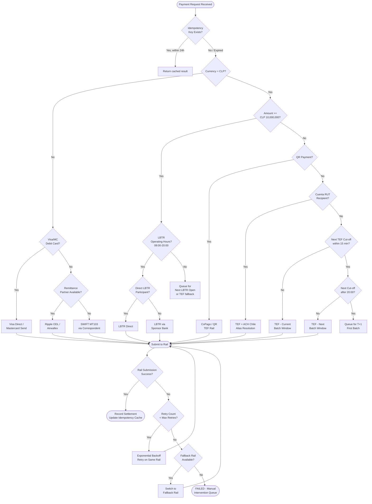
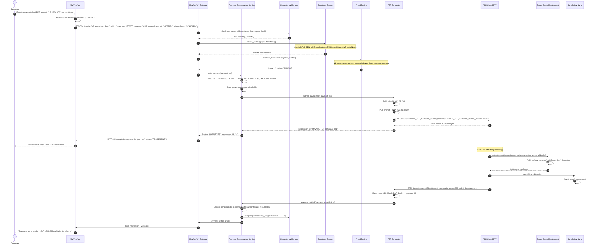

# 06 — Payments Infrastructure

> **Classification:** Internal Technical Architecture  
> **Owner:** Payments Engineering  
> **Last Updated:** 2026-06-06  
> **Regulatory Context:** CMF, Banco Central de Chile, UAF

---

## Table of Contents

1. [Chilean Domestic Payment Rails](#1-chilean-domestic-payment-rails)
2. [International Payments](#2-international-payments)
3. [Payment Orchestration Service](#3-payment-orchestration-service)
4. [Settlement Architecture](#4-settlement-architecture)
5. [Compliance](#5-compliance)

---

## 1. Chilean Domestic Payment Rails

### 1.1 TEF — Transferencias Electrónicas de Fondos

TEF is the primary interbank retail payment rail in Chile, operated by **ACH Chile** under the oversight of the Banco Central de Chile. All licensed banks and fintech institutions holding CMF authorization under Ley General de Bancos or Ley Fintec 21.521 may participate as direct or indirect members.

#### Operator and Membership

| Attribute | Detail |
|---|---|
| Operator | ACH Chile S.A. |
| Regulator | Banco Central de Chile (Chapter III.J.1 of Compendio de Normas Financieras) |
| Participation requirement | CMF authorization as bank, cooperative, or payments institution |
| SWIFT BIC required | Yes — BIC8 or BIC11, registered in BIC directory |
| MaWire BIC | `MAWRCLSAXXX` (to be registered upon CMF license grant) |
| Direct participation threshold | Minimum CLP 500M monthly volume (indicative) |
| Indirect participation | Via sponsor bank (e.g., Banco BICE, Banco Consorcio) during Phase 1 |

#### Settlement Windows and Cut-off Times

TEF operates intraday batch settlements. Transactions submitted before a cut-off are settled in that cycle's batch; late submissions roll to the next cut-off or to T+1.

| Cut-off (Santiago time, CLT = UTC-3 or UTC-4 DST) | Settlement |
|---|---|
| 12:00 | Same-day batch 1 — settled by ~13:30 |
| 15:00 | Same-day batch 2 — settled by ~16:30 |
| 17:00 | Same-day batch 3 — settled by ~18:30 |
| 20:00 | Same-day batch 4 — settled by ~21:30 |
| After 20:00 | T+1, first batch next business day |

**Key implementation note:** MaWire must submit TEF files via SFTP no later than 15 minutes before each cut-off to allow ACH Chile processing time. Internal SLA target is 45 minutes before cut-off.

#### File Format: ISO 20022 pain.001.001.09

ACH Chile mandated migration from proprietary flat-file format to **ISO 20022 pain.001.001.09** (Customer Credit Transfer Initiation) for all direct participants effective Q1 2025.

Minimal valid pain.001.001.09 document for a single TEF credit transfer:

```xml
<?xml version="1.0" encoding="UTF-8"?>
<Document xmlns="urn:iso:std:iso:20022:tech:xsd:pain.001.001.09"
          xmlns:xsi="http://www.w3.org/2001/XMLSchema-instance"
          xsi:schemaLocation="urn:iso:std:iso:20022:tech:xsd:pain.001.001.09 pain.001.001.09.xsd">
  <CstmrCdtTrfInitn>
    <GrpHdr>
      <!-- Group Header: one per file submission -->
      <MsgId>MAWIRE-TEF-20260606-001</MsgId>          <!-- Unique per submission; max 35 chars -->
      <CreDtTm>2026-06-06T11:30:00</CreDtTm>           <!-- ISO 8601, Santiago local or UTC -->
      <NbOfTxs>1</NbOfTxs>                              <!-- Total transactions in this file -->
      <CtrlSum>1500000.00</CtrlSum>                      <!-- Sum of all Amt elements -->
      <InitgPty>
        <Nm>MaWire Bank SpA</Nm>
        <Id>
          <OrgId>
            <AnyBIC>MAWRCLSAXXX</AnyBIC>
          </OrgId>
        </Id>
      </InitgPty>
    </GrpHdr>

    <PmtInf>
      <!-- Payment Information block: one per batch/rail combination -->
      <PmtInfId>MAWIRE-PMTINF-20260606-001</PmtInfId>
      <PmtMtd>TRF</PmtMtd>                              <!-- Credit Transfer -->
      <NbOfTxs>1</NbOfTxs>
      <CtrlSum>1500000.00</CtrlSum>
      <PmtTpInf>
        <SvcLvl>
          <Cd>NURG</Cd>                                  <!-- Non-urgent TEF -->
        </SvcLvl>
        <LclInstrm>
          <Prtry>TEF-CL</Prtry>                          <!-- ACH Chile proprietary code -->
        </LclInstrm>
      </PmtTpInf>
      <ReqdExctnDt>
        <Dt>2026-06-06</Dt>
      </ReqdExctnDt>
      <Dbtr>
        <Nm>Juan Andrés Pérez Soto</Nm>
        <Id>
          <PrvtId>
            <Othr>
              <Id>12345678-9</Id>                        <!-- RUT format: 8 digits + verificador -->
              <SchmeNm><Prtry>CL-RUT</Prtry></SchmeNm>
            </Othr>
          </PrvtId>
        </Id>
      </Dbtr>
      <DbtrAcct>
        <Id>
          <Othr>
            <Id>00901234567890</Id>                      <!-- MaWire account number, 14 digits -->
            <SchmeNm><Prtry>BBAN</Prtry></SchmeNm>
          </Othr>
        </Id>
        <Ccy>CLP</Ccy>
      </DbtrAcct>
      <DbtrAgt>
        <FinInstnId>
          <BICFI>MAWRCLSAXXX</BICFI>
          <ClrSysMmbId>
            <ClrSysId><Cd>CLACH</Cd></ClrSysId>          <!-- ACH Chile clearing system code -->
            <MmbId>999</MmbId>                            <!-- MaWire ACH Chile member ID -->
          </ClrSysMmbId>
        </FinInstnId>
      </DbtrAgt>

      <CdtTrfTxInf>
        <!-- One block per individual transaction -->
        <PmtId>
          <InstrId>MAWIRE-INSTR-20260606-0001</InstrId>
          <EndToEndId>E2E-UUID-7f3a2b1c-4d5e-6f7a-8b9c-0d1e2f3a4b5c</EndToEndId>
        </PmtId>
        <Amt>
          <InstdAmt Ccy="CLP">1500000</InstdAmt>
        </Amt>
        <CdtrAgt>
          <FinInstnId>
            <BICFI>BCHICLRM</BICFI>                      <!-- Banco de Chile BIC -->
            <ClrSysMmbId>
              <ClrSysId><Cd>CLACH</Cd></ClrSysId>
              <MmbId>001</MmbId>
            </ClrSysMmbId>
          </FinInstnId>
        </CdtrAgt>
        <Cdtr>
          <Nm>María Francisca González López</Nm>
          <Id>
            <PrvtId>
              <Othr>
                <Id>9876543-2</Id>
                <SchmeNm><Prtry>CL-RUT</Prtry></SchmeNm>
              </Othr>
            </PrvtId>
          </Id>
        </Cdtr>
        <CdtrAcct>
          <Id>
            <Othr>
              <Id>0011234567</Id>                         <!-- Beneficiary account at Banco de Chile -->
              <SchmeNm><Prtry>BBAN</Prtry></SchmeNm>
            </Othr>
          </Id>
          <Tp><Cd>CACC</Cd></Tp>                          <!-- Current/Checking account -->
        </CdtrAcct>
        <Purp><Cd>SUPP</Cd></Purp>                        <!-- Supplier payment; SALA for salary -->
        <RmtInf>
          <Ustrd>Pago factura 2026-001</Ustrd>
        </RmtInf>
      </CdtTrfTxInf>
    </PmtInf>
  </CstmrCdtTrfInitn>
</Document>
```

#### Reconciliation: camt.054 and MT940

ACH Chile returns settlement confirmations in two formats:

| Report | Standard | Description |
|---|---|---|
| Debit/Credit Notifications | ISO 20022 camt.054.001.08 | Per-transaction credit/debit advice; arrives after each settlement batch |
| End-of-Day Statement | ISO 20022 camt.053.001.08 | Full account statement for nostro reconciliation |
| Legacy statement (parallel) | SWIFT MT940 | Still supported for sponsor bank relationships; being phased out |

The camt.054 `NtfctnId` must be matched against MaWire's internal `EndToEndId` to reconcile. Unmatched items enter the **R-transaction queue** within 15 minutes of settlement file arrival.

#### SFTP Technical Integration

```
Host:    sftp.achchile.cl
Port:    22
Auth:    SSH public key (4096-bit RSA or Ed25519) + IP allowlist
Paths:
  /outbound/tef/submissions/   ← MaWire uploads pain.001 files here
  /inbound/tef/confirmations/  ← ACH Chile deposits camt.054 files here
  /inbound/tef/statements/     ← camt.053 end-of-day files
  /inbound/tef/returns/        ← pain.002 (Payment Status Report) for rejections

File naming convention:
  MAWIRE_TEF_YYYYMMDD_HHmmss_NNN.xml
  Example: MAWIRE_TEF_20260606_114500_001.xml

Encryption: PGP-encrypt files with ACH Chile public key before upload
Integrity:  SHA-256 checksum in companion .sha256 file
```

---

### 1.2 LBTR — Liquidación Bruta en Tiempo Real

LBTR is Chile's **Real-Time Gross Settlement (RTGS)** system, operated by the **Banco Central de Chile**. It provides finality of settlement in central bank reserves on a transaction-by-transaction basis with no netting.

#### System Characteristics

| Attribute | Detail |
|---|---|
| Operator | Banco Central de Chile |
| Settlement asset | Central bank reserves (account at Banco Central) |
| Transaction threshold | Typically CLP 10,000,000 and above; below this TEF is standard |
| Settlement finality | Irrevocable and immediate upon confirmation |
| Operating hours | 08:00–20:00 Santiago time on banking days |
| Technical protocol | SWIFT FIN messaging (SWIFTNet) |
| Primary message types | MT103 (customer credit transfer), MT202 (bank-to-bank transfer) |

#### Participation Requirements

Direct LBTR participation requires:
1. CMF banking license (Banco or equivalent regulated entity)
2. Reserve account at Banco Central de Chile
3. SWIFT membership and SWIFTNet connectivity (leased line or SWIFT service bureau)
4. Pledge of eligible securities as intraday liquidity collateral (Banco Central defines eligible instruments)
5. Bilateral settlement agreement with Banco Central

**MaWire Phase 1 strategy:** Access LBTR as an **indirect participant** through a sponsor bank (Banco BICE or Banco Consorcio recommended) until direct membership is obtained post-Series A. Indirect access adds ~30 minutes to settlement finality due to sponsor processing.

#### SWIFT MT103 Message Structure for LBTR

```
{1:F01MAWRCLSAAXXX0000000001}
{2:I103BCOCCLRMXXXXN}
{3:{108:MAWIRE-REF-00001}}
{4:
:20:MAWIRE-20260606-001          ← Transaction reference (sender's)
:23B:CRED                        ← Credit transfer
:32A:260606CLP25000000,          ← Value date, currency, amount (CLP 25,000,000)
:50K:/00901234567890              ← Ordering customer account
JUAN ANDRES PEREZ SOTO
AV APOQUINDO 3000, LAS CONDES
SANTIAGO, CHILE
:52A:MAWRCLSAXXX                 ← Ordering institution (MaWire BIC)
:53A:MAWRCLSAXXX                 ← Sender's correspondent (our nostro at Banco Central)
:57A:BCOCCLRMXXX                 ← Beneficiary's bank (Banco de Crédito)
:59:/0011234567
MARIA FRANCISCA GONZALEZ LOPEZ
CALLE LOS LEONES 500
PROVIDENCIA, SANTIAGO
:70:PAGO CONTRATO 2026/100       ← Remittance information (35 chars per line, max 4 lines)
:71A:SHA                         ← Charges: SHA = shared (standard for domestic)
-}
```

**Critical fields for Chilean LBTR:**
- `:32A:` value date must be today (LBTR is same-day only)
- `:71A:` must be `SHA` for domestic; `OUR` only for specific correspondent arrangements
- Amounts in CLP have no decimal places in practice (CLP has no subdivision), but the MT103 format requires the comma separator with zero trailing digits: `25000000,`

---

### 1.3 Cuenta RUT Interoperability

**Cuenta RUT** is BancoEstado's free basic account, identified by the account holder's RUT (tax ID number). With 14+ million accounts, it is the most widely-held account type in Chile. Under **Ley Fintec 21.521 (Article 26)**, all licensed payment institutions must support interoperability with Cuenta RUT.

#### Technical Implementation

The interoperability mechanism uses the existing TEF rail. The key difference is **alias resolution**: instead of providing a traditional bank account number, the sender provides only the beneficiary's RUT, which ACH Chile resolves to BancoEstado's account number via its **Central Directory** service.

```
Alias Resolution Flow:
1. MaWire customer enters: RUT 9.876.543-2, Amount CLP 50.000
2. MaWire calls ACH Chile Directory API:
   GET https://directorio.achchile.cl/v1/alias/rut/9876543-2
   Authorization: Bearer {ACH_CHILE_API_TOKEN}
   
3. Response:
   {
     "rut": "9876543-2",
     "account_type": "CUENTA_RUT",
     "bank_code": "012",          // BancoEstado ACH Chile code
     "bank_name": "BancoEstado",
     "bic": "BKCLCLR1XXX",
     "account_number": "012987654320",  // internal BancoEstado account
     "account_currency": "CLP",
     "alias_verified": true,
     "last_updated": "2026-06-05T14:22:00Z"
   }

4. MaWire populates pain.001 CdtrAcct with resolved account number
5. Submits via standard TEF flow
```

**Privacy consideration:** The directory may return only enough information to route the payment, not the full account number. MaWire must not store the resolved account number beyond the transaction lifecycle (per CMF data minimisation guidance).

---

### 1.4 QR Payments — CoPago Standard

#### Standard Overview

Chile's QR payment standard is **CoPago** (Código de Pago), developed under coordination of the Banco Central and adopted by the Comisión para el Mercado Financiero. It follows the **EMVCo QR Code Specification for Payment Systems (EMV QRCPS)**.

| Attribute | Detail |
|---|---|
| Standard | EMV QR Code (Merchant Presented Mode) |
| Underlying rail | TEF (for account-to-account QR) or card network |
| Regulator mandate | Banco Central Circular N°2.249 |
| Transbank QR | Parallel ecosystem; uses card-based settlement |
| Interoperability | QR codes from any issuer must be readable by any acquiring app |

#### EMV QR Data Objects for CoPago

```
QR Payload (ASCII string encoded in QR):
000201                          ← Payload Format Indicator: EMV v01
010212                          ← Point of Initiation: 12 = Dynamic QR
26580014br.gov.bcb.pix          ← (Merchant Account Info — CoPago adaptation)
    0114copago.cl               ← GUI: CoPago domain identifier
    0225MAWIRE-MERCHANT-00001   ← Merchant ID at MaWire
520458395303152                 ← Merchant Category Code: 5839 = misc; Currency: 152 = CLP
5404150005802CL                 ← Transaction amount: 15000 CLP; Country: CL
5914MaWire Tienda               ← Merchant name (max 25 chars)
6009SANTIAGO                    ← Merchant city
6304XXXX                        ← CRC16/CCITT checksum (last 4 hex chars)
```

#### Merchant QR Generation API

```http
POST /v1/payments/qr/generate
Authorization: Bearer {MERCHANT_API_KEY}
Content-Type: application/json

{
  "merchant_id": "MAWIRE-MERCHANT-00001",
  "amount": 15000,
  "currency": "CLP",
  "order_reference": "ORDER-2026-06-06-789",
  "description": "Café y pastel",
  "expiry_seconds": 300,
  "qr_type": "DYNAMIC"
}
```

```json
HTTP/1.1 200 OK
{
  "qr_id": "qr_7f3a2b1c4d5e6f7a8b9c",
  "qr_payload": "000201010212265800...(full EMV string)...6304A1B2",
  "qr_image_url": "https://api.mawire.cl/v1/payments/qr/qr_7f3a2b1c4d5e6f7a8b9c/image.png",
  "amount": 15000,
  "currency": "CLP",
  "expires_at": "2026-06-06T12:05:00Z",
  "status": "PENDING"
}
```

#### Consumer Scan-to-Pay Flow

```
1. Consumer opens MaWire app → "Pagar con QR"
2. Camera activates, scans merchant QR
3. App decodes EMV payload, extracts:
   - merchant_id, amount, currency, order_reference
4. App calls:
   GET /v1/payments/qr/{qr_id}/details
   → Returns merchant name, logo, amount for confirmation screen
5. Consumer reviews, authenticates (biometric/PIN)
6. App calls:
   POST /v1/payments/qr/{qr_id}/pay
   { "payer_account_id": "acc_xxxxxx", "auth_token": "..." }
7. MaWire initiates TEF to merchant's receiving account
8. QR status updates to COMPLETED
9. Merchant POS polls:
   GET /v1/payments/qr/{qr_id}/status
   ← { "status": "COMPLETED", "settled_at": "2026-06-06T12:01:15Z" }
```

---

### 1.5 Transbank Integration

Transbank S.A. is Chile's dominant card acquiring network, processing Visa, Mastercard, American Express, and Redcompra (domestic debit) transactions.

#### WebPay Plus Integration

| Attribute | Detail |
|---|---|
| Protocol | REST API (v1.3+) |
| Authentication | API Key + Secret per commerce code |
| 3DS | 3DS 2.0 mandatory for card-not-present |
| Settlement | T+1 to merchant's bank account |
| MDR — Debit (Redcompra) | 0.99% |
| MDR — Credit Visa/MC | 1.49–2.99% depending on installments and card tier |
| MDR — Amex | 2.99% |
| Chargeback window | 60 days from transaction date |

#### REST Integration — Transaction Creation

```http
POST https://webpay3g.transbank.cl/rswebpaytransaction/api/webpay/v1.3/transactions
Tbk-Api-Key-Id: {COMMERCE_CODE}
Tbk-Api-Key-Secret: {API_SECRET}
Content-Type: application/json

{
  "buy_order": "MAWIRE-ORD-20260606-001",
  "session_id": "sess_7f3a2b1c4d5e",
  "amount": 49990,
  "return_url": "https://app.mawire.cl/payments/webpay/callback"
}
```

```json
HTTP/1.1 200 OK
{
  "token": "e9d555262db0f989e49d587e47cd7b4dcf5f5c7c3c4b87cf",
  "url": "https://webpay3g.transbank.cl/webpayserver/initTransaction"
}
```

#### 3DS 2.0 Authentication Flow

The 3DS 2.0 challenge is embedded within Transbank's WebPay flow for card-not-present transactions. MaWire as issuer must participate in the **3DS Access Control Server (ACS)** via Visa or Mastercard's 3DS infrastructure.

```
Cardholder → MaWire App → Transbank → Visa/MC Directory Server
                                    ↓
                          Mastercard 3DS DS
                                    ↓
                          MaWire ACS (hosted via processor)
                                    ↓
                          Authentication Result (Y/N/A/U)
                                    ↓
                          Authorization request with ECI value
```

| ECI Value | Meaning |
|---|---|
| 05 (Visa) / 02 (MC) | Full 3DS authentication — liability shift to issuer |
| 06 (Visa) / 01 (MC) | Attempted authentication — partial liability shift |
| 07 (Visa) / 00 (MC) | No authentication — merchant liability |

---

## 2. International Payments

### 2.1 SWIFT

#### Membership Requirements for Chilean Banks

1. Apply to SWIFT as a member institution (shareholders' agreement)
2. Register BIC with SWIFT — MaWire target BIC: `MAWRCLSAXXX`
3. SWIFT connectivity options:
   - **SWIFTNet Link (SNL):** Direct leased-line connection; CapEx-heavy; required for LBTR direct participation
   - **SWIFT Service Bureau:** Connectivity via approved bureau (e.g., Citi Treasury and Trade Solutions); lower CapEx, higher per-message cost (~$0.35–0.80 per message)
   - **Alliance Lite2:** Cloud-based SWIFT connectivity; suitable for MaWire Phase 1-2 volumes
4. Subscribe to relevant message standards: FIN (MT), MX (ISO 20022)
5. Annual SWIFT membership fees scale with message volume (tiered; ~$15,000–$80,000/year for small banks)

#### SWIFT GPI (Global Payments Innovation) Implementation

SWIFT GPI is mandatory for international credit transfers for all SWIFT member banks as of November 2022.

Key GPI fields:
- `UETR` (Unique End-to-end Transaction Reference): UUIDv4, generated by MaWire at payment initiation, immutable across the correspondent chain
- `gpi-Tracker`: MaWire must update GPI tracker at each processing stage via `g4C` (GPI for Corporates) service
- Status codes: `ACCC` (completed), `ACSP` (processing), `RJCT` (rejected), `PDNG` (pending)

```python
# UETR generation — must be UUIDv4
import uuid

def generate_uetr() -> str:
    """
    UETR must be a UUID version 4 per SWIFT GPI specs.
    Generated once at payment initiation; never regenerated.
    """
    return str(uuid.uuid4())

# Example: "7f3a2b1c-4d5e-4f7a-8b9c-0d1e2f3a4b5c"
```

#### Sanctions Screening Before SWIFT Transmission

Every outgoing SWIFT message must be screened **before** transmission. Failure to screen prior to sending (not after) is a CMF and OFAC compliance requirement.

```python
async def screen_and_transmit_swift(payment: SwiftPayment) -> SwiftResult:
    # Step 1: Screen all parties
    parties_to_screen = [
        payment.ordering_customer,
        payment.beneficiary,
        payment.beneficiary_bank_bic,
        payment.intermediary_bank_bic,
    ]
    
    screening_results = await sanctions_engine.screen_batch(
        parties=parties_to_screen,
        lists=["OFAC_SDN", "UN_CONSOLIDATED", "EU_CONSOLIDATED", "CMF_LISTA_NEGRA"],
        match_threshold=0.85,  # fuzzy match score
    )
    
    if any(r.is_match for r in screening_results):
        await compliance.raise_alert(
            alert_type="SANCTIONS_HIT",
            payment_id=payment.id,
            matches=screening_results,
            action="BLOCKED_PRE_TRANSMISSION",
        )
        raise SanctionsHitError(f"Payment {payment.id} blocked: sanctions match")
    
    # Step 2: Build and transmit MT103
    mt103 = build_mt103(payment)
    result = await swift_network.transmit(mt103)
    
    # Step 3: Register UETR with GPI tracker
    await gpi_tracker.register(
        uetr=payment.uetr,
        status="ACSP",
        agent_bic=settings.MAWIRE_BIC,
    )
    
    return result
```

---

### 2.2 Visa Direct / Mastercard Send

Push-payment APIs enabling real-time credit to Visa/Mastercard debit cards globally, used primarily for international remittances and business payouts.

#### Visa Direct Push Payments

```http
POST https://sandbox.api.visa.com/visadirect/fundstransfer/v1/pushfundstransactions
Authorization: Basic {BASE64_CREDENTIALS}
x-client-transaction-id: {UNIQUE_REQUEST_ID}
Content-Type: application/json

{
  "systemsTraceAuditNumber": "451001",
  "retrievalReferenceNumber": "412770451001",
  "localTransactionDateTime": "2026-06-06T11:30:00",
  "acquiringBin": "408999",
  "acquirerCountryCode": "152",
  "senderPrimaryAccountNumber": "4895142232120006",
  "senderCardExpiryDate": "2026-12",
  "senderCurrencyCode": "840",
  "amount": "2500",
  "transactionCurrencyCode": "840",
  "recipientPrimaryAccountNumber": "4957030420210454",
  "recipientName": "María González",
  "businessApplicationId": "PP",
  "cardAcceptor": {
    "name": "MaWire Bank",
    "terminalId": "MAWIRE01",
    "idCode": "MAWIRE_BANK_CL",
    "address": {
      "country": "CHL",
      "state": "RM",
      "city": "Santiago",
      "zipCode": "7500000"
    }
  }
}
```

#### Fee Structure

| Component | Rate |
|---|---|
| Visa Direct per-transaction fee | $0.10–$0.25 USD per transaction |
| FX spread (CLP/USD) | 1.5–2.5% over mid-market rate |
| Recipient bank FX conversion | Variable by bank |
| MaWire markup | 0.5–1.0% (configured in fee engine) |

---

### 2.3 Remittance Partners

#### Ripple / On-Demand Liquidity (ODL)

Ripple ODL uses XRP as a bridge asset for cross-border settlement, eliminating the need for pre-funded nostro accounts in destination currencies.

```
Flow:
1. MaWire sends CLP to Ripple liquidity partner in Santiago
2. Ripple purchases XRP with CLP on Santiago exchange (Buda.com or CryptoMarket)
3. XRP transferred via XRP Ledger in ~3-5 seconds
4. Destination exchange sells XRP for local currency (e.g., MXN, USD)
5. Recipient receives local currency in their account
```

**Regulatory consideration:** Ripple ODL in Chile requires CMF authorization for virtual asset operations (Ley Fintec 21.521, Title IV). MaWire must ensure the XRP leg is treated as a foreign exchange transaction for UAF and Banco Central reporting purposes.

#### Airwallex Multi-Currency Integration

```http
POST https://api.airwallex.com/api/v1/payments/create
Authorization: Bearer {AIRWALLEX_ACCESS_TOKEN}
Content-Type: application/json

{
  "request_id": "MAWIRE-AW-20260606-001",
  "amount": 1000.00,
  "currency": "USD",
  "payment_method": {
    "type": "LOCAL_TRANSFER",
    "local_transfer": {
      "bank_account_number": "123456789",
      "bank_code": "021",
      "account_name": "Empresa ABC Ltda"
    }
  },
  "source_currency": "CLP",
  "payment_date": "2026-06-06",
  "reason": "GOODS"
}
```

---

## 3. Payment Orchestration Service

The **Payment Orchestration Service (POS)** is MaWire's internal routing engine that selects the optimal payment rail for each transaction, manages fallbacks, enforces idempotency, and provides a unified API surface to upstream services.

### 3.1 Architecture

```
┌─────────────────────────────────────────────────────────┐
│                  Payment Orchestration Service           │
│                                                         │
│  ┌──────────────┐    ┌──────────────┐  ┌────────────┐  │
│  │ Idempotency  │    │   Rail       │  │  Retry     │  │
│  │ Key Manager  │───▶│  Selector    │─▶│  Engine    │  │
│  └──────────────┘    └──────────────┘  └────────────┘  │
│                             │                │          │
│                    ┌────────┼────────┐       │          │
│                    ▼        ▼        ▼       ▼          │
│                  TEF      LBTR    SWIFT   Fallback       │
│                  Rail     Rail    Rail    Handler        │
└─────────────────────────────────────────────────────────┘
```

### 3.2 Rail Selection Decision Logic



### 3.3 Idempotency Key Management

```python
import asyncio
import hashlib
from datetime import datetime, timedelta
from typing import Optional
import redis.asyncio as aioredis

class IdempotencyKeyManager:
    """
    Manages idempotency keys for payment requests.
    
    Policy:
    - Hot storage (Redis): 24 hours
    - Cold storage (PostgreSQL): 24h to 7 years (regulatory retention)
    - Key format: UUID v4 provided by caller; never generated internally
    - Collision detection: exact string match, no normalization
    """
    
    HOT_TTL_SECONDS = 86400          # 24 hours in Redis
    COLD_RETENTION_YEARS = 7         # CMF regulatory minimum
    
    def __init__(self, redis: aioredis.Redis, db_pool):
        self.redis = redis
        self.db = db_pool
    
    async def check_and_reserve(
        self, 
        idempotency_key: str,
        payment_request_hash: str,
    ) -> Optional[dict]:
        """
        Returns cached result if key exists, None if new key (and reserves it).
        Raises IdempotencyConflictError if same key used with different payload.
        """
        redis_key = f"idempotency:{idempotency_key}"
        
        # Atomic check-and-set using Redis SET NX
        existing = await self.redis.get(redis_key)
        
        if existing:
            cached = json.loads(existing)
            if cached["request_hash"] != payment_request_hash:
                raise IdempotencyConflictError(
                    f"Idempotency key {idempotency_key} reused with different payload"
                )
            return cached["result"]  # Return cached response
        
        # Reserve the key with PENDING status
        reserved = {
            "request_hash": payment_request_hash,
            "result": None,
            "status": "PENDING",
            "created_at": datetime.utcnow().isoformat(),
        }
        
        # NX = only set if not exists; prevents race conditions
        set_result = await self.redis.set(
            redis_key,
            json.dumps(reserved),
            ex=self.HOT_TTL_SECONDS,
            nx=True,
        )
        
        if not set_result:
            # Race condition: another process reserved it first
            return await self.check_and_reserve(idempotency_key, payment_request_hash)
        
        # Also write to cold storage for regulatory retention
        await self._persist_to_cold_storage(idempotency_key, payment_request_hash)
        
        return None  # New key — caller should process the payment
    
    async def complete(self, idempotency_key: str, result: dict):
        """Mark idempotency key as complete with result."""
        redis_key = f"idempotency:{idempotency_key}"
        existing_raw = await self.redis.get(redis_key)
        if existing_raw:
            existing = json.loads(existing_raw)
            existing["result"] = result
            existing["status"] = "COMPLETE"
            existing["completed_at"] = datetime.utcnow().isoformat()
            # Reset TTL from completion time, not from reservation
            await self.redis.set(redis_key, json.dumps(existing), ex=self.HOT_TTL_SECONDS)
        
        await self._update_cold_storage(idempotency_key, result)
    
    async def _persist_to_cold_storage(self, key: str, request_hash: str):
        async with self.db.acquire() as conn:
            await conn.execute("""
                INSERT INTO idempotency_keys (
                    idempotency_key, request_hash, status, created_at, expires_cold_at
                ) VALUES ($1, $2, 'PENDING', NOW(), NOW() + INTERVAL '7 years')
            """, key, request_hash)
    
    async def _update_cold_storage(self, key: str, result: dict):
        async with self.db.acquire() as conn:
            await conn.execute("""
                UPDATE idempotency_keys 
                SET status = 'COMPLETE', result = $1, completed_at = NOW()
                WHERE idempotency_key = $2
            """, json.dumps(result), key)
```

### 3.4 Retry Logic with Exponential Backoff

```python
import asyncio
import random
from dataclasses import dataclass
from typing import Callable, TypeVar

T = TypeVar("T")

@dataclass
class RetryConfig:
    max_attempts: int = 4
    base_delay_ms: int = 500       # 500ms initial delay
    max_delay_ms: int = 30000      # 30s maximum delay
    multiplier: float = 2.0        # Double each retry
    jitter: bool = True            # Add ±20% random jitter to avoid thundering herd

async def with_retry(
    fn: Callable,
    config: RetryConfig,
    retryable_errors: tuple = (NetworkError, TimeoutError, RailUnavailableError),
) -> T:
    """
    Retry with exponential backoff and jitter.
    Non-retryable errors (e.g., InsufficientFundsError) propagate immediately.
    """
    last_error = None
    
    for attempt in range(1, config.max_attempts + 1):
        try:
            return await fn()
        except retryable_errors as e:
            last_error = e
            if attempt == config.max_attempts:
                break
            
            delay_ms = min(
                config.base_delay_ms * (config.multiplier ** (attempt - 1)),
                config.max_delay_ms,
            )
            
            if config.jitter:
                # Add ±20% jitter
                jitter_factor = 1 + random.uniform(-0.2, 0.2)
                delay_ms *= jitter_factor
            
            await asyncio.sleep(delay_ms / 1000)
        except Exception as e:
            # Non-retryable: propagate immediately
            raise
    
    raise MaxRetriesExceededError(
        f"Failed after {config.max_attempts} attempts"
    ) from last_error
```

### 3.5 End-to-End TEF Payment Sequence



---

## 4. Settlement Architecture

### 4.1 Nostro Account Structure

MaWire maintains the following nostro accounts for settlement:

| Account | Currency | Bank | Purpose |
|---|---|---|---|
| CLP Nostro — ACH Chile | CLP | Banco Central (via ACH) | TEF multilateral net settlement |
| CLP Nostro — LBTR | CLP | Banco Central | LBTR gross settlement |
| USD Nostro — New York | USD | JP Morgan Chase NY | USD international wires, Visa Direct |
| EUR Nostro — Frankfurt | EUR | Deutsche Bank | EUR international wires |
| USD Correspondent | USD | Citibank NY | Secondary/fallback USD |

### 4.2 Daily Position Reconciliation

```python
# Pseudocode for daily reconciliation job (runs at 22:00 Santiago time)
async def daily_reconciliation_job(settlement_date: date):
    
    # 1. Pull camt.053 end-of-day statement from ACH Chile SFTP
    statement = await sftp_client.download_latest_camt053(settlement_date)
    
    # 2. Parse all credit and debit entries
    bank_entries = parse_camt053(statement)  # List[LedgerEntry]
    
    # 3. Pull internal payment records for same date
    internal_records = await payment_db.get_settled_payments(settlement_date)
    
    # 4. Match bank entries to internal records by EndToEndId
    matched, unmatched_bank, unmatched_internal = reconcile(
        bank_entries=bank_entries,
        internal_records=internal_records,
        match_key="end_to_end_id",
    )
    
    # 5. Handle breaks
    for item in unmatched_bank:
        # Bank has a transaction we don't recognize → investigate
        await alert_ops(severity="HIGH", type="UNRECOGNIZED_BANK_ENTRY", item=item)
    
    for item in unmatched_internal:
        # We have a record the bank doesn't → possible submission failure
        if item.status == "SUBMITTED":
            await r_transaction_handler.initiate_trace(item)
        else:
            await alert_ops(severity="MEDIUM", type="MISSING_BANK_CONFIRMATION", item=item)
    
    # 6. Reconcile nostro balance
    bank_closing_balance = statement.closing_balance
    internal_expected_balance = await ledger.get_nostro_balance(settlement_date)
    
    if abs(bank_closing_balance - internal_expected_balance) > Decimal("0.01"):
        await alert_ops(
            severity="CRITICAL",
            type="NOSTRO_BALANCE_BREAK",
            bank_balance=bank_closing_balance,
            internal_balance=internal_expected_balance,
            difference=bank_closing_balance - internal_expected_balance,
        )
    
    # 7. Persist reconciliation report
    await reconciliation_db.save_report(
        date=settlement_date,
        matched_count=len(matched),
        unmatched_bank_count=len(unmatched_bank),
        unmatched_internal_count=len(unmatched_internal),
        nostro_balance=bank_closing_balance,
        status="COMPLETE" if not (unmatched_bank or unmatched_internal) else "BREAKS_FOUND",
    )
```

### 4.3 Failed Payment Handling — R-Transactions

R-transactions are returned payments initiated by ACH Chile when a TEF credit cannot be applied at the beneficiary bank.

| Return Code | Reason | MaWire Action |
|---|---|---|
| R01 | Account closed | Notify payer, refund in T+0 |
| R02 | Account blocked | Notify payer, refund |
| R03 | Account not found | Notify payer, refund |
| R04 | Invalid account number | Flag data quality issue |
| R07 | Authorization revoked | Notify payer, refund |
| R10 | Originator not authorized | Compliance review required |

Return processing SLA: refund to payer account within 2 business hours of receiving pain.002 return file from ACH Chile.

### 4.4 Liquidity Monitoring

```python
# Liquidity thresholds (per Banco Central minimum reserve requirements + MaWire policy)
LIQUIDITY_THRESHOLDS = {
    "CLP_ACH": {
        "critical":  500_000_000,    # CLP 500M — stop outbound payments
        "warning":  1_000_000_000,   # CLP 1B — alert treasury
        "target":   5_000_000_000,   # CLP 5B — normal operating level
    },
    "USD_NOSTRO": {
        "critical":  500_000,         # USD 500K
        "warning":  1_000_000,        # USD 1M
        "target":   5_000_000,        # USD 5M
    },
}
```

---

## 5. Compliance

### 5.1 Sanctions Screening Architecture

Every payment — inbound and outbound — must be screened against the following lists before processing:

| List | Source | Update Frequency |
|---|---|---|
| OFAC SDN (Specially Designated Nationals) | US Treasury | Daily (sometimes intraday) |
| OFAC Consolidated Sanctions | US Treasury | Daily |
| UN Security Council Consolidated List | UN | As updated |
| EU Consolidated Financial Sanctions | EU/OFAC mirror | Daily |
| CMF Lista Negra | CMF circular updates | As published |
| HM Treasury (UK) | HMT OFSI | Daily |

Screening must occur:
1. At payment initiation (pre-authorization)
2. Before SWIFT message transmission
3. On updates to any sanctions list (retroactive screening of PENDING payments)

### 5.2 UAF Reporting

The **Unidad de Análisis Financiero (UAF)** requires reporting of suspicious transactions under Ley N°19.913.

```python
# UAF Reporte de Operaciones Sospechosas (ROS) trigger rules
UAF_ROS_TRIGGERS = [
    # Rule 1: Large cash deposits inconsistent with customer profile
    {
        "rule_id": "UAF-001",
        "condition": "cash_deposit.amount > 5_000_000 AND customer.risk_tier == 'HIGH'",
        "action": "flag_for_compliance_review",
        "report_threshold": "compliance_officer_decision",
    },
    # Rule 2: Rapid round-trip funds
    {
        "rule_id": "UAF-002",
        "condition": "funds_received AND funds_sent_within_24h AND (sent_amount / received_amount) > 0.90",
        "action": "auto_flag",
        "report_threshold": "auto_report_if_amount > 10_000_000",
    },
    # Rule 3: Structuring — multiple transactions just below CLP 5M threshold
    {
        "rule_id": "UAF-003",
        "condition": "count(transactions_last_24h where 4_000_000 < amount < 5_000_000) >= 3",
        "action": "auto_flag_structuring",
        "report_threshold": "mandatory_report",
    },
]

# ROS must be filed within 48 hours of detection via UAF SIROS system
```

### 5.3 CMF Transaction Reporting

Per **CMF Resolución Exenta N°3174**, MaWire must submit daily transaction reports to the CMF:

- **Report format:** XML schema provided by CMF
- **Submission channel:** CMF CERET system (Envío Electrónico de Reportes)
- **Cut-off:** Report for business day D submitted by 10:00 on day D+1
- **Data included:** All payment transactions above CLP 1,000,000, customer identifiers, counterparty information

### 5.4 FATF Wire Transfer Rules (Travel Rule)

Per FATF Recommendation 16 (implemented in Chile via UAF Circular N°049):

**For transfers >= USD 1,000 equivalent (approx. CLP 950,000 at typical FX):**

Required originator information in the payment message:
- Full legal name
- Account number (or unique identifier)
- Address OR date and place of birth OR national ID number (RUT in Chile)

Required beneficiary information:
- Full legal name
- Account number (or unique identifier)

MaWire implementation:
- Originator data: populated from KYC-verified customer record at account opening
- Beneficiary data: collected at payment initiation; validated against ACH Chile directory where available
- Below-threshold payments: originator data still included in internal records, omitted from wire message

```xml
<!-- pain.001.001.09 Travel Rule fields for cross-border TEF/SWIFT -->
<CdtTrfTxInf>
  ...
  <Dbtr>
    <Nm>Juan Andrés Pérez Soto</Nm>             <!-- Full legal name: FATF R.16 originator -->
    <PstlAdr>
      <StrtNm>Av Apoquindo</StrtNm>
      <BldgNb>3000</BldgNb>
      <TwnNm>Las Condes</TwnNm>
      <Ctry>CL</Ctry>
    </PstlAdr>
    <Id>
      <PrvtId><Othr><Id>12345678-9</Id>
        <SchmeNm><Prtry>CL-RUT</Prtry></SchmeNm>
      </Othr></PrvtId>
    </Id>
  </Dbtr>
  ...
</CdtTrfTxInf>
```
