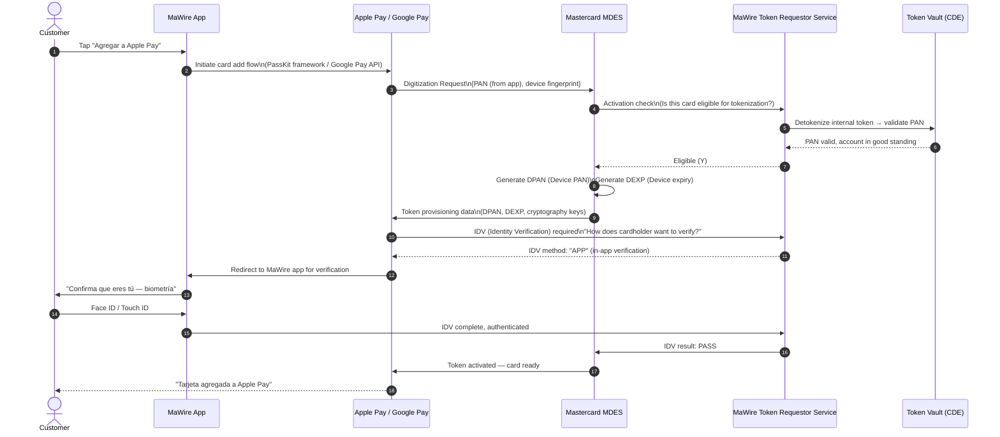

# 07 — Card Issuing

> **Classification:** Internal Technical Architecture  
> **Owner:** Card Products Engineering  
> **Last Updated:** 2026-06-06  
> **Regulatory Context:** CMF, Visa/Mastercard Operating Regulations, PCI-DSS v4.0

---

## Table of Contents

1. [Card Program Architecture](#1-card-program-architecture)
2. [Card Processor Options](#2-card-processor-options)
3. [Card Lifecycle Management](#3-card-lifecycle-management)
4. [Tokenization Architecture](#4-tokenization-architecture)
5. [Apple Pay and Google Pay Integration](#5-apple-pay-and-google-pay-integration)
6. [Card Authorization Flow](#6-card-authorization-flow)
7. [Credit Card Specifics](#7-credit-card-specifics)
8. [Debit Card Specifics](#8-debit-card-specifics)
9. [PCI-DSS Scope Management](#9-pci-dss-scope-management)

---

## 1. Card Program Architecture

### 1.1 Network Selection

#### Debit Card — Mastercard (Debin / Redcompra Replacement)

Chile's domestic debit card network is **Redcompra**, operated by Transbank, which historically was the only debit acceptance network in Chile. Under CMF Circular N°2.244 and the competitive deregulation framework, international debit networks (Mastercard Maestro/Debit, Visa Electron/Debit) are now accepted at Transbank terminals.

| Criterion | Mastercard Debit | Visa Debit |
|---|---|---|
| International acceptance | 210+ countries | 200+ countries |
| Chile merchant acceptance | Full (Transbank POS upgraded) | Full |
| Interchange rate (Chile) | 0.60–0.80% | 0.65–0.85% |
| Chargeback framework | Mastercard Rules | Visa Core Rules |
| **Recommendation** | **Preferred for Phase 1** | Alternative |
| BIN range availability | More available via sponsors | Competitive |

**Recommendation:** Issue Mastercard Debit for the MaWire main account. The Mastercard Debit BIN can be used for contactless (NFC), Apple Pay, Google Pay, and online CNP transactions globally, and will function on all Transbank POS terminals in Chile without the Redcompra exclusivity dependency.

#### Credit Card — Visa

| Criterion | Visa Credit | Mastercard Credit |
|---|---|---|
| International merchant acceptance | Slightly higher globally | Comparable |
| Premium product differentiation | Visa Signature, Visa Infinite | World Elite Mastercard |
| Lounge access (Priority Pass) | via Visa Infinite | via World Elite |
| **Recommendation** | **Preferred for credit** | Possible co-issue in Phase 3 |

#### BIN Sponsorship

MaWire will not be a **principal member** of Visa or Mastercard in Phase 1-2 (requires substantial capital and operational prerequisites). Instead, MaWire will be a **sponsored affiliate member** under a BIN sponsor:

- **Sponsor bank options in Chile:** Banco BICE, Banco Consorcio, Banco Security
- BIN sponsor relationship: sponsor holds the BIN license; MaWire operates as program manager under sponsor's Visa/MC agreements
- Liability: sponsor bank is liable to the network; contractual indemnification from MaWire
- Phase 3 target: Apply for principal membership once card volume justifies the capital outlay (~$2M for Mastercard principal membership)

---

## 2. Card Processor Options

A card processor manages **authorization routing, transaction processing, card data management, and settlement** on behalf of the card issuer. MaWire requires a processor with LATAM/Chile support, modern APIs, and flexibility for product iteration.

### 2.1 Marqeta

| Attribute | Detail |
|---|---|
| Headquarters | Oakland, CA, USA |
| Processing model | JIT (Just-in-Time) funding |
| API style | REST API, webhook-first |
| Chile/LATAM | Supported via Mastercard and Visa network |
| Sandbox | Available at `sandbox.marqeta.com` |
| Per-transaction fee | ~$0.06–$0.12 USD + interchange share (~20-30% of interchange) |
| Card management | Full lifecycle via API |
| Strengths | Fastest time-to-market, most flexible JIT model |
| Weaknesses | Cost becomes prohibitive at >5M transactions/month |

**JIT Funding Model:** On every authorization, Marqeta calls MaWire's **JIT Webhook** in real time. MaWire's authorization service responds with APPROVE/DECLINE and the exact amount to fund. This enables real-time spend controls without pre-loading funds.

```python
# MaWire JIT funding webhook handler
from fastapi import FastAPI, Request, HTTPException
from pydantic import BaseModel
from decimal import Decimal

app = FastAPI()

class JITFundingRequest(BaseModel):
    type: str                          # "jit_funding.authorization.created"
    token: str                         # Unique webhook event ID
    created_time: str
    card_token: str
    user_token: str
    amount: int                        # In minor units (centavos for CLP = same as CLP, no subdivision)
    currency_code: str                 # "CLP"
    transaction_token: str
    merchant: dict
    
class JITFundingResponse(BaseModel):
    amount: int                        # Amount approved (can be less than requested)
    jit_funding: dict

@app.post("/webhooks/marqeta/jit-funding")
async def handle_jit_funding(request: Request) -> dict:
    # Verify Marqeta HMAC signature
    signature = request.headers.get("X-Marqeta-Signature")
    body = await request.body()
    if not verify_hmac(signature, body, settings.MARQETA_WEBHOOK_SECRET):
        raise HTTPException(status_code=401, detail="Invalid signature")
    
    payload = JITFundingRequest(**(await request.json()))
    
    # Look up MaWire account from card token
    account = await account_service.get_by_card_token(payload.card_token)
    
    if not account:
        return {"amount": 0, "jit_funding": {"method": "pgfs.decline"}}
    
    # Check available balance
    available_balance = await ledger.get_available_balance(account.id)
    requested_amount = Decimal(payload.amount)  # CLP has no minor units beyond pesos
    
    if available_balance < requested_amount:
        return {
            "amount": 0,
            "jit_funding": {"method": "pgfs.decline"}
        }
    
    # Run fraud check
    fraud_result = await fraud_engine.evaluate_card_txn(
        account_id=account.id,
        amount=requested_amount,
        merchant=payload.merchant,
        card_token=payload.card_token,
    )
    
    if fraud_result.action == "DECLINE":
        return {"amount": 0, "jit_funding": {"method": "pgfs.decline"}}
    
    # Reserve funds (ledger hold)
    await ledger.create_hold(
        account_id=account.id,
        amount=requested_amount,
        transaction_token=payload.transaction_token,
        expires_in_hours=24,
    )
    
    return {
        "amount": payload.amount,
        "jit_funding": {
            "method": "pgfs.authorization",
            "token": payload.token,
        }
    }
```

### 2.2 Galileo (SoFi subsidiary)

| Attribute | Detail |
|---|---|
| Headquarters | Salt Lake City, UT, USA |
| Processing model | Pre-funded account model (no JIT) |
| LATAM presence | Strong — processes cards in Mexico, Colombia, Peru |
| Pricing | ~$0.05–$0.10 per authorization + monthly platform fee |
| API | REST with SOAP legacy endpoints for some functions |
| Strengths | LATAM regulatory expertise, established Chile relationships |
| Weaknesses | Less flexible than Marqeta; API less modern |

### 2.3 GPS (Global Processing Services)

| Attribute | Detail |
|---|---|
| Headquarters | Newcastle, UK |
| LATAM expansion | Active — signed partnerships in Brazil, Colombia |
| Pricing | Cheaper at volume (>500K cards); ~$0.03–$0.07 per auth |
| Certification | Visa and Mastercard principal member |
| Strengths | Cost-effective at scale; European regulatory expertise |
| Weaknesses | LATAM track record shorter than Galileo |

### 2.4 Phase Recommendation

| Phase | Processor | Rationale |
|---|---|---|
| Phase 1 (0–100K cards) | Marqeta | Fastest launch; best developer experience; JIT minimizes float risk |
| Phase 2 (100K–500K cards) | Marqeta + evaluate GPS | Monitor unit economics; GPS saves ~$0.03/auth at scale |
| Phase 3 (500K+ cards) | Proprietary processor or GPS | Build in-house processing for EBITDA improvement; requires 12-18 months |

---

## 3. Card Lifecycle Management

### 3.1 Card States

```
                ┌─────────┐
    ──created──▶│ CREATED │
                └────┬────┘
                     │ activated (app or IVR)
                     ▼
                ┌─────────┐
    ──suspend──▶│ ACTIVE  │◀──unsuspend──┐
    (temp block)└────┬────┘              │
                     │              ┌────┴─────┐
                     │              │SUSPENDED │
                     │              └──────────┘
                     │ terminate
                     ▼
                ┌─────────────┐
                │ TERMINATED  │  (irreversible)
                └─────────────┘
```

### 3.2 Virtual Card Issuance

Virtual cards are issued instantly (target: <3 seconds from API call) and are immediately available in the MaWire app for Apple Pay/Google Pay provisioning and online use.

```http
POST /v1/cards/virtual
Authorization: Bearer {INTERNAL_SERVICE_TOKEN}
Content-Type: application/json

{
  "account_id": "acc_7f3a2b1c4d5e6f7a",
  "card_type": "DEBIT",
  "network": "MASTERCARD",
  "currency": "CLP",
  "spending_limits": {
    "daily_limit_clp": 3000000,
    "monthly_limit_clp": 15000000,
    "single_transaction_limit_clp": 1000000
  },
  "controls": {
    "allow_international": true,
    "allow_atm": true,
    "allow_contactless": true,
    "allow_online_cnp": true,
    "mcc_blocklist": ["7995", "7994"]   // Gambling MCC codes — blocked by default
  }
}
```

```json
HTTP/1.1 201 Created
{
  "card_id": "card_9c8b7a6f5e4d3c2b",
  "card_token": "mk_card_xxxxxxxxxx",   // Marqeta card token (not the PAN)
  "last_four": "4521",
  "expiry_month": "12",
  "expiry_year": "2029",
  "network": "MASTERCARD",
  "type": "VIRTUAL",
  "status": "ACTIVE",
  "created_at": "2026-06-06T12:00:00Z",
  "pan_url": "https://vaults.mawire.cl/v1/cards/card_9c8b7a6f5e4d3c2b/pan",
  // PAN never returned directly — accessed via vault with separate auth
  "cvv_url": "https://vaults.mawire.cl/v1/cards/card_9c8b7a6f5e4d3c2b/cvv"
}
```

### 3.3 Physical Card Ordering

Physical cards require a Visa/Mastercard-certified card manufacturer. MaWire will use **IDEMIA** or **Thales** as the card personalization bureau.

```
Physical Card Flow:
1. Customer requests physical card in app
2. MaWire validates address (must be registered CMF-KYC address)
3. MaWire calls Marqeta:
   POST /v3/cards → creates physical card record in UNACTIVATED state
4. Marqeta sends card personalization data to certified bureau:
   - EMV chip data (DES/3DES key derivation, ARQC parameters)
   - Card artwork (PCI-DSS compliant transmission)
   - Personalization data: name, card number, expiry, CVV2
5. Bureau manufactures card → ships via correo certificado (Chile Post)
   or courier (DHL/Starken for premium customers)
6. Estimated delivery: 5-7 business days Santiago metro; 7-12 regional
7. Customer activates in app:
   POST /v1/cards/{card_id}/activate
   { "last_four": "4521", "expiry_month": "12", "expiry_year": "2029" }
8. Card status transitions: UNACTIVATED → ACTIVE
```

### 3.4 PIN Management

```
PIN Set Flow (first-time or reset):
1. Customer navigates to app: Tarjetas → Mi Tarjeta → Cambiar PIN
2. App generates a 256-bit ephemeral ECDH key pair
3. App sends public key to MaWire PIN Management Service (PMS)
4. PMS returns its ECDH public key
5. Both sides derive shared secret via ECDH → symmetric encryption key
6. Customer enters PIN on device secure keyboard (iOS Secure Enclave / Android StrongBox)
7. App encrypts PIN block (ISO PIN Block Format 4) with shared key
8. Encrypted PIN block transmitted to PMS
9. PMS decrypts PIN block, re-encrypts with HSM (Hardware Security Module) PIN key
10. Encrypted PIN transmitted to processor (Marqeta/Galileo) and ultimately to the card network's PIN change service
11. Confirmation returned to app

Hardware Security Module (HSM) Requirements:
- FIPS 140-2 Level 3 or higher
- Thales payShield 10K or equivalent
- PIN keys managed under dual control (no single person can access)
- Annual key ceremony with compliance officer and external auditor present
```

### 3.5 Card Blocking Operations

```python
class CardBlockingService:
    
    BLOCK_REASONS = {
        "LOST":          {"reversible": False, "customer_initiated": True},
        "STOLEN":        {"reversible": False, "customer_initiated": True, "notify_police": True},
        "FRAUD":         {"reversible": True,  "customer_initiated": False, "fraud_case": True},
        "USER_REQUEST":  {"reversible": True,  "customer_initiated": True},  # Temporary freeze
        "COMPLIANCE":    {"reversible": True,  "customer_initiated": False, "compliance_hold": True},
        "EXPIRED":       {"reversible": False, "customer_initiated": False},
    }
    
    async def block_card(
        self,
        card_id: str,
        reason: str,
        initiated_by: str,  # "CUSTOMER", "FRAUD_SYSTEM", "COMPLIANCE_OFFICER"
        notes: str = None,
    ) -> CardBlockResult:
        card = await card_repo.get(card_id)
        block_config = self.BLOCK_REASONS[reason]
        
        # For LOST/STOLEN: immediately terminate and order replacement
        if reason in ("LOST", "STOLEN"):
            await self.processor_client.terminate_card(card.processor_token)
            await card_repo.update_status(card_id, "TERMINATED")
            
            # Auto-initiate replacement
            replacement = await self.issue_replacement_card(
                account_id=card.account_id,
                card_type=card.card_type,
                reason=reason,
            )
            
            if block_config.get("notify_police"):
                await notifications.send(
                    user_id=card.account.user_id,
                    template="CARD_STOLEN_BLOCK",
                    data={"card_last_four": card.last_four, "replacement_eta": "5-7 días hábiles"},
                )
            
            return CardBlockResult(card_id=card_id, status="TERMINATED", replacement_card_id=replacement.id)
        
        # For reversible blocks: suspend (not terminate)
        await self.processor_client.suspend_card(card.processor_token)
        await card_repo.update_status(card_id, "SUSPENDED")
        
        # Audit log entry
        await audit_log.record(
            entity_type="CARD",
            entity_id=card_id,
            action=f"CARD_BLOCKED_{reason}",
            actor=initiated_by,
            notes=notes,
        )
        
        return CardBlockResult(card_id=card_id, status="SUSPENDED")
```

---

## 4. Tokenization Architecture

### 4.1 PCI-DSS Token Vault

MaWire does not store Primary Account Numbers (PANs) in application databases. All PANs are stored exclusively in the **Tokenization Vault**, which is isolated in its own PCI-DSS Level 1 compliant environment.

```
PAN Vault Architecture:
┌─────────────────────────────────────────────────────────┐
│                PCI-DSS Cardholder Data Environment      │
│                                                         │
│  ┌───────────────────┐      ┌──────────────────────┐   │
│  │   Token Vault     │      │  HSM Cluster         │   │
│  │   (encrypted DB)  │◀────▶│  (Thales payShield)  │   │
│  │                   │      │  - PAN encryption     │   │
│  │  token → PAN      │      │  - CVV generation     │   │
│  │  (AES-256 GCM)    │      │  - PIN block ops      │   │
│  └───────────────────┘      └──────────────────────┘   │
│           ▲                                              │
│           │ Tokenize/Detokenize API (mTLS required)     │
└───────────┼──────────────────────────────────────────────┘
            │
   ┌────────┴────────────────────────┐
   │   Application Zone (out of CDE) │
   │   - Card API service            │
   │   - Auth service                │
   │   - Mobile app backend          │
   │   Uses TOKENS, never PANs       │
   └─────────────────────────────────┘
```

### 4.2 Network Tokenization

Network tokens replace the PAN for digital transactions. The card network (Visa Token Service or Mastercard Digital Enablement Service) manages the token-to-PAN mapping.

| Token Type | Scope | Use Case |
|---|---|---|
| VTS (Visa Token Service) | Device-specific DPAN | Apple Pay, Google Pay, Samsung Pay |
| MDES (Mastercard DES) | Device-specific DPAN | Apple Pay, Google Pay |
| E-commerce token | Merchant-specific | Card-on-file at Amazon, MercadoLibre |
| Issuer token (internal) | MaWire-internal | Internal systems, never transmitted |

### 4.3 Token Provisioning Flow



---

## 5. Apple Pay and Google Pay Integration

### 5.1 Apple Pay

Apple Pay uses **NFC (Near Field Communication)** with a device-specific token (DPAN) stored in the iPhone's **Secure Element**. MaWire as issuer participates via the card network's Token Service.

| Component | Implementation |
|---|---|
| Token Service | MDES (Mastercard) for debit; VTS (Visa) for credit |
| IDV method | In-app authentication (preferred; avoids OTP friction) |
| NFC chip | iPhone Secure Element — MaWire has no direct access |
| Authentication | Face ID / Touch ID (Device-level) |
| CMF requirement | Mobile payments must use SCA (Strong Customer Authentication) per CMF Circular N°2.244 |

**iOS integration (PassKit):**

```swift
import PassKit

class ApplePayCardProvisioningViewController: UIViewController {
    
    func addCardToAppleWallet(cardData: MaWireCardData) {
        // Construct PKAddPaymentPassRequest
        let configuration = PKAddPaymentPassRequestConfiguration(
            encryptionScheme: .ECC_V2  // Use ECC encryption for card data
        )
        configuration?.cardholderName = cardData.holderName
        configuration?.primaryAccountSuffix = cardData.lastFour      // "4521"
        configuration?.paymentNetwork = .masterCard
        configuration?.localizedDescription = "MaWire Débito"
        
        guard let config = configuration else { return }
        
        let vc = PKAddPaymentPassViewController(
            requestConfiguration: config,
            delegate: self
        )
        present(vc!, animated: true)
    }
    
    // PKAddPaymentPassViewControllerDelegate
    func addPaymentPassViewController(
        _ controller: PKAddPaymentPassViewController,
        generateRequestWithCertificateChain certificates: [Data],
        nonce: Data,
        nonceSignature: Data,
        completionHandler handler: @escaping (PKAddPaymentPassRequest) -> Void
    ) {
        // Send certificates + nonce to MaWire backend
        Task {
            let encryptedCardData = await MaWireAPI.shared.getEncryptedCardData(
                cardId: cardData.id,
                certificates: certificates,
                nonce: nonce,
                nonceSignature: nonceSignature
            )
            
            let request = PKAddPaymentPassRequest()
            request.activationData = encryptedCardData.activationData
            request.encryptedPassData = encryptedCardData.encryptedPassData
            request.ephemeralPublicKey = encryptedCardData.ephemeralPublicKey
            handler(request)
        }
    }
}
```

### 5.2 Google Pay — HCE (Host Card Emulation)

Google Pay on Android uses **HCE** (Host Card Emulation), where the secure element is emulated in the cloud rather than a physical chip. Tokens are managed by MDES/VTS and cached on the device.

```kotlin
// Android: Initiate Google Pay card push provisioning
fun addCardToGooglePay(card: MaWireCard) {
    val tapAndPayClient = TapAndPay.getClient(this)
    
    tapAndPayClient.isTokenized(
        IsTokenizedRequest.Builder()
            .setIdentifier(card.lastFour)
            .setNetwork(TapAndPay.CARD_NETWORK_MASTERCARD)
            .setTokenServiceProvider(TapAndPay.TOKEN_PROVIDER_MASTERCARD)
            .build()
    ).addOnCompleteListener { task ->
        if (task.isSuccessful && task.result == true) {
            // Card already tokenized
            return@addOnCompleteListener
        }
        
        // Push provision the card
        tapAndPayClient.pushTokenize(
            this,
            PushTokenizeRequest.Builder()
                .setOpaquePaymentCard(card.opaquePaymentCardData) // From MaWire backend
                .setNetwork(TapAndPay.CARD_NETWORK_MASTERCARD)
                .setTokenServiceProvider(TapAndPay.TOKEN_PROVIDER_MASTERCARD)
                .setDisplayName("MaWire Débito •${card.lastFour}")
                .setLastDigits(card.lastFour)
                .build(),
            REQUEST_CODE_PUSH_TOKENIZE
        )
    }
}
```

---

## 6. Card Authorization Flow

### 6.1 Full Authorization Sequence

```mermaid
sequenceDiagram
    autonumber
    actor Cardholder
    participant POS as Merchant POS Terminal
    participant Acquirer as Transbank (Acquirer)
    participant Network as Mastercard Network
    participant Processor as Marqeta Processor
    participant MaWireAuth as MaWire Auth Service
    participant FraudEngine as Fraud Engine
    participant Ledger as MaWire Ledger

    Cardholder->>POS: Tap card / Insert chip / Swipe\n(NFC / EMV / MSR)
    POS->>POS: Generate ISO 8583 authorization request\nMTI: 0100

    Note over POS,Acquirer: ISO 8583 Field Map (key fields)
    POS->>Acquirer: ISO 8583 0100 Authorization Request
    Note right of POS: F2: PAN (or DPAN for NFC)\nF3: Processing Code 000000\nF4: Transaction Amount CLP 49.990\nF7: Transmission Date/Time\nF11: STAN (System Trace Audit Number)\nF12: Local Time 123045\nF13: Local Date 0606\nF14: Card Expiry MMYY\nF18: Merchant Category Code 5411\nF22: POS Entry Mode 07 (chip+PIN)\nF25: POS Condition Code 00\nF37: Retrieval Reference Number\nF41: Terminal ID\nF42: Merchant ID\nF43: Merchant Name/Location\nF49: Transaction Currency Code 152 (CLP)\nF55: EMV Data (ICC Data from chip)

    Acquirer->>Network: Forward ISO 8583 0100\n(Transbank → Mastercard LatAm)
    Network->>Processor: Route to MaWire Processor\n(Marqeta) via BIN lookup
    
    Processor->>Processor: Validate message structure\nDe-tokenize DPAN → PAN lookup
    Processor->>MaWireAuth: JIT funding webhook\nPOST /webhooks/marqeta/jit-funding\n{card_token, amount, merchant, ...}

    MaWireAuth->>FraudEngine: evaluate_transaction(context)
    Note over FraudEngine: ML model inputs:\n- Transaction amount CLP 49,990\n- MCC: 5411 (Supermarket)\n- Merchant location: Santiago\n- Customer location: Santiago (last known)\n- Velocity: 2 transactions last hour\n- Device: known iOS device\n- Time: 12:30 (normal hours)
    FraudEngine-->>MaWireAuth: {score: 8, action: "ALLOW", reason: "low_risk"}

    MaWireAuth->>Ledger: check_available_balance(account_id)
    Ledger-->>MaWireAuth: {available: CLP 245,320, hold: CLP 15,000}

    alt Sufficient balance AND fraud score low
        MaWireAuth->>Ledger: create_authorization_hold(amount: 49,990, txn_ref: "...")
        Ledger-->>MaWireAuth: hold_id: "hold_xxxx"
        MaWireAuth-->>Processor: 200 OK {amount: 49990, approved: true}
        Processor->>Network: ISO 8583 0110 Authorization Response\nF39: Response Code 00 (Approved)
        Network->>Acquirer: 0110 Response Code 00
        Acquirer->>POS: Approval\nAuthorization Code: 123456
        POS-->>Cardholder: "Aprobado — CLP 49.990"
    else Insufficient balance
        MaWireAuth-->>Processor: 200 OK {amount: 0, approved: false, decline_reason: "INSUFFICIENT_FUNDS"}
        Processor->>Network: ISO 8583 0110 Response Code 51 (Insufficient Funds)
        Network->>Acquirer: 0110 Response Code 51
        Acquirer->>POS: Declined
        POS-->>Cardholder: "Tarjeta rechazada"
    else Fraud decline
        MaWireAuth-->>Processor: 200 OK {amount: 0, approved: false, decline_reason: "FRAUD_SUSPECTED"}
        Processor->>Network: ISO 8583 0110 Response Code 59 (Suspected Fraud)
        Network->>Acquirer: 0110 Response Code 59
        Acquirer->>POS: Declined
        MaWireAuth->>MaWireAuth: Create fraud alert → notify customer
    end

    Note over Processor,MaWireAuth: At settlement (T+1 for Transbank)\nClearing: ISO 8583 MTI 0220\nSettlement: hold → posted transaction\nLedger: clear hold, post debit
```



### 6.2 ISO 8583 Key Response Codes

| Code | Meaning | MaWire Action |
|---|---|---|
| 00 | Approved | Hold funds, emit receipt |
| 01 | Refer to card issuer | Flag for review |
| 05 | Do not honor | Generic decline |
| 12 | Invalid transaction | Log, investigate |
| 14 | Invalid card number | Log PAN mismatch |
| 41 | Lost card | Block card, alert customer |
| 43 | Stolen card | Block card, fraud alert |
| 51 | Insufficient funds | Notify customer if opted-in |
| 54 | Expired card | Prompt card renewal |
| 55 | Incorrect PIN | Count PIN attempts; block at 3 |
| 57 | Transaction not permitted | Check MCC controls |
| 59 | Suspected fraud | Fraud alert, temporary block |
| 61 | Exceeds withdrawal limit | Notify limit reached |
| 65 | Exceeds frequency limit | Notify limit reached |
| 91 | Issuer unavailable | MaWire auth service down — stand-in |

### 6.3 Stand-In Processing

When MaWire's auth service is unreachable, **Marqeta stand-in** processes authorizations using pre-configured rules (approve up to CLP 50,000 for known-good cards with sufficient historical balance). Stand-in decisions are reconciled with MaWire's ledger within 4 hours of restoration. Stand-in uptime SLA from Marqeta: 99.99%.

---

## 7. Credit Card Specifics

### 7.1 Credit Limit Management

```python
from decimal import Decimal
from typing import Optional
import numpy as np

class CreditLimitEngine:
    """
    Determines initial credit limit at card approval and
    handles periodic limit reviews.
    """
    
    # CMF maximum credit limits (indicative; actual per CMF Circular N°2.272)
    CMF_MAX_CREDIT_LIMIT_MULTIPLIER = 5  # Max 5x monthly income (CMF guidance)
    
    def calculate_initial_limit(
        self,
        monthly_income_clp: Decimal,
        credit_bureau_score: int,         # DICOM/Equifax Chile score (300-850)
        existing_debts_clp: Decimal,
        employment_type: str,              # "EMPLOYED", "SELF_EMPLOYED", "PENSIONER"
        months_at_employer: int,
    ) -> Decimal:
        
        # Debt-to-income ratio (DTI)
        dti = existing_debts_clp / monthly_income_clp if monthly_income_clp > 0 else Decimal("1.0")
        
        # Base limit from income
        if credit_bureau_score >= 750:
            base_multiplier = Decimal("3.0")
        elif credit_bureau_score >= 680:
            base_multiplier = Decimal("2.0")
        elif credit_bureau_score >= 620:
            base_multiplier = Decimal("1.5")
        else:
            base_multiplier = Decimal("1.0")
        
        # Employment stability adjustment
        if employment_type == "EMPLOYED" and months_at_employer >= 12:
            stability_factor = Decimal("1.0")
        elif employment_type == "EMPLOYED" and months_at_employer >= 6:
            stability_factor = Decimal("0.85")
        else:
            stability_factor = Decimal("0.70")
        
        # DTI adjustment
        dti_factor = max(Decimal("0.5"), Decimal("1.0") - dti * Decimal("0.5"))
        
        initial_limit = monthly_income_clp * base_multiplier * stability_factor * dti_factor
        
        # Cap at CMF maximum
        max_limit = monthly_income_clp * self.CMF_MAX_CREDIT_LIMIT_MULTIPLIER
        initial_limit = min(initial_limit, max_limit)
        
        # Round to nearest CLP 50,000
        initial_limit = (initial_limit / 50000).quantize(Decimal("1")) * 50000
        
        # Absolute floor/ceiling
        initial_limit = max(Decimal("100000"), initial_limit)   # Min CLP 100,000
        initial_limit = min(Decimal("20000000"), initial_limit)  # Max CLP 20M for new customers
        
        return initial_limit
```

### 7.2 Interest Rate Compliance — Tasa Máxima Convencional

The **Tasa Máxima Convencional (TMC)** is the maximum interest rate that Chilean lenders may charge, set by the Banco Central quarterly under Ley N°18.010. MaWire must never charge above the TMC.

```python
# TMC enforcement (rates are illustrative; MaWire must pull live from Banco Central API)
# Reference: Banco Central API endpoint for current TMC

import httpx
from decimal import Decimal

async def get_current_tmc() -> dict:
    """
    Fetch current Tasa Máxima Convencional from Banco Central de Chile API.
    Banco Central publishes this via their estadisticas.bcentral.cl API.
    Cache for 24h (TMC is set quarterly but may update monthly for some tranches).
    """
    async with httpx.AsyncClient() as client:
        resp = await client.get(
            "https://si3.bcentral.cl/SieteRestWS/SieteRestWS.ashx",
            params={
                "user": settings.BANCO_CENTRAL_API_USER,
                "pass": settings.BANCO_CENTRAL_API_PASS,
                "function": "GetSeries",
                "timeseries": "TMC.CRE.C.90.M",  # TMC for credit operations >90 days
                "firstdate": "2026-01-01",
                "lastdate": "2026-12-31",
                "format": "json",
            }
        )
        data = resp.json()
        latest = data["Series"]["Obs"][-1]
        return {
            "tmc_annual_percent": Decimal(latest["value"]),  # e.g., "28.40"
            "effective_date": latest["indexDateString"],
            "period": "quarterly",
        }

def calculate_monthly_interest(
    outstanding_balance: Decimal,
    annual_rate_percent: Decimal,
    tmc_annual_percent: Decimal,
) -> Decimal:
    """
    Calculate monthly interest charge, ensuring rate does not exceed TMC.
    Raises ComplianceError if configured rate exceeds TMC.
    """
    effective_rate = min(annual_rate_percent, tmc_annual_percent)
    
    if annual_rate_percent > tmc_annual_percent:
        compliance_logger.warning(
            f"Configured rate {annual_rate_percent}% exceeds TMC {tmc_annual_percent}%. "
            f"Applying TMC rate. Alert compliance team."
        )
    
    # Monthly rate = (1 + annual_rate/100)^(1/12) - 1 (compound)
    monthly_rate = (1 + effective_rate / 100) ** (Decimal("1") / 12) - 1
    monthly_interest = outstanding_balance * monthly_rate
    
    return monthly_interest.quantize(Decimal("1"))  # CLP, no cents
```

### 7.3 Minimum Payment Calculation

Per **CMF Circular N°43 (Compendio de Normas del Sistema Financiero, Capítulo 7-1)**, the minimum payment for revolving credit cards must be disclosed clearly and calculated per a standardized formula.

```python
def calculate_minimum_payment(
    total_outstanding: Decimal,
    monthly_interest: Decimal,
    overdue_amount: Decimal,
    payment_month: int,   # Month number in credit cycle
) -> Decimal:
    """
    CMF-compliant minimum payment calculation.
    
    Formula: MAX(
        3% of total outstanding balance,
        monthly interest + fees,
        overdue amounts,
        CLP 5,000 (floor)
    )
    """
    
    percentage_based = total_outstanding * Decimal("0.03")  # 3% of balance
    interest_based = monthly_interest + overdue_amount
    floor_payment = Decimal("5000")
    
    minimum = max(percentage_based, interest_based, floor_payment)
    
    # Round up to nearest CLP 1,000
    minimum = (minimum / 1000).quantize(Decimal("1"), rounding=ROUND_UP) * 1000
    
    return minimum
```

### 7.4 CAE Disclosure — Carga Anual Equivalente

The **CAE (Carga Anual Equivalente)** is the all-in annual cost of credit, mandated by **Ley N°20.555 (SERNAC Financiero)** and **CMF Circular N°3.576**. MaWire must display the CAE prominently in all credit card offers and statements.

```python
def calculate_cae(
    principal: Decimal,
    monthly_interest_rate: Decimal,    # e.g., 0.0189 for 1.89%/month
    annual_fee: Decimal,
    other_monthly_fees: Decimal,       # Insurance, services
    n_months: int = 12,
) -> Decimal:
    """
    CAE calculation per CMF methodology.
    
    CAE = (1 + TEM)^12 - 1 + annual_costs_as_rate
    where TEM = Tasa Efectiva Mensual (all-in monthly rate including fees)
    
    More precisely, CMF requires IRR-based calculation:
    P = Σ [C_t / (1 + CAE/12)^t] for t = 1..n
    where C_t = monthly payment + monthly fees
    """
    from scipy.optimize import brentq
    import numpy as np
    
    # Monthly payment (annuity formula)
    r = float(monthly_interest_rate)
    p = float(principal)
    monthly_payment = p * (r * (1 + r)**n_months) / ((1 + r)**n_months - 1)
    
    # Total monthly cost including fees
    total_monthly_cost = monthly_payment + float(other_monthly_fees)
    annual_fee_monthly = float(annual_fee) / 12
    cash_flows = [-p] + [total_monthly_cost + annual_fee_monthly] * n_months
    
    # IRR (monthly) via Newton-Raphson / Brent's method
    def npv(rate):
        return sum(cf / (1 + rate)**t for t, cf in enumerate(cash_flows))
    
    monthly_irr = brentq(npv, 0.0001, 0.99)
    
    # Convert to annual CAE
    cae_annual = (1 + monthly_irr)**12 - 1
    
    return Decimal(str(round(cae_annual * 100, 2)))  # Return as percentage

# CAE must appear in:
# - Pre-contractual disclosure (before card approval)
# - Monthly statement header
# - Any marketing material mentioning interest rates
# Format per CMF: "CAE: 28.40% anual"
```

### 7.5 Statement Generation

```
Statement Schedule:
- Closing date: 25th of each month (configurable per cardholder)
- Payment due date: 15th of following month (21-day grace period minimum, CMF requirement)
- Statement format: PDF (primary), accessible HTML, in-app native view
- Delivery: Push notification + in-app + email
- Retention: 6 years (CMF regulatory minimum for credit card records)

Statement Fields (CMF-mandated disclosures):
- RUT del titular
- Número de tarjeta (last 4)
- Período del estado de cuenta
- Saldo anterior
- Compras y cargos del período
- Pagos recibidos
- Intereses del período (broken out: ordinary interest, default interest)
- Comisiones y gastos
- Saldo total adeudado
- Pago mínimo y fecha de vencimiento
- CAE (prominent, per CMF)
- Tasa de interés ordinaria y moratoria
- DICOM status if applicable
```

### 7.6 Late Fee Calculation and Cap

```python
def calculate_late_fee(
    overdue_amount: Decimal,
    days_overdue: int,
    tmc: Decimal,
) -> Decimal:
    """
    Late fees (interés moratorio) in Chile are capped at 1.5x the agreed interest rate
    and may not exceed the TMC for default interest (tasa de interés moratorio).
    
    Ley N°18.010, Art. 6: default interest cannot exceed 1.5x the agreed rate.
    CMF Circular N°3.576: maximum moratoria rate.
    """
    # Moratoria rate = min(agreed_rate * 1.5, TMC)
    base_rate_monthly = Decimal("0.0189")           # Example: 1.89%/month agreed rate
    moratoria_rate = min(base_rate_monthly * Decimal("1.5"), tmc / 12 / 100)
    
    # Interest on overdue amount
    late_fee = overdue_amount * moratoria_rate * Decimal(days_overdue) / 30
    
    return late_fee.quantize(Decimal("1"))
```

---

## 8. Debit Card Specifics

### 8.1 Real-Time Balance Check on Authorization

The JIT webhook (section 2.1) performs a real-time balance check at the moment of authorization. MaWire's ledger uses a **two-tier balance model**:

```sql
-- Account balance model
CREATE TABLE account_balances (
    account_id       UUID PRIMARY KEY,
    ledger_balance   BIGINT NOT NULL DEFAULT 0,    -- All posted transactions (in CLP pesos)
    pending_holds    BIGINT NOT NULL DEFAULT 0,    -- Authorized but not yet cleared
    available_balance BIGINT GENERATED ALWAYS AS   -- What customer can spend
                     (ledger_balance - pending_holds) STORED,
    overdraft_limit  BIGINT NOT NULL DEFAULT 0,    -- 0 = no overdraft
    last_updated_at  TIMESTAMPTZ NOT NULL DEFAULT NOW()
);

-- Authorization hold
CREATE TABLE authorization_holds (
    hold_id             UUID PRIMARY KEY DEFAULT gen_random_uuid(),
    account_id          UUID NOT NULL REFERENCES account_balances(account_id),
    amount_clp          BIGINT NOT NULL,
    transaction_token   TEXT UNIQUE NOT NULL,    -- Marqeta transaction token
    merchant_name       TEXT,
    created_at          TIMESTAMPTZ NOT NULL DEFAULT NOW(),
    expires_at          TIMESTAMPTZ NOT NULL,    -- Typically created_at + 7 days
    status              VARCHAR(20) NOT NULL DEFAULT 'ACTIVE',
                        -- 'ACTIVE', 'CLEARED', 'EXPIRED', 'REVERSED'
    cleared_at          TIMESTAMPTZ
);
```

### 8.2 Overdraft Protection

```python
OVERDRAFT_CONFIG = {
    "enabled_by_default": False,          # Customer must opt-in
    "max_overdraft_limit_clp": 50000,     # CLP 50,000 maximum coverage
    "daily_fee_when_used_clp": 1500,      # Fixed daily fee while in overdraft
    "grace_period_hours": 24,             # No fee if repaid within 24h
    "auto_repay_from_next_deposit": True, # Automatic repayment from next credit
}
```

### 8.3 Spending Limits

```python
# Default limits per CMF guidance; customer can reduce but not increase above CMF max
DEFAULT_DEBIT_LIMITS = {
    "daily_pos_limit_clp":    3_000_000,    # CLP 3M per day — POS purchases
    "daily_atm_limit_clp":    500_000,      # CLP 500K per day — ATM withdrawals
    "daily_online_limit_clp": 2_000_000,    # CLP 2M per day — CNP/e-commerce
    "single_transaction_max": 1_500_000,    # CLP 1.5M per transaction
    "monthly_limit_clp":     15_000_000,    # CLP 15M per month
}

CMF_ABSOLUTE_MAXIMUM_LIMITS = {
    # CMF has not set hard maximums for debit in Circular 2.244
    # but expects proportionality to customer income/profile
    "daily_total_max": 10_000_000,          # MaWire internal policy
}
```

### 8.4 ATM Fee Model

| ATM Network | Fee |
|---|---|
| MaWire branded ATMs (own network, Phase 3) | Free |
| Redbanc network (BancoEstado, Santander, BCI, etc.) | CLP 1,500 per withdrawal |
| International ATMs (Mastercard/Cirrus) | CLP 3,500 + 2.5% FX spread |
| Mastercard ATM fee rebate (premium tier) | First 3 withdrawals free per month |

---

## 9. PCI-DSS Scope Management

### 9.1 Scope Reduction Strategy

MaWire's goal is to minimize the **Cardholder Data Environment (CDE)** to reduce the cost and complexity of PCI-DSS compliance.

```
In-scope for PCI-DSS (CDE):
├── Token Vault service
├── HSM cluster
├── Card personalization API (calls to Marqeta with encrypted card data)
└── Any service that processes, stores, or transmits PAN/CVV/PIN

Out-of-scope (tokenization reduces scope):
├── All application microservices (use tokens, not PANs)
├── Mobile app (displays last-4 only; PAN shown via tokenized iframe)
├── Database layer (stores tokens, not PANs)
├── Analytics platform (masked data: XXXX-XXXX-XXXX-4521)
└── Customer support systems (last-4 and token only)
```

### 9.2 Network Segmentation

```
Network Zones:
┌─────────────────────────────────────────────────────────────┐
│  ZONE 1: CDE (Cardholder Data Environment)                  │
│  - VLAN 10, 11                                              │
│  - Token vault, HSM                                         │
│  - No internet access; only mTLS from App Zone              │
│  - WAF + IPS inline                                         │
│  - Full packet capture 90 days                              │
├─────────────────────────────────────────────────────────────┤
│  ZONE 2: Application Zone                                    │
│  - VLAN 20-29                                               │
│  - All microservices (auth, payments, accounts, etc.)       │
│  - Can call CDE APIs via mTLS only                          │
│  - Internet-facing via WAF/API Gateway                      │
├─────────────────────────────────────────────────────────────┤
│  ZONE 3: DMZ / API Gateway                                  │
│  - VLAN 100                                                 │
│  - Kong/Nginx ingress                                       │
│  - DDoS mitigation (Cloudflare)                             │
│  - TLS termination                                          │
├─────────────────────────────────────────────────────────────┤
│  ZONE 4: Management / Bastion                               │
│  - VLAN 200                                                 │
│  - Jump servers only (no direct SSH to prod)                │
│  - MFA required for all access                              │
│  - Session recording (PAM solution)                         │
└─────────────────────────────────────────────────────────────┘

Firewall rules:
- No traffic from App Zone to CDE except on port 8443 (mTLS)
- No traffic from CDE to internet
- All inter-zone traffic logged (SIEM)
- Default-deny posture on all zone boundaries
```

### 9.3 Required Controls for PCI-DSS Level 1

PCI-DSS Level 1 applies when processing >6 million card transactions per year. MaWire should target Level 1 compliance from launch (demonstrates maturity to partners and regulators).

| PCI-DSS Requirement | MaWire Implementation |
|---|---|
| Req 1: Firewall config | AWS Security Groups + dedicated FW (Palo Alto) |
| Req 2: No vendor defaults | Hardened AMIs; CIS benchmarks; automated scanning |
| Req 3: Protect stored CHD | AES-256 in token vault; no PAN in application DBs |
| Req 4: Encrypt transmission | TLS 1.2+ everywhere; mTLS for CDE; no plain HTTP |
| Req 5: Anti-malware | CrowdStrike Falcon on all hosts |
| Req 6: Secure systems | SAST/DAST in CI/CD; CVE patching SLA: critical <24h |
| Req 7: Restrict access | RBAC; least privilege; quarterly access review |
| Req 8: Identify/authenticate | MFA mandatory; PAM for privileged access; unique IDs |
| Req 9: Physical access | AWS data centers (inherited PCI cert); office access control |
| Req 10: Logging/monitoring | Centralized SIEM (Elastic); 90-day hot, 1-year cold log retention |
| Req 11: Vulnerability mgmt | Weekly ASV scans; quarterly penetration test |
| Req 12: Security policy | Annual policy review; PCI security awareness training |
| Annual QSA Audit | Engage approved QSA (e.g., KPMG Chile, Deloitte Chile) |

### 9.4 PAN Display Masking

MaWire never renders a full PAN in any UI. All PAN-adjacent displays use masking:

```
App card display:   •••• •••• •••• 4521   (only last 4)
Statement PDF:      4521 (last 4 in document; full PAN never in PDF)
API responses:      { "last_four": "4521" }  (never full PAN)
Support systems:    Customer support sees: XXXXXXXXXXXX4521
Card printing:      Only the manufacturer's CDE system receives the full PAN
```
