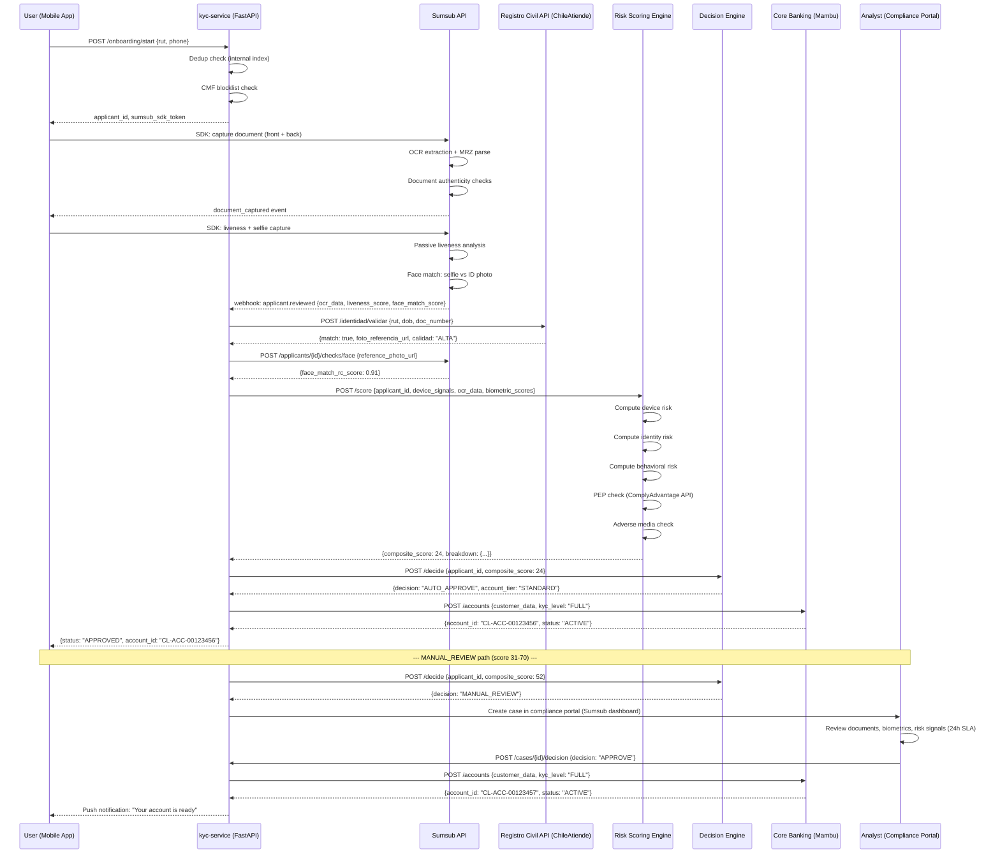

# 08 - Identity, KYC & Digital Onboarding

## Chilean Digital Onboarding Regulatory Requirements

### CMF Requirements

The Comisión para el Mercado Financiero (CMF) governs digital onboarding for regulated financial entities in Chile through the following primary instruments:

- **Circular N°2.649 (2019)**: Establishes requirements for digital onboarding of natural persons, permitting full remote account opening without physical presence when biometric verification is implemented. Mandates liveness detection and document authenticity checks.
- **Circular N°3.614 (2021)**: Supplements N°2.649 with requirements specific to fintech and payment service providers operating under the CMF fintech framework (Ley N°21.521, "Ley Fintech").
- **Norma de Carácter General N°484 (2022)**: Defines cybersecurity and data management requirements for CMF-regulated entities, directly affecting KYC data storage and access controls.

**Customer identification documents accepted:**
- Cédula de Identidad (RUN - Rol Único Nacional): primary document for Chilean nationals
- Pasaporte: for foreign nationals; linked to RUN if registered with Registro Civil
- Cédula de Identidad para Extranjeros: for resident foreigners

**Biometric verification requirements under Circular N°2.649:**
- Live facial comparison against Registro Civil enrolled photo (not just the ID document photo)
- Passive or active liveness detection to prevent spoofing
- Match score threshold: CMF does not mandate a specific threshold but the entity must document its risk-based rationale; industry standard is ≥ 80% confidence score for auto-approval

**Registro Civil API - ChileAtiende Integration:**
- The Servicio de Registro Civil e Identificación (SRCeI) exposes identity validation services via ChileAtiende platform APIs
- Endpoint: validates RUN + date of birth + document number; returns biographic match (true/false) and optionally a reference photo for biometric comparison
- SLA: 99.5% availability per government service agreement; fallback to OCR-only path with manual review flag
- Auth: OAuth2 client credentials, token TTL 3600s, IP whitelisting required
- Rate limits: 1,000 req/min per client; burst to 2,000 req/min with pre-approved quota

**Simplified Due Diligence thresholds (ex-SBIF, now CMF):**
- Accounts with monthly activity ≤ UF 60 (~CLP 1,960,000 at June 2026 UF) qualify for simplified KYC
- No face-to-face requirement, reduced document verification acceptable
- Transaction limits enforced at account level; breach triggers KYC upgrade

**Full KYC requirements for accounts above UF 60/month:**
- Complete biometric verification including Registro Civil photo match
- Source of funds declaration for activity exceeding UF 100/month
- Annual review scheduled

---

### UAF Requirements

The Unidad de Análisis Financiero (UAF) imposes KYC obligations on reporting entities (including CMF-licensed fintechs and banks) under:

- **Ley N°19.913 (as amended by Ley N°20.818 and Ley N°21.459)**: Establishes the UAF, defines reporting entities, and mandates KYC policies
- **Circular UAF N°049 (Instrucción General N°49)**: Customer identification and due diligence requirements
- **Resolución N°150**: Mandates a formal KYC policy document, approved by the board, reviewed annually, describing procedures for customer identification, risk classification, and EDD

**Risk-based approach to Customer Due Diligence (CDD):**
- All customers must be risk-classified as LOW / MEDIUM / HIGH
- Classification criteria documented in internal KYC policy
- CDD depth scaled to risk level

**Enhanced Due Diligence (EDD) mandatory for:**
- Politically Exposed Persons (PEPs) — domestic and foreign, per UAF PEP list and commercial databases
- Customers from FATF high-risk or non-cooperative jurisdictions (blacklist/greylist countries)
- Non-face-to-face customers with high transaction volumes
- Legal entities with complex ownership structures
- Customers with adverse media or UAF alerts

---

## Digital Onboarding Flow

### Step-by-Step User Journey

```
Step 1:  User downloads MaWire app (iOS/Android)
         → Enters RUT (Rol Único Tributario / RUN)
         → System performs CMF blacklist check via internal blocklist DB
         → System queries internal deduplication index (no existing account for this RUN)

Step 2:  Document capture
         → User photographs front face of Cédula de Identidad
         → User photographs back face of Cédula de Identidad
         → SDK validates image quality: resolution ≥ 300 DPI equivalent, no glare,
           full card visible, minimum blur threshold

Step 3:  OCR data extraction (within Sumsub SDK + server-side validation)
         → Fields extracted: full name, RUT, date of birth, document number,
           expiry date, MRZ (Machine Readable Zone on back)
         → Confidence score per field; any field < 85% confidence flags for review

Step 4:  Registro Civil / ChileAtiende API validation
         → POST /identidad/validar with: {rut, fecha_nacimiento, numero_documento}
         → Response: {match: true/false, foto_referencia_url: "...", calidad: "ALTA|MEDIA|BAJA"}
         → If match = false → REJECT with code ID_MISMATCH
         → foto_referencia_url used in Step 6 biometric comparison

Step 5:  Liveness detection
         → Passive liveness: single selfie analyzed for depth, texture, reflection
           artifacts; detects printed photo attacks, replay attacks, 3D mask attacks
         → Active challenge (for medium/high-risk sessions): random instructions
           (turn left, blink, smile) validated in real-time
         → Liveness confidence score returned; threshold < 70% → REJECT

Step 6:  Face matching — three-way comparison
         → Selfie vs ID document photo: local match within Sumsub
         → Selfie vs Registro Civil reference photo: API-based match
         → Both scores must exceed 80% for AUTO_APPROVE path
         → Score 65-80%: MANUAL_REVIEW with biometric review queue

Step 7:  Composite risk scoring
         → Device risk signals collected by SDK
         → Behavioral signals from session analytics
         → Data risk: PEP check, adverse media, address geocoding
         → Composite score 0–100 computed (see Risk Scoring Model section)

Step 8:  Automated decision
         → Score 0–30: AUTO_APPROVE
         → Score 31–70: MANUAL_REVIEW (24h SLA)
         → Score 71–100: REJECT with reason code

Step 9:  Account creation (AUTO_APPROVE path)
         → Account provisioned in core banking (Mambu/Temenos)
         → Virtual card issued immediately
         → Onboarding completion event fired to event bus (Kafka)

Step 10: Manual review queue (MANUAL_REVIEW path)
         → Case created in compliance portal (Sumsub dashboard)
         → Analyst reviews: documents, biometrics, risk signals, Registro Civil response
         → Decision: APPROVE / REQUEST_MORE_INFO / REJECT
         → Customer notified via push notification + email
         → SLA: 24h for MANUAL_REVIEW; 4h for cases with high-risk signals
```

### Complete Onboarding Sequence Diagram



---

## KYC Vendor Evaluation

### Sumsub

| Attribute | Detail |
|---|---|
| Pricing | $1.50–$5.00 per verification (volume tiers: <1K/mo at $5.00; 1K–10K at $3.00; 10K–50K at $2.00; >50K negotiated ~$1.50) |
| Chilean Cédula support | Full support: OCR, MRZ parse, hologram detection |
| Registro Civil integration | OCR-extracted data submitted to ChileAtiende; separate biometric comparison against RC photo via API |
| Liveness technology | Proprietary passive liveness (FaceSDK); active challenge available; iBeta Level 2 certified |
| Dashboard | Compliance portal: case queue, audit trail, bulk review, re-verification triggers |
| SDK | Flutter (official plugin), React Native (official plugin), iOS native, Android native |
| Data residency | AWS multi-region; São Paulo (sa-east-1) recommended for Chile latency (~45ms); data residency agreement available |
| Regulatory coverage | SOC 2 Type II, ISO 27001, GDPR compliant; experience with CMF-regulated entities |
| Webhook reliability | 99.9% SLA; retry with exponential backoff; event signing via HMAC-SHA256 |
| **Recommendation** | **Best fit for Phase 1 and Phase 2** |

### Persona (persona.com)

| Attribute | Detail |
|---|---|
| Pricing | $1.00–$3.00 per verification; flat tiers |
| Chilean document support | Moderate: Cédula de Identidad supported but OCR accuracy lower than Sumsub for Chilean-specific document features (hologram, UV patterns) |
| Strengths | Highly configurable workflow builder (no-code); excellent US compliance stack |
| Weaknesses | LATAM focus less mature; no direct Registro Civil API integration; support in Spanish limited |
| Data residency | US-only; data transfer agreement required for CMF compliance |

### Onfido (now part of Entrust)

| Attribute | Detail |
|---|---|
| Pricing | $2.00–$6.00 per verification; Atlas AI premium tier at upper end |
| Chilean documents | Supported with Atlas AI; certified for Chilean Cédula de Identidad |
| Liveness technology | Atlas AI: passive liveness + motion challenge; ISO 30107-3 Part 3 certified |
| Weaknesses | Acquisition by Entrust created product uncertainty; pricing not competitive vs. Sumsub at volume |
| Integration | REST API; SDK for iOS/Android/Web |

### Veriff

| Attribute | Detail |
|---|---|
| Pricing | $3.00–$8.00 per verification; minimum volume commitments |
| Accuracy | Best-in-class biometric accuracy (claimed 98.3% auto-verification rate) |
| Strengths | Very high auto-acceptance rate reduces manual review costs; strong fraud detection |
| Weaknesses | Premium pricing makes it difficult to justify for simplified KYC tier; Estonian company, LATAM support developing |
| Use case | Better suited for EDD flows (high-risk customer re-verification) than high-volume standard onboarding |

### Build vs. Buy Analysis (Phase 3)

At > 500K verifications/year, build unit economics improve significantly:

```
Phase 1 (0–50K verifications/year):
  Sumsub cost: ~$100K–$250K/year
  Build cost: $800K–1.2M (team + infra) → NOT justified

Phase 2 (50K–500K verifications/year):
  Sumsub cost: ~$250K–$750K/year
  Build cost: $1.2M–1.8M/year → borderline

Phase 3 (>500K verifications/year):
  Sumsub cost: >$750K/year (negotiated rates flatten)
  Build cost: $1.5M–2M/year → justified if biometric accuracy
  requirements can be met with open-source models (FaceNet, ArcFace)
```

**Recommendation: Sumsub for Phase 1–2, evaluate proprietary build at Phase 3 with ArcFace-based biometric pipeline + in-house Registro Civil integration.**

---

## KYC Service Architecture

```
                         ┌──────────────────────────────────────┐
                         │           Mobile App (Flutter)        │
                         │  Sumsub SDK (embedded)               │
                         └──────────────┬───────────────────────┘
                                        │ HTTPS + SDK callbacks
                         ┌──────────────▼───────────────────────┐
                         │          API Gateway (Kong)           │
                         │  Rate limiting, JWT validation        │
                         └──────────────┬───────────────────────┘
                                        │
                         ┌──────────────▼───────────────────────┐
                         │    kyc-service (Python 3.11/FastAPI)  │
                         │                                       │
                         │  Routes:                              │
                         │  POST /onboarding/start               │
                         │  POST /onboarding/webhook (Sumsub)    │
                         │  GET  /onboarding/{id}/status         │
                         │  POST /cases/{id}/decision            │
                         └───┬──────────┬──────────┬────────────┘
                             │          │          │
              ┌──────────────▼──┐  ┌───▼───────┐  ┌▼──────────────────┐
              │   Sumsub API    │  │Registro   │  │  Risk Scoring     │
              │  (biometrics,   │  │Civil API  │  │  Engine           │
              │   OCR, liveness)│  │(ChileAti- │  │  (internal ML     │
              └─────────────────┘  │ ende)     │  │   service)        │
                                   └───────────┘  └────────┬──────────┘
                                                           │
                                             ┌─────────────▼──────────┐
                                             │  Decision Engine        │
                                             │  (rule-based thresholds │
                                             │   + risk score)         │
                                             └─────────────┬──────────┘
                                                           │
                              ┌────────────────────────────┴───────────────┐
                              │                                             │
              ┌───────────────▼────────┐              ┌────────────────────▼──┐
              │  Core Banking (Mambu)  │              │  Compliance Portal     │
              │  Account provisioning  │              │  (Sumsub dashboard +   │
              └────────────────────────┘              │   internal case mgmt)  │
                                                      └────────────────────────┘

Storage:
  PostgreSQL (RDS):     KYC applications, decisions, audit events
  S3 (encrypted):       Document images, biometric templates (AES-256, KMS)
  Redis (ElastiCache):  Session state, dedup index (TTL: 24h)
  Kafka:                KYC events → downstream consumers (AML, fraud, core banking)
```

---

## Risk Scoring Model

### Feature Definitions

```python
from dataclasses import dataclass
from enum import Enum
import numpy as np

class RiskDecision(Enum):
    AUTO_APPROVE  = "AUTO_APPROVE"
    MANUAL_REVIEW = "MANUAL_REVIEW"
    REJECT        = "REJECT"

@dataclass
class KYCRiskFeatures:
    # --- Device Risk (weight: 25%) ---
    is_new_device: bool               # Device not previously seen in system
    vpn_proxy_detected: bool          # IP associated with VPN/proxy/Tor exit node
    device_fingerprint_mismatch: bool # SDK fingerprint ≠ registered device hash
    emulator_detected: bool           # Frida, root, emulator signals from SDK
    device_age_days: int              # Days since device first seen across platform
    ip_reputation_score: float        # 0-1 from IPQualityScore/MaxMind; 0=clean

    # --- Identity Risk (weight: 35%) ---
    document_quality_score: float     # 0-1; Sumsub OCR composite quality
    ocr_confidence_min: float         # Minimum OCR field confidence across all fields
    biometric_selfie_vs_id: float     # Face match: selfie vs ID document photo
    biometric_selfie_vs_rc: float     # Face match: selfie vs Registro Civil photo
    liveness_score: float             # 0-1; passive liveness confidence
    document_expiry_days: int         # Days until document expires; <0 = expired
    registro_civil_match: bool        # ChileAtiende API returned match=true
    mrz_checksum_valid: bool          # MRZ check digits valid

    # --- Behavioral Risk (weight: 20%) ---
    session_duration_seconds: int     # Total onboarding session time
    typing_anomaly_score: float       # 0-1; keystroke dynamics vs human baseline
    form_fill_speed_wpm: float        # Words per minute across text fields
    copy_paste_detected: bool         # Text fields filled via clipboard
    multiple_attempts: int            # Number of document capture retries

    # --- Data Risk (weight: 20%) ---
    pep_match_score: float            # 0-1; ComplyAdvantage PEP match confidence
    adverse_media_hits: int           # Count of adverse media articles
    address_high_risk_zone: bool      # Address geocoded to CMF/UAF high-risk area
    country_of_birth_fatf_risk: str   # "LOW" | "MEDIUM" | "HIGH" | "BLACKLIST"
    duplicate_device_applications: int # Other applications from same device (last 30d)

def compute_device_risk(f: KYCRiskFeatures) -> float:
    """Returns device risk sub-score 0–100."""
    score = 0.0
    if f.is_new_device:                   score += 15
    if f.vpn_proxy_detected:              score += 25
    if f.device_fingerprint_mismatch:     score += 30
    if f.emulator_detected:               score += 40
    if f.device_age_days < 1:             score += 10
    score += (1 - f.ip_reputation_score) * 20
    if f.duplicate_device_applications > 0:
        score += min(f.duplicate_device_applications * 10, 30)
    return min(score, 100.0)

def compute_identity_risk(f: KYCRiskFeatures) -> float:
    """Returns identity risk sub-score 0–100."""
    score = 0.0
    if not f.registro_civil_match:        score += 40
    if not f.mrz_checksum_valid:          score += 20
    if f.document_expiry_days < 0:        score += 30
    if f.liveness_score < 0.70:           score += 35
    if f.liveness_score < 0.50:           score += 20  # compound penalty
    # Biometric match scoring (inverted: low match = high risk)
    if f.biometric_selfie_vs_id < 0.80:
        score += (0.80 - f.biometric_selfie_vs_id) * 100
    if f.biometric_selfie_vs_rc < 0.80:
        score += (0.80 - f.biometric_selfie_vs_rc) * 80
    if f.document_quality_score < 0.70:   score += 15
    if f.ocr_confidence_min < 0.85:       score += 10
    return min(score, 100.0)

def compute_behavioral_risk(f: KYCRiskFeatures) -> float:
    """Returns behavioral risk sub-score 0–100."""
    score = 0.0
    # Suspiciously fast completion (bot-like)
    if f.session_duration_seconds < 30:   score += 40
    if f.session_duration_seconds < 60:   score += 20
    if f.typing_anomaly_score > 0.70:     score += 25
    if f.copy_paste_detected:             score += 15
    if f.form_fill_speed_wpm > 120:       score += 20  # inhuman typing speed
    score += min(f.multiple_attempts * 8, 25)
    return min(score, 100.0)

def compute_data_risk(f: KYCRiskFeatures) -> float:
    """Returns data risk sub-score 0–100."""
    score = 0.0
    if f.pep_match_score > 0.90:          score += 30   # EDD required, not auto-reject
    elif f.pep_match_score > 0.70:        score += 15
    score += min(f.adverse_media_hits * 10, 30)
    if f.address_high_risk_zone:          score += 10
    if f.country_of_birth_fatf_risk == "BLACKLIST":   score += 50
    elif f.country_of_birth_fatf_risk == "HIGH":       score += 25
    elif f.country_of_birth_fatf_risk == "MEDIUM":     score += 10
    return min(score, 100.0)

def compute_composite_kyc_score(f: KYCRiskFeatures) -> tuple[float, RiskDecision]:
    """
    Composite KYC risk score: weighted sum of sub-scores.
    Returns (score 0–100, decision).
    """
    device_score    = compute_device_risk(f)
    identity_score  = compute_identity_risk(f)
    behavioral_score = compute_behavioral_risk(f)
    data_score      = compute_data_risk(f)

    composite = (
        device_score    * 0.25 +
        identity_score  * 0.35 +
        behavioral_score * 0.20 +
        data_score      * 0.20
    )

    # Hard-reject conditions (override composite score)
    if not f.registro_civil_match:               return (composite, RiskDecision.REJECT)
    if f.emulator_detected:                      return (composite, RiskDecision.REJECT)
    if f.liveness_score < 0.50:                  return (composite, RiskDecision.REJECT)
    if f.country_of_birth_fatf_risk == "BLACKLIST":
        return (composite, RiskDecision.REJECT)

    # Decision thresholds
    if composite <= 30:    decision = RiskDecision.AUTO_APPROVE
    elif composite <= 70:  decision = RiskDecision.MANUAL_REVIEW
    else:                  decision = RiskDecision.REJECT

    return (round(composite, 2), decision)
```

### Score Threshold Calibration

| Score Range | Decision | Rationale |
|---|---|---|
| 0 – 30 | AUTO_APPROVE | Low risk across all dimensions; Registro Civil match confirmed; strong biometrics |
| 31 – 70 | MANUAL_REVIEW | Borderline signals; human review required within 24h; account on hold |
| 71 – 100 | REJECT | High risk or hard-reject trigger; rejection reason code provided to applicant |

**Target auto-approval rate (Phase 1):** 70–80% of clean applications.
**Target false rejection rate:** < 2% of genuine applicants.

---

## Enhanced Due Diligence (EDD)

EDD is mandatory under UAF Circular N°049 for the following customer categories.

### PEP Screening

**Definition (per FATF and UAF guidance):** Individuals who hold or have held prominent public functions, their family members (spouse, children, parents), and known close associates.

**Screening process:**
1. Name + date of birth submitted to ComplyAdvantage PEP database at onboarding
2. Fuzzy match with Jaro-Winkler distance threshold ≥ 0.88 generates a candidate hit
3. Analyst reviews candidate hit: confirm match / false positive
4. Confirmed PEP: EDD workflow triggered
5. Ongoing screening: monthly re-screen against updated PEP list

**EDD requirements for PEPs:**
- Senior management approval for account opening
- Enhanced source of funds / wealth declaration
- Purpose of relationship documented
- Quarterly transaction review (vs. annual for standard customers)

### Adverse Media Screening

- Source: ComplyAdvantage Adverse Media, Google News API, EMIS Chile, El Mercurio archives
- Categories monitored: financial crime, corruption, sanctions, terrorism financing, fraud
- NLP classification model: fine-tuned BERT for Spanish-language financial crime detection
- Alert threshold: 2+ adverse media articles in last 24 months with high-relevance score

### Beneficial Ownership for Legal Entities (Ley 20.393)

Chile's Ley N°20.393 (corporate criminal liability for money laundering, terrorism financing, and bribery) requires:
- Identification of Ultimate Beneficial Owners (UBOs) with ≥ 10% shareholding
- UBO identity verified to same standard as natural person KYC
- Corporate structure chart uploaded and stored in KYC file
- Registro de Beneficiarios Finales (SII registry) cross-reference from 2024

**Document requirements:**
- Escritura de constitución social (articles of incorporation)
- RUT de la empresa
- Poder notarial (if representative acting on behalf)
- UBO identification for each beneficial owner ≥ 10%

### Source of Funds Declaration

Required for customers whose monthly activity exceeds UF 60 (~CLP 1.96M):
- Structured questionnaire: employment, business activity, investment income
- Supporting documents: salary receipts (3 months), tax returns (Form 22 SII), invoices
- Annual refresh for HIGH risk customers; biennial for MEDIUM

### Annual Review Schedule

```sql
-- Scheduled job: identify customers due for KYC refresh
SELECT
    c.customer_id,
    c.risk_level,
    c.last_kyc_review_date,
    c.kyc_expiry_date,
    DATEDIFF(c.kyc_expiry_date, CURRENT_DATE) AS days_until_expiry
FROM customers c
WHERE
    c.status = 'ACTIVE'
    AND c.kyc_expiry_date <= DATEADD(day, 30, CURRENT_DATE)
ORDER BY
    CASE c.risk_level
        WHEN 'HIGH'   THEN 1
        WHEN 'MEDIUM' THEN 2
        WHEN 'LOW'    THEN 3
    END,
    c.kyc_expiry_date ASC;

-- KYC expiry rules by risk level
-- HIGH:   review every 12 months
-- MEDIUM: review every 24 months
-- LOW:    review every 36 months
-- PEP:    review every 6 months (override)
```

---

## Data Retention

| Data Category | Retention Period | Storage | Encryption | Legal Basis |
|---|---|---|---|---|
| KYC application records | 10 years from account closure | PostgreSQL (RDS) + S3 archival | AES-256, KMS-managed keys | CMF Circular N°2.649; Ley N°20.285 |
| Document images (Cédula, passport) | 10 years from account closure | S3 (Glacier after 5 years) | AES-256, customer-specific key | CMF; UAF Ley N°19.913 |
| Biometric templates (face embeddings) | 5 years from account closure | S3 + dedicated biometric vault | AES-256 + HSM-backed key | Ley N°19.628 (Chilean privacy law); aligns with GDPR Art. 9 |
| Selfie images | 5 years | S3 Glacier | AES-256 | Chilean privacy law |
| Registro Civil API responses | 10 years | PostgreSQL (immutable log) | AES-256 | CMF audit requirements |
| KYC decision audit trail | 10 years | Immutable S3 log (Object Lock WORM) | AES-256 | CMF; UAF; internal policy |
| Session behavioral data | 2 years | Separate behavioral DB | AES-256 | Proportionality principle (Ley N°19.628) |

**Immutability implementation:**
- AWS S3 Object Lock (WORM - Write Once Read Many) with Compliance mode
- Retention period set at object level; cannot be overridden even by root account
- Separate AWS account for archive storage (blast radius isolation)

**Biometric data handling:**
- Face embeddings stored as mathematical vectors, not images, where possible after initial verification
- Original images retained separately with stricter access controls (break-glass procedure)
- Subject access requests: response within 30 days per Ley N°19.628 Art. 12
- Right to erasure: biometric templates deleted on valid request; original images deleted except where retention mandated by CMF/UAF law (law overrides privacy right during retention period)

**Access controls:**
- KYC data: accessible only to compliance team, fraud team, and automated services
- Biometric data: additional approval required; logged access; quarterly access review
- No offshore access without CMF approval for data residency exception
