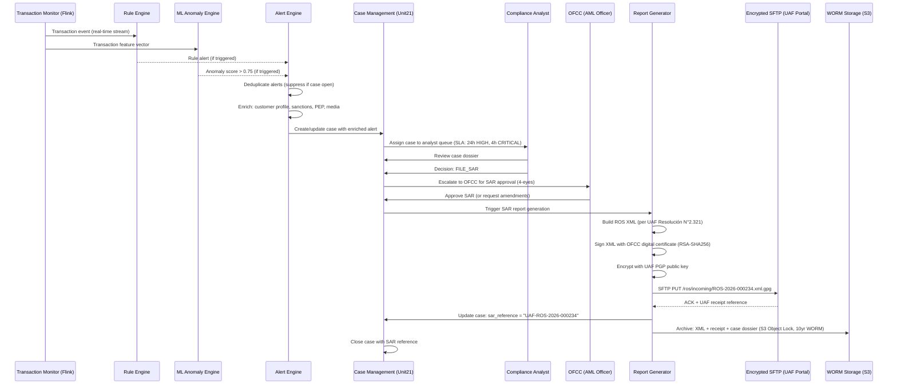

# 09 - AML Platform

## AML Regulatory Framework (Chile)

### UAF (Unidad de Análisis Financiero)

The UAF is Chile's financial intelligence unit, established under **Ley N°19.913** (2004), substantially amended by **Ley N°20.818** (2015) and **Ley N°21.459** (2022, which extended AML obligations to virtual asset service providers).

**Core legal instruments:**

| Instrument | Content |
|---|---|
| Ley N°19.913 | Establishes the UAF; defines reporting entities; mandates suspicious activity reporting; anti-money laundering; terrorism financing |
| Ley N°21.459 (2022) | Extends reporting obligations to VASPs; updated predicate offenses; higher penalties |
| Circular UAF N°049 | Customer identification and due diligence requirements for reporting entities |
| Circular UAF N°057 | Technical specifications for electronic submission of ROS and RTE reports |
| Resolución Exenta UAF N°2.321 | Technical format for ROS XML submissions |

**Reporting entities (entidades informantes) include:**
- Bancos e instituciones financieras (CMF regulated)
- Emisores de tarjetas de crédito y débito
- Empresas de factoring and leasing
- Fintechs with CMF license under Ley N°21.521 (Ley Fintech, 2023)

**Mandatory reports:**

1. **ROS (Reporte de Operaciones Sospechosas):** Filed when a reporting entity has reasonable grounds to suspect that funds derive from criminal activity. No monetary threshold. Filed via UAF's secure XML portal within 48 hours of determination.

2. **RTE (Reporte de Transacciones en Efectivo):** Mandatory for any single cash transaction (or series of related cash transactions within 24h) exceeding the equivalent of USD 10,000. Monthly consolidated report for all transactions exceeding USD 10,000. Note: threshold applies to cash (efectivo); electronic transfers have no automatic RTE threshold but feed into transaction monitoring.

3. **Reporte de Operaciones Sistemáticas:** Monthly statistical report of all transactions exceeding USD 10,000 equivalent (including electronic), submitted in batch XML format.

**Filing deadlines:**
- ROS: within 48 hours of the determination that a transaction is suspicious
- RTE: monthly, within the first 10 business days of the following month
- Reporte Sistemático: monthly, same deadline as RTE

---

### CMF AML Requirements

**Circular N°3.459 (2013, updated 2021):** AML compliance program requirements for banks and financial institutions:

- **Designated AML Compliance Officer (Oficial de Cumplimiento para la Prevención del Lavado de Activos - OFCC):** Must be a senior officer with direct board access; cannot hold operational roles that create conflicts of interest; credentials and appointment must be notified to CMF within 10 days of designation
- **Annual AML Risk Assessment:** Enterprise-wide assessment of ML/TF risks; documented methodology; reviewed and approved by the board
- **Staff Training:** Annual mandatory AML training for all staff; enhanced training for customer-facing and compliance roles; training records maintained for 5 years
- **Board-Level AML Oversight:** Quarterly AML report to board; board responsible for approval of AML policy and annual risk assessment
- **Internal Audit:** Annual independent AML audit; findings reported to audit committee

---

## Transaction Monitoring System

### Architecture Overview

```
                    ┌────────────────────────────────────────────┐
                    │          Transaction Event Bus (Kafka)      │
                    │  Topic: transactions.raw                    │
                    └──────────────────┬─────────────────────────┘
                                       │
                    ┌──────────────────▼─────────────────────────┐
                    │      TM Enrichment Service (Flink)          │
                    │  - Customer profile enrichment              │
                    │  - Historical velocity features             │
                    │  - Counterparty metadata                    │
                    └──────────────────┬─────────────────────────┘
                                       │
                         ┌─────────────┴────────────┐
                         │                          │
          ┌──────────────▼──────┐    ┌──────────────▼──────────┐
          │  Rule Engine        │    │  ML Anomaly Engine       │
          │  (Drools / custom)  │    │  (Isolation Forest +     │
          │  20+ AML rules      │    │   LSTM sequence model)   │
          └──────────┬──────────┘    └──────────────┬──────────┘
                     │                              │
                     └──────────────┬───────────────┘
                                    │
                    ┌───────────────▼────────────────────────────┐
                    │          Alert Engine                       │
                    │  - Deduplication (suppress duplicate alerts)│
                    │  - Priority scoring                         │
                    │  - Alert enrichment (sanctions, PEP, media) │
                    └───────────────┬────────────────────────────┘
                                    │
                    ┌───────────────▼────────────────────────────┐
                    │       Case Management System               │
                    │  (Unit21 or internal)                      │
                    │  - Analyst queue                           │
                    │  - SAR decision workflow                   │
                    │  - UAF submission pipeline                 │
                    └────────────────────────────────────────────┘
```

---

### Rule-Based Detection Engine

All rules are implemented as event-driven triggers evaluated at transaction time and in scheduled batch windows. Each rule produces an alert with a severity level (LOW / MEDIUM / HIGH / CRITICAL) and a rule code.

```sql
-- Rule evaluation table structure
CREATE TABLE aml_rule_alerts (
    alert_id          UUID PRIMARY KEY DEFAULT gen_random_uuid(),
    rule_code         VARCHAR(50) NOT NULL,
    severity          VARCHAR(10) NOT NULL CHECK (severity IN ('LOW','MEDIUM','HIGH','CRITICAL')),
    customer_id       UUID NOT NULL REFERENCES customers(customer_id),
    transaction_id    UUID REFERENCES transactions(transaction_id),
    alert_timestamp   TIMESTAMPTZ NOT NULL DEFAULT NOW(),
    rule_metadata     JSONB,
    status            VARCHAR(20) NOT NULL DEFAULT 'OPEN'
                      CHECK (status IN ('OPEN','IN_REVIEW','CLOSED_SAR','CLOSED_FALSE_POSITIVE','ESCALATED')),
    analyst_id        UUID REFERENCES users(user_id),
    resolved_at       TIMESTAMPTZ,
    sar_reference     VARCHAR(50)  -- UAF ROS reference number if filed
);

-- Index for analyst queue performance
CREATE INDEX idx_aml_alerts_status_severity ON aml_rule_alerts(status, severity, alert_timestamp DESC);
CREATE INDEX idx_aml_alerts_customer ON aml_rule_alerts(customer_id, alert_timestamp DESC);
```

**Complete rule definitions (20 rules):**

```python
from dataclasses import dataclass
from datetime import datetime, timedelta
from typing import Optional
import decimal

@dataclass
class Transaction:
    transaction_id: str
    customer_id: str
    amount_clp: decimal.Decimal
    amount_usd: decimal.Decimal
    currency: str
    transaction_type: str  # CASH_DEPOSIT, CASH_WITHDRAWAL, TRANSFER_OUT, TRANSFER_IN, CARD
    timestamp: datetime
    counterparty_account: Optional[str]
    counterparty_country: str
    merchant_category_code: Optional[str]
    channel: str  # ATM, BRANCH, MOBILE, WEB
    is_cash: bool

@dataclass
class AMLAlert:
    rule_code: str
    severity: str
    customer_id: str
    transaction_id: Optional[str]
    metadata: dict

# ─────────────────────────────────────────────────────────────────────────────
# RULE 1: CASH_THRESHOLD_REPORTING
# Trigger: single cash transaction exceeds CLP 5,000,000 (~USD 5,500)
# Basis: UAF RTE threshold; internal early-warning below USD 10K
# ─────────────────────────────────────────────────────────────────────────────
def rule_cash_threshold(tx: Transaction) -> Optional[AMLAlert]:
    if tx.is_cash and tx.amount_clp >= 5_000_000:
        severity = "CRITICAL" if tx.amount_clp >= 9_000_000 else "HIGH"
        return AMLAlert("CASH_THRESHOLD_REPORTING", severity, tx.customer_id,
                        tx.transaction_id, {"amount_clp": str(tx.amount_clp)})
    return None

# ─────────────────────────────────────────────────────────────────────────────
# RULE 2: STRUCTURING (Smurfing)
# Trigger: 3+ cash transactions within 24h, each below CLP 5M, summing to >CLP 5M
# Basis: Classic structuring pattern to evade threshold reporting
# ─────────────────────────────────────────────────────────────────────────────
def rule_structuring(customer_id: str, recent_cash_txs: list[Transaction]) -> Optional[AMLAlert]:
    window = [t for t in recent_cash_txs
              if t.is_cash and t.amount_clp < 5_000_000
              and t.timestamp > datetime.utcnow() - timedelta(hours=24)]
    if len(window) >= 3:
        total = sum(t.amount_clp for t in window)
        if total > 5_000_000:
            return AMLAlert("STRUCTURING", "CRITICAL", customer_id, None,
                            {"transaction_count": len(window), "total_clp": str(total)})
    return None

# ─────────────────────────────────────────────────────────────────────────────
# RULE 3: RAPID_MOVEMENT (Layering indicator)
# Trigger: funds received then >80% transferred out within 24h
# ─────────────────────────────────────────────────────────────────────────────
def rule_rapid_movement(customer_id: str, inflows: list, outflows: list) -> Optional[AMLAlert]:
    window_start = datetime.utcnow() - timedelta(hours=24)
    in_24h  = sum(t.amount_clp for t in inflows  if t.timestamp > window_start)
    out_24h = sum(t.amount_clp for t in outflows if t.timestamp > window_start)
    if in_24h > 1_000_000 and out_24h > 0:
        ratio = float(out_24h / in_24h)
        if ratio >= 0.80:
            return AMLAlert("RAPID_MOVEMENT", "HIGH", customer_id, None,
                            {"inflow_clp": str(in_24h), "outflow_clp": str(out_24h),
                             "ratio": ratio})
    return None

# ─────────────────────────────────────────────────────────────────────────────
# RULE 4: HIGH_VALUE_NEW_ACCOUNT
# Trigger: transaction >CLP 10M within 30 days of account opening
# ─────────────────────────────────────────────────────────────────────────────
def rule_high_value_new_account(tx: Transaction, account_opened_date: datetime) -> Optional[AMLAlert]:
    account_age_days = (tx.timestamp - account_opened_date).days
    if account_age_days <= 30 and tx.amount_clp > 10_000_000:
        return AMLAlert("HIGH_VALUE_NEW_ACCOUNT", "HIGH", tx.customer_id,
                        tx.transaction_id,
                        {"account_age_days": account_age_days, "amount_clp": str(tx.amount_clp)})
    return None

# ─────────────────────────────────────────────────────────────────────────────
# RULE 5: INTERNATIONAL_HIGH_RISK
# Trigger: transfer to/from FATF blacklist or greylist country
# Source: FATF Public Statement (updated quarterly)
# ─────────────────────────────────────────────────────────────────────────────
FATF_BLACKLIST = {"KP", "IR", "MM"}  # North Korea, Iran, Myanmar
FATF_GREYLIST  = {"SY", "YE", "PK", "SD", "SS", "HT", "LA", "VU", "TZ", "ML",
                   "BF", "CF", "CD", "MZ", "NG", "SN", "GA", "KM", "RU"}

def rule_international_high_risk(tx: Transaction) -> Optional[AMLAlert]:
    country = tx.counterparty_country
    if country in FATF_BLACKLIST:
        return AMLAlert("INTERNATIONAL_HIGH_RISK", "CRITICAL", tx.customer_id,
                        tx.transaction_id, {"country": country, "fatf_list": "BLACKLIST"})
    if country in FATF_GREYLIST and tx.amount_clp > 500_000:
        return AMLAlert("INTERNATIONAL_HIGH_RISK", "HIGH", tx.customer_id,
                        tx.transaction_id, {"country": country, "fatf_list": "GREYLIST"})
    return None

# ─────────────────────────────────────────────────────────────────────────────
# RULE 6: PEP_TRANSACTION
# Trigger: any transaction involving a confirmed PEP exceeding CLP 1,000,000
# ─────────────────────────────────────────────────────────────────────────────
def rule_pep_transaction(tx: Transaction, is_pep: bool, pep_confidence: float) -> Optional[AMLAlert]:
    if is_pep and pep_confidence >= 0.90 and tx.amount_clp > 1_000_000:
        return AMLAlert("PEP_TRANSACTION", "HIGH", tx.customer_id,
                        tx.transaction_id,
                        {"amount_clp": str(tx.amount_clp), "pep_confidence": pep_confidence})
    return None

# ─────────────────────────────────────────────────────────────────────────────
# RULE 7: ROUND_NUMBER
# Trigger: 3+ transactions with round amounts (multiples of 500K CLP) within 48h
# ─────────────────────────────────────────────────────────────────────────────
def rule_round_number(customer_id: str, recent_txs: list[Transaction]) -> Optional[AMLAlert]:
    window = [t for t in recent_txs
              if t.timestamp > datetime.utcnow() - timedelta(hours=48)]
    round_txs = [t for t in window
                 if t.amount_clp >= 500_000 and t.amount_clp % 500_000 == 0]
    if len(round_txs) >= 3:
        return AMLAlert("ROUND_NUMBER", "MEDIUM", customer_id, None,
                        {"round_transaction_count": len(round_txs)})
    return None

# ─────────────────────────────────────────────────────────────────────────────
# RULE 8: VELOCITY_DAILY
# Trigger: >20 transactions in a single calendar day
# ─────────────────────────────────────────────────────────────────────────────
def rule_velocity_daily(customer_id: str, today_txs: list[Transaction]) -> Optional[AMLAlert]:
    if len(today_txs) > 20:
        return AMLAlert("VELOCITY_DAILY", "MEDIUM", customer_id, None,
                        {"transaction_count": len(today_txs)})
    return None

# ─────────────────────────────────────────────────────────────────────────────
# RULE 9: GEOGRAPHIC_ANOMALY
# Trigger: transaction originating from a country with no travel history
# ─────────────────────────────────────────────────────────────────────────────
def rule_geographic_anomaly(tx: Transaction, customer_known_countries: set[str]) -> Optional[AMLAlert]:
    if tx.counterparty_country not in customer_known_countries and \
       tx.counterparty_country not in {"CL"}:  # Exclude Chile as home country
        return AMLAlert("GEOGRAPHIC_ANOMALY", "MEDIUM", tx.customer_id,
                        tx.transaction_id,
                        {"country": tx.counterparty_country,
                         "known_countries": list(customer_known_countries)})
    return None

# ─────────────────────────────────────────────────────────────────────────────
# RULE 10: UNUSUAL_HOURS
# Trigger: transaction at 02:00–05:00 local time with amount >CLP 2,000,000
# ─────────────────────────────────────────────────────────────────────────────
def rule_unusual_hours(tx: Transaction) -> Optional[AMLAlert]:
    local_hour = tx.timestamp.hour  # Assumes TX timestamp stored in Chile local time
    if 2 <= local_hour < 5 and tx.amount_clp > 2_000_000:
        return AMLAlert("UNUSUAL_HOURS", "LOW", tx.customer_id,
                        tx.transaction_id,
                        {"hour": local_hour, "amount_clp": str(tx.amount_clp)})
    return None

# ─────────────────────────────────────────────────────────────────────────────
# RULE 11: NEW_COUNTERPARTY_HIGH_VALUE
# Trigger: first-time recipient receiving >CLP 5,000,000
# ─────────────────────────────────────────────────────────────────────────────
def rule_new_counterparty_high_value(tx: Transaction, is_new_counterparty: bool) -> Optional[AMLAlert]:
    if is_new_counterparty and tx.amount_clp > 5_000_000:
        return AMLAlert("NEW_COUNTERPARTY_HIGH_VALUE", "HIGH", tx.customer_id,
                        tx.transaction_id,
                        {"counterparty": tx.counterparty_account,
                         "amount_clp": str(tx.amount_clp)})
    return None

# ─────────────────────────────────────────────────────────────────────────────
# RULE 12: MERCHANT_CATEGORY_MISMATCH
# Trigger: spend at MCC inconsistent with customer's spending profile
# Example: customer with no gambling history transacts at MCC 7995 (Betting)
# ─────────────────────────────────────────────────────────────────────────────
HIGH_RISK_MCCS = {
    "7995": "Betting/Casino",
    "6051": "Non-financial institutions (currency exchange)",
    "6099": "Money transfer, non-financial",
    "7012": "Timeshares",
    "5933": "Pawn shops",
}

def rule_mcc_mismatch(tx: Transaction, customer_mcc_history: set[str]) -> Optional[AMLAlert]:
    mcc = tx.merchant_category_code
    if mcc in HIGH_RISK_MCCS and mcc not in customer_mcc_history:
        return AMLAlert("MERCHANT_CATEGORY_MISMATCH", "MEDIUM", tx.customer_id,
                        tx.transaction_id,
                        {"mcc": mcc, "mcc_description": HIGH_RISK_MCCS[mcc]})
    return None

# ─────────────────────────────────────────────────────────────────────────────
# RULE 13: LAYERING_DETECTION
# Trigger: 3+ intermediate hops detected in network graph within 72h
# Requires: graph analysis on transaction network
# ─────────────────────────────────────────────────────────────────────────────
def rule_layering(customer_id: str, hop_count: int, time_window_hours: int) -> Optional[AMLAlert]:
    if hop_count >= 3 and time_window_hours <= 72:
        return AMLAlert("LAYERING_DETECTION", "HIGH", customer_id, None,
                        {"hop_count": hop_count, "window_hours": time_window_hours})
    return None

# ─────────────────────────────────────────────────────────────────────────────
# RULE 14: DORMANT_ACCOUNT_ACTIVATION
# Trigger: account dormant >180 days suddenly receives/sends >CLP 3,000,000
# ─────────────────────────────────────────────────────────────────────────────
def rule_dormant_activation(tx: Transaction, last_transaction_date: datetime) -> Optional[AMLAlert]:
    dormancy_days = (tx.timestamp - last_transaction_date).days
    if dormancy_days > 180 and tx.amount_clp > 3_000_000:
        return AMLAlert("DORMANT_ACCOUNT_ACTIVATION", "HIGH", tx.customer_id,
                        tx.transaction_id,
                        {"dormancy_days": dormancy_days, "amount_clp": str(tx.amount_clp)})
    return None

# ─────────────────────────────────────────────────────────────────────────────
# RULE 15: SANCTIONS_MATCH (real-time)
# Trigger: counterparty name/account matches OFAC/UN/EU/UAF sanctions list
# ─────────────────────────────────────────────────────────────────────────────
def rule_sanctions_match(tx: Transaction, match_score: float, list_name: str) -> Optional[AMLAlert]:
    if match_score >= 0.95:
        severity = "CRITICAL"
    elif match_score >= 0.85:
        severity = "HIGH"
    else:
        return None
    return AMLAlert("SANCTIONS_MATCH", severity, tx.customer_id,
                    tx.transaction_id,
                    {"match_score": match_score, "sanctions_list": list_name})

# ─────────────────────────────────────────────────────────────────────────────
# RULE 16: INTERNATIONAL_CASH_COMBO
# Trigger: cash deposit followed by same-day international wire
# ─────────────────────────────────────────────────────────────────────────────
def rule_intl_cash_combo(customer_id: str, same_day_cash_in: decimal.Decimal,
                          same_day_intl_out: decimal.Decimal) -> Optional[AMLAlert]:
    if same_day_cash_in > 1_000_000 and same_day_intl_out > same_day_cash_in * 0.7:
        return AMLAlert("INTERNATIONAL_CASH_COMBO", "HIGH", customer_id, None,
                        {"cash_in_clp": str(same_day_cash_in),
                         "intl_out_clp": str(same_day_intl_out)})
    return None

# ─────────────────────────────────────────────────────────────────────────────
# RULE 17: MULTIPLE_SENDERS_CONSOLIDATION
# Trigger: >5 unique senders sending to same customer within 24h (mule indicator)
# ─────────────────────────────────────────────────────────────────────────────
def rule_multiple_senders(customer_id: str, unique_senders_24h: int,
                           total_received_clp: decimal.Decimal) -> Optional[AMLAlert]:
    if unique_senders_24h > 5 and total_received_clp > 2_000_000:
        return AMLAlert("MULTIPLE_SENDERS_CONSOLIDATION", "HIGH", customer_id, None,
                        {"unique_senders": unique_senders_24h,
                         "total_clp": str(total_received_clp)})
    return None

# ─────────────────────────────────────────────────────────────────────────────
# RULE 18: SALARY_INCONSISTENCY
# Trigger: declared salary on KYC is CLP 1.5M/month; actual inflows are 5x+ that
# ─────────────────────────────────────────────────────────────────────────────
def rule_salary_inconsistency(customer_id: str, declared_monthly_income_clp: decimal.Decimal,
                               actual_monthly_inflow_clp: decimal.Decimal) -> Optional[AMLAlert]:
    if declared_monthly_income_clp > 0:
        ratio = float(actual_monthly_inflow_clp / declared_monthly_income_clp)
        if ratio >= 5.0:
            return AMLAlert("SALARY_INCONSISTENCY", "MEDIUM", customer_id, None,
                            {"declared_clp": str(declared_monthly_income_clp),
                             "actual_clp": str(actual_monthly_inflow_clp),
                             "ratio": ratio})
    return None

# ─────────────────────────────────────────────────────────────────────────────
# RULE 19: OFFSHORE_SHELL_INDICATOR
# Trigger: wire to/from known offshore jurisdiction + amount >CLP 10M
# Jurisdictions: Panama, BVI, Cayman Islands, Seychelles, Isle of Man
# ─────────────────────────────────────────────────────────────────────────────
OFFSHORE_JURISDICTIONS = {"PA", "VG", "KY", "SC", "IM", "BZ", "WS", "MH"}

def rule_offshore_shell(tx: Transaction) -> Optional[AMLAlert]:
    if tx.counterparty_country in OFFSHORE_JURISDICTIONS and tx.amount_clp > 10_000_000:
        return AMLAlert("OFFSHORE_SHELL_INDICATOR", "HIGH", tx.customer_id,
                        tx.transaction_id,
                        {"country": tx.counterparty_country,
                         "amount_clp": str(tx.amount_clp)})
    return None

# ─────────────────────────────────────────────────────────────────────────────
# RULE 20: NEGATIVE_NEWS_SPIKE
# Trigger: customer has 3+ new adverse media articles in last 7 days
# + any financial transaction over CLP 500K
# ─────────────────────────────────────────────────────────────────────────────
def rule_negative_news_spike(tx: Transaction, recent_adverse_media_count: int) -> Optional[AMLAlert]:
    if recent_adverse_media_count >= 3 and tx.amount_clp > 500_000:
        return AMLAlert("NEGATIVE_NEWS_SPIKE", "MEDIUM", tx.customer_id,
                        tx.transaction_id,
                        {"media_hits_7d": recent_adverse_media_count,
                         "amount_clp": str(tx.amount_clp)})
    return None
```

---

### ML-Based Anomaly Detection

#### Model Architecture: Isolation Forest + LSTM Sequence Model

```python
"""
AML ML Anomaly Detection Pipeline
Two complementary models:
  1. Isolation Forest: unsupervised anomaly detection for point anomalies
  2. LSTM Autoencoder: sequence-level anomaly detection (behavioral patterns)
"""
import numpy as np
from sklearn.ensemble import IsolationForest
from sklearn.preprocessing import StandardScaler
import torch
import torch.nn as nn

# ─────────────────────────────────────────────────────────────────────────────
# FEATURE ENGINEERING
# ─────────────────────────────────────────────────────────────────────────────
def extract_aml_features(customer_id: str, transaction: dict,
                          feature_store: dict) -> np.ndarray:
    """
    Extract feature vector for AML anomaly scoring.
    All features normalized to [0,1] or z-scored before model input.
    """
    fs = feature_store  # Pre-computed from Redis/Cassandra

    features = np.array([
        # Transaction-level features
        transaction["amount_usd"],                          # Raw amount (log-transformed)
        np.log1p(transaction["amount_usd"]),               # Log amount
        transaction["hour_of_day"] / 24.0,                 # Normalized hour
        transaction["day_of_week"] / 7.0,                  # Normalized DOW
        float(transaction["is_cash"]),
        float(transaction["is_international"]),

        # Velocity features (from feature store)
        fs.get("tx_count_1h", 0),
        fs.get("tx_count_24h", 0),
        fs.get("tx_count_7d", 0),
        fs.get("amount_sum_24h_usd", 0),
        fs.get("amount_sum_7d_usd", 0),
        fs.get("unique_counterparties_7d", 0),
        fs.get("unique_countries_30d", 0),

        # Behavioral features
        fs.get("amount_z_score_vs_90d", 0),               # Z-score vs customer baseline
        fs.get("hour_anomaly_score", 0),                  # How unusual is this hour for customer
        fs.get("counterparty_novelty_score", 0),          # 0=known, 1=first-time
        fs.get("channel_switch_indicator", 0),            # Changed channel recently

        # Customer risk profile features
        fs.get("kyc_risk_score", 0.5) / 100.0,           # Normalized to [0,1]
        float(fs.get("is_pep", False)),
        fs.get("account_age_days", 0) / 3650.0,          # Normalized, cap at 10 years
        fs.get("avg_monthly_inflow_usd", 0),
        fs.get("income_consistency_score", 1.0),          # 1=consistent, 0=erratic

        # Network features
        fs.get("network_centrality_score", 0),            # Graph centrality in tx network
        fs.get("mule_network_proximity", 0),              # Distance to known mule accounts
    ])

    return features

# ─────────────────────────────────────────────────────────────────────────────
# MODEL 1: ISOLATION FOREST (Point Anomaly Detection)
# ─────────────────────────────────────────────────────────────────────────────
class AMLIsolationForest:
    """
    Isolation Forest for detecting anomalous individual transactions.
    Trained monthly on 12 months of clean transaction data.
    Contamination parameter tuned to match expected 0.1-0.5% fraud rate.
    """
    def __init__(self):
        self.model = IsolationForest(
            n_estimators=300,          # Number of isolation trees
            max_samples="auto",        # Auto-scale with dataset size
            contamination=0.003,       # Expected anomaly rate: 0.3%
            max_features=0.8,          # Feature subsampling per tree
            bootstrap=False,
            random_state=42,
            n_jobs=-1
        )
        self.scaler = StandardScaler()
        self.feature_names = []

    def train(self, X_train: np.ndarray) -> None:
        X_scaled = self.scaler.fit_transform(X_train)
        self.model.fit(X_scaled)

    def score(self, features: np.ndarray) -> float:
        """
        Returns anomaly score in [0, 1].
        Isolation Forest native output: -1 (anomaly) to 1 (normal).
        We transform to [0,1] where 1 = highly anomalous.
        """
        X_scaled = self.scaler.transform(features.reshape(1, -1))
        raw_score = self.model.score_samples(X_scaled)[0]  # Raw: negative = anomalous
        # Transform: map [-0.5, 0] range to [0, 1]
        # Typical IF scores: clean data ~(-0.1), anomalies ~(-0.4 to -0.6)
        normalized = max(0.0, min(1.0, (-raw_score - 0.1) / 0.4))
        return normalized

# ─────────────────────────────────────────────────────────────────────────────
# MODEL 2: LSTM AUTOENCODER (Sequence Anomaly Detection)
# Detects anomalous behavioral sequences (e.g., unusual transaction patterns
# over 30-day window that individually look normal but collectively suspicious)
# ─────────────────────────────────────────────────────────────────────────────
class LSTMAutoencoder(nn.Module):
    """
    LSTM Autoencoder for sequence-level AML anomaly detection.
    Input: sequence of last 30 transactions (or padding) as feature vectors.
    Output: reconstruction error; high error = anomalous sequence.
    """
    def __init__(self, input_dim: int = 24, hidden_dim: int = 64,
                 latent_dim: int = 16, sequence_len: int = 30):
        super().__init__()
        self.sequence_len = sequence_len
        self.hidden_dim = hidden_dim

        # Encoder
        self.encoder_lstm = nn.LSTM(
            input_size=input_dim,
            hidden_size=hidden_dim,
            num_layers=2,
            batch_first=True,
            dropout=0.2
        )
        self.encoder_fc = nn.Linear(hidden_dim, latent_dim)

        # Decoder
        self.decoder_fc = nn.Linear(latent_dim, hidden_dim)
        self.decoder_lstm = nn.LSTM(
            input_size=latent_dim,
            hidden_size=hidden_dim,
            num_layers=2,
            batch_first=True,
            dropout=0.2
        )
        self.output_fc = nn.Linear(hidden_dim, input_dim)

    def encode(self, x: torch.Tensor) -> torch.Tensor:
        _, (hidden, _) = self.encoder_lstm(x)
        return self.encoder_fc(hidden[-1])  # Bottleneck

    def decode(self, z: torch.Tensor, seq_len: int) -> torch.Tensor:
        z_expanded = z.unsqueeze(1).repeat(1, seq_len, 1)
        h0 = self.decoder_fc(z).unsqueeze(0).repeat(2, 1, 1)
        out, _ = self.decoder_lstm(z_expanded, (h0, torch.zeros_like(h0)))
        return self.output_fc(out)

    def forward(self, x: torch.Tensor) -> tuple[torch.Tensor, torch.Tensor]:
        z = self.encode(x)
        x_recon = self.decode(z, x.size(1))
        return x_recon, z

    def anomaly_score(self, x: torch.Tensor) -> float:
        """Reconstruction error as anomaly score."""
        with torch.no_grad():
            x_recon, _ = self.forward(x)
            mse = torch.mean((x - x_recon) ** 2).item()
        # Threshold calibrated on validation set: >0.05 MSE = anomalous
        return min(1.0, mse / 0.05)

# ─────────────────────────────────────────────────────────────────────────────
# COMBINED SCORING
# ─────────────────────────────────────────────────────────────────────────────
def compute_aml_ml_score(if_score: float, lstm_score: float,
                          rule_alert_count: int) -> float:
    """
    Combine Isolation Forest score, LSTM sequence score, and rule alert count
    into a single AML ML risk score [0, 1].
    Alert threshold for case generation: > 0.75
    """
    combined = (
        if_score   * 0.45 +   # Point anomaly
        lstm_score * 0.40 +   # Sequence anomaly
        min(rule_alert_count / 5.0, 1.0) * 0.15  # Rule signal boost, cap at 5 alerts
    )
    return min(1.0, combined)

# Training schedule: monthly full retrain on 12-month rolling window
# Model versioning: MLflow with champion/challenger framework
# A/B testing: 10% traffic on challenger model for 2 weeks before promotion
# Performance metrics tracked: precision@K, recall, AUC-ROC, false positive rate
```

#### Model Performance Targets

| Metric | Target | Review Trigger |
|---|---|---|
| AUC-ROC | > 0.92 | < 0.88 triggers champion rollback |
| Precision (at threshold 0.75) | > 0.65 | < 0.50 triggers review |
| Recall (SAR cases) | > 0.85 | < 0.80 triggers review |
| False positive rate | < 15% | > 25% triggers threshold review |
| Alert volume (daily) | < 500 per 100K customers | Tuned quarterly |

---

## Case Management Workflow

```sql
-- Case management tables
CREATE TABLE aml_cases (
    case_id              UUID PRIMARY KEY DEFAULT gen_random_uuid(),
    case_reference       VARCHAR(30) UNIQUE NOT NULL, -- e.g., AML-2026-001234
    customer_id          UUID NOT NULL REFERENCES customers(customer_id),
    created_at           TIMESTAMPTZ NOT NULL DEFAULT NOW(),
    priority             VARCHAR(10) NOT NULL CHECK (priority IN ('LOW','MEDIUM','HIGH','CRITICAL')),
    status               VARCHAR(30) NOT NULL DEFAULT 'OPEN'
                         CHECK (status IN ('OPEN','IN_REVIEW','PENDING_INFO',
                                           'ESCALATED','SAR_FILED','CLOSED_FALSE_POSITIVE',
                                           'CLOSED_NO_ACTION','CLOSED_INTERNAL_REPORT')),
    assigned_analyst_id  UUID REFERENCES users(user_id),
    assigned_at          TIMESTAMPTZ,
    sla_deadline         TIMESTAMPTZ NOT NULL,  -- Computed based on priority
    sar_filed            BOOLEAN DEFAULT FALSE,
    sar_reference        VARCHAR(50),           -- UAF ROS reference if filed
    sar_filed_at         TIMESTAMPTZ,
    narrative            TEXT,                  -- Analyst's case narrative
    closed_at            TIMESTAMPTZ,
    closed_by            UUID REFERENCES users(user_id),
    -- Immutable audit via triggers
    CONSTRAINT chk_sar_reference CHECK (
        (sar_filed = TRUE AND sar_reference IS NOT NULL) OR sar_filed = FALSE
    )
);

CREATE TABLE case_alerts (
    case_id      UUID REFERENCES aml_cases(case_id),
    alert_id     UUID REFERENCES aml_rule_alerts(alert_id),
    linked_at    TIMESTAMPTZ DEFAULT NOW(),
    PRIMARY KEY (case_id, alert_id)
);

CREATE TABLE case_audit_log (
    log_id       UUID PRIMARY KEY DEFAULT gen_random_uuid(),
    case_id      UUID NOT NULL REFERENCES aml_cases(case_id),
    event_type   VARCHAR(50) NOT NULL,
    event_data   JSONB,
    performed_by UUID REFERENCES users(user_id),
    performed_at TIMESTAMPTZ NOT NULL DEFAULT NOW()
    -- No UPDATE or DELETE allowed on this table (enforced by DB role permissions)
);

-- SLA deadline computation
-- CRITICAL: 4 hours from case creation
-- HIGH:     24 hours
-- MEDIUM:   72 hours
-- LOW:      5 business days
```

### Workflow Steps

```
1. ALERT GENERATION
   ├── Rule engine fires → alert record created in aml_rule_alerts
   └── ML engine score > 0.75 → alert record created

2. ALERT ENRICHMENT (automated, within 30 seconds)
   ├── Fetch customer full profile (KYC tier, risk level, account age)
   ├── Fetch 90-day transaction history
   ├── Fetch last 10 AML cases for this customer
   ├── Re-run sanctions check (ComplyAdvantage real-time)
   ├── Run PEP check (ComplyAdvantage)
   ├── Fetch adverse media (last 30 days)
   └── Compute network graph proximity to known mule accounts

3. TRIAGE (automated scoring)
   ├── Score < 0.40 AND no rule alerts AND customer low-risk → AUTO_CLOSE
   ├── Score > 0.85 OR CRITICAL rule → AUTO_ESCALATE to senior analyst
   └── Otherwise → OPEN case in analyst queue

4. ANALYST REVIEW
   ├── Analyst reviews enriched case dossier
   ├── May request additional information from customer
   ├── May escalate to OFCC (AML Compliance Officer)
   └── Decision: FILE_SAR | CLOSE_FALSE_POSITIVE | CLOSE_NO_ACTION | INTERNAL_REPORT

5. SAR DECISION & FILING
   ├── If SAR: OFCC approves (4-eyes principle)
   ├── Generate ROS XML per UAF Resolución Exenta N°2.321
   ├── Encrypt XML with UAF PGP public key
   ├── Submit via encrypted SFTP to UAF portal (sftp.uaf.cl)
   └── Retain confirmation receipt and case artifact (10 years, WORM storage)

6. CASE ARCHIVAL
   └── All case data, analyst notes, attachments archived to S3 WORM
```

---

## AML Vendor Evaluation

### ComplyAdvantage

| Attribute | Detail |
|---|---|
| Pricing | $2,000–$15,000/month; tiered by API call volume and data modules enabled; enterprise contracts typically $8K–$12K/month for a mid-size fintech at 50K+ screenings/month |
| Sanctions screening | Real-time; 1,000+ global sanctions lists consolidated; 99.9% uptime SLA; < 500ms response time |
| PEP database | 1M+ global PEPs across 240+ jurisdictions; updated daily; includes Chilean public officials, congressional records, judiciary |
| Adverse media | NLP-based monitoring across 100K+ sources; Spanish-language coverage including Chilean media (El Mercurio, La Tercera, Ciper Chile) |
| API | REST; real-time and batch modes; webhook notifications for list updates; sandbox environment |
| False positive tools | Match case management; note system; bulk review; rule-based auto-dismiss |
| Integration | Python SDK, webhook-based alerts, direct Kafka connector available |
| **Recommendation** | **Best for Phase 1: sanctions + PEP + adverse media** |

### Feedzai

| Attribute | Detail |
|---|---|
| Pricing | Transaction-based: ~$0.005–$0.02 per transaction; minimum monthly commit; enterprise pricing from ~$15K/month |
| Model | Proprietary ML; real-time transaction scoring; pre-trained on billions of banking transactions |
| Strengths | Low-latency real-time scoring (< 100ms); explainability (SHAP values); strong case management UI |
| LATAM presence | Growing; has clients in Brazil, Mexico; Chilean regulatory specifics require configuration |
| Integration | REST API; Kafka connector; managed cloud or on-premise deployment |

### Unit21

| Attribute | Detail |
|---|---|
| Pricing | $3,000–$20,000/month depending on transaction volume and features |
| Strengths | Excellent case management UI; no-code rule builder; strong US regulatory coverage; good reporting |
| Weaknesses | Less mature ML vs. Feedzai; Chilean-specific regulatory reporting not pre-built (requires customization) |
| UAF reporting | Requires custom UAF XML template development; not out-of-the-box |

### Sardine

| Attribute | Detail |
|---|---|
| Pricing | $0.01–$0.05 per event; minimum monthly commit ~$5K |
| Strengths | Combines device intelligence + behavioral biometrics + AML in single platform; modern API-first design |
| Weaknesses | Newer platform; LATAM regulatory specifics still developing; smaller client base in Chile |
| Unique capability | Device graph links accounts across devices; excellent for mule network detection |

### Recommended Stack

```
Phase 1–2:
  Sanctions/PEP/Media:    ComplyAdvantage      (~$8K–12K/month)
  Transaction Monitoring: Feedzai              (~$15K–25K/month)
  Case Management:        Unit21               (~$5K–10K/month)
  Total:                  ~$28K–47K/month

Phase 3 (>2M transactions/month, >18 months data):
  Build in-house transaction monitoring engine
  Retain ComplyAdvantage for sanctions/PEP data
  Build proprietary case management on top of Temporal.io workflow engine
  Estimated build cost: $2M–3M; payback at >$40K/month vendor savings
```

---

## UAF Reporting Architecture

### ROS XML Format (per UAF Resolución Exenta N°2.321)

```xml
<?xml version="1.0" encoding="UTF-8"?>
<ROS xmlns="http://www.uaf.cl/schemas/ros/v2.0"
     xmlns:xsi="http://www.w3.org/2001/XMLSchema-instance"
     xsi:schemaLocation="http://www.uaf.cl/schemas/ros/v2.0 ros_v2.xsd">

  <CabeceraROS>
    <!-- Header identifying the reporting entity -->
    <RutEntidad>76123456-7</RutEntidad>
    <NombreEntidad>MaWire Bank SpA</NombreEntidad>
    <CodigoEntidad>BANCO_CMF_0099</CodigoEntidad>
    <FechaCreacion>2026-06-06T14:32:00-04:00</FechaCreacion>
    <NumeroCorrelativo>2026-000234</NumeroCorrelativo>  <!-- Sequential, per UAF instructions -->
    <NombreOficialCumplimiento>María González Pérez</NombreOficialCumplimiento>
    <TelefonoOficialCumplimiento>+56221234567</TelefonoOficialCumplimiento>
    <EmailOficialCumplimiento>ofcc@mawirebank.cl</EmailOficialCumplimiento>
  </CabeceraROS>

  <SujetoObligado>
    <!-- Who is being reported -->
    <TipoPersona>NATURAL</TipoPersona>  <!-- or JURIDICA -->
    <RUT>12345678-9</RUT>
    <Nombres>Juan Carlos</Nombres>
    <ApellidoPaterno>Rodríguez</ApellidoPaterno>
    <ApellidoMaterno>Soto</ApellidoMaterno>
    <FechaNacimiento>1980-03-15</FechaNacimiento>
    <Nacionalidad>CL</Nacionalidad>
    <Actividad>Comerciante</Actividad>
    <Direccion>
      <Calle>Av. Providencia</Calle>
      <Numero>1234</Numero>
      <Ciudad>Santiago</Ciudad>
      <Region>Metropolitana</Region>
      <Pais>CL</Pais>
    </Direccion>
  </SujetoObligado>

  <TransaccionesSospechosas>
    <Transaccion>
      <FechaTransaccion>2026-06-03T23:42:00-04:00</FechaTransaccion>
      <Monto>8500000</Monto>
      <Moneda>CLP</Moneda>
      <TipoTransaccion>DEPOSITO_EFECTIVO</TipoTransaccion>
      <CanalTransaccion>SUCURSAL</CanalTransaccion>
      <CuentaOrigen>
        <NumeroCuenta>001-234567-89</NumeroCuenta>
        <TipoCuenta>CORRIENTE</TipoCuenta>
        <BancoOrigen>MaWire Bank SpA</BancoOrigen>
        <RUTTitular>12345678-9</RUTTitular>
      </CuentaOrigen>
    </Transaccion>
    <Transaccion>
      <FechaTransaccion>2026-06-04T00:15:00-04:00</FechaTransaccion>
      <Monto>8200000</Monto>
      <Moneda>CLP</Moneda>
      <TipoTransaccion>TRANSFERENCIA_SALIDA</TipoTransaccion>
      <CanalTransaccion>BANCA_MOVIL</CanalTransaccion>
      <CuentaOrigen>
        <NumeroCuenta>001-234567-89</NumeroCuenta>
        <TipoCuenta>CORRIENTE</TipoCuenta>
        <BancoOrigen>MaWire Bank SpA</BancoOrigen>
        <RUTTitular>12345678-9</RUTTitular>
      </CuentaOrigen>
      <CuentaDestino>
        <NumeroCuenta>IBAN-PA12345678901234567890</NumeroCuenta>
        <TipoCuenta>INTERNACIONAL</TipoCuenta>
        <Pais>PA</Pais>  <!-- Panama -->
      </CuentaDestino>
    </Transaccion>
  </TransaccionesSospechosas>

  <DescripcionOperacion>
    <!-- Analyst narrative: mandatory, minimum 200 characters -->
    <NarrativaES>
      El cliente realizó un depósito en efectivo de CLP 8.500.000 a las 23:42 del
      03/06/2026, inmediatamente seguido de una transferencia internacional por
      CLP 8.200.000 (96% del monto depositado) a una cuenta en Panamá a las 00:15
      del 04/06/2026. El patrón de depósito en efectivo seguido de transferencia
      inmediata al exterior, combinado con el horario inusual y el destino en
      jurisdicción de alto riesgo, genera sospechas de lavado de activos mediante
      colocación y transferencia internacional.
    </NarrativaES>
    <TipoOperacionSospechosa>LAVADO_ACTIVOS</TipoOperacionSospechosa>
    <SubtipoOperacion>COLOCACION_TRANSFERENCIA_INTERNACIONAL</SubtipoOperacion>
  </DescripcionOperacion>

  <FirmaDigital>
    <!-- Digital signature of OFCC, applied before SFTP submission -->
    <AlgoritmoFirma>RSA-SHA256</AlgoritmoFirma>
    <CertificadoOficialCumplimiento>BASE64_ENCODED_CERT</CertificadoOficialCumplimiento>
    <Firma>BASE64_ENCODED_SIGNATURE</Firma>
  </FirmaDigital>

</ROS>
```

### UAF Integration Architecture and Submission Flow



---

## Sanctions Screening

### Screening Lists Maintained

| List | Publisher | Update Frequency | Integration |
|---|---|---|---|
| OFAC SDN (Specially Designated Nationals) | US Treasury | Daily (real-time delta) | ComplyAdvantage |
| OFAC Non-SDN Consolidated | US Treasury | Daily | ComplyAdvantage |
| UN Security Council Consolidated | United Nations | As published | ComplyAdvantage |
| EU Consolidated Sanctions | European Union | As published | ComplyAdvantage |
| UK HM Treasury | UK Government | As published | ComplyAdvantage |
| UAF Internal List | UAF Chile | Monthly + ad hoc | Direct integration |
| Interpol Notices | Interpol | Weekly | ComplyAdvantage |
| PEP List (global) | ComplyAdvantage | Daily | ComplyAdvantage |

### Fuzzy Matching Algorithm

```python
import jellyfish
import Levenshtein
from typing import Optional

def sanctions_fuzzy_match(query_name: str,
                           candidate_name: str,
                           threshold: float = 0.85) -> tuple[float, bool]:
    """
    Multi-algorithm fuzzy name matching for sanctions screening.
    Returns (match_score, is_match_above_threshold).

    Algorithms combined:
    - Jaro-Winkler: good for names with transpositions/prefixes
    - Levenshtein ratio: edit distance normalized to [0,1]
    - Token sort ratio: handles out-of-order name components

    Standard: FATF guidance on name matching for sanctions compliance.
    """
    # Normalize inputs
    q = query_name.upper().strip()
    c = candidate_name.upper().strip()

    # Exact match shortcut
    if q == c:
        return (1.0, True)

    # Jaro-Winkler distance (handles prefix importance; good for names)
    jw_score = jellyfish.jaro_winkler_similarity(q, c)

    # Levenshtein ratio (normalized edit distance)
    lev_score = Levenshtein.ratio(q, c)

    # Token sort: split names into tokens, sort alphabetically, then compare
    # Handles "Juan Carlos Rodríguez" vs "Rodríguez, Juan Carlos"
    q_tokens = " ".join(sorted(q.split()))
    c_tokens = " ".join(sorted(c.split()))
    token_sort_score = jellyfish.jaro_winkler_similarity(q_tokens, c_tokens)

    # Weighted combination: emphasize Jaro-Winkler for names
    combined_score = (
        jw_score        * 0.40 +
        lev_score       * 0.30 +
        token_sort_score * 0.30
    )

    return (round(combined_score, 4), combined_score >= threshold)

def screen_against_sanctions_list(name: str, dob: Optional[str],
                                   nationality: Optional[str]) -> dict:
    """
    Full sanctions screening result for a name.
    In production, this calls ComplyAdvantage API; shown here for logic illustration.
    """
    # ComplyAdvantage API call (production)
    # POST https://api.complyadvantage.com/searches
    # Body: {search_term: name, filters: {entity_type: "person", date_of_birth: dob}}

    result = {
        "screened_name": name,
        "hits": [],
        "highest_score": 0.0,
        "recommendation": "CLEAR",  # CLEAR | REVIEW | BLOCK
        "screening_timestamp": "2026-06-06T14:32:00Z",
        "lists_checked": ["OFAC_SDN", "UN_CONSOLIDATED", "EU_CONSOLIDATED", "UAF_CL"]
    }

    # Thresholds:
    # >= 0.95: BLOCK (likely true positive; requires 4-eyes review before clearing)
    # 0.85–0.94: REVIEW (probable match; analyst review required)
    # < 0.85: CLEAR (auto-cleared)

    return result
```

### False Positive Management Workflow

```
Match score >= 0.85:
  1. Auto-block transaction (freeze pending clearance)
  2. Create sanctions alert in case management
  3. Alert assigned to two analysts (4-eyes principle)
  4. Analyst 1 reviews: confirm / dismiss
  5. If confirm: Analyst 2 must concur before blocking is maintained
  6. If dismiss (false positive): Analyst 2 must concur before releasing transaction
  7. False positive added to whitelist with note: {name, dob, nationality, reason}
  8. All decisions audit-logged with analyst IDs and timestamps
  9. OFCC notified of all BLOCK confirmations within 2 hours
  10. If confirmed sanctions match: freeze account + file ROS to UAF within 48h

SLA:
  CRITICAL (score >= 0.95): 4-hour review SLA
  HIGH (score 0.85–0.94):   24-hour review SLA
  MEDIUM (score 0.75–0.84): 72-hour review SLA (lower confidence hits)

Monthly metrics reported to OFCC:
  - Total screenings performed
  - Total hits by list
  - False positive rate by list
  - Average review time
  - Confirmed sanctions matches
```
