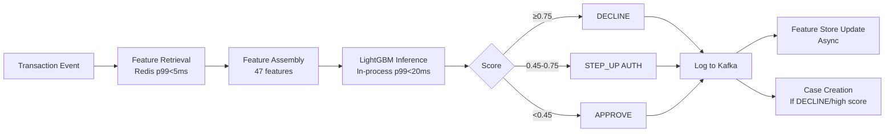

# 10 — Fraud Detection Platform

## Architecture Overview

MaWire Bank's fraud platform operates across three time horizons:
- **Real-time** (<150ms): authorization-time scoring for every card and payment transaction
- **Near-real-time** (<5 min): streaming behavioral analytics, account takeover detection
- **Batch** (hourly/daily): model retraining, pattern analysis, network fraud detection

The fraud-service is Python (FastAPI + Celery), runs on dedicated high-memory nodes (`r6i.4xlarge`), and integrates with Redis for feature serving and Apache Flink for streaming feature computation.

---

## Fraud Typology & Mitigation Matrix

| Fraud Type | Detection Method | Response |
|---|---|---|
| Account Takeover (ATO) | Behavioral biometrics + new device signal | Step-up auth, freeze if high confidence |
| Card Not Present (CNP) | ML model + velocity rules | Decline or OTP challenge |
| Synthetic Identity | KYC anomaly score + bureau check | Manual review during onboarding |
| Friendly Fraud | Chargeback pattern model | Require evidence, flag repeat offenders |
| Money Mule | Network graph anomaly | AML alert + account freeze |
| SIM Swap | Carrier API real-time check | Block SMS OTP, require app auth |
| APP Fraud (push payment) | Recipient novelty + amount spike | Confirmation delay + warning |
| ATM Cash-Out | Velocity + geo anomaly | Daily limit enforcement, alert |

---

## Layer 1: Device Intelligence

### Device Fingerprinting

Collected at app launch and each session start (SDK embedded in Flutter app):

```dart
// Flutter device fingerprint collection
final fingerprint = DeviceFingerprint(
  deviceId: await DeviceInfo.getDeviceId(),        // persisted UUID
  osVersion: deviceInfo.systemVersion,
  screenResolution: '${window.physicalSize}',
  timezone: DateTime.now().timeZoneName,
  locale: Platform.localeName,
  isEmulator: await DeviceInfo.isEmulator(),
  isRooted: await RootDetection.isRooted(),        // jailbreak/root
  hasVPN: await NetworkInfo.hasVpnActive(),
  installedApps: await SuspiciousApps.scan(),      // known overlay apps
  biometricStrength: await BiometricAuth.getStrength(),
);
```

### Device Risk Score Algorithm

```python
def compute_device_risk(device: DeviceFingerprint, customer_id: str) -> float:
    score = 0.0
    
    # Known device check (Redis lookup)
    known_devices = redis.smembers(f"known_devices:{customer_id}")
    if device.device_id not in known_devices:
        score += 0.35  # new device is significant risk signal
    
    # Emulator/root detection
    if device.is_emulator:
        score += 0.40
    if device.is_rooted:
        score += 0.25
    
    # VPN usage (not inherently bad, but signal)
    if device.has_vpn:
        score += 0.10
    
    # Suspicious overlay apps installed
    score += min(len(device.suspicious_apps) * 0.15, 0.30)
    
    # Device reputation database (ThreatMetrix)
    rep_score = threatmetrix.get_device_reputation(device.device_id)
    score += rep_score * 0.40
    
    return min(score, 1.0)
```

### Behavioral Biometrics (BioCatch integration)

Collected passively during app session:
- Touch pressure patterns (iOS 3D Touch, Android pressure API)
- Swipe velocity and curvature
- Tap timing patterns
- Device handling angle (gyroscope/accelerometer)
- Typing rhythm on numeric keypad

BioCatch returns a session risk score (0-100) updated every 30 seconds. Score > 70 triggers step-up authentication silently.

---

## Layer 2: Rules Engine

The rules engine runs in-process in `fraud-service` on every transaction. All rules evaluate in parallel; the worst result wins.

```python
from dataclasses import dataclass
from enum import Enum
from typing import Optional
import redis

class RuleDecision(Enum):
    APPROVE = "APPROVE"
    STEP_UP = "STEP_UP"    # require additional auth
    DECLINE = "DECLINE"
    REVIEW  = "REVIEW"     # async analyst review

@dataclass
class RuleResult:
    rule_id: str
    decision: RuleDecision
    score_adjustment: float
    reason: str

class FraudRulesEngine:
    def __init__(self, redis_client: redis.Redis):
        self.redis = redis_client

    def evaluate(self, tx: Transaction, ctx: CustomerContext) -> list[RuleResult]:
        results = []

        # R001: Card velocity — >5 card transactions in 60 minutes
        tx_count_1h = self.redis.get(f"velocity:{ctx.customer_id}:card:1h") or 0
        if int(tx_count_1h) > 5:
            results.append(RuleResult("R001", RuleDecision.STEP_UP, 0.30,
                "Card velocity: >5 transactions in 1 hour"))

        # R002: Amount spike — >5x customer's 90-day average
        if tx.amount > ctx.avg_tx_amount_90d * 5 and tx.amount > 100_000:  # CLP 100K
            results.append(RuleResult("R002", RuleDecision.STEP_UP, 0.35,
                f"Amount spike: {tx.amount} vs 90d avg {ctx.avg_tx_amount_90d}"))

        # R003: Impossible travel (> 800 km/h between transactions)
        if ctx.last_tx_location and tx.merchant_location:
            distance_km = haversine(ctx.last_tx_location, tx.merchant_location)
            hours_elapsed = (tx.created_at - ctx.last_tx_at).total_seconds() / 3600
            if hours_elapsed > 0 and (distance_km / hours_elapsed) > 800:
                results.append(RuleResult("R003", RuleDecision.DECLINE, 0.90,
                    "Impossible geographic velocity"))

        # R004: New device + high amount
        if ctx.device_is_new and tx.amount > 500_000:  # CLP 500K
            results.append(RuleResult("R004", RuleDecision.STEP_UP, 0.45,
                "New device with high-value transaction"))

        # R005: ATM velocity — >3 ATM withdrawals in 4 hours
        atm_count_4h = self.redis.get(f"velocity:{ctx.customer_id}:atm:4h") or 0
        if int(atm_count_4h) >= 3:
            results.append(RuleResult("R005", RuleDecision.DECLINE, 0.70,
                "ATM withdrawal velocity exceeded"))

        # R006: International card use without travel notification
        if tx.merchant_country != 'CL' and not ctx.has_travel_notification:
            results.append(RuleResult("R006", RuleDecision.STEP_UP, 0.25,
                "International transaction without travel notification"))

        # R007: Post-ATO pattern (password change + transfer <1h)
        if ctx.last_password_change_at:
            minutes_since_pw_change = (
                tx.created_at - ctx.last_password_change_at
            ).total_seconds() / 60
            if minutes_since_pw_change < 60 and tx.amount > 50_000:
                results.append(RuleResult("R007", RuleDecision.DECLINE, 0.85,
                    "High-value transfer within 1h of password change"))

        # R008: Declined card retry — same card declined >3x in 1 hour
        decline_count = self.redis.get(f"declines:{tx.card_id}:1h") or 0
        if int(decline_count) >= 3:
            results.append(RuleResult("R008", RuleDecision.DECLINE, 0.60,
                "Repeated card declines"))

        # R009: Known fraudulent merchant (real-time blocklist)
        if self.redis.sismember("merchant_blocklist", tx.merchant_id):
            results.append(RuleResult("R009", RuleDecision.DECLINE, 1.0,
                "Merchant on fraud blocklist"))

        # R010: Round number structuring signal
        if tx.amount % 1_000_000 == 0 and tx.amount >= 5_000_000:
            results.append(RuleResult("R010", RuleDecision.REVIEW, 0.20,
                "Round number large transaction (AML signal)"))

        return results
```

---

## Layer 3: ML Fraud Model

### Feature Engineering (47 features)

```python
# Real-time features (from Redis, p99 < 5ms)
REALTIME_FEATURES = [
    "tx_count_1h", "tx_count_6h", "tx_count_24h", "tx_count_7d",
    "tx_amount_sum_1h", "tx_amount_sum_24h",
    "unique_merchants_24h", "unique_countries_7d",
    "card_declines_1h", "card_declines_24h",
    "device_risk_score",
    "biometric_session_risk",
    "atm_withdrawals_24h",
]

# Transaction features
TRANSACTION_FEATURES = [
    "amount_log",                    # log(amount) to normalize
    "amount_z_score_90d",            # (amount - mean_90d) / std_90d
    "amount_percentile_customer",    # percentile in customer's distribution
    "hour_of_day",
    "day_of_week",
    "is_weekend",
    "is_holiday_chile",              # Chilean public holidays
    "merchant_category_risk",        # pre-computed MCC risk score
    "merchant_novelty",              # 1.0 if first-time, 0.0 if frequent
    "is_international",
    "is_online",
    "is_contactless",
]

# Customer context features
CUSTOMER_FEATURES = [
    "account_age_days",
    "days_since_last_tx",
    "kyc_risk_level",                # 0=low, 1=medium, 2=high
    "has_fraud_history",
    "chargeback_rate_12m",
    "avg_monthly_spend",
    "income_estimate",
    "has_travel_notification",
    "device_count_30d",
    "password_change_days_ago",
    "mfa_method",                    # 0=none, 1=sms, 2=totp, 3=fido2
]
```

### Model: LightGBM

```python
import lightgbm as lgb
import numpy as np

class FraudScoringModel:
    def __init__(self, model_path: str):
        self.model = lgb.Booster(model_file=model_path)
        self.threshold_decline = 0.75
        self.threshold_step_up = 0.45

    def predict(self, features: np.ndarray) -> dict:
        fraud_prob = self.model.predict(features.reshape(1, -1))[0]
        
        if fraud_prob >= self.threshold_decline:
            decision = "DECLINE"
        elif fraud_prob >= self.threshold_step_up:
            decision = "STEP_UP"
        else:
            decision = "APPROVE"
        
        return {
            "fraud_probability": float(fraud_prob),
            "decision": decision,
            "model_version": self.model.version,
        }

    # Training parameters (on 6 months labeled data, ~500K transactions)
    TRAIN_PARAMS = {
        "objective": "binary",
        "metric": "auc",
        "num_leaves": 63,
        "learning_rate": 0.05,
        "feature_fraction": 0.8,
        "bagging_fraction": 0.8,
        "bagging_freq": 5,
        "min_child_samples": 50,
        "scale_pos_weight": 200,   # class imbalance (~0.5% fraud rate)
        "n_estimators": 500,
        "early_stopping_rounds": 50,
    }
    # Typical performance: AUC 0.97, precision@recall80 = 0.62
```

### Model Serving



---

## Streaming Feature Pipeline (Apache Flink)

```sql
-- Flink SQL: compute rolling velocity windows
CREATE TABLE transactions_stream (
    transaction_id STRING,
    customer_id    STRING,
    card_id        STRING,
    amount         DECIMAL(19,4),
    merchant_id    STRING,
    merchant_country STRING,
    tx_type        STRING,
    created_at     TIMESTAMP(3),
    WATERMARK FOR created_at AS created_at - INTERVAL '5' SECOND
) WITH (
    'connector' = 'kafka',
    'topic' = 'banking.transactions.completed',
    'properties.bootstrap.servers' = 'msk-broker:9092',
    'format' = 'json'
);

-- 1-hour transaction count per customer
CREATE VIEW customer_velocity_1h AS
SELECT
    customer_id,
    COUNT(*) AS tx_count_1h,
    SUM(amount) AS tx_amount_sum_1h,
    COUNT(DISTINCT merchant_id) AS unique_merchants_1h,
    TUMBLE_END(created_at, INTERVAL '1' HOUR) AS window_end
FROM transactions_stream
GROUP BY customer_id, TUMBLE(created_at, INTERVAL '1' HOUR);
```

Results are written to Redis with TTL matching the window size.

---

## Performance Requirements & SLAs

| Component | p50 | p95 | p99 | Hard Limit |
|---|---|---|---|---|
| Device risk lookup (Redis) | 1ms | 3ms | 5ms | 10ms |
| Rules engine (in-process) | 5ms | 12ms | 20ms | 30ms |
| ML inference (LightGBM) | 8ms | 15ms | 25ms | 50ms |
| Feature assembly | 3ms | 8ms | 15ms | 25ms |
| **End-to-end fraud decision** | **18ms** | **45ms** | **80ms** | **150ms** |

If fraud-service p99 exceeds 150ms, fail open (APPROVE with REVIEW flag) to avoid impacting payment latency SLA.

---

## Case Management

When a transaction is declined or flagged for review, a fraud case is created:

```sql
CREATE TABLE fraud_cases (
    id              UUID          PRIMARY KEY DEFAULT gen_random_uuid(),
    transaction_id  UUID          NOT NULL,
    customer_id     UUID          NOT NULL,
    case_type       VARCHAR(50)   NOT NULL, -- 'ATO','CNP','APP_FRAUD'
    fraud_score     NUMERIC(5,4)  NOT NULL,
    triggered_rules TEXT[]        NOT NULL,
    status          VARCHAR(20)   NOT NULL DEFAULT 'OPEN',
    assigned_to     UUID,
    resolution      VARCHAR(50),
    resolved_at     TIMESTAMPTZ,
    chargeback_id   UUID,
    evidence        JSONB         NOT NULL DEFAULT '{}',
    created_at      TIMESTAMPTZ   NOT NULL DEFAULT NOW()
);
```

SLAs: P1 (score ≥ 0.90): 15-minute analyst review. P2 (0.75-0.90): 2-hour review. P3 (<0.75): 24-hour review.

---

## Model Retraining Pipeline

```
Weekly:
1. Extract labeled data (confirmed fraud + confirmed legitimate)
2. Feature engineering on historical data
3. Train new LightGBM model (holdout: last 2 weeks)
4. Validate: AUC must be ≥ 0.96, no worse than current model by >0.5%
5. Shadow mode: run new model alongside current for 48h
6. Compare: if new model better, promote to production via A/B (10% → 50% → 100%)
7. Archive old model (keep for 12 months for regulatory audit)
```

---

## Vendor Integrations

| Vendor | Role | Integration | Cost |
|---|---|---|---|
| BioCatch | Behavioral biometrics SDK | Mobile SDK + REST API | ~$0.01/session |
| ThreatMetrix (LexisNexis) | Device reputation | REST API | ~$0.02/lookup |
| Sardine | Device + AML combined | REST API (backup) | $0.015/event |
| iovation (TransUnion) | Device reputation (backup) | REST API | ~$0.015/lookup |
