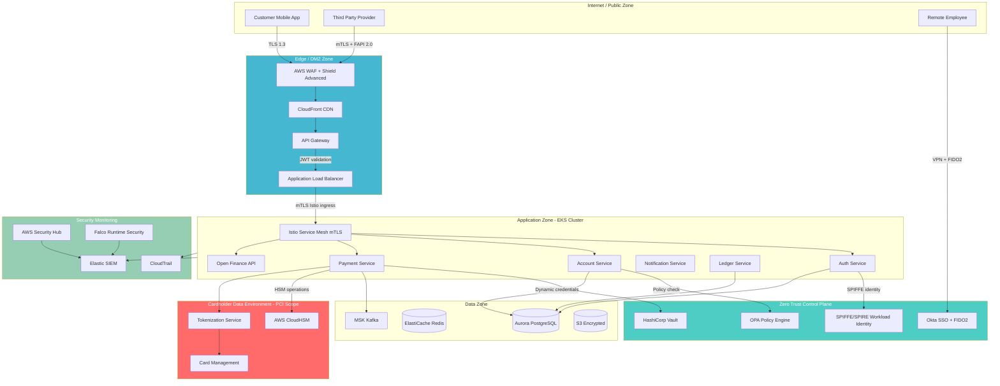

# Security Architecture — MaWire Bank

**Classification:** CONFIDENTIAL — INTERNAL USE ONLY  
**Version:** 1.0  
**Owner:** CISO  
**Last Updated:** 2026-06-06  
**Review Cycle:** Annual (or upon significant architecture change)

---

## Table of Contents

1. [Threat Model](#1-threat-model)
2. [Zero Trust Architecture](#2-zero-trust-architecture)
3. [Encryption Architecture](#3-encryption-architecture)
4. [PCI-DSS Compliance Architecture](#4-pci-dss-compliance-architecture)
5. [ISO 27001 Control Mapping](#5-iso-27001-control-mapping)
6. [SOC 2 Type II Controls](#6-soc-2-type-ii-controls)
7. [Security Operations Center (SOC)](#7-security-operations-center-soc)
8. [Vulnerability Management](#8-vulnerability-management)
9. [Secure SDLC](#9-secure-sdlc)

---

## 1. Threat Model

MaWire Bank operates under Chilean financial regulation (CMF — Comisión para el Mercado Financiero) and processes cardholder data subject to PCI-DSS Level 1. The threat model uses STRIDE methodology applied to each service boundary and data flow.

**Risk Rating Methodology:** Probability × Impact, rated LOW / MEDIUM / HIGH / CRITICAL.

**Threat Actors Considered:**
- Nation-state actors (espionage, disruption)
- Organized crime (fraud, ransomware)
- Hacktivists (reputational attack)
- Malicious insiders (current and former employees)
- Opportunistic cybercriminals (credential stuffing, phishing-as-a-service)
- Malicious TPPs (Open Finance abuse)

---

### 1.1 Banking-Specific Attack Vectors

#### Attack Vector 1 — Account Takeover (ATO)

**Risk Rating:** CRITICAL

| Sub-vector | Description | Likelihood | Impact |
|---|---|---|---|
| Credential stuffing | Automated login attempts using leaked password databases (e.g., HaveIBeenPwned corpus) | HIGH | CRITICAL |
| SIM swapping | Attacker convinces carrier to transfer victim's number, defeats SMS OTP | MEDIUM | HIGH |
| Phishing kits | Adversary-in-the-middle phishing pages mirroring MaWire login with real-time credential relay | HIGH | HIGH |
| Malware / RAT | Remote access trojan on customer device exfiltrates session tokens or keystrokes | MEDIUM | CRITICAL |
| Session hijacking | JWT theft via XSS, unprotected local storage, or insecure WebSocket | LOW | HIGH |

**Mitigations:**
- **FIDO2/WebAuthn** as primary second factor — phishing-resistant by design (origin binding)
- **Behavioral biometrics** (TypingDNA or equivalent) on login and transaction flows to detect bot patterns
- **SIM-swap detection API** — real-time query to carrier API (e.g., via GSMA Open Gateway SIM Swap API) before any SMS OTP is accepted; block if SIM changed within 48 hours
- **Device fingerprinting** + **device reputation** (ThreatMetrix) for new device step-up challenge
- **Rate limiting** on `/auth` endpoints: 5 failed attempts → CAPTCHA; 10 → temporary lockout; progressive lockout with jitter
- **Impossible travel detection**: flag logins from geographically inconsistent locations within short time windows
- **Passkey-first mobile UX**: eliminate passwords entirely on mobile, FIDO2 platform authenticator (FaceID/TouchID)
- **Anomaly detection** on post-login behavior: unusual transfer amounts, new payees, off-hours activity → require step-up authentication

---

#### Attack Vector 2 — API Attacks

**Risk Rating:** HIGH

| Sub-vector | Description | Likelihood | Impact |
|---|---|---|---|
| BOLA (OWASP API1) | Direct object reference bypass: `GET /api/accounts/12345` where `12345` belongs to another user | HIGH | CRITICAL |
| BFLA (OWASP API5) | Calling admin endpoints with customer token: `POST /api/admin/users/{id}/disable` | MEDIUM | HIGH |
| Mass assignment | Injecting fields not intended to be user-settable: `{"role":"admin","creditLimit":999999}` | MEDIUM | HIGH |
| API key leakage | Hardcoded API keys in mobile app binary or public GitHub repository | MEDIUM | HIGH |
| GraphQL introspection abuse | Exposing internal schema to enumerate all objects and relationships | LOW | MEDIUM |
| JWT algorithm confusion | Switching `alg` to `none` or RS256→HS256 to forge tokens | LOW | CRITICAL |

**Mitigations:**
- **API Gateway (AWS API Gateway + custom authorizer)** enforces per-resource ownership checks — every request validates that the authenticated user's `sub` matches the resource owner in a centralized authorization service
- **OpenAPI spec enforcement** via OWASP Ruleset: requests/responses validated against strict schema; reject any field not in the spec (prevents mass assignment)
- **Input validation library** (Zod for TypeScript services, Pydantic for Python): every inbound DTO explicitly typed; unknown fields rejected
- **GraphQL**: disable introspection in production; depth limiting (max 5 levels); query cost analysis
- **JWT validation**: RS256 with asymmetric keys only; `alg` header explicitly verified in code, not delegated to library default; short expiry (15 min access token, 24 h refresh with rotation)
- **API key management**: API keys stored in HashiCorp Vault, rotated quarterly; no API keys in code — scanned by Gitleaks pre-commit hook
- **Mutual TLS for TPP connections**: all Open Finance API consumers must present a valid certificate from CMF-registered CA
- **Synthetic monitoring**: automated BOLA test suite runs in staging after every deploy

---

#### Attack Vector 3 — Insider Threats

**Risk Rating:** HIGH

| Sub-vector | Description | Likelihood | Impact |
|---|---|---|---|
| Data exfiltration | Employee exports customer PII / transaction data to personal storage | MEDIUM | CRITICAL |
| Fraudulent transaction | Operations staff creates or approves fraudulent payments | LOW | HIGH |
| Privilege escalation | Employee exploits misconfigured IAM to gain elevated access | MEDIUM | HIGH |
| Collusion | Employee provides account details to external fraud ring | LOW | CRITICAL |
| Sabotage | Disgruntled employee deletes data or introduces backdoor in code | LOW | CRITICAL |

**Mitigations:**
- **Principle of Least Privilege**: IAM roles scoped to minimum required actions per microservice and per human role; quarterly access reviews (Okta Access Certification)
- **Four-eyes principle (dual control)**: all transactions above CLP $5,000,000 require approval from a second authorized operator; implemented at application layer with cryptographic attestation
- **Privileged Access Management (CyberArk PAM)**: all production access via just-in-time (JIT) access requests, session recording, keystroke logging; no standing production access for engineers
- **Employee activity anomaly detection**: behavioral analytics on internal tools (Elastic UBA rules); alerts on bulk data export, off-hours database queries, access to unusual customer accounts
- **Data Loss Prevention (DLP)**: endpoint DLP on company devices blocks upload of CSV/Excel files containing RUT patterns to non-approved cloud storage
- **Separation of duties**: code deployment separated from infrastructure access; developer cannot deploy to production without SRE approval
- **Background checks**: enhanced background screening for employees with production data access (financial history, criminal record — per Ley 19.628 Chile)
- **Termination procedure**: accounts disabled within 1 hour of termination; PAM access revoked before exit meeting

---

#### Attack Vector 4 — Infrastructure Attacks

**Risk Rating:** HIGH

| Sub-vector | Description | Likelihood | Impact |
|---|---|---|---|
| Kubernetes cluster escape | Container breakout to host via runc vulnerability or privileged container | LOW | CRITICAL |
| Supply chain compromise | Malicious code injected into third-party npm/pip package or Docker base image | MEDIUM | CRITICAL |
| SSRF to IMDS | Service-side request forgery to AWS Instance Metadata Service to steal IAM credentials | MEDIUM | HIGH |
| Secrets in env vars | Secrets exposed via `kubectl describe pod`, logs, or crash dumps | MEDIUM | HIGH |
| Crypto-mining / lateral movement | Compromised container used as pivot point for internal network scanning | MEDIUM | HIGH |
| etcd exposure | Kubernetes control plane etcd exposed without authentication | LOW | CRITICAL |

**Mitigations:**
- **OPA/Gatekeeper policies** enforced at admission: no privileged containers, no `hostPID`/`hostNetwork`, no `latest` image tags, required security contexts (`readOnlyRootFilesystem`, `runAsNonRoot`, `allowPrivilegeEscalation: false`)
- **Image signing (Sigstore/Cosign)**: all container images signed by CI pipeline; Gatekeeper verifies signature before admission; unsigned images rejected
- **IMDSv2 enforcement**: all EC2/EKS nodes configured with `HttpPutResponseHopLimit: 1` and `HttpTokens: required`; network policy blocks pod-level access to 169.254.169.254
- **HashiCorp Vault**: no secrets in environment variables, Kubernetes Secrets, or config files; Vault Agent Injector sidecar populates secrets as in-memory files (`tmpfs`); secrets never written to disk
- **Runtime security (Falco)**: kernel-level syscall monitoring; alerts on shell spawned in container, unexpected network connections, file writes to sensitive paths
- **Network policies (Cilium)**: default-deny, explicit allow-list per namespace; pods cannot communicate unless explicitly permitted
- **Node hardening**: Amazon Linux 2023 with CIS Benchmark Level 2; SSM Session Manager replaces SSH; no public IPs on nodes
- **Software Bill of Materials (SBOM)**: generated for every image build (Syft); stored in artifact registry; queried against CVE databases

---

#### Attack Vector 5 — Data Exfiltration

**Risk Rating:** HIGH

| Sub-vector | Description | Likelihood | Impact |
|---|---|---|---|
| SQL injection | Malformed input passed to raw SQL query returns unauthorized data | LOW | CRITICAL |
| S3 misconfiguration | Public S3 bucket exposes customer documents or transaction exports | LOW | CRITICAL |
| Log injection with PII | RUT, account numbers logged in plaintext, accessible via log aggregation UI | MEDIUM | HIGH |
| Database credential theft | Static DB password reused across services; compromised in one service exposes all | MEDIUM | HIGH |
| Elasticsearch exposure | Internal search index exposed to internet without authentication | LOW | CRITICAL |

**Mitigations:**
- **Parameterized queries only**: enforced via ORM (TypeORM/Prisma); raw SQL strings banned by Semgrep rule in CI (pattern: `query(\`.*${`) flagged as blocking finding)
- **S3 block public access**: AWS Organizations SCP denies `s3:PutBucketAcl` with `public` ACL; AWS Config rule `s3-bucket-public-read-prohibited` in continuous monitoring; Security Hub alert on any violation
- **PII scrubbing in logs**: custom logging middleware intercepts all log events before writing to Elasticsearch; scrubs RUT pattern (`\d{1,2}.\d{3}.\d{3}-[\dkK]`), card numbers, email addresses using regex + named entity recognition; replaced with `[REDACTED]`
- **Dynamic database credentials**: Vault Database Secrets Engine generates per-service credentials with 1-hour TTL; credentials never reused; leaked credential automatically expires
- **VPC endpoints**: all S3, DynamoDB, Secrets Manager access via VPC endpoints; traffic never traverses internet
- **Macie**: AWS Macie scans S3 buckets weekly for PII patterns; findings routed to Security Hub

---

#### Attack Vector 6 — Third-Party Risk (Open Finance / APIs Abiertas)

**Risk Rating:** HIGH

| Sub-vector | Description | Likelihood | Impact |
|---|---|---|---|
| Malicious TPP registration | Attacker registers as TPP, obtains valid OAuth client credentials, abuses data access | LOW | HIGH |
| OAuth token theft | TPP application compromised; customer access tokens stolen | MEDIUM | HIGH |
| mTLS certificate compromise | TPP's private key stolen; impersonation of legitimate TPP | LOW | HIGH |
| Excessive data access | TPP requests broader scope than customer consented to | MEDIUM | MEDIUM |
| Consent manipulation | TPP UI tricks customer into granting broader consent than intended | MEDIUM | MEDIUM |

**Mitigations:**
- **CMF registry validation**: real-time check against CMF's official TPP registry before any token issuance; suspended or revoked TPPs immediately blocked
- **FAPI 2.0 compliance**: Financial-grade API Security Profile 2.0 with PAR (Pushed Authorization Requests), DPoP (Demonstrating Proof of Possession), and JAR (JWT-secured Authorization Requests)
- **Short-lived access tokens**: 15-minute expiry for Open Finance access tokens; refresh tokens rotate on every use (refresh token rotation) with family invalidation on reuse detection
- **mTLS for all TPP connections**: certificate pinned to TPP's CMF-registered certificate; OCSP stapling; CRL checked on every connection; certificate revocation triggers immediate session termination
- **Consent ledger**: immutable audit trail of every consent grant, modification, and revocation; customer can review and revoke at any time in-app
- **Scope enforcement**: authorization server enforces exact requested scopes against customer consent record; no implicit scope expansion
- **TPP rate limiting**: per-TPP rate limits enforced at API Gateway; quota violations trigger alert and temporary block

---

## 2. Zero Trust Architecture

### 2.1 Principles Applied

MaWire Bank implements Zero Trust Architecture (ZTA) as defined by NIST SP 800-207, adapted for a cloud-native banking context:

1. **Never trust, always verify** — no implicit trust based on network location; every request authenticated and authorized regardless of source (internal or external)
2. **Least privilege access** — every service identity, human user, and automated process receives only the minimum permissions required; access reviewed and rotated continuously
3. **Assume breach** — design for containment; full lateral movement detection; blast radius minimized through micro-segmentation; full observability at every network layer
4. **Verify explicitly** — authentication uses multiple signals: identity, device health, location, time, behavioral context
5. **Continuous verification** — session validity re-evaluated continuously; anomalous signals trigger step-up authentication or session termination

### 2.2 Security Zones

```
┌─────────────────────────────────────────────────────────────────────┐
│                     INTERNET / PUBLIC ZONE                          │
│  Customers, TPPs, Regulators                                        │
└─────────────────────────┬───────────────────────────────────────────┘
                          │ TLS 1.3
                          ▼
┌─────────────────────────────────────────────────────────────────────┐
│                     DMZ / EDGE ZONE                                 │
│  AWS WAF → CloudFront → API Gateway → ALB                          │
│  DDoS protection, rate limiting, geo-blocking, bot detection       │
└─────────────────────────┬───────────────────────────────────────────┘
                          │ mTLS (Istio ingress)
                          ▼
┌─────────────────────────────────────────────────────────────────────┐
│                  APPLICATION ZONE (EKS)                             │
│  Microservices with Istio sidecar (Envoy)                          │
│  mTLS between all services, SPIFFE identities                      │
│  Auth Service │ Account Service │ Payment Service │ Notification   │
└──────┬─────────────────┬──────────────────┬──────────────────────┘
       │ mTLS            │ mTLS             │ mTLS
       ▼                 ▼                  ▼
┌─────────────────────────────────────────────────────────────────────┐
│                    DATA ZONE                                        │
│  Aurora PostgreSQL (primary + replicas)                            │
│  ElastiCache Redis │ MSK Kafka │ S3 (encrypted)                    │
│  Network policies: only specific services → specific databases     │
└──────────────────────────┬──────────────────────────────────────────┘
                           │ Vault dynamic credentials only
                           ▼
┌─────────────────────────────────────────────────────────────────────┐
│                    CDE ZONE (PCI-DSS)                               │
│  Isolated VPC subnet — no direct internet access                   │
│  Payment Service → HSM (AWS CloudHSM)                             │
│  Tokenization Service │ Card Management Service                    │
│  Access only from Payment Service via specific security group rule │
└─────────────────────────────────────────────────────────────────────┘
```

### 2.3 Zero Trust Network Architecture Diagram



### 2.4 Implementation Components

#### 2.4.1 Service Mesh — Istio

| Component | Configuration | Purpose |
|---|---|---|
| mTLS mode | `STRICT` — no plaintext allowed between pods | Encrypts all east-west traffic |
| Certificate rotation | cert-manager + Vault PKI, 24h certificate lifetime | Limits blast radius of key compromise |
| Authorization policies | `AuthorizationPolicy` per service: source workload + path + method | Prevents lateral movement |
| TLS version | TLS 1.3 minimum (`minProtocolVersion: TLSV1_3`) | Eliminates legacy cipher suites |
| Distributed tracing | Jaeger with 100% sampling for payment flows, 5% for others | Full request attribution |
| Circuit breaker | 5xx > 50% in 10s → open circuit 30s | Limits cascading failures |
| Retry policy | 3 retries with exponential backoff, idempotency key enforcement | Prevents duplicate transactions |

**Istio Authorization Policy Example — Payment Service:**
```yaml
apiVersion: security.istio.io/v1beta1
kind: AuthorizationPolicy
metadata:
  name: payment-service-policy
  namespace: payments
spec:
  selector:
    matchLabels:
      app: payment-service
  action: ALLOW
  rules:
  - from:
    - source:
        principals:
        - cluster.local/ns/api/sa/api-gateway-sa
        - cluster.local/ns/ledger/sa/ledger-service-sa
    to:
    - operation:
        methods: ["POST"]
        paths: ["/api/v1/payments", "/api/v1/transfers"]
    when:
    - key: request.auth.claims[iss]
      values: ["https://auth.mawire.cl"]
```

#### 2.4.2 Identity and Access Management

**Human Identities:**

| User Type | Authentication | MFA | Session | Privileged Access |
|---|---|---|---|---|
| Customers | Passkey (FIDO2) + PIN fallback | TOTP / FIDO2 | 30 min idle, 8h absolute | N/A |
| Employees (standard) | Okta SSO + FIDO2 YubiKey | Hardware FIDO2 required | 8h with re-auth for sensitive ops | CyberArk JIT |
| Employees (admin/ops) | Okta SSO + FIDO2 YubiKey | Hardware FIDO2 required | 30 min idle | CyberArk JIT + session recording |
| Engineers (production) | Okta SSO + FIDO2 YubiKey | Hardware FIDO2 required | JIT access max 4h | PAM + peer approval |
| SRE on-call | Okta SSO + FIDO2 YubiKey | Hardware FIDO2 required | Break-glass with full audit | PAM + automatic alert |

**Service Identities:**

| Identity Type | Implementation | Lifetime | Rotation |
|---|---|---|---|
| Kubernetes workload | SPIFFE/SPIRE SVID (X.509) | 24 hours | Automatic |
| Database credentials | Vault Dynamic Secrets | 1 hour | Per-request generation |
| AWS IAM (pods) | IAM Roles for Service Accounts (IRSA) | 1 hour | Automatic |
| Inter-service mTLS | Istio/cert-manager certificates | 24 hours | Automatic |
| CI/CD pipeline | OIDC federation (no long-lived keys) | Per-job | N/A |

**SPIFFE/SPIRE Configuration:**
```
SPIFFE URI format: spiffe://mawire.cl/ns/{namespace}/sa/{serviceaccount}

Example:
  Payment Service:    spiffe://mawire.cl/ns/payments/sa/payment-service
  Account Service:    spiffe://mawire.cl/ns/accounts/sa/account-service
  Auth Service:       spiffe://mawire.cl/ns/auth/sa/auth-service

Trust domain: mawire.cl
SVID TTL: 24h (re-issued every 12h to prevent expiry gaps)
```

#### 2.4.3 Secrets Management — HashiCorp Vault

**Architecture:**
- Vault deployed in HA mode (3 nodes) using Raft storage backend
- Vault auto-unseal using AWS KMS; unseal keys never held by any single individual
- Namespace separation: `mawire-prod/`, `mawire-staging/`, `mawire-dev/`
- Vault Agent Injector: secrets injected as in-memory `tmpfs` mounts, never written to container filesystem or environment variables

**Secrets Engines Deployed:**

| Engine | Purpose | Lease / Rotation |
|---|---|---|
| Database (PostgreSQL) | Dynamic credentials per service | 1h lease, max 2h with renewal |
| AWS | Dynamic IAM credentials for batch jobs | 15min lease |
| PKI | Internal CA for mTLS certificates | 24h certificate TTL |
| Transit | Encryption-as-a-service for PII fields | Key rotation every 90 days |
| KV v2 | Static secrets (API keys for third parties) | Manual rotation, version history |
| SSH | Dynamic SSH certificates for break-glass | 30min TTL, one-time use |

**Access control — Vault Policy for Payment Service:**
```hcl
# payment-service policy
path "mawire-prod/database/creds/payment-service-role" {
  capabilities = ["read"]
}

path "mawire-prod/transit/encrypt/card-data" {
  capabilities = ["update"]
}

path "mawire-prod/transit/decrypt/card-data" {
  capabilities = ["update"]
}

# Deny everything else
path "*" {
  capabilities = ["deny"]
}
```

#### 2.4.4 Hardware Security Module (HSM)

**Platform:** AWS CloudHSM (FIPS 140-3 Level 3) with Thales Luna Network HSM as on-premise backup for DR scenarios.

| Key Type | Algorithm | HSM Storage | Usage |
|---|---|---|---|
| Card encryption key (CEK) | AES-256 | AWS CloudHSM | Encrypts card PAN at tokenization |
| PIN encryption key (PEK) | 3DES (legacy) / AES-256 | AWS CloudHSM | PIN block encryption per ISO 9564 |
| Zone master key (ZMK) | AES-256 | AWS CloudHSM | Key exchange with card networks |
| Signing key (RSA-4096) | RSA-4096 | AWS CloudHSM | Transaction signing, audit log integrity |
| Data encryption key (DEK) | AES-256-GCM | Vault (wrapped by HSM key) | PII field encryption at rest |

**HSM Operational Rules:**
- Cryptographic operations performed inside HSM; keys never exported in plaintext
- Dual control: key ceremonies require presence of two key custodians with HSM credentials
- Backup HSM in `sa-east-1` (São Paulo) replicates key material in real time
- HSM cluster monitored for hardware faults; automatic failover to secondary cluster
- Annual key ceremony documented, witnessed, and notarized per PCI-DSS requirement 3.7

---

## 3. Encryption Architecture

### 3.1 Data at Rest

| Data Category | Encryption Standard | Key Management | Key Rotation |
|---|---|---|---|
| Aurora PostgreSQL (full disk) | AES-256 (AWS-managed RDS encryption) | AWS KMS CMK | Annual |
| PII columns (RUT, name, address) | AES-256-GCM (field-level, app layer) | Vault Transit Engine | 90 days |
| Card PAN / CVV | AES-256 in HSM via tokenization | AWS CloudHSM | Annual (key ceremony) |
| S3 objects (documents, exports) | SSE-KMS with customer-managed key | AWS KMS CMK | Annual |
| EBS volumes (node storage) | AES-256 (AWS EBS encryption) | AWS KMS | Annual |
| Backups (S3 Glacier) | AES-256, encrypted before upload | Separate Vault-managed DEK | On restore |
| MSK Kafka at-rest | AES-256 (AWS-managed) | AWS KMS CMK | Annual |
| Elasticsearch indices | AES-256 (OpenSearch encryption) | AWS KMS CMK | Annual |

### 3.2 Data in Transit

| Connection Type | Protocol | Certificate Authority | Notes |
|---|---|---|---|
| Customer mobile → API Gateway | TLS 1.3 | AWS ACM (DigiCert root) | Certificate pinning in mobile app |
| API Gateway → ALB → Istio | mTLS 1.3 | Internal Vault CA | Automatic rotation |
| Service-to-service (Istio) | mTLS 1.3 | SPIRE (Vault CA) | SPIFFE identity verification |
| App → Aurora PostgreSQL | TLS 1.3 | AWS RDS CA | Enforced via `sslmode=verify-full` |
| App → HashiCorp Vault | TLS 1.3 | Internal Vault CA | |
| Payment Service → HSM | TLS 1.3 (PKCS#11 over TLS) | HSM vendor CA | |
| PCI scope (card network) | TLS 1.3 / ISO 8583 over TLS | Visa/Mastercard CA | Pass-through, no termination at ALB |
| Employee VPN | WireGuard (ChaCha20-Poly1305) | PKI (Vault CA) | MFA required before tunnel establishment |

**Certificate Pinning in Mobile App:**
```
// iOS (Swift) — Public key pinning
let pinnedPublicKeyHash = "sha256//MaWire_API_PublicKey_Hash="
// Backup pin (rotation preparation):
let backupPublicKeyHash  = "sha256//MaWire_API_Backup_Hash="

// Implemented via TrustKit framework
// Pin checked on every TLS handshake; connection aborted if mismatch
// 60-day advance notice policy for pin rotation
```

### 3.3 Field-Level Encryption Schema

All PII is encrypted at the application layer before database write, using Vault Transit Engine (AES-256-GCM). A separate HMAC-SHA256 hash enables indexed lookup without decrypting.

```sql
-- Customers table: PII stored encrypted
CREATE TABLE customers (
    id                  UUID PRIMARY KEY DEFAULT gen_random_uuid(),
    created_at          TIMESTAMPTZ NOT NULL DEFAULT NOW(),
    updated_at          TIMESTAMPTZ NOT NULL DEFAULT NOW(),

    -- Encrypted PII fields (application-layer AES-256-GCM via Vault Transit)
    rut_encrypted       BYTEA NOT NULL,        -- AES-256-GCM ciphertext
    rut_hmac            BYTEA NOT NULL,        -- HMAC-SHA256(rut, lookup_key) for indexed search
    full_name_encrypted BYTEA NOT NULL,
    email_encrypted     BYTEA NOT NULL,
    email_hmac          BYTEA NOT NULL,        -- For login lookup
    phone_encrypted     BYTEA NOT NULL,
    address_encrypted   BYTEA NOT NULL,
    dob_encrypted       BYTEA NOT NULL,        -- Date of birth

    -- Non-sensitive fields stored plaintext
    account_status      VARCHAR(20) NOT NULL,
    kyc_level           INTEGER NOT NULL DEFAULT 0,
    created_by_service  VARCHAR(50) NOT NULL,
    key_version         INTEGER NOT NULL DEFAULT 1,  -- Tracks which Transit key version encrypted this row

    -- Indexes on HMAC columns for fast lookup
    CONSTRAINT uq_rut_hmac   UNIQUE (rut_hmac),
    CONSTRAINT uq_email_hmac UNIQUE (email_hmac)
);

CREATE INDEX idx_customers_rut_hmac   ON customers (rut_hmac);
CREATE INDEX idx_customers_email_hmac ON customers (email_hmac);
CREATE INDEX idx_customers_status     ON customers (account_status);

-- PAN tokenization mapping (in CDE schema — separate database)
CREATE TABLE pan_tokens (
    token               VARCHAR(16) PRIMARY KEY,    -- Format-preserving token (BIN-preserving)
    pan_encrypted       BYTEA NOT NULL,             -- AES-256 encrypted in HSM
    expiry_encrypted    BYTEA NOT NULL,
    created_at          TIMESTAMPTZ NOT NULL DEFAULT NOW(),
    last_used_at        TIMESTAMPTZ,
    token_type          VARCHAR(20) NOT NULL         -- 'NETWORK', 'APPLE_PAY', 'GOOGLE_PAY'
);
```

### 3.4 Key Hierarchy

```
Root of Trust: AWS CloudHSM (FIPS 140-3 Level 3)
│
├── Master Key Encryption Key (MKEK) — stored in HSM, never exported
│   ├── Zone Master Key (ZMK) — card network key exchange
│   ├── PIN Encryption Key (PEK) — PIN block encryption
│   └── Card Encryption Key (CEK) — PAN encryption
│
└── AWS KMS CMK (wrapped by HSM-held key)
    ├── Vault Unseal Key — Vault auto-unseal
    ├── RDS Encryption Key — Aurora at-rest encryption
    ├── S3 SSE-KMS Key — document and export storage
    └── Vault Transit Key (rotated 90 days)
        ├── PII Encryption Key (rut, name, email, phone, address)
        └── Audit Log Signing Key
```

---

## 4. PCI-DSS Compliance Architecture

### 4.1 Scope Reduction Strategy

MaWire Bank uses a tokenization-first approach to minimize PCI-DSS scope:

1. **Tokenization at ingress**: PAN is tokenized at the payment service entry point; only the token is propagated to non-CDE systems
2. **CDE isolation**: Cardholder Data Environment is a dedicated VPC subnet (`10.10.10.0/24`) with no internet gateway; only reachable from Payment Service via security group rule
3. **Network segmentation**: AWS Network Firewall enforces allow-list between CDE and application zone; all other traffic denied
4. **Log sanitization**: PAN scrubbing middleware ensures no card number appears in any log stream
5. **Scope validation**: quarterly scope review with QSA (Qualified Security Assessor) to confirm segmentation effectiveness

### 4.2 PCI-DSS v4.0 Control Mapping — Level 1

| Req # | Requirement Description | MaWire Control Implementation | Evidence Location |
|---|---|---|---|
| **1.1** | Network security controls installed and maintained | AWS VPC with Security Groups (stateful), NACLs (stateless), AWS Network Firewall between CDE and app zone; Terraform-managed, changes require PR approval | Terraform state, AWS Config rules |
| **1.2** | Network security controls configured to restrict inbound and outbound traffic | Default-deny security groups; explicit allow-list documented in network-architecture.md; CDE subnet: only port 8443 from payment-service SG | AWS Config `restricted-ssh`, Security Group change alerts |
| **1.3** | Network access to and from CDE is restricted | CDE subnet has no internet gateway; outbound only to Visa/Mastercard IPs via NAT; inbound only from payment-service security group | VPC Flow Logs, quarterly firewall rule review |
| **1.4** | Network connections between trusted and untrusted networks are controlled | AWS WAF on all public-facing endpoints; Istio ingress with mTLS; WAF rules include OWASP CRS, rate limiting, geo-blocking | WAF logs, Istio access logs |
| **2.1** | Processes and mechanisms for applying secure configurations to all system components | CIS Benchmark hardening for all EKS nodes (Amazon Linux 2023 CIS Level 2); Kubernetes PodSecurity Standards (Restricted); OPA/Gatekeeper admission control | Ansible hardening playbooks, OPA policy library |
| **2.2** | System components are configured and managed securely | No default passwords; all service accounts use SPIFFE identity; no shared accounts; SSM Parameter Store for OS-level config | CyberArk PAM audit logs, SSM inventory |
| **2.3** | Wireless environments are secured | No wireless networks in CDE or data center; office WiFi on separate VLAN with no CDE access; WPA3-Enterprise | Network diagram, VLAN configuration |
| **3.1** | Processes and mechanisms to protect stored account data are defined and understood | Data classification policy in effect; PAN stored only in CDE in encrypted form; tokenization for all other systems; retention policy: 7 years then secure deletion | Data classification policy v2.1, retention schedule |
| **3.2** | Account data storage is kept to a minimum | SAD (Sensitive Authentication Data) never stored post-authorization; PAN tokenized at ingress; CVV never stored; expiry stored encrypted only in CDE | Code review attestation, Semgrep rule `no-cvv-storage` |
| **3.3** | SAD is not retained after authorization | Automated test in CI verifies no CVV/SAD persisted in DB post-auth; Semgrep blocks `cvv` field persistence patterns | CI pipeline output, automated test suite |
| **3.4** | PAN is secured wherever stored | PAN in CDE encrypted AES-256 via HSM; format-preserving encryption maintains BIN structure; token used in all non-CDE systems | HSM audit logs, tokenization service code |
| **3.5** | PAN is secured with cryptography wherever transmitted | TLS 1.3 for all PAN transmission; mTLS within CDE; no PAN in URLs or logs | Istio mTLS reports, WAF logs |
| **3.6** | Cryptographic keys used to protect stored account data are secured | Keys stored in HSM; dual control for key ceremonies; key split knowledge (no single custodian has full key); documented in key management policy | HSM audit logs, key ceremony records |
| **3.7** | Cryptographic keys are managed throughout their lifecycle | Key lifecycle policy: generation (HSM), distribution (encrypted), storage (HSM), rotation (annual with ceremony), destruction (HSM zeroization) | Key management policy, ceremony certificates |
| **4.1** | Processes for protection of PAN over open networks defined | TLS 1.3 enforced at all boundaries; certificate management via ACM + cert-manager; no PAN in HTTP (WAF blocks) | TLS configuration, WAF rules |
| **4.2** | PAN protected with strong cryptography during transmission | TLS 1.3 with ECDHE-AES-256-GCM-SHA384 preferred cipher; no PAN in query strings, headers, or logs | Nginx TLS config, API Gateway settings |
| **5.1** | Anti-malware solutions deployed on applicable system components | AWS GuardDuty (cloud-native threat detection) + Falco (container runtime) + CrowdStrike Falcon on employee endpoints | GuardDuty findings dashboard |
| **5.2** | Anti-malware mechanisms are active and current | GuardDuty: continuous, AWS-managed updates; Falco: rules updated weekly via GitOps; CrowdStrike: automatic sensor updates | GuardDuty status, Falco rule version log |
| **6.1** | Security vulnerabilities identified and managed | Vulnerability management program: Trivy (containers), Snyk (dependencies), Semgrep (SAST), OWASP ZAP (DAST); CVE SLA: Critical 24h, High 72h, Medium 30 days | Vulnerability tracker (Jira), CI pipeline reports |
| **6.2** | Software developed and maintained securely | Secure SDLC: threat modeling, SAST in CI, peer code review (security checklist), DAST on staging; no deploy to production without security sign-off | GitHub PR history, security checklist template |
| **6.3** | Security vulnerabilities in bespoke and custom software are identified and corrected | SAST (Semgrep) blocks High/Critical findings in CI; DAST (ZAP) runs on every staging deploy; pen test semi-annual | Semgrep SaaS dashboard, ZAP reports |
| **6.4** | Public-facing web applications are protected against attacks | AWS WAF with OWASP Core Rule Set (CRS) 3.3; rate limiting; API Gateway request validation; custom rules for banking-specific attacks | WAF rule configuration, WAF logs |
| **6.5** | Security in software development lifecycle | Security champions program; OWASP Top 10 training annual; threat modeling for new features; security requirements in Definition of Done | Training records, threat model library |
| **7.1** | Access to system components and cardholder data restricted to least privilege | RBAC via Kubernetes RBAC + Istio AuthorizationPolicy; IAM roles scoped to service; quarterly access review via Okta Access Certification | IAM policy documentation, access review reports |
| **7.2** | Access to system components and data is appropriately defined and assigned | Role matrix documented; CDE access restricted to 3 named roles; access requests via ServiceNow with manager + security approval | Access control matrix, ServiceNow tickets |
| **7.3** | All user access and related access rights are reviewed | Quarterly automated access review; leavers deprovisioned within 1 hour via Okta automation; annual manual review of privileged access | Okta Access Certification reports |
| **8.1** | All users are assigned a unique ID | No shared accounts in any system; service accounts via SPIFFE (not human credentials); Okta enforces unique user IDs | Okta user directory, SPIRE attestation logs |
| **8.2** | User identification and related accounts are managed throughout their lifecycle | Joiner-Mover-Leaver process automated via Okta + HR system integration; account review at 90-day probation completion | HR-to-Okta provisioning flow documentation |
| **8.3** | User authentication factors are managed securely | Passwords: bcrypt (cost 12) for legacy paths; phasing out for passkeys; MFA required for all CDE access; FIDO2 for privileged users | Auth service code, Okta MFA policy |
| **8.4** | Multi-factor authentication implemented | MFA enforced via Okta for all employees; TOTP or FIDO2 for customers; hardware FIDO2 (YubiKey) for CDE-accessing roles | Okta MFA enforcement policy |
| **8.5** | Multi-factor authentication systems are configured securely | TOTP: HMAC-SHA1 (RFC 6238), 30s window, 1-step tolerance; FIDO2: UV required for privileged access; backup codes: one-time use, encrypted in Vault | Auth service configuration |
| **8.6** | Use of application and system accounts and authentication factors is managed | Service account credentials: Vault dynamic secrets; no static passwords for services; rotation automated | Vault dynamic secrets configuration |
| **9.1** | Physical access to cardholder data environment is controlled | CDE runs in AWS — physical security delegated to AWS (ISO 27001, SOC 2 certified); AWS data center in Santiago region (us-east-1 DR) | AWS compliance documentation |
| **9.2** | Physical access to sensitive areas is controlled | Employee office: badge access, CCTV; server room (if applicable): biometric + badge + CCTV; visitor log | Physical security policy |
| **10.1** | All access to system components and cardholder data is logged | AWS CloudTrail (API calls), Kubernetes audit logs, Istio access logs, application audit logs; all routed to Elastic SIEM; tamper-evident via CloudWatch Logs integrity | CloudTrail configuration, SIEM log source inventory |
| **10.2** | Audit logs capture all relevant events | Log format includes: timestamp (UTC), user/service identity, action, resource, source IP, outcome, session ID; structured JSON | Log format specification, sample log entries |
| **10.3** | Audit logs are protected from destruction and unauthorized modifications | CloudWatch Logs with S3 export; S3 Object Lock (WORM) with 7-year retention; Vault-signed log hashes for integrity; CloudTrail log file validation enabled | S3 Object Lock policy, CloudTrail configuration |
| **10.4** | Audit logs are reviewed to identify anomalies or suspicious activity | Elastic SIEM with 50+ detection rules; anomaly detection (ML jobs); daily automated review of critical alerts; weekly SOC analyst review | SIEM rule library, SOC shift reports |
| **10.5** | Audit log history is retained and available for analysis | 90 days hot storage (Elasticsearch); 1 year warm (S3 Standard-IA); 7 years cold (S3 Glacier Deep Archive); searchable via SIEM | Log retention policy, S3 lifecycle rules |
| **10.6** | Time-synchronization mechanisms support consistent time | AWS Time Sync Service (chrony) on all instances; EKS node time sync verified; log timestamps normalized to UTC in application layer | Time sync configuration |
| **10.7** | Failures of critical security controls detected and addressed | Alerting on: SIEM offline, Vault unreachable, mTLS policy bypass, HSM fault; P1 alerts page on-call SRE within 5 minutes | PagerDuty alert configuration |
| **11.1** | Processes to detect and manage vulnerabilities | Monthly vulnerability scan (Nessus/Inspector) of all infrastructure; Trivy on every container build; SBOM tracked | Scan reports, vulnerability tracker |
| **11.2** | Wireless access points are identified and unauthorized access detected | No wireless in CDE; wireless scanning quarterly in office; unauthorized AP alert via network monitoring | Wireless scan reports |
| **11.3** | External and internal vulnerabilities are identified, prioritized, and addressed | Internal: AWS Inspector + Trivy; External: quarterly external pen test by CREST firm; bug bounty via HackerOne | Pen test reports, Inspector findings |
| **11.4** | External and internal penetration testing performed | Semi-annual pen test by CREST-certified firm; scope: external perimeter, API layer, internal network, social engineering; findings remediated within SLA | Pen test reports, remediation tracker |
| **11.5** | Network intrusions and unexpected file changes are detected and alerted | AWS GuardDuty (network anomaly detection); Falco (file integrity, unexpected processes); CloudTrail Insights for API anomalies | GuardDuty findings, Falco alert log |
| **11.6** | Unauthorized changes to payment pages detected | Content Security Policy (CSP) headers enforced; Sub-Resource Integrity (SRI) on all JS; weekly automated CSP audit; Cloudflare Page Shield | CSP policy, SRI implementation |
| **12.1** | Information security policy is established, published, reviewed | Information Security Policy v3.0 published on intranet; reviewed annually; signed by CEO and CISO; communicated to all employees at onboarding | Policy document, acknowledgment records |
| **12.2** | Acceptable use policies for end-user technologies are implemented | Acceptable Use Policy covers: personal device prohibition in CDE, USB restriction, internet use; enforced via MDM (Jamf) | AUP document, MDM configuration |
| **12.3** | Risk to cardholder data from third parties is managed | Third-party risk assessment before onboarding; annual SOC 2 review for critical vendors; contractual security requirements; PCI-DSS attestation for any CDE-touching vendor | Third-party risk register, vendor contracts |
| **12.4** | PCI-DSS compliance is managed | Annual QSA assessment; quarterly self-assessment for SAQ items; CISO owns compliance program; board-level reporting quarterly | QSA reports, compliance dashboard |
| **12.5** | PCI-DSS scope is documented and validated | Scope document reviewed quarterly with QSA; data flow diagram showing all CDE data flows; segmentation test quarterly | Scope document, DFD |
| **12.6** | Security awareness education is ongoing | Annual OWASP Top 10 + PCI awareness training for all staff; role-specific training for CDE-accessing staff; phishing simulation quarterly | Training completion records, phishing simulation reports |
| **12.7** | Personnel are screened to reduce risks from insider threats | Background checks for all employees (criminal, financial, identity verification per Ley 19.628); enhanced for CDE-accessing roles | HR screening policy, screening records |
| **12.8** | Risk to information assets associated with third-party service provider activity is managed | Third-party inventory maintained; TPRM policy; contractual right-to-audit; annual PCI responsibility matrix per Appendix B | TPRM register, vendor contracts |
| **12.9** | Third-party service providers acknowledge their PCI-DSS responsibility | PCI Responsibility Matrix signed by all critical vendors; Mambu, AWS, payment processor attestation on file | Signed responsibility matrices |
| **12.10** | Suspected and confirmed security incidents respond to immediately | Incident Response Plan v2.0 with 5 banking-specific playbooks; IR team trained semi-annually; tabletop exercise annual; PagerDuty escalation | IR Plan, tabletop exercise reports |

---

## 5. ISO 27001 Control Mapping

**Certification Target:** ISO 27001:2022  
**Scope:** MaWire Bank digital banking platform, cloud infrastructure, and related processes  
**Certification Body:** Bureau Veritas (accredited by UKAS)

| Control ID | Control Name | MaWire Implementation |
|---|---|---|
| **A.5.1** | Policies for information security | Information Security Policy v3.0; reviewed annually; Board-approved; covers all ISO 27001 domains |
| **A.5.7** | Threat intelligence | Threat intelligence feeds: CERT Chile, FS-ISAC, CISA alerts; integrated into SIEM detection rules; monthly threat briefing to CISO |
| **A.5.15** | Access control | Role-based access control (RBAC) across all systems; Okta as IdP; zero-standing privilege for production; access review quarterly |
| **A.5.16** | Identity management | Centralized identity in Okta; SCIM provisioning/deprovisioning; service identities via SPIFFE; no shared accounts |
| **A.5.17** | Authentication information | Password policy: 12+ chars, complexity; passkeys phasing out passwords for customers; FIDO2 required for privileged roles; bcrypt (cost 12) hashing |
| **A.5.18** | Access rights | Least privilege RBAC; access request workflow via ServiceNow; manager + security approval; 90-day access expiry with renewal required |
| **A.5.23** | Information security for use of cloud services | Cloud Security Policy covers: AWS shared responsibility model, multi-region DR, data residency (Chile primary); AWS Business Associate Agreement |
| **A.5.24** | Information security incident management planning and preparation | Incident Response Plan v2.0; RACI matrix; IR team: CISO, SOC Lead, SRE Lead, Legal, Communications; tested annually via tabletop |
| **A.5.25** | Assessment and decision on information security events | SIEM alert triage process: automated severity scoring, analyst triage SLA (P1: 5 min, P2: 15 min), documented decision tree |
| **A.5.26** | Response to information security incidents | 5 banking-specific IR playbooks (see Section 7.3); PagerDuty automation for P1/P2; post-incident review within 5 business days |
| **A.5.28** | Collection of evidence | Digital forensics capability: Velociraptor for endpoint; AWS forensic account for evidence preservation; chain of custody documented |
| **A.5.30** | ICT readiness for business continuity | DR plan tested quarterly; RTO 4h / RPO 1h for critical systems; multi-AZ active-active for application layer; Aurora Global Database for cross-region |
| **A.5.36** | Compliance with policies, rules, and standards | Compliance monitoring via AWS Config, Security Hub, Prisma Cloud; monthly compliance report to CISO; annual external audit |
| **A.6.3** | Information security awareness, education, and training | Annual security awareness training (all staff); role-specific training (developers: OWASP; CDE staff: PCI); phishing simulation quarterly; training completion tracked in LMS |
| **A.8.8** | Management of technical vulnerabilities | Vulnerability management program: scan → track → remediate → verify; SLA: Critical 24h, High 72h, Medium 30 days, Low 90 days; Jira integration |
| **A.8.9** | Configuration management | Infrastructure-as-Code (Terraform) for all cloud resources; GitOps for Kubernetes; configuration drift detection via AWS Config; no manual changes to production |
| **A.8.15** | Logging | Centralized logging to Elastic SIEM; structured JSON logs from all services; audit logs immutable (S3 Object Lock); retention 7 years |
| **A.8.16** | Monitoring activities | 24/7 SOC monitoring; SIEM with 50+ detection rules; anomaly detection (ML-based); GuardDuty, Security Hub, Falco; PagerDuty escalation |
| **A.8.24** | Use of cryptography | Cryptography policy: AES-256-GCM for symmetric, RSA-4096 or ECDSA P-384 for asymmetric, SHA-256/SHA-384 for hashing; no MD5, no SHA-1, no DES; Vault as crypto oracle |
| **A.8.25** | Secure development life cycle | Secure SDLC policy: threat modeling mandatory for new features, SAST/DAST in CI, security code review checklist, pen test before go-live; security gate in release process |

---

## 6. SOC 2 Type II Controls

**Audit Firm:** KPMG Chile  
**Trust Service Criteria:** Security (CC), Availability (A), Confidentiality (C)  
**Audit Period:** 12 months (aligned with fiscal year)

### 6.1 Common Criteria — Security (CC)

| CC Criteria | Description | MaWire Control |
|---|---|---|
| CC1.1 | Entity demonstrates commitment to integrity and ethical values | Code of Conduct; Acceptable Use Policy; ethics hotline; annual attestation by all employees |
| CC2.1 | Information and communication to support internal control functioning | Security policies on intranet; monthly security newsletter; incident post-mortems shared with engineering |
| CC3.1 | Risk assessment — identifying risks to achievement of objectives | Annual risk assessment (CISO-led); risk register maintained in Jira; residual risk accepted by CISO + CEO for High/Critical |
| CC4.1 | Control monitoring to evaluate controls are present and functioning | AWS Config continuous monitoring; Security Hub consolidated findings; monthly control effectiveness review; annual SOC 2 audit |
| CC5.1 | Selection and development of control activities | Control selection based on risk assessment; PCI-DSS, ISO 27001, CMF requirements mapped; compensating controls documented where applicable |
| CC6.1 | Logical and physical access security | Okta SSO + FIDO2; zero-standing privilege; CyberArk PAM; RBAC; access review quarterly; leavers deprovisioned in 1 hour |
| CC6.2 | Authentication credentials management | FIDO2 / TOTP for MFA; passkeys for customers; no plaintext password storage; Vault for secrets; password reset via verified identity |
| CC6.3 | Role-based access restrictions | IAM roles per service; Kubernetes RBAC; Istio AuthorizationPolicy; Okta application assignment by role; service account segregation |
| CC6.6 | Logical access security measures against threats from outside | WAF (OWASP CRS, rate limiting); API Gateway JWT validation; DDoS protection (Shield Advanced); Istio ingress mTLS |
| CC6.7 | Transmission of confidential information protected | TLS 1.3 for all external; mTLS for internal; certificate pinning in mobile; no PII in URLs |
| CC7.1 | Vulnerability management | Monthly infrastructure scan; DAST per deploy; SAST in CI; pen test semi-annual; CVE SLA enforced; SBOM maintained |
| CC7.2 | Monitor system components for anomalies | Elastic SIEM; GuardDuty; Falco; CloudTrail Insights; behavioral analytics; 24/7 SOC |
| CC7.3 | Evaluate security events | Triage process: P1 < 5 min MTTD; escalation tree; documented decision criteria; false positive tuning process |
| CC7.4 | Incident response | IR Plan v2.0; 5 banking playbooks; tabletop exercise annual; PagerDuty automation; post-incident review |
| CC7.5 | Recovery from identified security incidents | Runbooks for each P1/P2 scenario; DR tested quarterly; RTO 4h; post-incident improvement tracking in Jira |
| CC8.1 | Change management | GitOps: all changes via PR with review; terraform plan reviewed before apply; change freeze windows; rollback procedures documented |

### 6.2 Availability (A)

| A Criteria | Description | MaWire Control |
|---|---|---|
| A1.1 | Current processing capacity and performance needs | Horizontal pod autoscaling (HPA); Aurora autoscaling; Kafka partition scaling; capacity review monthly; load testing quarterly |
| A1.2 | Environmental, regulatory, and technological changes | Change management process; regulatory monitoring (CMF bulletins); architectural review board for major changes |
| A1.3 | Recovery plan for business continuity | DR plan: multi-AZ active-active (primary); Aurora Global Database (cross-region); Kafka replication; tested quarterly; RTO 4h / RPO 1h |

### 6.3 Confidentiality (C)

| C Criteria | Description | MaWire Control |
|---|---|---|
| C1.1 | Identify and maintain confidential information | Data classification policy: Public, Internal, Confidential, Restricted (PCI); data inventory maintained; DLP controls enforced |
| C1.2 | Dispose of confidential information | Secure deletion policy: crypto-shredding for encrypted data; S3 Object versioning with lifecycle delete; data retention schedule |

---

## 7. Security Operations Center (SOC)

### 7.1 SIEM Architecture

**Platform Stack:**
- **Primary SIEM:** Elastic SIEM (Elasticsearch + Kibana) — self-hosted on dedicated EKS namespace
- **Cloud-native aggregation:** AWS Security Hub (aggregates GuardDuty, Inspector, Macie, Config findings)
- **Log shipper:** Fluentbit (DaemonSet on all nodes) → Amazon Kinesis Data Firehose → Elastic
- **Threat intelligence:** MISP instance integrated with Elastic; enriches IOC matches automatically

**Log Sources and Volume:**

| Source | Format | Volume (est.) | Retention |
|---|---|---|---|
| All microservices | Structured JSON (ECS schema) | 2 GB/day | 90 days hot |
| Kubernetes audit logs | JSON | 500 MB/day | 90 days hot |
| Istio access logs | JSON | 3 GB/day | 30 days hot |
| VPC Flow Logs | Parquet (via Athena) | 5 GB/day | 90 days |
| AWS CloudTrail | JSON | 200 MB/day | 7 years (S3 Object Lock) |
| WAF logs | JSON | 1 GB/day | 90 days |
| GuardDuty findings | JSON | 10 MB/day | 7 years |
| Falco alerts | JSON | 50 MB/day | 90 days |
| HSM audit logs | Vendor format | 10 MB/day | 7 years (PCI requirement) |
| CyberArk PAM | Syslog → JSON | 20 MB/day | 7 years |

**Detection Rules (50+ custom rules):**

| Rule Category | Count | Examples |
|---|---|---|
| Account Takeover | 8 | Credential stuffing (>100 failed logins/min), impossible travel, new device + high-value transfer |
| Fraud | 10 | Transaction velocity, new payee + large amount, off-hours transfer above threshold |
| Insider Threat | 7 | Bulk data export by employee, off-hours DB query, access to >1000 accounts in 1 hour |
| Infrastructure | 12 | K8s cluster admin access, Vault root token use, secrets engine disabled, IMDSv2 bypass attempt |
| API Abuse | 6 | BOLA attempt (cross-account access pattern), rate limit bypass, JWT manipulation |
| Compliance | 7 | PAN in log, unencrypted S3 put, public security group added, MFA bypass |

**SLA Targets:**

| Severity | Definition | MTTD Target | MTTR Target | Escalation |
|---|---|---|---|---|
| P1 — Critical | Active breach, fraud in progress, service down | < 5 minutes | < 60 minutes | Immediate: CISO + SRE Lead + Legal |
| P2 — High | Probable attack, anomalous privileged activity | < 15 minutes | < 4 hours | SOC Lead + SRE on-call |
| P3 — Medium | Suspicious activity, policy violation | < 2 hours | < 24 hours | SOC analyst, business hours |
| P4 — Low | Informational, single indicator | < 24 hours | < 7 days | Ticket in Jira, SOC weekly review |

### 7.2 Alert Routing

```
SIEM Alert Fired
       │
       ▼
  Severity Classification
       │
   ┌───┴───┐
   │  P1   │──► PagerDuty P1 policy → Phone call to on-call SRE + SOC Lead (15s escalation)
   │  P2   │──► PagerDuty P2 policy → SMS + push to on-call SRE (5min escalation)
   │  P3   │──► Email to SOC team + Jira ticket created
   │  P4   │──► Jira ticket created, SOC weekly review queue
   └───────┘
       │
  (P1/P2) IR playbook triggered automatically in Confluence + Jira Epic created
```

### 7.3 Incident Response Playbooks

---

#### Playbook 1 — Account Takeover Detected

**Trigger:** SIEM rule fires on: >20 failed logins for same account + successful login from new device + immediate high-value transfer initiated.

**Severity:** P1

**Steps:**

| Phase | Action | Owner | SLA |
|---|---|---|---|
| **Detection** | SIEM rule fires; PagerDuty pages SOC analyst and SRE on-call | SIEM auto | T+0 |
| **Triage** | Analyst reviews login session: IP geolocation, device fingerprint, login time, behavioral score; confirms ATO pattern | SOC Analyst | T+5 min |
| **Containment** | Force-logout all active sessions for affected customer; lock account; freeze pending transfers; block device fingerprint | SRE / Auth Service | T+10 min |
| **Customer notification** | Send SMS + email: "We detected unusual activity and temporarily locked your account for your security. Call 600-XXX-XXXX to verify." | Comms | T+15 min |
| **Investigation** | Full session replay; identify attack vector (credential stuffing vs phishing vs malware); check other accounts accessed from same IP/device | SOC Analyst | T+30 min |
| **Evidence preservation** | Capture CloudTrail logs, Istio access logs, auth service logs for affected account; hash and archive to forensics S3 bucket | SOC Analyst | T+30 min |
| **Eradication** | Block attacker IPs at WAF; update fraud detection model with attack signature; force password reset for affected account and any accounts from same credential stuffing batch | Security Engineer | T+2 hr |
| **Recovery** | Customer identity re-verification via KYC flow (document + selfie); restore account access; reverse fraudulent transfers (coordinate with ops) | Operations | T+4 hr |
| **Regulatory** | If PII was accessed: CMF notification within 24h per Circular 2.287; customer formal notification within 3 business days | CISO + Legal | T+24 hr |
| **Lessons Learned** | Post-incident review within 5 business days; update detection rule sensitivity; review credential stuffing defenses | CISO | T+5 days |

---

#### Playbook 2 — Suspected Data Breach

**Trigger:** GuardDuty detects unusual data transfer to external IP; OR Macie reports unexpected PII pattern; OR SIEM detects bulk export by employee; OR external report (HackerOne, journalist).

**Severity:** P1

**Steps:**

| Phase | Action | Owner | SLA |
|---|---|---|---|
| **Detection** | SIEM/GuardDuty alert; or external notification logged and escalated immediately | SOC Analyst | T+0 |
| **Triage** | Assess scope: what data, which systems, timeframe, volume; determine if breach is ongoing or historical | CISO + SOC Lead | T+30 min |
| **Containment (ongoing breach)** | Isolate affected systems (EKS namespace isolation, revoke IAM credentials, block egress IP at network firewall); revoke Vault dynamic credentials | SRE + Security | T+30 min |
| **Evidence preservation** | Create forensic copy of affected S3 buckets, DB snapshots, container images; enable enhanced CloudTrail logging; do NOT wipe any systems | SOC Analyst | T+1 hr |
| **Legal notification** | Notify General Counsel; initiate legal hold; assess if law enforcement notification required (PDI — Policía de Investigaciones de Chile) | CISO + Legal | T+2 hr |
| **Scope determination** | Query audit logs to determine exact customer records affected; generate list of impacted customers | Security Engineer + DBA | T+4 hr |
| **Eradication** | Remove attacker access; patch exploited vulnerability; rotate all potentially compromised credentials; rebuild affected containers from clean images | SRE + Security | T+8 hr |
| **Regulatory notification** | CMF notification within 24h (Circular 2.287); if banking secrets breached, additional notification per Ley 19.628; SBIF coordination | CISO + Legal | T+24 hr |
| **Customer notification** | Affected customers notified per Ley 19.628 Art. 20; include: what happened, what data, what we're doing, credit monitoring offer | Comms + Legal | T+72 hr |
| **Recovery** | Restore systems from clean state; enhanced monitoring for 30 days; external forensics firm engaged for independent investigation | CISO | T+5 days |
| **Lessons Learned** | Root cause analysis; control gap identification; remediation plan with deadlines; executive briefing; board notification | CISO | T+10 days |

---

#### Playbook 3 — DDoS Attack

**Trigger:** AWS Shield Advanced alert; CloudWatch alarm on ALB 5xx rate > 10%; API Gateway throttling > 50% of requests; significant latency increase (p99 > 5s).

**Severity:** P1 or P2 depending on impact

**Steps:**

| Phase | Action | Owner | SLA |
|---|---|---|---|
| **Detection** | Shield Advanced auto-mitigates L3/L4; CloudWatch alarm fires for L7 (application-layer DDoS) | AWS Shield / SIEM | T+0 |
| **Triage** | Identify attack type: volumetric (L3/L4), protocol (L4), or application (L7); identify source pattern (single IP, botnet, geographic cluster) | SRE + SOC | T+5 min |
| **Engage AWS DDoS Response Team** | Shield Advanced: call AWS DRT 24/7 line; share attack details; request additional mitigation support | SRE Lead | T+5 min |
| **Containment — L7** | Rate limiting increase at WAF (reduce thresholds); geo-blocking if attack concentrated; CAPTCHA on suspicious user-agents; Cloudflare Under Attack Mode if CloudFront is in stack | SRE | T+10 min |
| **Traffic analysis** | Analyze VPC Flow Logs + WAF logs to identify attack signatures (user-agent, request pattern, URI target) | SOC Analyst | T+15 min |
| **Capacity scaling** | Scale API Gateway (auto), EKS node groups (cluster autoscaler), Aurora read replicas; pre-provision capacity headroom | SRE | T+15 min |
| **Communication** | Internal: stakeholder update every 30 min; if customer-facing outage: status page update at status.mawire.cl; regulatory: CMF notification if extended outage | Comms | T+30 min |
| **Eradication** | WAF IP reputation block list updated; Shield Advanced custom mitigation published; BGP blackholing if carrier-level DDoS | SRE + AWS | T+1 hr |
| **Recovery** | Gradually remove mitigation measures monitoring for attack return; restore normal rate limits; debrief AWS DRT | SRE | T+2 hr |
| **Lessons Learned** | Review attack patterns; update Shield configuration; test capacity limits; review WAF rule effectiveness | SRE + Security | T+5 days |

---

#### Playbook 4 — Fraudulent Transaction Detected

**Trigger:** Real-time fraud model flags transaction with score > 0.85; OR operations team flags suspicious transaction; OR customer disputes transaction; OR card network sends fraud alert.

**Severity:** P2 (financial fraud) / P1 if > CLP 50M or systemic pattern

**Steps:**

| Phase | Action | Owner | SLA |
|---|---|---|---|
| **Detection** | Fraud model fires in real-time (pre-authorization check); OR post-authorization monitoring rule triggers | Fraud System | T+0 |
| **Triage** | Fraud analyst reviews: transaction amount, merchant, customer location, device, recent activity pattern, historical behavior; determine false positive vs confirmed fraud | Fraud Analyst | T+5 min |
| **Containment** | If confirmed: decline in-flight transaction (if pre-auth); if post-settlement: initiate recall/reversal with correspondent bank; freeze customer account pending investigation | Operations | T+10 min |
| **Customer contact** | Contact customer via verified phone number to confirm or deny transaction; if customer confirms fraud, initiate chargeback process | Customer Service | T+15 min |
| **Investigation** | Trace full transaction chain (Kafka event log); identify all transactions in same fraud pattern; check for merchant collusion pattern; review all transactions from same device/card | Fraud Analyst | T+1 hr |
| **Card network coordination** | If card fraud: notify Visa/Mastercard via fraud reporting API; share BIN-level fraud data for network-wide protection | Operations | T+2 hr |
| **Chargeback / reversal** | Initiate chargeback per Visa/Mastercard dispute rules (120-day window); gather evidence (transaction log, device fingerprint, IP geolocation) | Operations | T+24 hr |
| **Regulatory reporting** | If fraud > UF 100: report to UAF (Unidad de Análisis Financiero) as suspicious transaction (Ley 19.913 AML) | Compliance | T+24 hr |
| **Eradication** | Update fraud model training data with confirmed fraud case; block identified merchant/BIN if compromised; update device block list | Data Science | T+48 hr |
| **Recovery** | Customer: refund confirmed fraud amount within 5 business days per SBIF regulation; re-issue card with new PAN; | Operations | T+5 days |
| **Lessons Learned** | Fraud model performance review; false positive/negative rate analysis; rules update; report to Risk Committee | CISO + Head of Risk | T+10 days |

---

#### Playbook 5 — Insider Threat Suspected

**Trigger:** SIEM behavioral rule fires: employee accessed >500 customer accounts in 1 hour; OR DLP alert on bulk PII export; OR colleague reports suspicious behavior; OR CyberArk PAM flags unusual privileged session.

**Severity:** P1 (data exfiltration) / P2 (policy violation)

**Steps:**

| Phase | Action | Owner | SLA |
|---|---|---|---|
| **Detection** | SIEM UBA rule fires; or DLP endpoint alert; or anonymous tip via ethics hotline | SIEM / HR | T+0 |
| **Triage** | CISO + HR + Legal: assess credibility of indicator; distinguish between mistake, policy violation, and malicious insider | CISO + HR + Legal | T+30 min |
| **Evidence preservation (covert)** | Enable enhanced logging on suspect's accounts WITHOUT alerting the individual; preserve CyberArk session recordings; take forensic image of endpoint (covert) | Security Engineer | T+1 hr |
| **Scope determination** | Identify all systems accessed, data touched, external communications in past 90 days; correlate with HR records (notice period? PIP? access changes?) | SOC Analyst | T+2 hr |
| **Legal coordination** | Brief external counsel; assess whether criminal referral required (PDI); employee rights under Chilean labor law (Código del Trabajo); determine if covert investigation can continue | Legal | T+4 hr |
| **Containment** | Based on legal advice: either continue covert monitoring OR move to overt: suspend access, revoke credentials, escort off premises if termination | CISO + HR | T+4-24 hr |
| **HR action** | Formal investigation per internal procedures; suspension with pay during investigation; if confirmed: disciplinary action per Código del Trabajo | HR | T+24 hr |
| **Eradication** | Revoke all access immediately upon action; rotate any credentials the individual had access to; audit all actions taken with revoked credentials | SRE + Security | T+2 hr (from containment) |
| **Regulatory reporting** | If customer data was exfiltrated: CMF notification + Ley 19.628 obligations; UAF if financial crime suspected | CISO + Legal | T+24 hr |
| **Recovery** | Audit all data the individual touched for potential customer impact; notify affected customers if PII was exfiltrated; implement additional monitoring for 90 days | Security + Comms | T+5 days |
| **Lessons Learned** | Review access control gaps that enabled the activity; tighten least-privilege; update insider threat detection rules; improve onboarding/offboarding | CISO | T+10 days |

---

## 8. Vulnerability Management

### 8.1 Scanning Stack

| Tool | Scope | Trigger | Integration | SLA |
|---|---|---|---|---|
| **Semgrep (SAST)** | Source code (TypeScript, Python, SQL) | Every PR (CI gate) | GitHub Actions → blocks merge if High/Critical | Must fix before merge |
| **OWASP ZAP (DAST)** | API endpoints on staging | Every deploy to staging | CI/CD post-deploy step | Fix before production promotion |
| **Trivy** | Container images | Every image build | CI pipeline; also nightly on running images | Critical: 24h, High: 72h |
| **Snyk** | NPM/pip dependencies (SCA) | Every PR + weekly | GitHub integration; Jira ticket auto-created | Critical: 24h, High: 72h |
| **AWS Inspector v2** | EC2, ECR, Lambda | Continuous | Security Hub aggregation | Per CVE SLA |
| **Nessus** | Network infrastructure | Monthly | Manual trigger; Jira ticket per finding | Per severity SLA |
| **Gitleaks** | Git history (secrets detection) | Pre-commit hook + CI | Blocks commit if secret detected | Immediate (blocks commit) |
| **Checkov** | Terraform / IaC** | Every Terraform PR | CI gate; blocks merge on CRITICAL policy violation | Must fix before merge |

### 8.2 Penetration Testing

- **Frequency:** Semi-annual external penetration test + annual internal red team exercise
- **Firm:** CREST-certified, with banking sector specialization (e.g., NCC Group, Bishop Fox, or equivalent Chile-certified firm)
- **Scope:** External perimeter (all public IP ranges), API layer (authenticated + unauthenticated), mobile applications (iOS + Android), internal network (from assumed-compromised workstation), social engineering (phishing campaign against staff)
- **Methodology:** PTES (Penetration Testing Execution Standard) + OWASP Testing Guide v4.2 + OWASP Mobile Testing Guide
- **Remediation SLA:** Critical/High findings must be remediated before next scheduled pen test (6 months); confirmed via retest
- **Report:** Full technical report + executive summary stored in Vault (access: CISO, CTO, Board Audit Committee)

### 8.3 Bug Bounty Program

- **Platform:** HackerOne
- **Scope:** All public-facing APIs, mobile apps (iOS + Android), web app (app.mawire.cl)
- **Out of scope:** Social engineering, physical attacks, DoS
- **Rewards:** Critical $5,000–$15,000 USD | High $1,000–$5,000 | Medium $250–$1,000 | Low $50–$250
- **Response SLA:** Initial triage 24h; resolution plan 72h for Critical; fix + bounty payment within 90 days
- **Disclosure policy:** Coordinated disclosure, 90-day embargo before public disclosure

---

## 9. Secure SDLC

### 9.1 Security Requirements in Development

Every user story must include:
- Security acceptance criteria (e.g., "Only the account owner can access this endpoint")
- Privacy impact (does this feature process PII?)
- STRIDE threat model (for stories that introduce new data flows or external integrations)
- Compliance tagging (PCI-DSS, Ley 19.628, CMF regulation)

### 9.2 Threat Modeling Process (STRIDE)

| Phase | Activity | Tool | Owner |
|---|---|---|---|
| Design | STRIDE threat model for new feature | OWASP Threat Dragon | Feature lead + Security Champion |
| Review | Threat model review | Threat modeling checklist | Security team (async PR review) |
| Mitigations | Security controls mapped to threats | ADR + user story acceptance criteria | Developer |
| Validation | Penetration test validates mitigations | ZAP + manual testing | Security team |

### 9.3 Security Gates in CI/CD

```
Developer pushes code
        │
   ┌────▼────┐
   │ Pre-commit hooks │  Gitleaks (secrets scan), lint, basic SAST
   └────┬────┘
        │
   ┌────▼────┐
   │ Pull Request │  Semgrep SAST, Snyk SCA, Checkov IaC scan
   │    CI checks │  → Merge BLOCKED if Critical/High unresolved
   └────┬────┘
        │
   ┌────▼────┐
   │ Build pipeline │  Trivy image scan, SBOM generation, Cosign image signing
   └────┬────┘
        │
   ┌────▼────┐
   │ Staging deploy │  OWASP ZAP DAST, integration tests, smoke tests
   └────┬────┘
        │
   ┌────▼────┐
   │ Production gate │  Security sign-off for new services; automated for patch releases
   │  (manual for new│  SRE approval + Security Champion sign-off
   │   features)     │
   └────┬────┘
        │
   ┌────▼────┐
   │ Production │  Falco runtime monitoring, continuous SIEM monitoring
   └─────────┘
```

### 9.4 Security Training Program

| Audience | Training | Frequency | Platform |
|---|---|---|---|
| All employees | Security awareness: phishing, social engineering, data handling | Annual (+ quarterly phishing simulation) | KnowBe4 |
| Developers | OWASP Top 10, secure coding, threat modeling | Annual + quarterly lunch-and-learn | Secure Code Warrior |
| PCI-touching staff | PCI-DSS awareness, CHD handling, card security | Annual | Custom LMS course |
| New hires | Security onboarding: policies, tools, incident reporting | Week 1 | Intranet + live session |
| Security champions | Advanced threat modeling, code review, SAST tuning | Quarterly | External training + conferences |

---

*Document Owner: CISO | Next Review: 2027-06-06 | Classification: CONFIDENTIAL*
