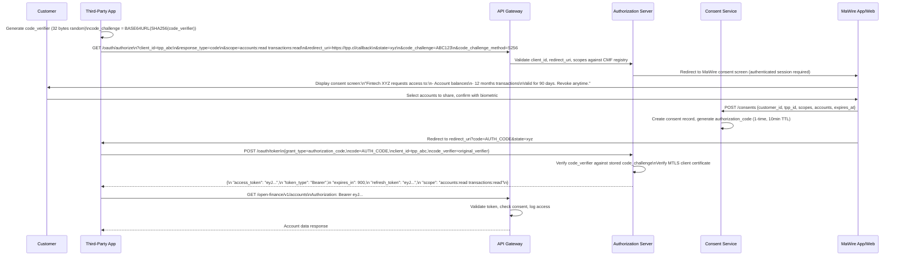

# 12 — Open Finance Platform

## Regulatory Foundation

### Ley Fintec 21.521 (effective February 2023)

Chile's Open Finance framework under Ley 21.521 (Ley Fintec) establishes:

- **Article 21 — Open Finance**: Financial institutions holding customer data must share it with CMF-authorized third parties upon customer consent.
- **Article 22 — API Standards**: CMF sets technical standards for data sharing APIs.
- **Article 23 — Consent**: Consent must be explicit, granular (per data category), time-limited, and revocable at any time.
- **CMF Norma de Carácter General N°502** (2024): technical implementation guidelines.

### Data Categories Available for Sharing

| Category | Data Elements | Customer Authorization Level |
|---|---|---|
| Account Information | Account numbers, balances, product type | Explicit per-account |
| Transaction History | Last 24 months of transactions | Explicit per-account |
| Product Information | Loans, cards, investments held | Explicit per-product |
| Identity Data | Name, RUT, address (verified) | Explicit, enhanced consent |
| Payment Initiation | Ability to initiate payments on behalf | Explicit + per-transaction confirmation |

---

## Consent Management System

### Data Model

```sql
-- Third-party providers registered with CMF
CREATE TABLE third_party_providers (
    id              UUID          PRIMARY KEY DEFAULT gen_random_uuid(),
    cmf_registration_id VARCHAR(50) NOT NULL UNIQUE,
    name            VARCHAR(200)  NOT NULL,
    legal_name      VARCHAR(200)  NOT NULL,
    rut             VARCHAR(20)   NOT NULL UNIQUE,
    status          VARCHAR(20)   NOT NULL DEFAULT 'ACTIVE'
                    CHECK (status IN ('PENDING','ACTIVE','SUSPENDED','REVOKED')),
    allowed_scopes  TEXT[]        NOT NULL,
    redirect_uris   TEXT[]        NOT NULL,
    jwks_uri        TEXT          NOT NULL,  -- for MTLS cert verification
    logo_uri        TEXT,
    privacy_policy_uri TEXT       NOT NULL,
    client_id       VARCHAR(100)  NOT NULL UNIQUE,
    created_at      TIMESTAMPTZ   NOT NULL DEFAULT NOW(),
    verified_at     TIMESTAMPTZ
);

-- Customer consent records
CREATE TABLE consents (
    id                  UUID          PRIMARY KEY DEFAULT gen_random_uuid(),
    customer_id         UUID          NOT NULL,
    third_party_id      UUID          NOT NULL REFERENCES third_party_providers(id),
    -- Scopes: e.g., ['accounts:read','transactions:read:account_id_xyz']
    scopes              TEXT[]        NOT NULL,
    status              VARCHAR(20)   NOT NULL DEFAULT 'ACTIVE'
                        CHECK (status IN ('PENDING','ACTIVE','REVOKED','EXPIRED')),
    granted_at          TIMESTAMPTZ,
    expires_at          TIMESTAMPTZ   NOT NULL,  -- max 12 months per CMF
    revoked_at          TIMESTAMPTZ,
    revocation_reason   VARCHAR(100),
    redirect_uri        TEXT          NOT NULL,
    state               VARCHAR(500)  NOT NULL,  -- PKCE state parameter
    code_challenge      VARCHAR(200)  NOT NULL,  -- PKCE S256 challenge
    authorized_accounts UUID[]        NOT NULL DEFAULT '{}',
    ip_address          INET          NOT NULL,
    user_agent          TEXT,
    created_at          TIMESTAMPTZ   NOT NULL DEFAULT NOW(),
    -- Immutability: no updates to status via application; insert new records
    CONSTRAINT fk_customer FOREIGN KEY (customer_id) REFERENCES customers(id)
);

CREATE INDEX idx_consents_customer ON consents (customer_id, status);
CREATE INDEX idx_consents_tpp ON consents (third_party_id, status);

-- Token records (OAuth access + refresh tokens)
CREATE TABLE oauth_tokens (
    id              UUID          PRIMARY KEY DEFAULT gen_random_uuid(),
    consent_id      UUID          NOT NULL REFERENCES consents(id),
    customer_id     UUID          NOT NULL,
    third_party_id  UUID          NOT NULL,
    token_type      VARCHAR(20)   NOT NULL CHECK (token_type IN ('ACCESS','REFRESH')),
    token_hash      BYTEA         NOT NULL UNIQUE,  -- SHA-256 of the actual token
    scopes          TEXT[]        NOT NULL,
    expires_at      TIMESTAMPTZ   NOT NULL,
    revoked_at      TIMESTAMPTZ,
    last_used_at    TIMESTAMPTZ,
    created_at      TIMESTAMPTZ   NOT NULL DEFAULT NOW()
);

-- Audit: every data access by a third party is logged
CREATE TABLE open_finance_access_log (
    id              BIGSERIAL     PRIMARY KEY,
    consent_id      UUID          NOT NULL REFERENCES consents(id),
    third_party_id  UUID          NOT NULL,
    customer_id     UUID          NOT NULL,
    endpoint        VARCHAR(200)  NOT NULL,
    method          VARCHAR(10)   NOT NULL,
    scopes_used     TEXT[]        NOT NULL,
    response_code   SMALLINT      NOT NULL,
    response_ms     INTEGER       NOT NULL,
    ip_address      INET          NOT NULL,
    created_at      TIMESTAMPTZ   NOT NULL DEFAULT NOW()
);
-- Partition by month for retention management
-- Retention: 10 years per CMF requirement
```

---

## OAuth 2.0 + PKCE Authorization Flow



### Token Lifetimes
- Authorization code: 10 minutes (single use)
- Access token: 15 minutes
- Refresh token: 30 days (rotated on each use)
- Consent max duration: 12 months (CMF limit)

---

## Open Finance API Specification

### Base URL: `https://openfinance.mawire.cl/v1`

### Security: FAPI 2.0 Security Profile
- All requests require valid access token (Bearer)
- TPP requests additionally require MTLS client certificate (matching registered JWKS)
- PAR (Pushed Authorization Requests) required for payment initiation scope
- Signed request objects (JAR - JWT Authorization Request) for sensitive operations

---

### Account Information API

**GET /accounts**
```json
// Response 200
{
  "data": [
    {
      "account_id": "acc_01HN4X2Y3Z",
      "account_number_masked": "****4521",
      "account_type": "CHECKING",
      "currency": "CLP",
      "balance": {
        "available": 1234567,
        "current": 1284567,
        "pending": -50000,
        "as_of": "2026-06-06T14:32:00Z"
      },
      "status": "ACTIVE",
      "institution": {
        "name": "MaWire Bank",
        "cmf_code": "MW001"
      }
    }
  ],
  "meta": {
    "total_count": 2,
    "consent_id": "con_01HN4X...",
    "consent_expires_at": "2026-09-06T00:00:00Z"
  }
}
```

**GET /accounts/{accountId}/transactions**
```json
// Response 200
{
  "data": [
    {
      "transaction_id": "txn_01HN4X...",
      "amount": -45000,
      "currency": "CLP",
      "description": "LIDER 220 LAS CONDES",
      "category": "Supermercado",
      "merchant": {
        "name": "Supermercado Lider",
        "mcc": "5411",
        "city": "Santiago"
      },
      "type": "DEBIT",
      "status": "COMPLETED",
      "booking_date": "2026-06-05",
      "value_date": "2026-06-05",
      "balance_after": 1279567
    }
  ],
  "meta": {
    "cursor": "eyJpZCI6Ijk4NzY1In0=",
    "has_more": true
  }
}
```

### Payment Initiation API

**POST /payments/domestic**
```json
// Request
{
  "idempotency_key": "uuid-v4",
  "source_account_id": "acc_01HN4X...",
  "amount": 50000,
  "currency": "CLP",
  "recipient": {
    "bank_code": "001",
    "account_number": "1234567890",
    "account_type": "CHECKING",
    "rut": "12345678-9",
    "name": "María González"
  },
  "concept": "Pago arriendo junio 2026",
  "execution_date": "2026-06-06"
}

// Response 201
{
  "payment_id": "pay_01HN4X...",
  "status": "PENDING_AUTHORIZATION",
  "authorization_url": "https://app.mawire.cl/authorize/pay_01HN4X...",
  "expires_at": "2026-06-06T14:47:00Z"
}
```

Payment initiation requires **per-payment customer authorization** in the MaWire app (biometric) even when consent exists. This is a CMF requirement for payment initiation services.

---

## API Gateway Configuration

```yaml
# Kong configuration for Open Finance API
services:
  - name: open-finance-api
    url: http://open-finance-service:8080
    plugins:
      - name: jwt
        config:
          key_claim_name: kid
          claims_to_verify: [exp, nbf]
          
      - name: rate-limiting
        config:
          minute: 100        # per TPP client_id
          hour: 1000
          policy: redis
          
      - name: mtls-auth
        config:
          ca_certificates: [cmf-approved-ca-bundle]
          skip_consumer_grab: false
          
      - name: request-transformer
        config:
          add:
            headers:
              - "X-Consent-ID:$(consumer.custom_id)"
              - "X-Customer-ID:$(jwt.sub)"

      - name: audit-log
        config:
          # Custom plugin: logs every request to open_finance_access_log
          kafka_topic: banking.open-finance.access-log
```

---

## Consent Management UI (Customer-Facing)

### Consent Dashboard in MaWire App

**View Active Consents:**
- List of all TPPs with access
- For each: TPP name, logo, data categories accessed, expiry date
- Last data access timestamp
- "Revocar acceso" button (immediately revokes)

**Consent Grant Screen (during OAuth flow):**
- TPP name, logo, CMF registration badge
- Explicit list of what will be shared (not legal text — plain Spanish)
- Account selector (checkbox per account)
- Duration selector (30 / 60 / 90 / 180 / 365 days)
- Privacy policy link
- Biometric confirmation required

### Consent Revocation

On revocation:
1. Consent record updated: `status = REVOKED`, `revoked_at = NOW()`
2. All associated access tokens invalidated immediately (Redis blacklist)
3. Refresh tokens deleted from database
4. TPP notified via webhook: `consent.revoked` event
5. Audit log entry created

---

## Regulatory Compliance

| Requirement | Implementation |
|---|---|
| CMF TPP registry check | Real-time validation on every authorization request |
| Consent record retention | 7 years, immutable, append-only |
| Access audit log retention | 10 years |
| Customer consent in plain language | UX requirement, legal review on consent text |
| Incident reporting to CMF | Within 24h of any data breach involving TPP access |
| TPP suspension capability | On CMF instruction: block client_id at API Gateway within 1 hour |
| Data minimization | API returns only scopes explicitly consented |
| Cross-border data transfer | Requires CMF approval; default: data stays in Chile (AWS sa-east-1) |
