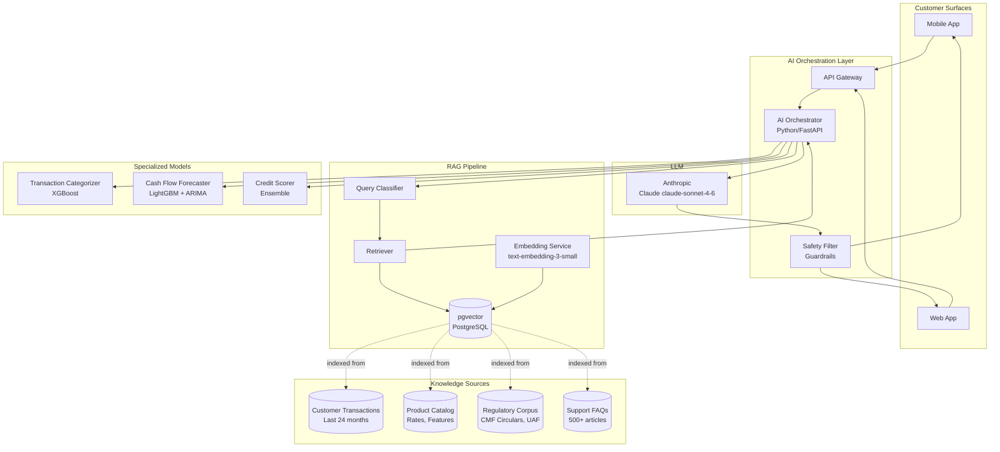

# 13 — AI Banking Layer

## Strategy

MaWire Bank's AI layer is embedded throughout the product — not bolted on as a chatbot. Every customer interaction surface is augmented by AI: the home dashboard surfaces insights automatically, the assistant responds in conversational Chilean Spanish, and the credit engine uses alternative signals for thin-file customers.

**Guiding constraint**: AI provides *information and education*, never *advice*. CMF classifies personalized financial advice as a regulated activity (Ley 20.712, Ley 18.045). All AI-generated content carries appropriate disclosures.

---

## LLM Provider Selection

| Provider | Model | Input $/1M | Output $/1M | Context | LATAM Latency | Data BAA | Reasoning |
|---|---|---|---|---|---|---|---|
| Anthropic | Claude Sonnet 4.6 | $3.00 | $15.00 | 200K | ~400ms (US-East) | Available | **RECOMMENDED** |
| OpenAI | GPT-4o | $5.00 | $15.00 | 128K | ~350ms | Available | Higher cost |
| Google | Gemini 1.5 Pro | $3.50 | $10.50 | 1M | ~450ms | Available | Strong for long context |
| Mistral | Mistral Large | $8.00 | $24.00 | 128K | ~600ms | EU-hosted | Higher cost, EU focus |
| Self-hosted | Llama 3.1 70B | ~$0.40 compute | — | 128K | <50ms | Full control | Operational overhead |

**Recommendation: Anthropic Claude claude-sonnet-4-6**

Rationale:
- 200K context window handles 18+ months of transaction history in a single call
- Consistently highest scores on financial reasoning benchmarks
- Constitutional AI training aligns with banking trust requirements (less likely to hallucinate financial data)
- Structured output (tool use / JSON mode) reliability critical for financial data extraction
- Data Processing Agreement available for Chilean regulatory compliance
- Latency acceptable for async insight generation (not in payment critical path)

---

## Architecture Overview



---

## MaWire AI Assistant

### System Prompt

```xml
<system>
You are MaWire's financial assistant, helping Chilean banking customers 
understand their finances and navigate MaWire's products.

<role>INFORMATION_PROVIDER</role>
<language>Spanish (Chilean dialect — use "plata" for money, "lucas" for thousands of pesos naturally)</language>
<persona>Knowledgeable, warm, direct. Like a financially savvy friend who works in banking.</persona>

<strict_rules>
1. You provide INFORMATION, never personalized financial ADVICE.
   - OK: "Los fondos mutuos conservadores en Chile rinden entre 3-5% anual actualmente"
   - NOT OK: "Deberías invertir tu plata en el fondo conservador"
   
2. For investment decisions, always add: "Para recomendaciones personalizadas, 
   consulta con un asesor financiero certificado CMF."

3. Transaction data shown to you belongs to the authenticated user only. 
   Never infer or share data about other customers.

4. NEVER hallucinate: if you don't have the data in context, say so.
   "No tengo información de esa transacción. Puedes buscarla en tu historial."

5. Monetary amounts always in Chilean format: $ 1.234.567 (dot thousands, no decimals for CLP)

6. Disclose AI nature when asked: "Soy el asistente virtual de MaWire."

7. For urgent issues (fraud, blocked card): immediately provide the human support path.
   "Para bloquear tu tarjeta de emergencia, llama al 600 XXX XXXX o hazlo en Ajustes > Tarjeta > Bloquear."
</strict_rules>

<capabilities>
- Explain transactions ("¿Qué es este cobro de JUNAEB?")
- Summarize and categorize spending
- Answer product questions (rates, limits, fees)
- Guide through processes (cómo hacer una transferencia, cómo abrir una cuenta de ahorro)
- Explain CMF regulations in plain language
- Calculate loan costs, compare savings products
- Forecast end-of-month balance (using provided transaction data)
</capabilities>

<cannot_do>
- Initiate transactions
- Change account settings, passwords, or security
- Provide personalized investment portfolio recommendations
- Access or discuss other customers' information
- Make binding product commitments (rates may differ from current offer)
</cannot_do>
</system>
```

### Conversation Flow

```python
# ai-service/assistant.py
import anthropic
from typing import AsyncIterator

client = anthropic.AsyncAnthropic()  # API key from HashiCorp Vault

async def handle_message(
    session: ChatSession,
    user_message: str,
    customer_context: CustomerContext,
) -> AsyncIterator[str]:
    
    # 1. Retrieve relevant context via RAG
    relevant_docs = await rag_retriever.retrieve(
        query=user_message,
        customer_id=session.customer_id,
        top_k=5,
    )
    
    # 2. Build context-enriched prompt
    context_block = format_context(relevant_docs, customer_context)
    
    # 3. Stream response from Claude
    async with client.messages.stream(
        model="claude-sonnet-4-6",
        max_tokens=1024,
        system=SYSTEM_PROMPT,
        messages=[
            {"role": "user", "content": context_block + "\n\nPregunta del cliente: " + user_message}
        ] + session.history[-10:],  # last 10 turns for context
    ) as stream:
        async for text_chunk in stream.text_stream:
            # Safety filter: block PII, harmful content
            filtered = await safety_filter.process(text_chunk)
            yield filtered
    
    # 4. Log conversation (90-day retention, customer can delete)
    await conversation_store.append(session.id, user_message, full_response)
```

---

## RAG Architecture

### Vector Database (pgvector)

```sql
-- Enable pgvector extension
CREATE EXTENSION IF NOT EXISTS vector;

-- Transaction embeddings (for semantic search over customer transactions)
CREATE TABLE transaction_embeddings (
    transaction_id  UUID          PRIMARY KEY,
    customer_id     UUID          NOT NULL,
    embedding       vector(1536)  NOT NULL,  -- text-embedding-3-small dimensions
    text_content    TEXT          NOT NULL,  -- "CLP 45000 Supermercado Lider Las Condes 2026-06-05"
    created_at      TIMESTAMPTZ   NOT NULL DEFAULT NOW()
);

CREATE INDEX idx_tx_embeddings_customer
    ON transaction_embeddings USING hnsw (embedding vector_cosine_ops)
    WITH (m = 16, ef_construction = 64);

-- Product knowledge base
CREATE TABLE product_knowledge (
    id          UUID          PRIMARY KEY DEFAULT gen_random_uuid(),
    product     VARCHAR(100)  NOT NULL,
    category    VARCHAR(50)   NOT NULL,
    content     TEXT          NOT NULL,
    embedding   vector(1536)  NOT NULL,
    version     INTEGER       NOT NULL DEFAULT 1,
    updated_at  TIMESTAMPTZ   NOT NULL DEFAULT NOW()
);

CREATE INDEX idx_product_knowledge_embedding
    ON product_knowledge USING hnsw (embedding vector_cosine_ops);
```

### Retrieval Query

```python
async def retrieve(query: str, customer_id: str, top_k: int = 5) -> list[Document]:
    # Embed the query
    query_embedding = await embed(query)  # OpenAI text-embedding-3-small
    
    # Classify query intent
    intent = classify_intent(query)
    
    docs = []
    
    if intent in ["transaction_lookup", "spending_question"]:
        # Search customer's transaction history
        tx_docs = await db.fetch("""
            SELECT text_content, 1 - (embedding <=> $1) AS similarity
            FROM transaction_embeddings
            WHERE customer_id = $2
            ORDER BY embedding <=> $1
            LIMIT $3
        """, query_embedding, customer_id, top_k)
        docs.extend(tx_docs)
    
    if intent in ["product_question", "rate_question", "process_question"]:
        # Search product knowledge base
        product_docs = await db.fetch("""
            SELECT content, 1 - (embedding <=> $1) AS similarity
            FROM product_knowledge
            ORDER BY embedding <=> $1
            LIMIT $2
        """, query_embedding, top_k)
        docs.extend(product_docs)
    
    # Rerank by similarity score, return top_k
    docs.sort(key=lambda d: d.similarity, reverse=True)
    return docs[:top_k]
```

---

## Spending Insights Engine

### Transaction Categorization Model

```python
# Merchant category taxonomy — Chilean market
CATEGORIES = {
    "Supermercado":     ["LIDER", "JUMBO", "TOTTUS", "UNIMARC", "SMU", "ACUENTA"],
    "Restaurantes":     ["MCC:5812", "MCC:5814", "UBEREATS", "RAPPI", "PEDIDOSYA"],
    "Combustible":      ["COPEC", "SHELL", "PETROBRAS", "MCC:5541"],
    "Transporte":       ["UBER", "CABIFY", "METRO", "MCC:4111", "MCC:4121"],
    "Farmacias":        ["AHUMADA", "CRUZ VERDE", "SALCOBRAND", "MCC:5912"],
    "Telecomunicaciones": ["MOVISTAR", "ENTEL", "CLARO", "VTR", "WOM"],
    "Servicios básicos": ["ENEL", "AGUAS ANDINAS", "METROGAS", "ESVAL"],
    "Educación":        ["MCC:8211", "MCC:8220", "MCC:8299"],
    "Entretenimiento":  ["NETFLIX", "SPOTIFY", "DISNEY", "STEAM", "MCC:7941"],
    "Viajes":           ["LATAM", "SKY AIRLINE", "BOOKING", "AIRBNB", "MCC:4511"],
    "Salud":            ["MCC:8011", "MCC:8049", "CLINICA", "HOSPITAL"],
    "Ropa y calzado":   ["FALABELLA", "RIPLEY", "PARIS", "H&M", "MCC:5600"],
}

# XGBoost categorization model
# Features: merchant_name_tfidf(256), mcc_onehot(200), amount_bucket(10), hour(24)
# Training: 2M labeled Chilean transactions
# Accuracy: 94.2% (vs 87% rule-only baseline)

def categorize_transaction(tx: Transaction) -> CategoryResult:
    features = extract_features(tx)
    proba = model.predict_proba(features)[0]
    category_idx = proba.argmax()
    return CategoryResult(
        category=CATEGORY_LABELS[category_idx],
        confidence=float(proba[category_idx]),
        fallback="Otros" if proba[category_idx] < 0.60 else None,
    )
```

### Monthly Insights Generation

Generated as a background job on the 1st of each month (or on demand):

```python
async def generate_monthly_insights(customer_id: str, month: str) -> list[Insight]:
    insights = []
    txs = await fetch_transactions(customer_id, month)
    prev_txs = await fetch_transactions(customer_id, prev_month(month))
    
    # Categorize all transactions
    by_category = group_by_category(txs)
    prev_by_category = group_by_category(prev_txs)
    
    # Insight 1: Top spending category
    top_cat = max(by_category, key=lambda c: by_category[c])
    insights.append(Insight(
        type="TOP_CATEGORY",
        text=f"Tu mayor gasto en {month_name} fue en {top_cat}: $ {by_category[top_cat]:,.0f}".replace(",", "."),
        amount=by_category[top_cat],
    ))
    
    # Insight 2: Month-over-month change >20%
    for cat, amount in by_category.items():
        prev = prev_by_category.get(cat, 0)
        if prev > 0:
            change_pct = (amount - prev) / prev * 100
            if abs(change_pct) > 20 and amount > 10_000:  # CLP 10K minimum
                direction = "más" if change_pct > 0 else "menos"
                insights.append(Insight(
                    type="CATEGORY_CHANGE",
                    text=f"Gastaste {abs(change_pct):.0f}% {direction} en {cat} que el mes pasado.",
                    amount=amount,
                    change_pct=change_pct,
                ))
    
    # Insight 3: Unusual transaction
    for tx in txs:
        z_score = (tx.amount - customer_avg_amount) / customer_std_amount
        if z_score > 3.0:
            insights.append(Insight(
                type="UNUSUAL_TRANSACTION",
                text=f"Tuviste un gasto inusual de $ {tx.amount:,.0f} en {tx.merchant_name}.",
            ))
    
    return insights[:5]  # max 5 insights to avoid notification fatigue
```

---

## Cash Flow Forecasting

### Model Architecture

```python
class CashFlowForecaster:
    """
    Hybrid ARIMA + LightGBM model for 30-day balance forecasting.
    Inputs: 6 months of daily balance history + detected recurring transactions
    Output: daily projected balance for next 30 days with confidence intervals
    """
    
    def detect_recurring_transactions(self, txs: list[Transaction]) -> list[Recurring]:
        """
        Identifies recurring patterns:
        - Monthly salary (large positive, consistent day of month)
        - Recurring bills (Netflix, gym, utilities — consistent amount ± 5%)
        - Loan payments (consistent amount, consistent date)
        """
        # Frequency analysis using FFT on transaction time series
        recurring = []
        merchant_groups = group_by_merchant(txs)
        
        for merchant, group_txs in merchant_groups.items():
            if len(group_txs) >= 3:
                intervals = compute_intervals(group_txs)
                if coefficient_of_variation(intervals) < 0.15:  # regular interval
                    recurring.append(Recurring(
                        merchant=merchant,
                        amount=median(t.amount for t in group_txs),
                        day_of_month=modal_day(group_txs),
                        confidence=1 - coefficient_of_variation(intervals),
                    ))
        return recurring
    
    def forecast(self, customer_id: str) -> ForecastResult:
        history = fetch_daily_balances(customer_id, days=180)
        recurring = self.detect_recurring_transactions(
            fetch_transactions(customer_id, days=90)
        )
        
        # ARIMA for trend + seasonality
        arima_forecast = self.arima_model.predict(history, steps=30)
        
        # LightGBM adjustment for known upcoming transactions
        features = build_forecast_features(history, recurring, forecast_horizon=30)
        lgbm_adjustment = self.lgbm_model.predict(features)
        
        combined = arima_forecast + lgbm_adjustment
        
        # Alert if projected to go below CLP 50,000 within 7 days
        alerts = []
        for day, balance in enumerate(combined[:7]):
            if balance < 50_000:
                alerts.append(f"Tu saldo podría ser bajo en {day+1} días ($ {balance:,.0f})")
        
        return ForecastResult(daily_balances=combined, alerts=alerts)
```

---

## AI Cost Model

### Token Consumption Estimates

| Feature | Usage Pattern | Avg tokens/call | Cost/1K calls (Claude Sonnet) |
|---|---|---|---|
| AI Assistant message | 30% of DAU, 3 msgs/session | 3,000 (in+out) | $0.054 |
| Transaction explanation | 15% of DAU, 5/month | 800 | $0.014 |
| Monthly insights generation | 100% of MAU, 1/month | 5,000 | $0.090 |
| Cash flow forecast | 20% of MAU, daily | 2,000 (context) | $0.036 |

### Cost at Scale

| MAU | AI Assistant | Categorization | Insights | **Total/month** |
|---|---|---|---|---|
| 10,000 | $162 | $20 | $90 | **~$272** |
| 100,000 | $1,620 | $200 | $900 | **~$2,720** |
| 1,000,000 | $16,200 | $2,000 | $9,000 | **~$27,200** |

Categorization uses XGBoost (local inference, near-zero marginal cost).
Forecast uses LightGBM (local inference, near-zero marginal cost).
LLM costs are primarily for the assistant and insight generation.

---

## Privacy and Data Controls

### PII Handling in AI Pipeline

```python
# Never send to LLM:
NEVER_INCLUDE = [
    "rut", "rut_encrypted",          # Chilean national ID
    "account_number",                 # full account number
    "card_number", "card_pan",        # card numbers
    "email", "phone_number",          # contact info
    "address",                        # home address
]

# Safe to include in LLM context:
SAFE_TO_INCLUDE = [
    "transaction.amount",
    "transaction.date",
    "transaction.merchant_name",      # de-normalized merchant name
    "transaction.category",
    "account.balance",                # aggregated, not account number
    "account.type",                   # CHECKING / SAVINGS
]

def sanitize_for_llm(context: dict) -> dict:
    """Strip PII before sending to external LLM API."""
    safe = {}
    for key, value in context.items():
        if not any(pii_field in key for pii_field in NEVER_INCLUDE):
            safe[key] = value
    return safe
```

### Conversation Data Retention
- Conversation logs: 90 days by default
- Customer can delete all conversations: DELETE /ai/conversations (right to erasure)
- Conversations are NOT used to train Anthropic models (zero-retention API option)
- Chilean data protection law (Ley 19.628 + Proyecto Ley de Datos Personales 2024): all AI processing disclosed in privacy policy

---

## Regulatory Disclosures (CMF)

The AI assistant must include the following disclosures:

1. **First session**: "Soy el asistente virtual de MaWire. Puedo ayudarte con información sobre tus finanzas y productos MaWire, pero no soy un asesor financiero certificado."

2. **Investment-adjacent responses**: Automatic disclaimer appended: *"Esta información es general y no constituye asesoría financiera. Para recomendaciones personalizadas, consulta con un profesional certificado por la CMF."*

3. **Always available**: "Hablar con un humano" button in chat UI. CMF requires human escalation path for bank customers.
