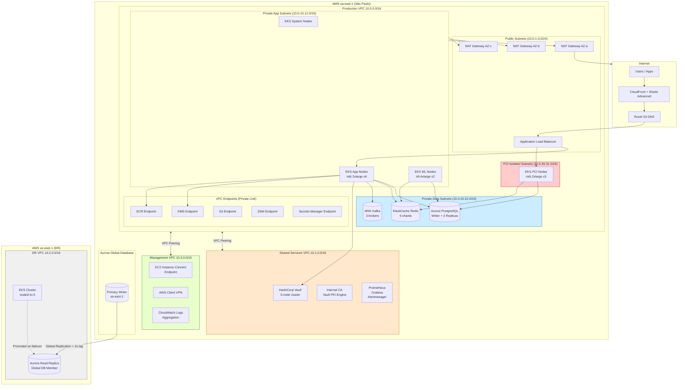

# 14 — Cloud Infrastructure Architecture

**MaWire Bank — Chile**
**Classification:** Internal — Architecture
**Last Updated:** 2026-06-06
**Owner:** Platform Engineering

---

## Cloud Provider Selection

### AWS vs Azure vs GCP Comparison

| Criterion | AWS | Azure | GCP |
|---|---|---|---|
| **Banking references in LATAM** | Nubank, Itau, Bradesco, Santander Chile, Banco de Chile | BBVA, Santander (corporate), Bci | Few production banking references |
| **Data residency — Chile** | No Chile region; sa-east-1 (São Paulo) is nearest; contractual data residency available | No Chile region; Brazil South (São Paulo) nearest | No Chile region; southamerica-east1 (São Paulo) nearest |
| **Data residency — São Paulo** | sa-east-1 — GA since 2011, most mature | Brazil South — GA, LGPD compliant | southamerica-east1 — GA |
| **Managed Kubernetes** | EKS — most mature, widest tooling, Karpenter for node autoscaling | AKS — tight Azure AD integration | GKE — Autopilot is innovative but less LATAM adoption |
| **Managed databases** | Aurora PostgreSQL — industry-leading managed Postgres with Global Database | Azure Database for PostgreSQL Flexible Server | Cloud SQL PostgreSQL — solid but fewer LATAM deployments |
| **HSM support** | AWS CloudHSM — FIPS 140-2 Level 3, full key control | Azure Dedicated HSM — FIPS 140-2 Level 3 | Cloud HSM via Cloud KMS — FIPS 140-2 Level 3 |
| **PCI-DSS** | Level 1 Service Provider — largest PCI-scoped footprint | Level 1 Service Provider | Level 1 Service Provider |
| **ISO 27001** | Yes — sa-east-1 in scope | Yes — Brazil South in scope | Yes — southamerica-east1 in scope |
| **SOC 2 Type II** | Yes | Yes | Yes |
| **Chilean CMF recognition** | Strongest — CMF circular 2 and 20 compliance guides reference AWS | Recognized | Recognized |
| **Network connectivity** | Direct Connect to Chile (Claro, GTD, Entel partners); 3 PoPs in Santiago | ExpressRoute — fewer Chilean ISP partners | Cloud Interconnect — limited Chilean partners |
| **Chilean region availability** | No local region; committed São Paulo latency ~180ms to Santiago | No local region | No local region |
| **Partner ecosystem** | Mambu, Temenos, Finastra, Galileo all run on AWS | Mambu supports Azure | Limited core banking ISV presence |
| **Cost at scale (est. 1M users)** | ~$85K/month (reserved + savings plans) | ~$92K/month | ~$88K/month |
| **Managed Kafka** | MSK — Apache Kafka compatible, SASL/TLS, IAM auth | Event Hubs — Kafka-compatible protocol | Pub/Sub — different model, not Kafka-compatible |
| **Secrets management** | Secrets Manager + KMS; HashiCorp Vault integration | Key Vault — excellent | Secret Manager — solid |
| **DDoS protection** | Shield Advanced — $3,000/month, 24x7 DRT access | DDoS Protection Standard | Cloud Armor — per-policy pricing |

### RECOMMENDATION: AWS (sa-east-1 Primary + us-east-1 Secondary)

**Justification:**

1. **Largest banking ecosystem in LATAM.** Nubank (80M+ customers), Itau, Bradesco, and Santander Chile all run production workloads on AWS. This means battle-tested runbooks, mature compliance tooling, and available talent in Santiago and São Paulo.
2. **Mambu compatibility.** MaWire's core banking system (Mambu) is AWS-native and certified on EKS. Running both on AWS eliminates cross-cloud latency for Mambu API calls.
3. **CMF alignment.** Chile's financial regulator (Comisión para el Mercado Financiero) has the most detailed AWS-specific guidance of the three providers, covering shared responsibility model, data encryption requirements, and incident reporting.
4. **Compliance depth.** AWS has the widest set of PCI-DSS validated services in sa-east-1, critical for card issuing and payment processing.
5. **Operational maturity.** Terraform AWS provider, EKS add-ons, Aurora Global Database, and MSK are all GA in sa-east-1 with multi-year track records.

---

## Production Architecture

### VPC Design

Four isolated VPCs with explicit peering:

```
┌─────────────────────────────────────────────────────────┐
│  Production VPC (10.0.0.0/16) — sa-east-1               │
│  ┌────────────────┐ ┌────────────────┐ ┌─────────────┐  │
│  │ Public /24     │ │ Private App    │ │ Private Data│  │
│  │ 10.0.1-3.0     │ │ 10.0.10-12.0  │ │ 10.0.20-22  │  │
│  │ ALB, NAT GW    │ │ EKS nodes      │ │ RDS, Redis  │  │
│  └────────────────┘ └────────────────┘ └─────────────┘  │
│  ┌───────────────────────────────────┐                   │
│  │ Isolated PCI subnets 10.0.30-31.0 │                   │
│  │ Card processing nodes             │                   │
│  └───────────────────────────────────┘                   │
└─────────────────────────────────────────────────────────┘
         │ VPC Peering                │ VPC Peering
┌────────┴──────────────┐   ┌─────────┴─────────────────┐
│ Shared Services VPC   │   │ Management VPC             │
│ 10.1.0.0/16           │   │ 10.3.0.0/16               │
│ HashiCorp Vault        │   │ Session Manager bastions   │
│ Internal CA            │   │ VPN endpoint               │
│ Monitoring stack       │   │ Log aggregation            │
└───────────────────────┘   └───────────────────────────┘

┌──────────────────────────────────────────────────────────┐
│  DR VPC (10.2.0.0/16) — us-east-1 (passive standby)      │
│  Aurora read replicas, EKS cluster (scaled to 0)         │
└──────────────────────────────────────────────────────────┘
```

#### VPC 1 — Production (10.0.0.0/16) — sa-east-1

| Subnet | CIDR | AZ | Purpose |
|---|---|---|---|
| public-1a | 10.0.1.0/24 | sa-east-1a | Internet-facing ALB, NAT Gateway |
| public-1b | 10.0.2.0/24 | sa-east-1b | Internet-facing ALB, NAT Gateway |
| public-1c | 10.0.3.0/24 | sa-east-1c | Internet-facing ALB, NAT Gateway |
| private-app-1a | 10.0.10.0/24 | sa-east-1a | EKS worker nodes (app) |
| private-app-1b | 10.0.11.0/24 | sa-east-1b | EKS worker nodes (app) |
| private-app-1c | 10.0.12.0/24 | sa-east-1c | EKS worker nodes (app) |
| private-data-1a | 10.0.20.0/24 | sa-east-1a | Aurora, ElastiCache |
| private-data-1b | 10.0.21.0/24 | sa-east-1b | Aurora, ElastiCache |
| private-data-1c | 10.0.22.0/24 | sa-east-1c | Aurora, ElastiCache |
| pci-isolated-1a | 10.0.30.0/24 | sa-east-1a | Card processing EKS nodes |
| pci-isolated-1b | 10.0.31.0/24 | sa-east-1b | Card processing EKS nodes |

#### VPC 2 — Shared Services (10.1.0.0/16) — sa-east-1

| Subnet | CIDR | Purpose |
|---|---|---|
| private-vault-1a | 10.1.10.0/24 | HashiCorp Vault cluster node 1 |
| private-vault-1b | 10.1.11.0/24 | HashiCorp Vault cluster node 2 |
| private-vault-1c | 10.1.12.0/24 | HashiCorp Vault cluster node 3 |
| private-pki-1a | 10.1.20.0/24 | Internal CA (Vault PKI secrets engine) |
| private-monitoring-1a | 10.1.30.0/24 | Prometheus, Grafana, Alertmanager |

#### VPC 3 — DR (10.2.0.0/16) — us-east-1

| Subnet | CIDR | Purpose |
|---|---|---|
| private-app-dr-1a | 10.2.10.0/24 | EKS nodes (scaled to 0 when passive) |
| private-data-dr-1a | 10.2.20.0/24 | Aurora Global read replica |
| private-data-dr-1b | 10.2.21.0/24 | Aurora Global read replica |

#### VPC 4 — Management (10.3.0.0/16) — sa-east-1

| Subnet | CIDR | Purpose |
|---|---|---|
| private-mgmt-1a | 10.3.10.0/24 | EC2 Instance Connect Endpoint (no SSH keys) |
| private-vpn-1a | 10.3.20.0/24 | AWS Client VPN endpoint |
| private-logs-1a | 10.3.30.0/24 | CloudWatch Logs aggregation, S3 export |

#### VPC Peering and Transit Gateway

```
Production VPC  ←→  Shared Services VPC  (pcx-prod-shared)
Production VPC  ←→  Management VPC        (pcx-prod-mgmt)
Production VPC  ←→  DR VPC               (Transit Gateway — cross-region)
```

No peering between Shared Services and Management (least privilege). All cross-VPC routes are explicitly defined in route tables; no transit routing allowed through Production VPC.

---

## Kubernetes Architecture (EKS)

### Cluster Design

```
Cluster name:    mawire-production
EKS version:     1.30 (upgraded on N-1 cadence, ~3 months behind latest)
Region:          sa-east-1
Control plane:   AWS-managed, multi-AZ
Networking:      AWS VPC CNI (pod IPs from private-app subnets)
Service mesh:    Istio 1.22 (mTLS between all services)
Ingress:         AWS Load Balancer Controller (ALB Ingress)
Autoscaling:     Karpenter (replaces Cluster Autoscaler)
Image registry:  ECR (private, immutable tags enforced)
```

### Node Groups

| Node Group | Instance Type | Count | Scaling | Taints | Purpose |
|---|---|---|---|---|---|
| system | t3.medium | 3 (fixed) | None | CriticalAddonsOnly | kube-system, CoreDNS, Karpenter, AWS CNI |
| app | m6i.2xlarge | 6 | 3 – 20 | None | All application workloads |
| pci | m6i.2xlarge | 3 | 3 – 6 | pci=true:NoSchedule | Card processing, PCI-scoped pods only |
| ml | r6i.4xlarge | 2 | 2 – 6 | ml=true:NoSchedule | Fraud model inference, feature computation |

All nodes use:
- Amazon Linux 2023 (EKS-optimized AMI)
- EBS gp3 root volume, 100 GB, encrypted with customer-managed KMS key
- IMDSv2 enforced (no IMDSv1)
- Nodes in private-app subnets only (no public IP)

### Kubernetes Namespaces

```yaml
namespaces:
  - name: mawire-core
    # Core banking: auth, customer, account, ledger
    labels:
      istio-injection: enabled
      compliance: standard

  - name: mawire-payments
    # Payment processing, SPEI, ACH, card-present
    labels:
      istio-injection: enabled
      compliance: standard

  - name: mawire-compliance
    # AML engine, KYC orchestration, OFAC screening
    labels:
      istio-injection: enabled
      compliance: aml

  - name: mawire-ml
    # Fraud scoring, risk models, feature store
    labels:
      istio-injection: enabled
      node-pool: ml

  - name: mawire-pci
    # Card issuing, authorization, tokenization
    labels:
      istio-injection: enabled
      compliance: pci-dss
      node-pool: pci

  - name: mawire-monitoring
    # Prometheus, Grafana, Alertmanager, Jaeger
    labels:
      istio-injection: disabled  # monitoring must work even if mesh is degraded

  - name: istio-system
    # Istiod, ingress gateway, egress gateway
```

### Kubernetes Manifests — auth-service

#### Deployment

```yaml
apiVersion: apps/v1
kind: Deployment
metadata:
  name: auth-service
  namespace: mawire-core
  labels:
    app: auth-service
    version: "1.0"
    app.kubernetes.io/part-of: mawire-core
    app.kubernetes.io/managed-by: argocd
  annotations:
    deployment.kubernetes.io/revision: "1"
spec:
  replicas: 3
  revisionHistoryLimit: 5
  selector:
    matchLabels:
      app: auth-service
  strategy:
    type: RollingUpdate
    rollingUpdate:
      maxSurge: 1
      maxUnavailable: 0          # zero-downtime deploys
  template:
    metadata:
      labels:
        app: auth-service
        version: "1.0"
      annotations:
        prometheus.io/scrape: "true"
        prometheus.io/port: "9090"
        prometheus.io/path: "/metrics"
        sidecar.istio.io/proxyCPU: "100m"
        sidecar.istio.io/proxyMemory: "128Mi"
    spec:
      serviceAccountName: auth-service
      automountServiceAccountToken: false   # explicit mount via projected volume
      securityContext:
        runAsNonRoot: true
        runAsUser: 1000
        runAsGroup: 1000
        fsGroup: 1000
        seccompProfile:
          type: RuntimeDefault
      topologySpreadConstraints:
        - maxSkew: 1
          topologyKey: topology.kubernetes.io/zone
          whenUnsatisfiable: DoNotSchedule
          labelSelector:
            matchLabels:
              app: auth-service
      affinity:
        podAntiAffinity:
          requiredDuringSchedulingIgnoredDuringExecution:
            - labelSelector:
                matchExpressions:
                  - key: app
                    operator: In
                    values:
                      - auth-service
              topologyKey: kubernetes.io/hostname
      containers:
        - name: auth-service
          image: 123456789.dkr.ecr.sa-east-1.amazonaws.com/auth-service:v1.4.2
          imagePullPolicy: Always
          ports:
            - name: http
              containerPort: 8080
              protocol: TCP
            - name: metrics
              containerPort: 9090
              protocol: TCP
            - name: grpc
              containerPort: 9000
              protocol: TCP
          resources:
            requests:
              cpu: "200m"
              memory: "256Mi"
            limits:
              cpu: "500m"
              memory: "512Mi"
          readinessProbe:
            httpGet:
              path: /healthz/ready
              port: 8080
            initialDelaySeconds: 10
            periodSeconds: 5
            failureThreshold: 3
            successThreshold: 1
            timeoutSeconds: 3
          livenessProbe:
            httpGet:
              path: /healthz/live
              port: 8080
            initialDelaySeconds: 30
            periodSeconds: 15
            failureThreshold: 3
            successThreshold: 1
            timeoutSeconds: 5
          startupProbe:
            httpGet:
              path: /healthz/startup
              port: 8080
            failureThreshold: 30
            periodSeconds: 2
          env:
            - name: APP_ENV
              value: "production"
            - name: LOG_LEVEL
              value: "info"
            - name: LOG_FORMAT
              value: "json"
            - name: VAULT_ADDR
              value: "https://vault.internal:8200"
            - name: VAULT_AUTH_METHOD
              value: "kubernetes"
            - name: VAULT_ROLE
              value: "auth-service"
            - name: REDIS_ADDR
              value: "redis-cluster.mawire-core.svc.cluster.local:6379"
            - name: DB_HOST
              valueFrom:
                secretKeyRef:
                  name: auth-service-db
                  key: host
            - name: DB_PORT
              value: "5432"
            - name: DB_NAME
              value: "auth_service"
            - name: DB_USER
              valueFrom:
                secretKeyRef:
                  name: auth-service-db
                  key: username
            - name: DB_PASSWORD
              valueFrom:
                secretKeyRef:
                  name: auth-service-db
                  key: password
            - name: JWT_SIGNING_KEY_ID
              value: "arn:aws:kms:sa-east-1:123456789:key/mrk-abc123"
            - name: POD_NAME
              valueFrom:
                fieldRef:
                  fieldPath: metadata.name
            - name: POD_NAMESPACE
              valueFrom:
                fieldRef:
                  fieldPath: metadata.namespace
            - name: POD_IP
              valueFrom:
                fieldRef:
                  fieldPath: status.podIP
          securityContext:
            allowPrivilegeEscalation: false
            readOnlyRootFilesystem: true
            capabilities:
              drop:
                - ALL
          volumeMounts:
            - name: tmp
              mountPath: /tmp
            - name: config
              mountPath: /app/config
              readOnly: true
      volumes:
        - name: tmp
          emptyDir: {}
        - name: config
          configMap:
            name: auth-service-config
      terminationGracePeriodSeconds: 30
      dnsPolicy: ClusterFirst
      restartPolicy: Always
```

#### HorizontalPodAutoscaler

```yaml
apiVersion: autoscaling/v2
kind: HorizontalPodAutoscaler
metadata:
  name: auth-service
  namespace: mawire-core
spec:
  scaleTargetRef:
    apiVersion: apps/v1
    kind: Deployment
    name: auth-service
  minReplicas: 3
  maxReplicas: 20
  metrics:
    - type: Resource
      resource:
        name: cpu
        target:
          type: Utilization
          averageUtilization: 70
    - type: Resource
      resource:
        name: memory
        target:
          type: Utilization
          averageUtilization: 80
    - type: Pods
      pods:
        metric:
          name: http_requests_per_second
        target:
          type: AverageValue
          averageValue: "500"
  behavior:
    scaleUp:
      stabilizationWindowSeconds: 60
      policies:
        - type: Pods
          value: 2
          periodSeconds: 60
        - type: Percent
          value: 100
          periodSeconds: 60
      selectPolicy: Max
    scaleDown:
      stabilizationWindowSeconds: 300       # 5 minutes before scaling down
      policies:
        - type: Pods
          value: 1
          periodSeconds: 120
      selectPolicy: Min
```

#### PodDisruptionBudget

```yaml
apiVersion: policy/v1
kind: PodDisruptionBudget
metadata:
  name: auth-service-pdb
  namespace: mawire-core
spec:
  minAvailable: 2          # always keep at least 2 pods running during node drain
  selector:
    matchLabels:
      app: auth-service
```

#### NetworkPolicy

```yaml
# Deny all ingress and egress by default in mawire-core namespace
apiVersion: networking.k8s.io/v1
kind: NetworkPolicy
metadata:
  name: default-deny-all
  namespace: mawire-core
spec:
  podSelector: {}
  policyTypes:
    - Ingress
    - Egress
---
# auth-service specific policy
apiVersion: networking.k8s.io/v1
kind: NetworkPolicy
metadata:
  name: auth-service-netpol
  namespace: mawire-core
spec:
  podSelector:
    matchLabels:
      app: auth-service
  policyTypes:
    - Ingress
    - Egress
  ingress:
    # Accept traffic from Istio ingress gateway only
    - from:
        - namespaceSelector:
            matchLabels:
              kubernetes.io/metadata.name: istio-system
          podSelector:
            matchLabels:
              app: istio-ingressgateway
      ports:
        - protocol: TCP
          port: 8080
    # Accept gRPC from other mawire-core services
    - from:
        - namespaceSelector:
            matchLabels:
              kubernetes.io/metadata.name: mawire-core
        - namespaceSelector:
            matchLabels:
              kubernetes.io/metadata.name: mawire-payments
      ports:
        - protocol: TCP
          port: 9000
    # Prometheus scraping from monitoring namespace
    - from:
        - namespaceSelector:
            matchLabels:
              kubernetes.io/metadata.name: mawire-monitoring
      ports:
        - protocol: TCP
          port: 9090
  egress:
    # Aurora PostgreSQL
    - to:
        - ipBlock:
            cidr: 10.0.20.0/22    # private-data subnets
      ports:
        - protocol: TCP
          port: 5432
    # Redis cluster
    - to:
        - ipBlock:
            cidr: 10.0.20.0/22
      ports:
        - protocol: TCP
          port: 6379
    # HashiCorp Vault
    - to:
        - ipBlock:
            cidr: 10.1.10.0/22    # shared-services vault subnets
      ports:
        - protocol: TCP
          port: 8200
    # AWS KMS (via VPC endpoint)
    - to:
        - ipBlock:
            cidr: 10.0.0.0/16
      ports:
        - protocol: TCP
          port: 443
    # DNS resolution
    - to:
        - namespaceSelector:
            matchLabels:
              kubernetes.io/metadata.name: kube-system
          podSelector:
            matchLabels:
              k8s-app: kube-dns
      ports:
        - protocol: UDP
          port: 53
        - protocol: TCP
          port: 53
```

---

## Multi-Region Strategy

### Active-Passive Configuration

| Parameter | Primary (sa-east-1) | Secondary (us-east-1) |
|---|---|---|
| Traffic | 100% | 0% (passive) |
| EKS cluster | Active, full node groups | Scaled to 0 (warm standby) |
| Aurora | Writer + 2 read replicas | Global Database member (promoted on failover) |
| Redis | Active cluster | Read replica cluster |
| MSK | Active | Mirror Maker 2 replication |
| RTO target | — | 4 hours (CMF requirement) |
| RPO target | — | 15 minutes |

**RTO of 4 hours breakdown:**
- Detection and decision: 15 minutes
- EKS node group scale-out in us-east-1: 20 minutes
- Aurora Global Database promotion: 1 minute (< 1 second data loss in practice)
- Secrets and config propagation: 15 minutes
- DNS propagation and smoke testing: 30 minutes
- Gradual traffic shift and validation: 2 hours
- Total: ~3.5 hours with margin

**RPO of 15 minutes:** Aurora Global Database replicates with typical lag < 1 second. The 15-minute RPO is a conservative regulatory commitment; actual RPO is near-zero for Aurora.

### DNS Failover with Route 53

```
api.mawire.cl
  → Alias: mawire-production-alb.sa-east-1.elb.amazonaws.com
  → Health check: HTTPS /healthz/ready every 10s from 3 regions
  → Failover policy: PRIMARY

api.mawire.cl (failover)
  → Alias: mawire-dr-alb.us-east-1.elb.amazonaws.com
  → Failover policy: SECONDARY (only if PRIMARY unhealthy)
  → TTL: 60 seconds
```

Health check configuration:
- Protocol: HTTPS
- Path: `/healthz/ready`
- Port: 443
- Interval: 10 seconds
- Failure threshold: 3 consecutive failures
- Regions measured from: us-east-1, eu-west-1, ap-southeast-1

Client-side retry logic (all SDKs):
- Retry budget: 3 attempts
- Initial backoff: 100ms
- Exponential backoff with jitter (max 2s)
- DNS re-resolution on every retry (respects TTL change)
- Idempotency keys on all write operations

---

## Security Infrastructure

### WAF Configuration (AWS WAF v2)

WAF is attached to the CloudFront distribution (edge) and the ALB (origin). Two-layer defense.

```
WebACL: mawire-production-waf

Rules (in priority order):
1. AWSManagedRulesCommonRuleSet          (priority 10, COUNT then BLOCK)
   - Protects against OWASP Top 10
   - Rules: NoUserAgent_HEADER, UserAgent_BadBots_HEADER, SizeRestrictions_QUERYSTRING,
             SizeRestrictions_Cookie_HEADER, SizeRestrictions_BODY, SizeRestrictions_URIPATH,
             EC2MetaDataSSRF_BODY, EC2MetaDataSSRF_COOKIE, EC2MetaDataSSRF_URIPATH,
             EC2MetaDataSSRF_QUERYARGUMENTS, GenericLFI_QUERYARGUMENTS,
             GenericRFI_BODY, GenericRFI_QUERYARGUMENTS, GenericRFI_URIPATH,
             RestrictedExtensions_URIPATH, RestrictedExtensions_QUERYARGUMENTS,
             GenericLFI_URIPATH, GenericLFI_BODY

2. AWSManagedRulesKnownBadInputsRuleSet (priority 20, BLOCK)
   - Log4Shell, Spring4Shell, SSRF patterns

3. AWSManagedRulesSQLiRuleSet           (priority 30, BLOCK)
   - SQL injection in all request positions

4. AWSManagedRulesLinuxRuleSet          (priority 40, BLOCK)
   - Linux-specific path traversal, command injection

5. RateLimitRule                        (priority 50, BLOCK)
   - Rate: 1000 requests per 5 minutes per IP
   - Applied to all URIs (aggregate key: IP)
   - Immune: internal health check paths via IP set whitelist

6. RateLimitLoginEndpoint               (priority 55, BLOCK)
   - URI path: /api/v1/auth/*
   - Rate: 20 requests per 5 minutes per IP
   - Stricter limit for authentication endpoints (brute-force protection)

7. GeoBlockingRule                      (priority 60, BLOCK)
   - Country codes blocked (OFAC sanctioned): CU, IR, KP, RU, SY, VE
   - Exception: allow if header X-Internal-Health-Check: true (ALB origin only)

8. XSSProtectionRule                    (priority 70, BLOCK)
   - AWSManagedRulesAnonymousIpList (Tor exit nodes, VPN providers)

Logging:
  - All requests logged to CloudWatch Logs: aws-waf-logs-mawire-production
  - Retention: 90 days
  - Sampled requests stored: 1000 per rule per 3-hour window
```

### DDoS Protection

**AWS Shield Advanced** (activated at account level, $3,000/month + data transfer):
- Protects: CloudFront, ALB, Route 53, Elastic IPs
- 24x7 access to AWS DDoS Response Team (DRT)
- Real-time attack visibility in AWS Shield console
- Proactive engagement for >10 Gbps attack events
- Cost protection: SLA credits for scaling costs during DDoS events

**CloudFront configuration:**
- All public API endpoints behind CloudFront (acts as DDoS absorption layer)
- Cache TTL: 0 for API responses (pass-through), 300s for static assets
- Origin Shield enabled (sa-east-1) — collapses cache misses
- Compress objects: enabled
- Price class: PriceClass_200 (Americas + Europe — covers Chilean users optimally)

**Auto-scaling response:**
- Karpenter provisions new nodes within 90 seconds of capacity signal
- ALB scales automatically (no pre-warming needed)
- Aurora Serverless v2 scales read capacity on demand (fraud of analytics queries)

---

## VPC Architecture Diagram



---

## Security Groups

```
sg-alb-public:
  Inbound:  443/tcp from 0.0.0.0/0, ::/0 (HTTPS)
  Outbound: 8080/tcp to sg-eks-app (health checks + traffic)

sg-eks-app:
  Inbound:  8080/tcp from sg-alb-public
            8080/tcp from sg-eks-app (inter-pod communication via ALB)
            9090/tcp from sg-monitoring (Prometheus scrape)
            9000/tcp from sg-eks-app (gRPC inter-service)
  Outbound: 5432/tcp to sg-aurora
            6379/tcp to sg-redis
            9092/tcp to sg-msk
            8200/tcp to sg-vault (via VPC peering)
            443/tcp to com.amazonaws.sa-east-1.kms (VPC endpoint)
            443/tcp to com.amazonaws.sa-east-1.ecr.api (VPC endpoint)

sg-aurora:
  Inbound:  5432/tcp from sg-eks-app
            5432/tcp from sg-eks-pci
            5432/tcp from sg-eks-ml
            5432/tcp from sg-bastion (emergency admin access)
  Outbound: None (Aurora does not initiate connections)

sg-redis:
  Inbound:  6379/tcp from sg-eks-app
            6379/tcp from sg-eks-pci
  Outbound: None

sg-msk:
  Inbound:  9092/tcp from sg-eks-app (PLAINTEXT — disabled in prod)
            9094/tcp from sg-eks-app (TLS)
            9096/tcp from sg-eks-app (SASL/SCRAM)
  Outbound: None

sg-eks-pci:
  Inbound:  8080/tcp from sg-alb-public (PCI ALB only)
  Outbound: 5432/tcp to sg-aurora
            6379/tcp to sg-redis
            443/tcp to VPC endpoints only
  # No outbound to internet, no peering with monitoring except via dedicated log endpoint
```

---

## IAM Architecture

### IRSA (IAM Roles for Service Accounts)

Each microservice gets its own IAM role, bound to its Kubernetes service account. Zero shared credentials.

```
Role: arn:aws:iam::123456789:role/mawire-auth-service
  Trust: oidc.eks.sa-east-1.amazonaws.com/id/EXAMPLED539D4633E (EKS OIDC issuer)
  Condition: StringEquals:
    oidc.eks.sa-east-1.amazonaws.com/id/EXAMPLED:sub = system:serviceaccount:mawire-core:auth-service
  Policies:
    - Allow: kms:Decrypt, kms:Sign, kms:Verify on key/mrk-abc123 (JWT signing key)
    - Allow: secretsmanager:GetSecretValue on secret/mawire/auth-service/*
    - Allow: ssm:GetParameter on /mawire/auth-service/*

Role: arn:aws:iam::123456789:role/mawire-payment-service
  Policies:
    - Allow: kms:Decrypt, kms:GenerateDataKey on key/mrk-payments
    - Allow: secretsmanager:GetSecretValue on secret/mawire/payment-service/*
    - Allow: sqs:SendMessage, sqs:ReceiveMessage on queue/mawire-payment-dlq
```

### CloudHSM Integration

- One CloudHSM cluster in the private-data subnet of Production VPC
- Used for: private key operations for card PIN encryption, HSM-backed KMS custom key store
- KMS Custom Key Store points to CloudHSM — all KMS API calls transparently use HSM
- FIPS 140-2 Level 3 validated
- Two HSM instances in separate AZs (minimum for production)

---

## Cost Estimate (Production — 500K users)

| Component | Config | Est. Monthly Cost |
|---|---|---|
| EKS Control Plane | 1 cluster | $144 |
| EC2 — App Nodes | m6i.2xlarge x6 (1-yr reserved) | $2,400 |
| EC2 — System Nodes | t3.medium x3 | $90 |
| EC2 — PCI Nodes | m6i.2xlarge x3 (1-yr reserved) | $1,200 |
| EC2 — ML Nodes | r6i.4xlarge x2 (1-yr reserved) | $1,800 |
| Aurora PostgreSQL | r6g.4xlarge multi-AZ x8 clusters | $12,000 |
| ElastiCache Redis | r6g.2xlarge x6 shards | $4,200 |
| MSK Kafka | kafka.m5.2xlarge x3 brokers | $1,500 |
| CloudHSM | 2 HSM instances | $3,000 |
| Shield Advanced | Account-level | $3,000 |
| NAT Gateway | 3 AZs, ~1TB/month | $450 |
| CloudFront | ~5TB/month egress | $400 |
| Data Transfer | Cross-AZ, inter-service | $500 |
| CloudWatch Logs | ~500GB/month | $250 |
| S3 (backups, logs) | ~10TB | $230 |
| Route 53 | Health checks + queries | $50 |
| **Total** | | **~$31,200/month** |

*Scales to ~$85,000/month at 1M users with additional Aurora clusters and node scaling.*
