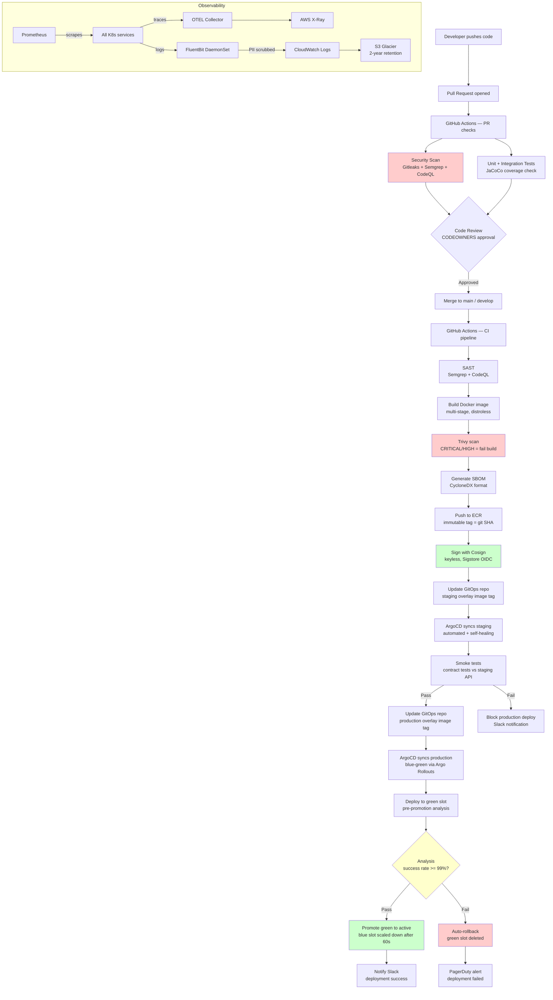

# 15 — DevOps Architecture

**MaWire Bank — Chile**
**Classification:** Internal — Architecture
**Last Updated:** 2026-06-06
**Owner:** Platform Engineering / DevOps

---

## Overview

MaWire's DevOps architecture is built on three principles:

1. **Everything as code** — infrastructure, pipelines, configuration, and policies are all versioned in Git.
2. **Shift-left security** — SAST, container scanning, dependency auditing, and secret detection run on every commit before any image is built.
3. **GitOps for delivery** — ArgoCD is the single source of truth for what runs in every environment. No human has `kubectl apply` access in production.

---

## CI/CD Pipeline Design

### Toolchain

| Concern | Tool | Rationale |
|---|---|---|
| Source control | GitHub Enterprise Cloud | SOC 2, SAML SSO, branch protection, CODEOWNERS |
| CI | GitHub Actions | Tight GitHub integration, reusable workflows |
| Artifact registry | Amazon ECR | Private, immutable tags, integrated IAM |
| Image signing | Cosign + Sigstore | Supply-chain security, verifiable provenance |
| GitOps controller | ArgoCD | Declarative, audit log, RBAC, SSO |
| Config templating | Helm + Kustomize | Helm for packages, Kustomize for overlays |
| IaC | Terraform 1.8 + Terragrunt | Modular, DRY, remote state in S3 |
| Secret management | HashiCorp Vault + External Secrets Operator | Dynamic secrets, no static credentials in Git |
| Feature flags | LaunchDarkly | Gradual rollouts, kill switches |
| DB migrations | Flyway | Versioned, repeatable, rollback-aware |
| SAST | Semgrep + CodeQL | Language-aware, low false-positive rate |
| Container scanning | Trivy | CVE database, IaC scanning, SBOM generation |
| Dependency scanning | OWASP Dependency-Check | License + CVE analysis for JVM/Node/Python |
| Policy as code | OPA / Gatekeeper | Admission control in Kubernetes |

### GitHub Actions Workflow — Full Microservice Pipeline

```yaml
# .github/workflows/service-cicd.yaml
name: Service CI/CD

on:
  push:
    branches:
      - main
      - develop
      - "release/**"
  pull_request:
    branches:
      - main
      - develop

env:
  AWS_REGION: sa-east-1
  ECR_REGISTRY: 123456789.dkr.ecr.sa-east-1.amazonaws.com
  SERVICE_NAME: ${{ github.event.repository.name }}
  ARGOCD_SERVER: argocd.internal.mawire.cl

concurrency:
  group: ${{ github.workflow }}-${{ github.ref }}
  cancel-in-progress: true

jobs:
  # ──────────────────────────────────────────────
  # JOB 1: Static Analysis and Secret Detection
  # ──────────────────────────────────────────────
  security-scan:
    name: Security Scan (SAST + Secrets)
    runs-on: ubuntu-latest
    permissions:
      security-events: write
      contents: read
    steps:
      - name: Checkout code
        uses: actions/checkout@v4
        with:
          fetch-depth: 0       # full history needed for git-secrets

      - name: Detect secrets (Gitleaks)
        uses: gitleaks/gitleaks-action@v2
        env:
          GITHUB_TOKEN: ${{ secrets.GITHUB_TOKEN }}
          GITLEAKS_LICENSE: ${{ secrets.GITLEAKS_LICENSE }}

      - name: Run Semgrep SAST
        uses: semgrep/semgrep-action@v1
        with:
          config: >-
            p/default
            p/owasp-top-ten
            p/sql-injection
            p/java
          auditOn: push
        env:
          SEMGREP_APP_TOKEN: ${{ secrets.SEMGREP_APP_TOKEN }}

      - name: Initialize CodeQL
        uses: github/codeql-action/init@v3
        with:
          languages: java        # change per service language
          queries: security-extended

      - name: Autobuild for CodeQL
        uses: github/codeql-action/autobuild@v3

      - name: Perform CodeQL Analysis
        uses: github/codeql-action/analyze@v3
        with:
          category: "/language:java"

  # ──────────────────────────────────────────────
  # JOB 2: Unit and Integration Tests
  # ──────────────────────────────────────────────
  test:
    name: Test
    runs-on: ubuntu-latest
    needs: security-scan
    services:
      postgres:
        image: postgres:16-alpine
        env:
          POSTGRES_DB: testdb
          POSTGRES_USER: test
          POSTGRES_PASSWORD: test
        options: >-
          --health-cmd pg_isready
          --health-interval 5s
          --health-timeout 5s
          --health-retries 5
        ports:
          - 5432:5432
      redis:
        image: redis:7-alpine
        options: >-
          --health-cmd "redis-cli ping"
          --health-interval 5s
          --health-timeout 5s
          --health-retries 5
        ports:
          - 6379:6379
    steps:
      - name: Checkout code
        uses: actions/checkout@v4

      - name: Set up JDK 21
        uses: actions/setup-java@v4
        with:
          java-version: "21"
          distribution: "corretto"
          cache: "maven"

      - name: Run unit tests
        run: mvn test -Dspring.profiles.active=test

      - name: Run integration tests
        run: mvn verify -Dspring.profiles.active=integration
        env:
          SPRING_DATASOURCE_URL: jdbc:postgresql://localhost:5432/testdb
          SPRING_DATASOURCE_USERNAME: test
          SPRING_DATASOURCE_PASSWORD: test
          SPRING_REDIS_HOST: localhost

      - name: Generate JaCoCo coverage report
        run: mvn jacoco:report

      - name: Check coverage threshold (80% minimum)
        run: mvn jacoco:check -Djacoco.minimum.coverage=0.80

      - name: Upload test results
        uses: actions/upload-artifact@v4
        if: always()
        with:
          name: test-results
          path: target/surefire-reports/

      - name: Upload coverage report
        uses: codecov/codecov-action@v4
        with:
          token: ${{ secrets.CODECOV_TOKEN }}
          files: target/site/jacoco/jacoco.xml

  # ──────────────────────────────────────────────
  # JOB 3: Build and Scan Container Image
  # ──────────────────────────────────────────────
  build:
    name: Build and Push Image
    runs-on: ubuntu-latest
    needs: test
    permissions:
      id-token: write        # for OIDC auth to AWS
      contents: read
      packages: write
    outputs:
      image-tag: ${{ steps.meta.outputs.version }}
      image-digest: ${{ steps.push.outputs.digest }}
    steps:
      - name: Checkout code
        uses: actions/checkout@v4

      - name: Set up QEMU
        uses: docker/setup-qemu-action@v3

      - name: Set up Docker Buildx
        uses: docker/setup-buildx-action@v3
        with:
          driver-opts: |
            image=moby/buildkit:latest

      - name: Configure AWS credentials (OIDC)
        uses: aws-actions/configure-aws-credentials@v4
        with:
          role-to-assume: arn:aws:iam::123456789:role/github-actions-ecr-push
          aws-region: ${{ env.AWS_REGION }}

      - name: Login to Amazon ECR
        id: login-ecr
        uses: aws-actions/amazon-ecr-login@v2

      - name: Extract image metadata
        id: meta
        uses: docker/metadata-action@v5
        with:
          images: ${{ env.ECR_REGISTRY }}/${{ env.SERVICE_NAME }}
          tags: |
            type=sha,prefix=,format=long
            type=semver,pattern={{version}}
            type=ref,event=branch
            type=raw,value=latest,enable=${{ github.ref == 'refs/heads/main' }}

      - name: Build image (no push yet — scan first)
        uses: docker/build-push-action@v6
        with:
          context: .
          platforms: linux/amd64
          push: false
          load: true
          tags: ${{ env.SERVICE_NAME }}:scan
          cache-from: type=registry,ref=${{ env.ECR_REGISTRY }}/${{ env.SERVICE_NAME }}:buildcache
          cache-to: type=registry,ref=${{ env.ECR_REGISTRY }}/${{ env.SERVICE_NAME }}:buildcache,mode=max
          build-args: |
            BUILD_VERSION=${{ steps.meta.outputs.version }}
            GIT_COMMIT=${{ github.sha }}

      - name: Scan image with Trivy (CRITICAL/HIGH — block)
        uses: aquasecurity/trivy-action@master
        with:
          image-ref: "${{ env.SERVICE_NAME }}:scan"
          format: "sarif"
          output: "trivy-results.sarif"
          severity: "CRITICAL,HIGH"
          exit-code: "1"             # fail build on CRITICAL or HIGH CVEs
          ignore-unfixed: true       # don't block on CVEs with no fix available

      - name: Upload Trivy SARIF to GitHub Security
        uses: github/codeql-action/upload-sarif@v3
        if: always()
        with:
          sarif_file: "trivy-results.sarif"

      - name: Generate SBOM (CycloneDX)
        uses: aquasecurity/trivy-action@master
        with:
          image-ref: "${{ env.SERVICE_NAME }}:scan"
          format: "cyclonedx"
          output: "sbom.json"

      - name: Push image to ECR
        id: push
        uses: docker/build-push-action@v6
        with:
          context: .
          platforms: linux/amd64
          push: true
          tags: ${{ steps.meta.outputs.tags }}
          labels: ${{ steps.meta.outputs.labels }}
          cache-from: type=registry,ref=${{ env.ECR_REGISTRY }}/${{ env.SERVICE_NAME }}:buildcache
          cache-to: type=registry,ref=${{ env.ECR_REGISTRY }}/${{ env.SERVICE_NAME }}:buildcache,mode=max

      - name: Install Cosign
        uses: sigstore/cosign-installer@v3
        with:
          cosign-release: "v2.4.0"

      - name: Sign image with Cosign (keyless — Sigstore OIDC)
        run: |
          cosign sign --yes \
            --oidc-provider github \
            ${{ env.ECR_REGISTRY }}/${{ env.SERVICE_NAME }}@${{ steps.push.outputs.digest }}

      - name: Attach SBOM to image
        run: |
          cosign attach sbom \
            --sbom sbom.json \
            --type cyclonedx \
            ${{ env.ECR_REGISTRY }}/${{ env.SERVICE_NAME }}@${{ steps.push.outputs.digest }}

      - name: Upload SBOM artifact
        uses: actions/upload-artifact@v4
        with:
          name: sbom
          path: sbom.json

  # ──────────────────────────────────────────────
  # JOB 4: Deploy to Staging
  # ──────────────────────────────────────────────
  deploy-staging:
    name: Deploy to Staging
    runs-on: ubuntu-latest
    needs: build
    environment:
      name: staging
      url: https://api.staging.mawire.cl
    steps:
      - name: Checkout GitOps repo
        uses: actions/checkout@v4
        with:
          repository: mawire-bank/gitops-infra
          token: ${{ secrets.GITOPS_PAT }}
          path: gitops

      - name: Update image tag in staging overlay
        run: |
          cd gitops/apps/${{ env.SERVICE_NAME }}/overlays/staging
          # Using kustomize to set the new image tag
          kustomize edit set image \
            ${{ env.ECR_REGISTRY }}/${{ env.SERVICE_NAME }}=${{ env.ECR_REGISTRY }}/${{ env.SERVICE_NAME }}:${{ needs.build.outputs.image-tag }}

      - name: Commit and push image tag update
        run: |
          cd gitops
          git config user.name "mawire-ci-bot"
          git config user.email "ci-bot@mawire.cl"
          git add .
          git commit -m "chore(staging): update ${{ env.SERVICE_NAME }} to ${{ needs.build.outputs.image-tag }}"
          git push

      - name: Wait for ArgoCD sync (staging)
        run: |
          argocd app wait ${{ env.SERVICE_NAME }}-staging \
            --health \
            --sync \
            --timeout 300 \
            --grpc-web
        env:
          ARGOCD_SERVER: ${{ env.ARGOCD_SERVER }}
          ARGOCD_AUTH_TOKEN: ${{ secrets.ARGOCD_TOKEN }}

      - name: Run smoke tests against staging
        run: |
          npm install -g @stoplight/prism-cli
          # Run contract tests against staging API
          make smoke-test ENVIRONMENT=staging

  # ──────────────────────────────────────────────
  # JOB 5: Deploy to Production (main branch only)
  # ──────────────────────────────────────────────
  deploy-production:
    name: Deploy to Production (Blue-Green)
    runs-on: ubuntu-latest
    needs: deploy-staging
    if: github.ref == 'refs/heads/main'
    environment:
      name: production
      url: https://api.mawire.cl
    steps:
      - name: Verify image signature before production deploy
        uses: sigstore/cosign-installer@v3
      - name: Cosign verify
        run: |
          cosign verify \
            --certificate-identity-regexp="https://github.com/mawire-bank/${{ env.SERVICE_NAME }}/" \
            --certificate-oidc-issuer="https://token.actions.githubusercontent.com" \
            ${{ env.ECR_REGISTRY }}/${{ env.SERVICE_NAME }}@${{ needs.build.outputs.image-digest }}

      - name: Checkout GitOps repo
        uses: actions/checkout@v4
        with:
          repository: mawire-bank/gitops-infra
          token: ${{ secrets.GITOPS_PAT }}
          path: gitops

      - name: Update image tag in production overlay
        run: |
          cd gitops/apps/${{ env.SERVICE_NAME }}/overlays/production
          kustomize edit set image \
            ${{ env.ECR_REGISTRY }}/${{ env.SERVICE_NAME }}=${{ env.ECR_REGISTRY }}/${{ env.SERVICE_NAME }}:${{ needs.build.outputs.image-tag }}

      - name: Commit and push production image tag
        run: |
          cd gitops
          git config user.name "mawire-ci-bot"
          git config user.email "ci-bot@mawire.cl"
          git add .
          git commit -m "chore(production): deploy ${{ env.SERVICE_NAME }} ${{ needs.build.outputs.image-tag }}"
          git push

      - name: Trigger ArgoCD blue-green sync (production)
        run: |
          # ArgoCD uses Argo Rollouts for blue-green
          # This promotes the new version to the green slot
          argocd app sync ${{ env.SERVICE_NAME }}-production \
            --grpc-web \
            --prune
        env:
          ARGOCD_SERVER: ${{ env.ARGOCD_SERVER }}
          ARGOCD_AUTH_TOKEN: ${{ secrets.ARGOCD_TOKEN }}

      - name: Wait for rollout health check (green slot)
        run: |
          kubectl argo rollouts status ${{ env.SERVICE_NAME }} \
            -n mawire-core \
            --timeout 600s
        env:
          KUBECONFIG_DATA: ${{ secrets.KUBECONFIG_PRODUCTION }}

      - name: Promote green to active (manual gate passed by environment approval)
        run: |
          kubectl argo rollouts promote ${{ env.SERVICE_NAME }} \
            -n mawire-core
        env:
          KUBECONFIG_DATA: ${{ secrets.KUBECONFIG_PRODUCTION }}

      - name: Notify Slack on successful deployment
        uses: 8398a7/action-slack@v3
        with:
          status: success
          text: ":white_check_mark: *${{ env.SERVICE_NAME }}* deployed to production — `${{ needs.build.outputs.image-tag }}`"
        env:
          SLACK_WEBHOOK_URL: ${{ secrets.SLACK_DEPLOY_WEBHOOK }}
        if: success()

      - name: Notify Slack on failed deployment
        uses: 8398a7/action-slack@v3
        with:
          status: failure
          text: ":red_circle: *${{ env.SERVICE_NAME }}* production deployment FAILED — `${{ needs.build.outputs.image-tag }}`"
        env:
          SLACK_WEBHOOK_URL: ${{ secrets.SLACK_DEPLOY_WEBHOOK }}
        if: failure()
```

---

## GitOps with ArgoCD

### GitOps Repository Structure

```
gitops-infra/
├── apps/
│   ├── auth-service/
│   │   ├── base/
│   │   │   ├── deployment.yaml          # Argo Rollout (blue-green)
│   │   │   ├── service.yaml
│   │   │   ├── hpa.yaml
│   │   │   ├── pdb.yaml
│   │   │   ├── networkpolicy.yaml
│   │   │   ├── serviceaccount.yaml
│   │   │   ├── configmap.yaml
│   │   │   └── kustomization.yaml
│   │   └── overlays/
│   │       ├── staging/
│   │       │   ├── kustomization.yaml   # patches for staging
│   │       │   └── replicas.yaml        # replicas: 1 in staging
│   │       └── production/
│   │           ├── kustomization.yaml   # patches for production
│   │           └── replicas.yaml        # replicas: 3 in production
│   ├── payment-service/
│   │   └── ...
│   └── fraud-service/
│       └── ...
├── argocd/
│   ├── applications/
│   │   ├── auth-service-staging.yaml
│   │   ├── auth-service-production.yaml
│   │   ├── payment-service-staging.yaml
│   │   └── payment-service-production.yaml
│   ├── projects/
│   │   ├── mawire-staging.yaml
│   │   └── mawire-production.yaml
│   └── appsets/                         # ApplicationSets for bulk management
│       └── all-services.yaml
├── infrastructure/
│   ├── monitoring/
│   │   ├── prometheus-stack/
│   │   └── jaeger/
│   ├── istio/
│   │   ├── istio-config.yaml
│   │   └── gateway.yaml
│   └── external-secrets/
│       └── vault-secret-store.yaml
└── policies/
    ├── gatekeeper/
    │   ├── require-resource-limits.yaml
    │   ├── require-non-root.yaml
    │   ├── require-signed-images.yaml
    │   └── deny-privileged.yaml
    └── kyverno/
        └── ...
```

### ArgoCD Application Manifest — auth-service (Production)

```yaml
# argocd/applications/auth-service-production.yaml
apiVersion: argoproj.io/v1alpha1
kind: Application
metadata:
  name: auth-service-production
  namespace: argocd
  labels:
    environment: production
    team: platform
    service: auth-service
  finalizers:
    - resources-finalizer.argocd.argoproj.io   # deletes K8s resources on ArgoCD app deletion
  annotations:
    notifications.argoproj.io/subscribe.on-sync-succeeded.slack: platform-deploys
    notifications.argoproj.io/subscribe.on-sync-failed.slack: platform-alerts
    notifications.argoproj.io/subscribe.on-health-degraded.slack: platform-alerts
spec:
  project: mawire-production

  source:
    repoURL: https://github.com/mawire-bank/gitops-infra.git
    targetRevision: main
    path: apps/auth-service/overlays/production
    plugin:
      name: kustomize-build-with-helm  # custom plugin for Helm + Kustomize hybrid

  destination:
    server: https://kubernetes.default.svc   # in-cluster ArgoCD deployment
    namespace: mawire-core

  syncPolicy:
    automated:
      prune: true              # delete resources removed from Git
      selfHeal: true           # revert manual kubectl changes
      allowEmpty: false        # never sync to empty state (safety guard)
    syncOptions:
      - Validate=true
      - CreateNamespace=false
      - PrunePropagationPolicy=foreground
      - PruneLast=true
      - ApplyOutOfSyncOnly=true   # only apply changed resources
      - RespectIgnoreDifferences=true
    retry:
      limit: 3
      backoff:
        duration: 10s
        factor: 2
        maxDuration: 3m

  revisionHistoryLimit: 10

  ignoreDifferences:
    # Ignore HPA current replicas (managed by cluster autoscaler)
    - group: autoscaling
      kind: HorizontalPodAutoscaler
      jsonPointers:
        - /spec/replicas
    # Ignore Argo Rollouts managed fields
    - group: argoproj.io
      kind: Rollout
      jsonPointers:
        - /status

  info:
    - name: "Team"
      value: "Core Banking"
    - name: "Runbook"
      value: "https://wiki.mawire.cl/runbooks/auth-service"
    - name: "PagerDuty"
      value: "https://mawire.pagerduty.com/services/P1234"
```

### ArgoCD Project — mawire-production

```yaml
apiVersion: argoproj.io/v1alpha1
kind: AppProject
metadata:
  name: mawire-production
  namespace: argocd
spec:
  description: "MaWire Bank production workloads"

  sourceRepos:
    - https://github.com/mawire-bank/gitops-infra.git
    - https://charts.helm.sh/stable
    - https://prometheus-community.github.io/helm-charts

  destinations:
    - namespace: mawire-core
      server: https://kubernetes.default.svc
    - namespace: mawire-payments
      server: https://kubernetes.default.svc
    - namespace: mawire-compliance
      server: https://kubernetes.default.svc
    - namespace: mawire-ml
      server: https://kubernetes.default.svc
    - namespace: mawire-pci
      server: https://kubernetes.default.svc
    - namespace: mawire-monitoring
      server: https://kubernetes.default.svc

  clusterResourceWhitelist:
    - group: ""
      kind: Namespace
    - group: networking.k8s.io
      kind: NetworkPolicy
    - group: policy
      kind: PodSecurityPolicy

  namespaceResourceBlacklist:
    - group: ""
      kind: ResourceQuota      # managed centrally, not by individual apps
    - group: ""
      kind: LimitRange

  roles:
    - name: read-only
      description: "Read-only access for developers"
      policies:
        - p, proj:mawire-production:read-only, applications, get, mawire-production/*, allow
        - p, proj:mawire-production:read-only, applications, list, mawire-production/*, allow
      groups:
        - mawire-developers

    - name: deployer
      description: "CI/CD service account"
      policies:
        - p, proj:mawire-production:deployer, applications, sync, mawire-production/*, allow
        - p, proj:mawire-production:deployer, applications, get, mawire-production/*, allow
      groups:
        - mawire-ci-bots

  syncWindows:
    - kind: deny
      schedule: "0 22 * * *"    # deny syncs 22:00–06:00 Chile time (production freeze)
      duration: 8h
      applications:
        - "*"
      namespaces:
        - mawire-core
        - mawire-payments
        - mawire-pci
      manualSync: false         # even manual syncs blocked during freeze window
```

---

## Deployment Strategies

### Blue-Green (Argo Rollouts) — Customer-Facing Services

```yaml
# apps/auth-service/base/deployment.yaml (Argo Rollout, not standard Deployment)
apiVersion: argoproj.io/v1alpha1
kind: Rollout
metadata:
  name: auth-service
  namespace: mawire-core
spec:
  replicas: 3
  selector:
    matchLabels:
      app: auth-service
  template:
    metadata:
      labels:
        app: auth-service
    spec:
      # ... same pod spec as in cloud-infrastructure.md
  strategy:
    blueGreen:
      activeService: auth-service-active      # receives production traffic
      previewService: auth-service-preview     # receives preview/green traffic
      autoPromotionEnabled: false              # require manual promotion
      scaleDownDelaySeconds: 60               # keep blue running 60s after promotion
      prePromotionAnalysis:
        templates:
          - templateName: success-rate
        args:
          - name: service-name
            value: auth-service-preview
      postPromotionAnalysis:
        templates:
          - templateName: success-rate
        args:
          - name: service-name
            value: auth-service-active
---
apiVersion: argoproj.io/v1alpha1
kind: AnalysisTemplate
metadata:
  name: success-rate
  namespace: mawire-core
spec:
  args:
    - name: service-name
  metrics:
    - name: success-rate
      interval: 30s
      count: 5
      successCondition: result[0] >= 0.99
      failureLimit: 1
      provider:
        prometheus:
          address: http://prometheus.mawire-monitoring.svc:9090
          query: |
            sum(rate(http_requests_total{job="{{args.service-name}}",status!~"5.."}[2m]))
            /
            sum(rate(http_requests_total{job="{{args.service-name}}"}[2m]))
```

### Canary Deployment — High-Risk Changes

```yaml
strategy:
  canary:
    steps:
      - setWeight: 5         # 5% of traffic to new version
      - pause:
          duration: 5m
      - analysis:
          templates:
            - templateName: error-rate
      - setWeight: 25        # 25% of traffic
      - pause:
          duration: 10m
      - analysis:
          templates:
            - templateName: error-rate
            - templateName: latency-p99
      - setWeight: 50
      - pause:
          duration: 10m
      - setWeight: 100       # full rollout
    canaryService: auth-service-canary
    stableService: auth-service-stable
    trafficRouting:
      istio:
        virtualService:
          name: auth-service-vsvc
          routes:
            - primary
```

### Database Migrations (Flyway)

```
Migration rules:
1. All migrations must be backward-compatible (old code runs against new schema)
2. Column renames: add new column → dual-write → backfill → remove old column
3. Breaking changes require a 3-deploy sequence:
   Deploy 1: Add new structure (both old and new exist)
   Deploy 2: Update code to use new structure
   Deploy 3: Remove old structure
4. Every migration has a corresponding rollback migration script
5. Flyway runs as a Kubernetes Job before deployment rollout begins
6. Flyway uses a dedicated low-privilege DB user (mawire_migrator) with DDL rights only

Naming convention:
  V{version}__{description}.sql
  R{identifier}__{description}.sql  (repeatable migrations)

Example: V20260101_001__add_mfa_table.sql
```

---

## Infrastructure as Code (Terraform)

### Repository Structure

```
terraform/
├── modules/
│   ├── vpc/
│   ├── eks/
│   ├── aurora/
│   ├── elasticache/
│   ├── msk/
│   ├── waf/
│   └── vault/
├── environments/
│   ├── production/
│   │   ├── main.tf
│   │   ├── variables.tf
│   │   ├── outputs.tf
│   │   └── terraform.tfvars
│   ├── staging/
│   └── dr/
└── terragrunt.hcl
```

### VPC Module

```hcl
# terraform/environments/production/main.tf

terraform {
  required_version = ">= 1.8"
  required_providers {
    aws = {
      source  = "hashicorp/aws"
      version = "~> 5.50"
    }
    kubernetes = {
      source  = "hashicorp/kubernetes"
      version = "~> 2.30"
    }
  }

  backend "s3" {
    bucket         = "mawire-terraform-state-prod"
    key            = "production/terraform.tfstate"
    region         = "sa-east-1"
    encrypt        = true
    kms_key_id     = "arn:aws:kms:sa-east-1:123456789:key/mrk-tfstate"
    dynamodb_table = "mawire-terraform-locks"
  }
}

module "vpc" {
  source  = "terraform-aws-modules/vpc/aws"
  version = "5.8.1"

  name = "mawire-production"
  cidr = "10.0.0.0/16"

  azs = ["sa-east-1a", "sa-east-1b", "sa-east-1c"]

  # Public subnets — ALB and NAT Gateway only
  public_subnets = ["10.0.1.0/24", "10.0.2.0/24", "10.0.3.0/24"]

  # Private app subnets — EKS worker nodes
  private_subnets = ["10.0.10.0/24", "10.0.11.0/24", "10.0.12.0/24"]

  # Private data subnets — RDS, ElastiCache, MSK
  database_subnets = ["10.0.20.0/24", "10.0.21.0/24", "10.0.22.0/24"]

  # Intra subnets — PCI isolated (no internet, no NAT)
  intra_subnets = ["10.0.30.0/24", "10.0.31.0/24"]

  enable_nat_gateway     = true
  single_nat_gateway     = false   # one per AZ for HA
  one_nat_gateway_per_az = true
  enable_vpn_gateway     = false
  enable_dns_hostnames   = true
  enable_dns_support     = true

  # VPC Flow Logs — all traffic, sent to S3 for SIEM
  enable_flow_log                      = true
  flow_log_destination_type            = "s3"
  flow_log_destination_arn             = aws_s3_bucket.flow_logs.arn
  flow_log_traffic_type                = "ALL"
  flow_log_log_format                  = "$${version} $${account-id} $${interface-id} $${srcaddr} $${dstaddr} $${srcport} $${dstport} $${protocol} $${packets} $${bytes} $${windowstart} $${windowend} $${action} $${flowlogstatus} $${vpc-id} $${subnet-id}"

  # Subnet tags for EKS and ALB controller auto-discovery
  public_subnet_tags = {
    "kubernetes.io/role/elb"                        = "1"
    "kubernetes.io/cluster/mawire-production"       = "shared"
  }
  private_subnet_tags = {
    "kubernetes.io/role/internal-elb"               = "1"
    "kubernetes.io/cluster/mawire-production"       = "shared"
  }

  tags = {
    Environment  = "production"
    Project      = "mawire"
    Compliance   = "pci-dss"
    ManagedBy    = "terraform"
    CostCenter   = "platform"
  }
}

# VPC Endpoints — keep AWS API traffic off the internet
resource "aws_vpc_endpoint" "s3" {
  vpc_id            = module.vpc.vpc_id
  service_name      = "com.amazonaws.sa-east-1.s3"
  vpc_endpoint_type = "Gateway"
  route_table_ids   = module.vpc.private_route_table_ids
  tags              = { Name = "mawire-s3-endpoint" }
}

resource "aws_vpc_endpoint" "kms" {
  vpc_id              = module.vpc.vpc_id
  service_name        = "com.amazonaws.sa-east-1.kms"
  vpc_endpoint_type   = "Interface"
  subnet_ids          = module.vpc.private_subnets
  security_group_ids  = [aws_security_group.vpc_endpoints.id]
  private_dns_enabled = true
  tags                = { Name = "mawire-kms-endpoint" }
}

resource "aws_vpc_endpoint" "secretsmanager" {
  vpc_id              = module.vpc.vpc_id
  service_name        = "com.amazonaws.sa-east-1.secretsmanager"
  vpc_endpoint_type   = "Interface"
  subnet_ids          = module.vpc.private_subnets
  security_group_ids  = [aws_security_group.vpc_endpoints.id]
  private_dns_enabled = true
  tags                = { Name = "mawire-secretsmanager-endpoint" }
}

resource "aws_vpc_endpoint" "ecr_api" {
  vpc_id              = module.vpc.vpc_id
  service_name        = "com.amazonaws.sa-east-1.ecr.api"
  vpc_endpoint_type   = "Interface"
  subnet_ids          = module.vpc.private_subnets
  security_group_ids  = [aws_security_group.vpc_endpoints.id]
  private_dns_enabled = true
  tags                = { Name = "mawire-ecr-api-endpoint" }
}

resource "aws_vpc_endpoint" "ecr_dkr" {
  vpc_id              = module.vpc.vpc_id
  service_name        = "com.amazonaws.sa-east-1.ecr.dkr"
  vpc_endpoint_type   = "Interface"
  subnet_ids          = module.vpc.private_subnets
  security_group_ids  = [aws_security_group.vpc_endpoints.id]
  private_dns_enabled = true
  tags                = { Name = "mawire-ecr-dkr-endpoint" }
}
```

### EKS Module

```hcl
module "eks" {
  source  = "terraform-aws-modules/eks/aws"
  version = "20.11.1"

  cluster_name    = "mawire-production"
  cluster_version = "1.30"

  vpc_id                   = module.vpc.vpc_id
  subnet_ids               = module.vpc.private_subnets
  control_plane_subnet_ids = module.vpc.private_subnets

  # API server endpoint — private only (no public endpoint)
  cluster_endpoint_public_access  = false
  cluster_endpoint_private_access = true

  # Enable IRSA (IAM Roles for Service Accounts)
  enable_irsa = true

  # Cluster-level encryption — all secrets encrypted at rest
  cluster_encryption_config = {
    resources        = ["secrets"]
    provider_key_arn = aws_kms_key.eks.arn
  }

  # Cluster add-ons (managed by AWS)
  cluster_addons = {
    coredns = {
      addon_version               = "v1.11.1-eksbuild.9"
      resolve_conflicts_on_update = "PRESERVE"
    }
    kube-proxy = {
      addon_version               = "v1.30.0-eksbuild.3"
      resolve_conflicts_on_update = "PRESERVE"
    }
    vpc-cni = {
      addon_version               = "v1.18.1-eksbuild.3"
      resolve_conflicts_on_update = "PRESERVE"
      configuration_values = jsonencode({
        env = {
          ENABLE_PREFIX_DELEGATION = "true"    # more IPs per node
          WARM_PREFIX_TARGET       = "1"
        }
      })
    }
    aws-ebs-csi-driver = {
      addon_version            = "v1.31.0-eksbuild.1"
      service_account_role_arn = module.ebs_csi_irsa.iam_role_arn
    }
    aws-guardduty-agent = {
      addon_version = "v1.6.1-eksbuild.1"
    }
  }

  # Managed node groups
  eks_managed_node_groups = {
    system = {
      name           = "system"
      instance_types = ["t3.medium"]
      min_size       = 3
      max_size       = 3
      desired_size   = 3
      capacity_type  = "ON_DEMAND"

      labels = {
        role = "system"
      }
      taints = [
        {
          key    = "CriticalAddonsOnly"
          value  = "true"
          effect = "NO_SCHEDULE"
        }
      ]

      block_device_mappings = {
        xvda = {
          device_name = "/dev/xvda"
          ebs = {
            volume_size           = 100
            volume_type           = "gp3"
            encrypted             = true
            kms_key_id            = aws_kms_key.eks_ebs.arn
            delete_on_termination = true
          }
        }
      }

      metadata_options = {
        http_endpoint               = "enabled"
        http_tokens                 = "required"   # IMDSv2 enforced
        http_put_response_hop_limit = 1
      }
    }

    app = {
      name           = "app"
      instance_types = ["m6i.2xlarge"]
      min_size       = 3
      max_size       = 20
      desired_size   = 6
      capacity_type  = "ON_DEMAND"

      labels = {
        role = "app"
      }

      block_device_mappings = {
        xvda = {
          device_name = "/dev/xvda"
          ebs = {
            volume_size           = 100
            volume_type           = "gp3"
            iops                  = 3000
            throughput            = 125
            encrypted             = true
            kms_key_id            = aws_kms_key.eks_ebs.arn
            delete_on_termination = true
          }
        }
      }

      metadata_options = {
        http_endpoint               = "enabled"
        http_tokens                 = "required"
        http_put_response_hop_limit = 1
      }
    }

    pci = {
      name           = "pci"
      instance_types = ["m6i.2xlarge"]
      min_size       = 3
      max_size       = 6
      desired_size   = 3
      capacity_type  = "ON_DEMAND"
      subnet_ids     = [module.vpc.intra_subnets[0], module.vpc.intra_subnets[1]]  # PCI isolated subnets

      labels = {
        role        = "pci"
        compliance  = "pci-dss"
      }
      taints = [
        {
          key    = "pci"
          value  = "true"
          effect = "NO_SCHEDULE"
        }
      ]

      metadata_options = {
        http_endpoint               = "enabled"
        http_tokens                 = "required"
        http_put_response_hop_limit = 1
      }
    }

    ml = {
      name           = "ml"
      instance_types = ["r6i.4xlarge"]
      min_size       = 2
      max_size       = 6
      desired_size   = 2
      capacity_type  = "ON_DEMAND"

      labels = {
        role = "ml"
      }
      taints = [
        {
          key    = "ml"
          value  = "true"
          effect = "NO_SCHEDULE"
        }
      ]
    }
  }

  tags = {
    Environment = "production"
    Project     = "mawire"
    ManagedBy   = "terraform"
  }
}
```

### Aurora PostgreSQL Module

```hcl
module "aurora" {
  # One module call per service — each service gets its own cluster
  # This shows the auth-service cluster as an example
  source  = "terraform-aws-modules/rds-aurora/aws"
  version = "9.3.6"

  name            = "mawire-auth-service"
  engine          = "aurora-postgresql"
  engine_version  = "16.3"
  instance_class  = "db.r6g.4xlarge"

  instances = {
    writer = {}
    reader1 = {
      instance_class = "db.r6g.4xlarge"
      promotion_tier = 1
    }
    reader2 = {
      instance_class = "db.r6g.2xlarge"   # smaller replica for reporting
      promotion_tier = 2
    }
  }

  vpc_id               = module.vpc.vpc_id
  db_subnet_group_name = module.vpc.database_subnet_group_name
  security_group_rules = {
    eks_ingress = {
      type                     = "ingress"
      from_port                = 5432
      to_port                  = 5432
      protocol                 = "tcp"
      source_security_group_id = module.eks.node_security_group_id
    }
  }

  database_name   = "auth_service"
  master_username = "mawire_admin"
  # Password managed by Secrets Manager rotation
  manage_master_user_password                            = true
  master_user_secret_kms_key_id                          = aws_kms_key.aurora.arn

  storage_encrypted = true
  kms_key_id        = aws_kms_key.aurora.arn

  # Performance Insights — 7-day free, pay for longer retention
  performance_insights_enabled          = true
  performance_insights_retention_period = 31
  performance_insights_kms_key_id       = aws_kms_key.aurora.arn

  # Enhanced monitoring every 5 seconds
  monitoring_interval = 5
  monitoring_role_arn = aws_iam_role.rds_enhanced_monitoring.arn

  backup_retention_period = 35
  preferred_backup_window = "03:00-04:00"         # 03:00 UTC = 00:00 Chile time (quiet hours)
  preferred_maintenance_window = "sun:04:00-sun:05:00"

  deletion_protection = true
  skip_final_snapshot = false
  final_snapshot_identifier = "mawire-auth-service-final-snapshot"

  # Aurora Serverless v2 scaling for burst reads
  serverlessv2_scaling_configuration = {
    min_capacity = 0.5
    max_capacity = 16
  }

  db_cluster_parameter_group_family = "aurora-postgresql16"
  db_cluster_db_instance_parameter_group_name = aws_db_parameter_group.aurora_pg16.name

  tags = {
    Service     = "auth-service"
    Environment = "production"
    Backup      = "required"
    Compliance  = "pci-dss"
  }
}

resource "aws_db_parameter_group" "aurora_pg16" {
  name   = "mawire-aurora-pg16"
  family = "aurora-postgresql16"

  parameter {
    name  = "shared_buffers"
    value = "{DBInstanceClassMemory/4}"   # 25% of RAM
  }
  parameter {
    name  = "max_connections"
    value = "1000"
  }
  parameter {
    name  = "log_min_duration_statement"
    value = "1000"              # log queries > 1 second
  }
  parameter {
    name  = "log_statement"
    value = "ddl"               # log all DDL statements
  }
  parameter {
    name  = "log_connections"
    value = "1"
  }
  parameter {
    name  = "log_disconnections"
    value = "1"
  }
  parameter {
    name  = "pgaudit.log"
    value = "ddl,role,write"    # pgAudit for compliance
  }
  parameter {
    name  = "ssl"
    value = "1"                 # TLS required
  }
}
```

### ElastiCache Redis Module

```hcl
module "elasticache_redis" {
  source  = "terraform-aws-modules/elasticache/aws"
  version = "1.3.2"

  cluster_id         = "mawire-redis"
  cluster_mode       = "enabled"      # Redis Cluster mode (sharded)
  engine_version     = "7.2"
  node_type          = "cache.r6g.2xlarge"

  num_node_groups         = 6    # 6 shards
  replicas_per_node_group = 2    # 2 replicas per shard = 18 total nodes

  multi_az_enabled           = true
  automatic_failover_enabled = true

  subnet_ids         = module.vpc.database_subnets
  security_group_ids = [aws_security_group.redis.id]

  at_rest_encryption_enabled  = true
  kms_key_id                  = aws_kms_key.elasticache.arn
  transit_encryption_enabled  = true
  transit_encryption_mode     = "required"   # TLS only, no plaintext
  auth_token                  = random_password.redis_auth_token.result

  # Snapshot for backup
  snapshot_retention_limit = 7
  snapshot_window          = "02:00-03:00"     # 02:00 UTC

  # Logs to CloudWatch
  log_delivery_configuration = [
    {
      destination      = aws_cloudwatch_log_group.redis_slow_logs.name
      destination_type = "cloudwatch-logs"
      log_format       = "json"
      log_type         = "slow-log"
    },
    {
      destination      = aws_cloudwatch_log_group.redis_engine_logs.name
      destination_type = "cloudwatch-logs"
      log_format       = "json"
      log_type         = "engine-log"
    }
  ]

  tags = {
    Environment = "production"
    Project     = "mawire"
    ManagedBy   = "terraform"
  }
}
```

### MSK (Kafka) Module

```hcl
module "msk" {
  source  = "terraform-aws-modules/msk-kafka-cluster/aws"
  version = "2.6.0"

  name                   = "mawire-events"
  kafka_version          = "3.7.x.kraft"      # KRaft mode — no ZooKeeper
  number_of_broker_nodes = 3

  broker_node_group_info = {
    instance_type   = "kafka.m5.2xlarge"
    client_subnets  = module.vpc.database_subnets
    security_groups = [aws_security_group.msk.id]
    storage_info = {
      ebs_storage_info = {
        volume_size = 2000    # 2TB per broker
        provisioned_throughput = {
          enabled           = true
          volume_throughput = 250
        }
      }
    }
  }

  # Encryption — at rest and in transit
  encryption_info = {
    encryption_at_rest_kms_key_arn = aws_kms_key.msk.arn
    encryption_in_transit = {
      client_broker = "TLS"           # TLS only between clients and brokers
      in_cluster    = true            # TLS within cluster
    }
  }

  # Authentication — SASL/SCRAM for clients
  client_authentication = {
    sasl = {
      scram = true
      iam   = true    # IAM auth for cross-account access
    }
    tls = {
      certificate_authority_arns = [aws_acmpca_certificate_authority.mawire_internal.arn]
    }
  }

  # Auto-scaling storage
  storage_mode = "LOCAL"

  # CloudWatch metrics — enhanced monitoring
  enhanced_monitoring = "PER_TOPIC_PER_PARTITION"

  # Open monitoring — Prometheus scraping
  open_monitoring = {
    prometheus = {
      jmx_exporter  = { enabled_in_broker = true }
      node_exporter = { enabled_in_broker = true }
    }
  }

  # Broker logs
  broker_log_info = {
    cloudwatch_logs = {
      enabled   = true
      log_group = aws_cloudwatch_log_group.msk.name
    }
    s3 = {
      enabled = true
      bucket  = aws_s3_bucket.msk_logs.id
      prefix  = "msk-logs/"
    }
  }

  configuration_info = {
    arn      = aws_msk_configuration.mawire.arn
    revision = aws_msk_configuration.mawire.latest_revision
  }

  tags = {
    Environment = "production"
    Project     = "mawire"
  }
}

resource "aws_msk_configuration" "mawire" {
  name          = "mawire-kafka-config"
  kafka_versions = ["3.7.x.kraft"]

  server_properties = <<PROPERTIES
auto.create.topics.enable=false
default.replication.factor=3
min.insync.replicas=2
num.io.threads=8
num.network.threads=5
num.partitions=12
num.replica.fetchers=2
replica.lag.time.max.ms=30000
socket.receive.buffer.bytes=102400
socket.request.max.bytes=104857600
socket.send.buffer.bytes=102400
unclean.leader.election.enable=false
zookeeper.session.timeout.ms=18000
log.retention.hours=168
log.retention.bytes=-1
log.segment.bytes=1073741824
log.cleanup.policy=delete
message.max.bytes=1048576
compression.type=lz4
PROPERTIES
}
```

---

## Observability Stack

### Metrics — Prometheus + Grafana

```yaml
# Prometheus scrape config (deployed via kube-prometheus-stack Helm chart)
# values.yaml excerpt

prometheus:
  prometheusSpec:
    retention: 15d
    retentionSize: "500GB"
    storageSpec:
      volumeClaimTemplate:
        spec:
          storageClassName: gp3
          resources:
            requests:
              storage: 500Gi

    additionalScrapeConfigs:
      - job_name: mawire-services
        kubernetes_sd_configs:
          - role: pod
        relabel_configs:
          - source_labels: [__meta_kubernetes_pod_annotation_prometheus_io_scrape]
            action: keep
            regex: "true"
          - source_labels: [__meta_kubernetes_pod_annotation_prometheus_io_path]
            action: replace
            target_label: __metrics_path__
            regex: (.+)
          - source_labels: [__address__, __meta_kubernetes_pod_annotation_prometheus_io_port]
            action: replace
            regex: ([^:]+)(?::\d+)?;(\d+)
            replacement: $1:$2
            target_label: __address__
        metric_relabel_configs:
          # Drop high-cardinality labels to control TSDB size
          - source_labels: [__name__]
            regex: "go_.*"
            action: drop
```

### Alerting Rules

```yaml
# prometheus-rules.yaml
groups:
  - name: mawire-api-slos
    interval: 30s
    rules:
      # HTTP Error Rate > 1% for 5 minutes
      - alert: HighErrorRate
        expr: |
          (
            sum(rate(http_requests_total{status=~"5.."}[5m])) by (service)
            /
            sum(rate(http_requests_total[5m])) by (service)
          ) > 0.01
        for: 5m
        labels:
          severity: critical
          team: platform
        annotations:
          summary: "High error rate on {{ $labels.service }}"
          description: "Error rate is {{ $value | humanizePercentage }} (threshold: 1%)"
          runbook: "https://wiki.mawire.cl/runbooks/high-error-rate"

      # Payment processing p99 > 2 seconds
      - alert: PaymentProcessingLatencyHigh
        expr: |
          histogram_quantile(0.99,
            sum(rate(http_request_duration_seconds_bucket{service="payment-service"}[5m])) by (le)
          ) > 2.0
        for: 3m
        labels:
          severity: critical
          team: payments
        annotations:
          summary: "Payment processing p99 latency exceeded 2s"
          description: "p99 = {{ $value | humanizeDuration }}"
          runbook: "https://wiki.mawire.cl/runbooks/payment-latency"

      # Fraud scoring p99 > 150ms
      - alert: FraudScoringLatencyHigh
        expr: |
          histogram_quantile(0.99,
            sum(rate(http_request_duration_seconds_bucket{service="fraud-service"}[5m])) by (le)
          ) > 0.15
        for: 5m
        labels:
          severity: warning
          team: ml
        annotations:
          summary: "Fraud scoring p99 latency exceeded 150ms"

      # DB connection pool saturation > 80%
      - alert: DatabaseConnectionPoolSaturated
        expr: |
          (
            pgbouncer_pools_cl_active / pgbouncer_pools_maxconn
          ) > 0.80
        for: 5m
        labels:
          severity: warning
          team: platform
        annotations:
          summary: "PgBouncer connection pool at {{ $value | humanizePercentage }}"

      # Kafka consumer lag > 10K
      - alert: KafkaConsumerLagHigh
        expr: |
          sum(kafka_consumer_group_lag) by (topic, consumer_group) > 10000
        for: 5m
        labels:
          severity: warning
          team: platform
        annotations:
          summary: "Kafka consumer lag is {{ $value }} on {{ $labels.topic }}"

      # Card authorization p99 > 200ms
      - alert: CardAuthorizationLatencyHigh
        expr: |
          histogram_quantile(0.99,
            sum(rate(http_request_duration_seconds_bucket{service="card-service"}[5m])) by (le)
          ) > 0.20
        for: 2m
        labels:
          severity: critical
          team: payments
          pci: "true"
        annotations:
          summary: "Card authorization p99 latency exceeded 200ms"

  - name: mawire-infrastructure
    rules:
      # EKS node not ready
      - alert: KubernetesNodeNotReady
        expr: kube_node_status_condition{condition="Ready",status="true"} == 0
        for: 5m
        labels:
          severity: critical
        annotations:
          summary: "Kubernetes node {{ $labels.node }} is not ready"

      # Aurora replica lag > 30 seconds
      - alert: AuroraReplicaLagHigh
        expr: aws_rds_replica_lag_average > 30
        for: 5m
        labels:
          severity: warning
        annotations:
          summary: "Aurora replica lag is {{ $value }}s"

      # Redis memory usage > 80%
      - alert: RedisMemoryHigh
        expr: redis_memory_used_bytes / redis_memory_max_bytes > 0.80
        for: 10m
        labels:
          severity: warning
        annotations:
          summary: "Redis memory at {{ $value | humanizePercentage }}"
```

### Logging Architecture (FluentBit to CloudWatch)

```yaml
# FluentBit DaemonSet configuration (values.yaml for aws-for-fluent-bit Helm chart)
config:
  inputs: |
    [INPUT]
        Name                tail
        Tag                 kube.*
        Path                /var/log/containers/*.log
        multiline.parser    docker, cri
        DB                  /var/log/fluentbit-db/kube-flb.db
        Mem_Buf_Limit       50MB
        Skip_Long_Lines     On
        Refresh_Interval    10

  filters: |
    [FILTER]
        Name                kubernetes
        Match               kube.*
        Kube_URL            https://kubernetes.default.svc:443
        Kube_CA_File        /var/run/secrets/kubernetes.io/serviceaccount/ca.crt
        Kube_Token_File     /var/run/secrets/kubernetes.io/serviceaccount/token
        Kube_Tag_Prefix     kube.var.log.containers.
        Merge_Log           On
        K8S-Logging.Parser  On
        K8S-Logging.Exclude Off
        Annotations         Off
        Labels              On

    # PII scrubbing — remove sensitive fields before shipping to CloudWatch
    [FILTER]
        Name         lua
        Match        kube.*
        script       /fluent-bit/scripts/pii-scrub.lua
        call         scrub_pii

    # Parse JSON logs (all MaWire services log JSON)
    [FILTER]
        Name         parser
        Match        kube.*
        Key_Name     log
        Parser       json
        Reserve_Data True

  outputs: |
    [OUTPUT]
        Name                cloudwatch_logs
        Match               kube.*
        region              sa-east-1
        log_group_name      /mawire/production/kubernetes
        log_stream_prefix   ${MY_NODE_NAME}-
        auto_create_group   false
        log_retention_days  90

    # High-value audit logs go to separate group with 2-year retention
    [OUTPUT]
        Name                cloudwatch_logs
        Match               kube.mawire-compliance.*
        region              sa-east-1
        log_group_name      /mawire/production/audit
        log_stream_prefix   audit-
        auto_create_group   false
        log_retention_days  730
```

```lua
-- /fluent-bit/scripts/pii-scrub.lua
-- Called by FluentBit Lua filter before shipping logs to CloudWatch

local patterns = {
  rut        = "[0-9]{1,2}[.][0-9]{3}[.][0-9]{3}[-][0-9kK]",
  email      = "[a-zA-Z0-9._%+-]+@[a-zA-Z0-9.-]+[.][a-zA-Z]{2,}",
  phone      = "[+]?[0-9]{8,15}",
  card_pan   = "[0-9]{4}[ -]?[0-9]{4}[ -]?[0-9]{4}[ -]?[0-9]{4}",
  iban       = "[A-Z]{2}[0-9]{2}[A-Z0-9]{4}[0-9]{7}([A-Z0-9]?){0,16}",
}

function scrub_pii(tag, timestamp, record)
  local log = record["log"]
  if type(log) == "string" then
    for name, pattern in pairs(patterns) do
      log = string.gsub(log, pattern, "[REDACTED-" .. string.upper(name) .. "]")
    end
    record["log"] = log
    record["pii_scrubbed"] = true
  end
  return 1, timestamp, record
end
```

### Distributed Tracing (AWS X-Ray + OpenTelemetry)

```yaml
# OpenTelemetry Collector configuration (deployed as sidecar in each pod)
# otel-collector-config.yaml
receivers:
  otlp:
    protocols:
      grpc:
        endpoint: 0.0.0.0:4317
      http:
        endpoint: 0.0.0.0:4318

processors:
  batch:
    timeout: 1s
    send_batch_size: 1024

  # Tail-based sampling — decision made after span completes
  tail_sampling:
    decision_wait: 10s
    num_traces: 50000
    expected_new_traces_per_sec: 500
    policies:
      # Always sample errors
      - name: errors-policy
        type: status_code
        status_code: {status_codes: [ERROR]}
      # Sample slow requests (p99 analysis)
      - name: slow-requests-policy
        type: latency
        latency: {threshold_ms: 1000}
      # 1% baseline sample for healthy requests
      - name: probabilistic-policy
        type: probabilistic
        probabilistic: {sampling_percentage: 1}

exporters:
  awsxray:
    region: sa-east-1
    index_all_attributes: true

  # Also export to Jaeger for local development
  jaeger:
    endpoint: jaeger.mawire-monitoring.svc:14250
    tls:
      insecure: false
      ca_file: /etc/ssl/certs/ca-bundle.crt

service:
  pipelines:
    traces:
      receivers: [otlp]
      processors: [batch, tail_sampling]
      exporters: [awsxray]
```

---

## SLO/SLI Definitions

```yaml
# slos.yaml — tracking via Sloth (Prometheus-based SLO generator)

apiVersion: sloth.slok.dev/v1
kind: PrometheusServiceLevel
metadata:
  name: api-gateway-slo
  namespace: mawire-monitoring
spec:
  service: api-gateway
  slos:
    - name: availability-99-9
      objective: 99.9
      description: "API Gateway availability"
      sli:
        events:
          errorQuery: |
            sum(rate(http_requests_total{job="api-gateway",status=~"5.."}[{{.window}}]))
          totalQuery: |
            sum(rate(http_requests_total{job="api-gateway"}[{{.window}}]))
      alerting:
        name: APIGatewayHighErrorRate
        labels:
          team: platform
        annotations:
          runbook: "https://wiki.mawire.cl/runbooks/api-gateway-slo"
        pageAlert:
          labels:
            severity: critical
        ticketAlert:
          labels:
            severity: warning

    - name: latency-p99-300ms
      objective: 99.9
      description: "API Gateway p99 latency < 300ms"
      sli:
        events:
          errorQuery: |
            sum(rate(http_request_duration_seconds_bucket{job="api-gateway",le="0.3"}[{{.window}}]))
          totalQuery: |
            sum(rate(http_request_duration_seconds_count{job="api-gateway"}[{{.window}}]))
---
# Service SLO targets (all tracked in Grafana dashboard)
service_slos:
  api_gateway:
    availability: 99.9%
    latency_p99: 300ms

  payment_processing:
    success_rate: 99.95%
    latency_p99: 2000ms

  card_authorization:
    availability: 99.99%
    latency_p99: 200ms

  kyc_completion:
    completion_rate: 99.5%      # within 30 seconds
    latency_p99: 30000ms

  fraud_scoring:
    availability: 99.95%
    latency_p99: 150ms

  auth_service:
    availability: 99.95%
    latency_p99: 500ms
```

---

## CI/CD Pipeline Diagram



---

## Branch Strategy and Environment Mapping

```
Branch            →  Environment     →  Deploy trigger
──────────────────────────────────────────────────────
feature/*         →  (none)          →  PR checks only
develop           →  staging         →  Auto on merge
release/*         →  staging         →  Auto on push
main              →  production      →  Auto on merge (blue-green, manual promote gate)
hotfix/*          →  staging → prod  →  Expedited review, same pipeline

Protection rules (main branch):
  - Require 2 approving reviews
  - Require CODEOWNERS approval
  - Require all status checks to pass (SAST, tests, Trivy)
  - Require signed commits (GPG/SSH)
  - No force push
  - No branch deletion
  - Restrict who can push: only GitHub Actions bot (via OIDC)
```

---

## Secrets Management

All secrets flow through HashiCorp Vault. No static secrets in Kubernetes Secrets (which would be base64 in etcd). External Secrets Operator pulls secrets from Vault into ephemeral Kubernetes Secrets.

```yaml
# ExternalSecret for auth-service database credentials
apiVersion: external-secrets.io/v1beta1
kind: ExternalSecret
metadata:
  name: auth-service-db
  namespace: mawire-core
spec:
  refreshInterval: 1h
  secretStoreRef:
    name: vault-backend
    kind: ClusterSecretStore
  target:
    name: auth-service-db
    creationPolicy: Owner
    template:
      engineVersion: v2
      data:
        host: "{{ .host }}"
        username: "{{ .username }}"
        password: "{{ .password }}"
  data:
    - secretKey: host
      remoteRef:
        key: database/auth-service
        property: host
    - secretKey: username
      remoteRef:
        key: database/auth-service
        property: username
    - secretKey: password
      remoteRef:
        key: database/auth-service
        property: password
---
apiVersion: external-secrets.io/v1beta1
kind: ClusterSecretStore
metadata:
  name: vault-backend
spec:
  provider:
    vault:
      server: "https://vault.internal:8200"
      path: "secret"
      version: "v2"
      auth:
        kubernetes:
          mountPath: "kubernetes"
          role: "external-secrets-operator"
          serviceAccountRef:
            name: external-secrets-operator
```
