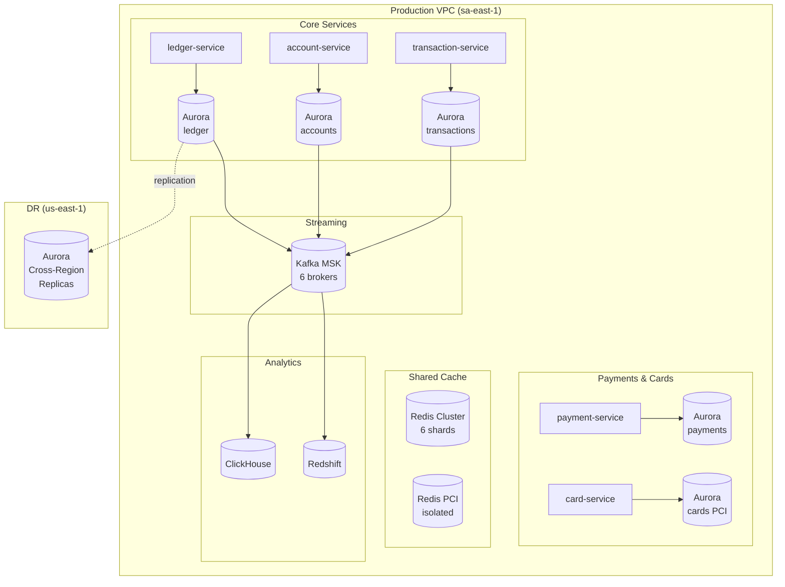

# 16 — Database Architecture

## Principles

1. **Database-per-service**: each microservice owns its schema. No cross-service table access — only via API.
2. **Right tool for the job**: PostgreSQL for ACID transactions, Redis for caching and real-time features, Kafka for event streaming, ClickHouse for analytics.
3. **Aurora for PostgreSQL**: managed, multi-AZ, automatic failover, point-in-time recovery.
4. **PCI scope**: card data databases are isolated in dedicated subnets with separate KMS keys.

---

## Service-to-Database Mapping

| Service | Primary Database | Cache | Analytics | Rationale |
|---|---|---|---|---|
| auth-service | Aurora PostgreSQL | Redis Cluster | — | ACID sessions, token management |
| customer-service | Aurora PostgreSQL | Redis | — | Strong consistency for customer profiles |
| kyc-service | Aurora PostgreSQL + S3 | — | — | ACID + document storage |
| aml-service | Aurora PostgreSQL | — | ClickHouse | Transactional alerts + analytics queries |
| account-service | Aurora PostgreSQL | Redis | — | ACID balance management |
| ledger-service | Aurora PostgreSQL | Redis (read cache) | — | Strictest ACID requirement |
| transaction-service | Aurora PostgreSQL | Redis | — | ACID + idempotency keys |
| payment-service | Aurora PostgreSQL | Redis | — | ACID + distributed locks |
| card-service | Aurora PostgreSQL (PCI) | Redis (PCI) | — | PCI isolated cluster |
| loan-service | Aurora PostgreSQL | — | — | Complex financial calculations |
| investment-service | Aurora PostgreSQL | — | — | NAV calculations, pricing |
| notification-service | Aurora PostgreSQL | Redis | — | Queue management |
| fraud-service | Aurora PostgreSQL | Redis | ClickHouse | Feature store + ML training data |
| treasury-service | Aurora PostgreSQL | Redis | — | Position management |
| fx-service | Aurora PostgreSQL | Redis | — | Rate caching |
| reporting-service | — | — | Redshift + ClickHouse | Read-only analytics |
| document-service | Aurora PostgreSQL | — | S3 | Metadata + S3 for blobs |
| audit-service | Aurora PostgreSQL | — | — | Append-only, immutable |

---

## Aurora PostgreSQL Configuration

### Cluster Topology

```
Production (sa-east-1):
  Writer:       db.r6g.4xlarge (16 vCPU, 128GB RAM)
  Read Replica 1: db.r6g.2xlarge (ledger queries)
  Read Replica 2: db.r6g.2xlarge (reporting queries)

DR (us-east-1):
  Read Replica (cross-region): db.r6g.2xlarge
  Promoted to writer on failover (manual or automated per RTO)
```

### PostgreSQL Parameter Tuning

```ini
# Aurora PostgreSQL parameter group: mawire-production
max_connections                  = 500     # use PgBouncer to pool to 10K
shared_buffers                   = 32GB    # 25% of RAM
effective_cache_size             = 96GB    # 75% of RAM
maintenance_work_mem             = 2GB
checkpoint_completion_target     = 0.9
wal_buffers                      = 64MB
default_statistics_target        = 500
random_page_cost                 = 1.1     # SSD-optimized
effective_io_concurrency         = 200
work_mem                         = 64MB
min_wal_size                     = 4GB
max_wal_size                     = 16GB
max_worker_processes             = 16
max_parallel_workers_per_gather  = 4
max_parallel_workers             = 16
idle_in_transaction_session_timeout = 30000  # 30s — prevent long-held locks
statement_timeout                = 60000    # 60s hard limit
lock_timeout                     = 5000     # 5s — fail fast on lock contention
log_min_duration_statement       = 1000     # log slow queries >1s
track_activity_query_size        = 4096
pg_stat_statements.track         = all
```

### Connection Pooling (PgBouncer)

```ini
# pgbouncer.ini — deployed as sidecar in each service pod
[databases]
ledger    = host=ledger-db.cluster.sa-east-1.rds.amazonaws.com port=5432 dbname=ledger
payments  = host=payments-db.cluster.sa-east-1.rds.amazonaws.com port=5432 dbname=payments

[pgbouncer]
pool_mode            = transaction   # transaction pooling for most services
                                     # session mode for ledger (due to advisory locks)
max_client_conn      = 1000
default_pool_size    = 25
min_pool_size        = 5
reserve_pool_size    = 5
reserve_pool_timeout = 3
max_db_connections   = 100
server_idle_timeout  = 600
client_idle_timeout  = 0
```

---

## Redis Architecture (ElastiCache)

### Cluster Topology

```
Cluster mode: enabled (6 shards)
Replicas per shard: 2 (1 primary, 2 replicas)
Instance type: r6g.2xlarge (each) — 32GB RAM
Total cluster memory: ~192GB usable
Multi-AZ: yes (replicas in different AZs)
Encryption: in-transit (TLS) + at-rest (AES-256)
Auth: Redis AUTH + IAM authentication
```

### Key Schema by Service

```
# auth-service
sessions:{userId}                    → JWT payload (HASH, TTL: 604800s / 7 days)
refresh_tokens:{tokenHash}           → userId (STRING, TTL: 2592000s / 30 days)
mfa_pending:{userId}                 → {otp_hash, attempts} (HASH, TTL: 300s)
rate_limit:auth:{ip}                 → request count (STRING, TTL: 60s, INCR+EXPIRE)

# payment-service
idempotency:{idempotencyKey}         → payment result JSON (STRING, TTL: 86400s)
payment_lock:{paymentId}             → "1" (STRING, TTL: 30s, used as distributed mutex)

# fraud-service
velocity:{customerId}:card:1h        → count (STRING, TTL: 3600s)
velocity:{customerId}:card:24h       → count (STRING, TTL: 86400s)
velocity:{customerId}:atm:4h         → count (STRING, TTL: 14400s)
declines:{cardId}:1h                 → count (STRING, TTL: 3600s)
known_devices:{customerId}           → SET of device_ids (SET, no TTL)
device_score:{deviceId}              → risk score float (STRING, TTL: 604800s)
merchant_blocklist                   → SET of merchant_ids (SET, updated via job)
features:{customerId}               → ML feature vector JSON (HASH, TTL: 300s)

# card-service (PCI-scoped Redis cluster)
card_auth_cache:{cardId}             → auth response (HASH, TTL: 5s)
card_limits:{cardId}                 → {daily_used, monthly_used} (HASH, TTL: until midnight)
```

---

## Apache Kafka (MSK) Configuration

### MSK Cluster Setup

```hcl
# Terraform: MSK cluster
resource "aws_msk_cluster" "mawire_production" {
  cluster_name           = "mawire-production"
  kafka_version          = "3.6.0"
  number_of_broker_nodes = 6  # 2 per AZ, 3 AZs

  broker_node_group_info {
    instance_type = "kafka.m5.2xlarge"  # 8 vCPU, 32GB RAM each
    storage_info {
      ebs_storage_info {
        volume_size = 2000  # 2TB per broker
      }
    }
  }

  encryption_info {
    encryption_in_transit {
      client_broker = "TLS"
      in_cluster    = true
    }
    encryption_at_rest_kms_key_arn = aws_kms_key.kafka.arn
  }

  configuration_info {
    arn      = aws_msk_configuration.mawire.arn
    revision = 1
  }
}
```

### Topic Configuration

```
# Topic: banking.transactions.completed
Partitions:        24       (partitioned by customer_id hash)
Replication factor: 3
Retention:         7 days
min.insync.replicas: 2
compression.type:  lz4

# Topic: banking.audit.events  
Partitions:        12
Replication factor: 3
Retention:         30 days   (longer for audit)
min.insync.replicas: 2

# Topic: banking.fraud.alerts
Partitions:        12
Replication factor: 3
Retention:         14 days
min.insync.replicas: 2

# Complete topic list:
banking.transactions.initiated
banking.transactions.completed
banking.transactions.failed
banking.transactions.reversed
banking.accounts.created
banking.accounts.status-changed
banking.payments.initiated
banking.payments.settled
banking.payments.returned
banking.cards.issued
banking.cards.authorized
banking.cards.declined
banking.kyc.started
banking.kyc.completed
banking.kyc.failed
banking.aml.alerts
banking.fraud.alerts
banking.fraud.cases.created
banking.notifications.requests
banking.audit.events
banking.open-finance.access-log
```

---

## ClickHouse (Analytics)

Deployed on AWS EC2 (`c6a.8xlarge`, 32 vCPU, 64GB RAM):

```sql
-- Fraud analytics: fast queries over billions of events
CREATE TABLE fraud_events (
    event_id        UUID,
    customer_id     UUID,
    transaction_id  UUID,
    fraud_score     Float32,
    rules_triggered Array(String),
    decision        Enum8('APPROVE'=1, 'STEP_UP'=2, 'DECLINE'=3),
    model_version   String,
    created_at      DateTime64(3, 'America/Santiago')
) ENGINE = MergeTree()
PARTITION BY toYYYYMM(created_at)
ORDER BY (created_at, customer_id)
TTL created_at + INTERVAL 2 YEAR;

-- Query: fraud rate by hour (runs in <100ms on 1B rows)
SELECT
    toHour(created_at) AS hour,
    countIf(decision = 'DECLINE') / count() AS fraud_rate
FROM fraud_events
WHERE created_at >= today() - 30
GROUP BY hour
ORDER BY hour;
```

---

## Redshift (Regulatory Reporting)

```sql
-- Fact: all financial transactions for CMF reporting
CREATE TABLE fact_transactions (
    transaction_id  VARCHAR(36)     ENCODE lzo,
    account_id      VARCHAR(36)     ENCODE lzo,
    customer_id     VARCHAR(36)     ENCODE lzo,
    amount          DECIMAL(19,4)   ENCODE az64,
    currency        CHAR(3)         ENCODE bytedict,
    transaction_type VARCHAR(50)    ENCODE bytedict,
    deal_date       DATE            ENCODE az64,
    settlement_date DATE            ENCODE az64,
    merchant_name   VARCHAR(200)    ENCODE lzo,
    mcc             CHAR(4)         ENCODE bytedict,
    country         CHAR(2)         ENCODE bytedict,
    status          VARCHAR(20)     ENCODE bytedict,
    year            SMALLINT        ENCODE az64,
    month           SMALLINT        ENCODE az64
)
DISTSTYLE KEY
DISTKEY (customer_id)
SORTKEY (deal_date, account_id);
```

Data loaded from S3 via Redshift COPY (nightly), sourced from Aurora PostgreSQL via AWS DMS.

---

## Backup Strategy

| Database | Method | RPO | RTO | Retention | Cost/month |
|---|---|---|---|---|---|
| Aurora PostgreSQL | Continuous WAL + snapshots | 5 minutes | < 1 hour | 35 days | ~$200 |
| Redis | RDB snapshot to S3 | 6 hours | 30 minutes | 7 days | ~$50 |
| Kafka (MSK) | Cross-region topic replication | Near-zero | Near-zero | 30 days | ~$300 |
| Redshift | Automated snapshots | 24 hours | 2 hours | 35 days | ~$150 |
| S3 (documents) | Cross-region replication | Near-zero | Near-zero | 10 years | ~$100 |

---

## Scaling Strategy

### Phase 1 (0–50K users)
- Single writer Aurora per service group (smaller services share a cluster)
- Redis single-node ElastiCache (r6g.xlarge)
- MSK 3 brokers

### Phase 2 (50K–500K users)
- Dedicated Aurora cluster per high-traffic service (ledger, transactions, auth)
- Add 1-2 Aurora read replicas for ledger and reporting
- Redis cluster mode (6 shards)
- MSK 6 brokers

### Phase 3 (500K–2M users)
- Aurora Limitless for ledger service (100K+ TPS)
- PgBouncer fleet scaled horizontally
- Redis: upgrade to r6g.4xlarge per shard
- Consider Cassandra for velocity counters at extreme scale

### Phase 4 (2M+ users / LATAM)
- Multi-region Active-Active for payments (CockroachDB evaluation)
- Separate regional deployments per country with data residency
- Global event streaming mesh (MSK cross-region)


